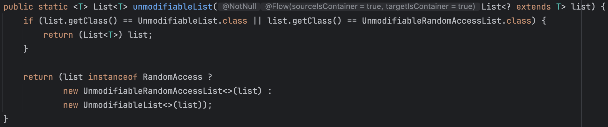
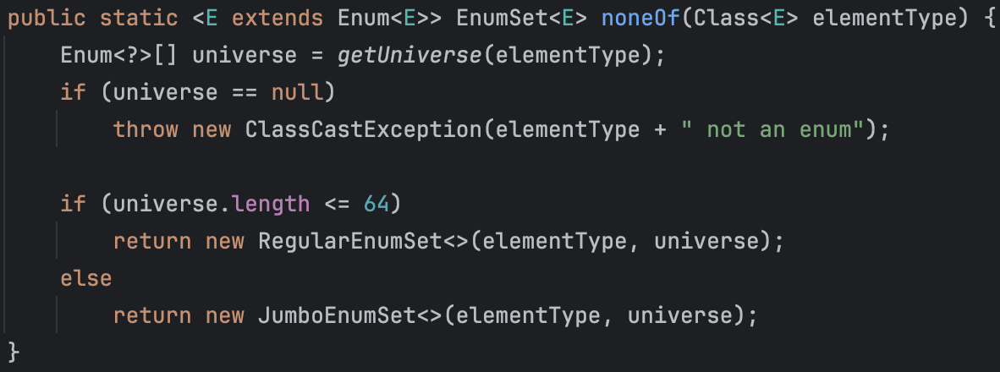
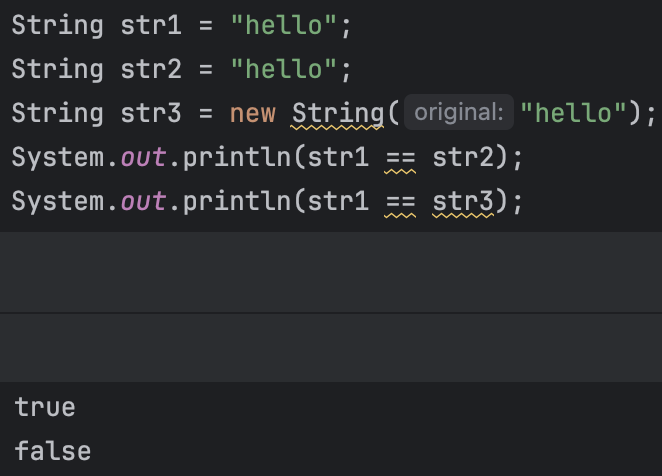
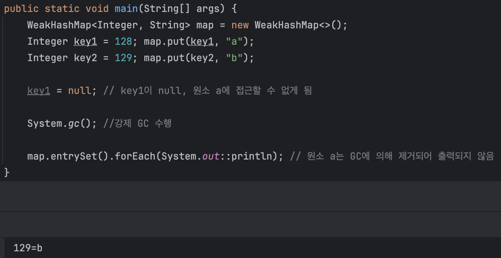

# 2장 객체 생성과 파괴

이번 장에서는 객체를 만들어야 할 때와 만들지 말아야 할 때를 구분하는 법, 올바른 객체 생성 방법과 불필요한 객체 생성을 피하는 방법, 그리고 파괴 전략에 대해 소개한다.

- [아이템 1. 생성자 대신 정적 팩터리 메서드를 고려하라](#아이템-1-생성자-대신-정적-팩터리-메서드를-고려하라)
- [아이템 2. 생성자에 매개변수가 많다면 빌더를 고려하라](#아이템-2-생성자에-매개변수가-많다면-빌더를-고려하라)
- [아이템 3. private 생성자나 열거 타입으로 싱글턴임을 보증하라](#아이템-3-private-생성자나-열거-타입으로-싱글턴임을-보증하라)
- [아이템 4. 인스턴스화를 막으려거든 private 생성자를 사용하라](#아이템-4-인스턴스화를-막으려거든-private-생성자를-사용하라)
- [아이템 5. 자원을 직접 명시하지 말고 의존 객체 주입을 사용하라](#아이템-5-자원을-직접-명시하지-말고-의존-객체-주입을-사용하라)
- [아이템 6. 불필요한 객체 생성을 피하라](#아이템-6-불필요한-객체-생성을-피하라)
- [아이템 7. 다 쓴 객체 참조를 해제하라](#아이템-7-다-쓴-객체-참조를-해제하라)
- [아이템 8. finalizer와 cleaner 사용을 피하라](#아이템-8-finalizer와-cleaner-사용을-피하라)
- [아이템 9. try-finally보다는 try-with-resources를 사용하라](#아이템-9-try-finally보다는-try-with-resources를-사용하라)

## 아이템 1. 생성자 대신 정적 팩터리 메서드를 고려하라

> ### 핵심 정리
>
> 정적 팩터리 메서드와 public 생성자는 각자의 쓰임새가 있으니 상황에 맞게 사용하면 된다. 그러나 정적 팩터리 메서드를 사용하는 게 유리한 경우가 많으므로, 무작정 public 생성자를 제공하던 습관이 있다면 고쳐야 한다.

클라이언트가 클래스의 인스턴스를 얻는 전통적인 수단은 public 생성자이지만, 생성자와 별도로 정적 팩터리 메서드(static factory method)를 제공할 수도 있다.

public 생성자 대신 (혹은 생성자와 함께) 정적 팩터리 메서드를 제공하는 방법의 장점 5가지를 소개한다.

### 장점 1. 이름을 가질 수 있다.

생성자만 보고 반환될 객체의 특성을 짐작하기는 어렵다.

```java
class Pizza {
    private String size;
    private boolean cheese;
    private boolean pepperoni;

    public Pizza(String size, boolean cheese, boolean pepperoni) {
        this.size = size;
        this.cheese = cheese;
        this.pepperoni = pepperoni;
    }
}

// 생성자를 사용하는 입장에서 Pizza 객체를 생성할 때 어떤 객체가 반환될지 짐작하기 어렵다.
new Pizza("Large", false, false);
new Pizza("Large", false, true);
```

반면, 정적 팩터리 메서드를 사용하면 이름만 잘 지으면 반환될 객체의 특성을 쉽게 짐작할 수 있다.

```java
class Pizza {
    private String size;
    private boolean cheese;
    private boolean pepperoni;

    private Pizza(String size, boolean cheese, boolean pepperoni) {
        this.size = size;
        this.cheese = cheese;
        this.pepperoni = pepperoni;
    }

    public static Pizza createLargePizzaWithoutCheese() {
        return new Pizza("Large", false, false);
    }

    public static Pizza createLargePizzaWithPepperoni() {
        return new Pizza("Large", false, true);
    }
}

// 반환될 객체의 특성을 쉽게 짐작할 수 있다.
Pizza pizza = Pizza.createLargePizzaWithoutCheese();
Pizza pizza = Pizza.createLargePizzaWithPepperoni();
```

추가로 하나의 시그니처로는 생성자를 하나만 만들 수 있다. 그러나 정적 팩터리 메서드는 이러한 제약이 없다. (물론 매개변수의 순서를 바꾸는 등의 방법으로 해결할 수도 있지만, 이는 코드 사용자에게 큰 혼란을 줄 수 있다.)

### 장점 2. 호출될 때마다 인스턴스를 새로 생성하지는 않아도 된다.

인스턴스를 미리 만들어 놓거나, 캐싱된 인스턴스를 재사용할 수 있기 때문에 불필요한 객체 생성을 피할 수 있다.

대표적인 예시로 `Boolean.valueOf(boolean)` 메서드가 있다. 이 메서드는 `true`와 `false` 두 가지 값만을 가지는 `Boolean` 객체를 반환한다. 이때 매번 새로운 객체를 생성하는 것이 아니라, 미리 만들어 놓은 객체를 반환한다.

```java
class Boolean {
    private static final Boolean TRUE = new Boolean(true);
    private static final Boolean FALSE = new Boolean(false);

    ...

    public static Boolean valueOf(boolean b) {
        return b ? TRUE : FALSE;
    }
}
```

생성자를 사용하면 매번 새로운 객체를 생성해야 하지만, 정적 팩터리 메서드를 사용하면 반복되는 요청에 같은 객체를 반환하는 것처럼 언제 어느 인스턴스를 반환할지를 통제할 수 있다. 이런 클래스를 인스턴스 통제(instance-controlled) 클래스라고 한다.

또한, 이러한 방식을 통해 인스턴스를 통제하면 싱글턴(singleton)이나 인스턴스화 불가(noninstantiable) 클래스를 만들 수 있다.

### 장점 3. 반환 타입의 하위 타입 객체를 반환할 수 있는 능력이 있다.

반환할 객체의 클래스를 자유롭게 선택할 수 있게 하는 유연성을 제공한다. API를 만들 때 구현 클래스를 공개하지 않고 그 객체를 반환할 수 있어 API를 작게 유지할 수 있다. 이는 인터페이스 기반 프레임워크를 만드는 핵심 기술이라고 한다.

자바 컬렉션 프레임워크는 수십 개의 구현 클래스를 가지고 있지만, 이 구현체 대부분을 단 하나의 인스턴스화 불가 클래스인 `Collections`의 정적 팩터리 메서드를 통해 반환한다.

예시로 아래는 `Collections.unmodifiableList()` 메서드이다.



```java
// 우리는 이 메서드를 통해 수정 불가능한 리스트를 반환받을 뿐이다.
// 내부 구현체에 대해서는 알 필요가 없기 때문에 API가 작아진다.
Collections.unmodifiableList();
```

우리는 `Collections.unmodifiableList()` 메서드를 통해 반환되는 객체가 어떤 클래스(구현체)의 객체인지 알 필요가 없다. 우리는 그저 수정 불가능한 리스트를 반환하는 메서드를 호출하면 된다.

### 장점 4. 입력 매개변수에 따라 매번 다른 클래스의 객체를 반환할 수 있다.

반환 타입의 하위 타입 객체를 반환할 수 있는 능력을 이용하면, 입력 매개변수에 따라 다른 클래스의 객체를 반환할 수 있다. 이는 클라이언트가 어떤 클래스의 객체를 사용할지를 자유롭게 결정할 수 있게 해준다.

예시로 `EnumSet` 클래스는 원소의 개수에 따라 `RegularEnumSet`과 `JumboEnumSet` 두 가지 구현체 중 하나를 반환한다. (Enum 클래스는 public 생성자가 없고 정적 팩터리 메서드만 제공한다.)



사용하는 입장에서는 `EnumSet` 클래스의 객체를 반환받을 뿐이다. 내부적으로는 원소의 개수에 따라 적절한 구현체를 반환한다. 즉, 클라이언트는 어떤 클래스의 객체를 사용할지를 결정할 필요가 없다.

### 장점 5. 정적 팩터리 메서드를 작성하는 시점에는 반환할 객체의 클래스가 존재하지 않아도 된다.

정적 팩터리 메서드는 반환할 객체의 구체적인 클래스가 작성 시점에 정의되어 있지 않더라도 동작할 수 있다는 유연성을 제공한다. 덕분에 `서비스 제공자 프레임워크(Service Provider Framework)`를 설계할 때 매우 유용하다.

> ### 서비스 제공자 프레임워크란?
>
> 서비스 제공자 프레임워크는 특정 기능을 제공하는 구현체를 독립적으로 관리하고, 클라이언트가 구현체의 세부사항을 몰라도 사용할 수 있도록 지원하는 설계 패턴이다.
>
> - `서비스 인터페이스(Service Interface)` : 서비스의 동작을 정의
> - `제공자 등록 API(Provider Registration API)` : 서비스 제공자가 자신의 구현체를 등록할 때 사용하는 API
> - `서비스 접근 API(Service Access API)` : 클라이언트가 서비스를 사용할 때 접근하는 API
> - `서비스 제공자 인터페이스(Optional)` : 서비스를 생성하는 팩토리 역할을 담당

대표적인 예시로 JDBC(Java Database Connectivity)가 있다. JDBC는 다양한 데이터베이스를 단일 API로 연결할 수 있도록 설계된 대표적인 서비스 제공자 프레임워크다.

- `서비스 인터페이스` : java.sql.Driver
- `제공자 등록 API` : DriverManager.registerDriver()
- `서비스 접근 API` : DriverManager.getConnection()

클라이언트는 데이터베이스 연결을 위해 `DriverManager.getConnection()` 정적 메서드를 호출하여 연결 객체를 얻는다. 이때 드라이버를 얻을 때 구현체를 알 필요가 없으며, `DriverManager`는 등록된 드라이버 중 적합한 구현체를 찾아 연결 객체를 반환한다.

즉, 특정 구현체(MySQL, OracleDB 등)에 얽매이지 않고 다양한 구현체를 동적으로 선택할 수 있다.

```java
// 드라이버를 얻을 때 구현체를 알 필요가 없다.
Connection connection = DriverManager.getConnection("jdbc:mysql://localhost:3306/test-db", "user", "password");
```

드라이버는 java.sql.Driver 인터페이스를 구현하기만 하면 되며, 새로운 데이터베이스 드라이버를 추가해도 클라이언트 코드를 수정할 필요가 없다.

정적 팩터리 메서드를 사용하면 구현체가 작성되지 않은 상태에서도 서비스 제공자와 클라이언트를 분리할 수 있고, 이러한 유연성은 새로운 서비스 제공자를 쉽게 추가하거나 대체할 수 있는 기반이 된다.

### 단점 1. 정적 팩터리 메서드만 제공한다면 하위 클래스를 만들 수 없다.

상속을 위해 설계된 클래스라면 public(혹은 protected) 생성자를 제공해야 하며, 정적 팩터리 메서드만 제공한다면 하위 클래스를 만들 수 없다. 이는 상속보다 컴포지션을 사용하도록 유도하므로, 상속보다 컴포지션을 사용하는 것이 더 좋은 설계 방법이 될 수 있다.

### 단점 2. 정적 팩터리 메서드는 프로그래머가 찾기 어렵다.

생성자처럼 API 설명에 명확히 드러나지 않으므로, 사용자는 정적 팩터리 메서드를 찾기 어려울 수 있다. 이를 해결하기 위해 메서드 이름을 신중히 선택하고, Javadoc 주석을 통해 명확하게 문서화하는 것이 좋다.

또한 정적 팩터리 메서드의 이름을 널리 알려진 규약을 따르도록 하는 것도 좋은 방법이다. 관련 컨벤션은 쉽게 찾아볼 수 있다.

## 아이템 2. 생성자에 매개변수가 많다면 빌더를 고려하라

> ### 핵심 정리
>
> 생성자나 정적 팩터리가 처리해야 할 매개변수가 많다면(4개 이상이 되면 가치가 높아진다.) 빌더 패턴을 선택하는 게 더 낫다. 매개변수 중 다수가 필수가 아니거나 같은 타입이면 특히 더 그럴 것이다. 빌더는 점층적 생성자보다 클라이언트 코드를 읽고 쓰기가 훨씬 간결하고, 자바빈즈보다 훨씬 더 안전하며, 자연스럽게 이해하기 쉽다.

정적 팩터리와 생성자는 선택적 매개변수가 많을 때 적절히 대응하기 어렵다는 단점이 있다.

예를 들어, 식품 포장의 영양정보를 표현하는 클래스를 만든다고 가정해보자. 영양정보는 1회 내용량, 총 n회 제공량, 칼로리 같은 필수 항목과 총 지방, 트랜스지방, 콜레스테롤 같은 선택적 항목으로 구성된다. 이때 생성자로는 이러한 선택적 매개변수를 처리하기 어렵다.

### 점층적 생성자 패턴(telescoping constructor pattern)

이럴 때 프로그래머들은 점층적 생성자 패턴을 즐겨 사용했다고 한다. 이 패턴은 생성자에 필요한 매개변수를 추가해가는 방식으로 객체를 생성하는 방법이다.

```java
// 점층적 생성자 패턴
// 선택 매개변수가 전달되지 않으면 기본값을 사용하도록 오버로딩된 생성자를 사용한다.
new NutritionFacts(240, 8);
new NutritionFacts(240, 8, 100);
new NutritionFacts(240, 8, 100, 0);
new NutritionFacts(240, 8, 100, 0, 35);
new NutritionFacts(240, 8, 100, 0, 35, 27);

...
```

하지만 이러한 방식은 매개변수가 많아질수록 코드를 읽는 사람이 어떤 매개변수가 무엇을 의미하는지 알기 어렵다. 또한 매개변수의 순서를 혼동할 수 있으며, 특히 선택적 매개변수가 많을 경우 사용하기 더욱 어렵다.

### 자바빈즈 패턴(JavaBeans pattern)

이러한 단점을 극복하기 위해 자바빈즈 패턴을 사용하기도 한다. 자바빈즈 패턴은 매개변수가 많은 생성자를 사용하지 않고, 기본 생성자로 객체를 생성한 후, setter 메서드를 통해 필요한 매개변수를 설정하는 방식이다. (초기값은 기본값이거나 null일 것이다.)

```java
NutritionFacts cocaCola = new NutritionFacts();
cocaCola.setServingSize(240);
cocaCola.setServings(8);
cocaCola.setCalories(100);
cocaCola.setSodium(35);
cocaCola.setCarbohydrate(27);
```

각 매개변수가 어떤 의미를 가지는지 알기 쉽지만, 객체 일관성이 지켜지지 않는다. 즉, 객체가 완성되기 전까지 일관성이 무너질 수 있다. 또한 불변으로 만들 수 없으며, 스레드 안전성을 보장할 수 없다.

이러한 단점을 극복하기 위해 생성이 끝난 객체를 수동으로 freeze하는 방법을 사용하기도 한다. 하지만 이러한 방식은 코드가 복잡해지고, 실수로 freeze를 빼먹을 수 있기 때문에 좋은 방법은 아니다.

### 빌더 패턴(Builder pattern)

점층적 생성자 패턴의 안전성과 자바빈즈 패턴의 가독성을 결합한 방식이 빌더 패턴이다. 빌더 패턴은 클라이언트가 원하는 객체를 직접 만들기보다는 빌더에 필요한 매개변수를 설정한 후, 빌더가 객체를 만들도록 하는 방식이다.

```java
public class NutritionFacts {
    private final int servingSize;
    private final int servings;
    private final int calories;
    private final int fat;
    private final int sodium;
    private final int carbohydrate;

    public static class Builder {
        // 필수 매개변수
        private final int servingSize;
        private final int servings;

        // 선택 매개변수 - 기본값으로 초기화
        private int calories = 0;
        private int fat = 0;
        private int sodium = 0;
        private int carbohydrate = 0;

        public Builder(int servingSize, int servings) {
            this.servingSize = servingSize;
            this.servings = servings;
        }

        public Builder calories(int val) {
            calories = val;
            return this;
        }

        public Builder fat(int val) {
            fat = val;
            return this;
        }

        public Builder sodium(int val) {
            sodium = val;
            return this;
        }

        public Builder carbohydrate(int val) {
            carbohydrate = val;
            return this;
        }

        public NutritionFacts build() {
            return new NutritionFacts(this);
        }
    }

    private NutritionFacts(Builder builder) {
        servingSize = builder.servingSize;
        servings = builder.servings;
        calories = builder.calories;
        fat = builder.fat;
        sodium = builder.sodium;
        carbohydrate = builder.carbohydrate;
    }
}
```

필수 매개변수만으로 빌더 객체를 생성한 후, 선택 매개변수를 설정하고, build 메서드를 호출하여 객체를 생성한다.

```java
NutritionFacts cocaCola = new NutritionFacts.Builder(240, 8)
    .calories(100)
    .sodium(35)
    .carbohydrate(27)
    .build();
```

이때 cocaCola 객체는 불변 객체이며, 매개변수의 순서를 혼동할 일도 없다.

추가로 위 예시에 검증 로직을 추가하면 더욱 안전하게 객체를 생성할 수 있다. (예시: 음수 값이 들어오면 예외를 던지도록 처리 등)

빌더 패턴은 계층적으로 설계된 클래스와 함께 사용하기 좋다. 아래는 추상 클래스는 추상 빌더를 가지고, 서브 클래스에서 이를 구체 빌더로 구현한 예시이다.

```java
public abstract class Pizza{
   public enum Topping { HAM, MUSHROOM, ONION, PEPPER, SAUSAGE }
   final Set<Topping> toppings;

   // 추상 클래스는 추상 발도를 가진다. 서브 클래스에서 이를 구체 빌더로 구현한다.
   abstract static class Builder<T extends Builder<T>> {
      EnumSet<Topping> toppings = EnumSet.noneOf(Topping.class);

      public T addTopping(Topping topping) {
         toppings.add(Objects.requireNonNull(topping));
         return self();
      }

      abstract Pizza build();

      // 하위 클래스는 이 메서드를 overriding하여 this를 반환하도록 해야 한다.
      // 덕분에 하위 클래스에서는 형변환을 사용하지 않고도 메서드 체이닝을 사용할 수 있다.
      protected abstract T self();
   }

   Pizza(Builder<?> builder) {
      toppings = builder.toppings.clone();
   }
}

public class NyPizza extends Pizza {
    public enum Size { SMALL, MEDIUM, LARGE }

    private final Size size;

    public static class Builder extends Pizza.Builder<Builder> {
        private final Size size;

        public Builder(Size size) {
            this.size = Objects.requireNonNull(size);
        }

        @Override
        public NyPizza build() {
           return new NyPizza(this);
        }

        @Override
        protected Builder self() {
            return this;
        }
    }

    private NyPizza(Builder builder) {
        super(builder);
        size = builder.size;
    }
}

public class Calzone extends Pizza {
    private final boolean sauceInside;

    public static class Builder extends Pizza.Builder<Builder> {
        private boolean sauceInside = false;

        public Builder sauceInside() {
            sauceInside = true;
            return this;
        }

        @Override
        public Calzone build() {
            return new Calzone(this);
        }

        @Override
        protected Builder self() {
            return this;
        }
    }

    private Calzone(Builder builder) {
        super(builder);
        sauceInside = builder.sauceInside;
    }
}
```

위와 같이 계층적으로 설계된 클래스를 빌더 패턴으로 구현하면, 클라이언트가 객체를 생성할 때 계층적으로 생성할 수 있어 편리하다.

각 하위 클래스의 빌더가 정의한 build 메서드는 해당 클래스의 객체를 반환하도록 선언했다. 이를 통해 클라이언트는 빌더의 build 메서드를 호출하면 해당 클래스의 객체를 반환받을 수 있다. 즉, NyPizza.Builder의 build 메서드를 호출하면 NyPizza 객체를 반환받을 수 있고, Calzone.Builder의 build 메서드를 호출하면 Calzone 객체를 반환받을 수 있다는 말이다. 덕분에 클라이언트는 형변환을 사용하지 않고도 메서드 체이닝을 사용할 수 있다.

추가로 addTopping 메서드는 여러 번 호출할 수 있으며, 넘겨진 매개변수를 toppings 집합에 추가한다. 이는 생성자로는 불가능하다.

물론 장점만 있는 것은 아니다. 빌더 패턴은 코드가 장황하고, 빌더 객체의 생성 비용도 발생한다. (생성 비용이 크지 않지만, 성능에 민감한 상황에서는 영향을 줄 수 있다.) 그러나 프로그램은 시간이 지날수록 매개변수가 늘어나는 경향이 있으므로, 빌더 패턴을 사용하는 것이 좋다. (최소 4개 이상의 매개변수가 필요한 경우 빌더 패턴을 사용하는 것이 좋다.)

## 아이템 3. private 생성자나 열거 타입으로 싱글턴임을 보증하라

> ### 핵심 정리
>
> 각 방식에 따라 장단점이 있으므로 상황에 맞게 사용하면 된다. Enum도 좋은 방법이니 고려 대상에 포함시키자.

싱글턴이란 인스턴스를 오직 하나만 생성할 수 있는 클래스를 말한다. 싱글턴은 전역 변수와 같은 역할을 하며, 인스턴스가 하나만 생성되어야 하는 경우에 사용된다.

전형적인 싱글턴의 예시로는 무상태 객체나 설계상 유일해야 하는 시스템 컴포넌트 등이 있다.

싱글턴을 만드는 방법은 보통 두 가지다.

- public static final 필드 방식
- 정적 팩터리 방식

### public static final 필드 방식

```java
public class Elvis {
    public static final Elvis INSTANCE = new Elvis();

    private Elvis() { ... }

    public void leaveTheBuilding() { ... }
}

...

// Elvis 객체는 public static final 필드인 INSTANCE를 통해 언제든지 접근할 수 있다.
Elvis elvis = Elvis.INSTANCE;
```

private 생성자는 public static final 필드인 `INSTANCE`를 초기화할 때 한 번만 호출된다. 이 방식은 간결하고, public 필드가 final이니 다른 필드를 더 추가하거나 변경할 수 없다. 또한 API를 바꾸지 않고도 싱글턴이 아니게 변경할 수 있다. (물론 리플렉션을 통해 private 생성자를 호출할 수 있지만, 이를 방어하기 위해 생성자에서 두 번째 객체가 생성되려 할 때 예외를 던지도록 할 수 있다.)

이 방법은 public 필드가 final이기 때문에 다른 객체를 참조할 수 없으며, 간결하다는 장점이 있다.

### 정적 팩터리 방식

```java
public class Elvis {
    private static final Elvis INSTANCE = new Elvis();

    private Elvis() { ... }

    public static Elvis getInstance() { return INSTANCE; }

    public void leaveTheBuilding() { ... }
}

...

// Elvis 객체는 정적 팩터리 메서드인 getInstance를 통해 언제든지 접근할 수 있다.
Elvis elvis = Elvis.getInstance();
```

항상 같은 객체의 참조를 반환하기 때문에 절대 다른 Elvis 인스턴스가 만들어지지 않는다. (리플렉션 예외는 똑같이 적용된다.)

이 방법은 정적 팩터리 메서드를 변경하면 싱글턴이 아니게 변경할 수 있다는 장점이 있다. 또한 정적 팩터리 메서드 참조를 Supplier로 사용할 수 있어, 메서드 참조를 사용할 수 있다.

```java
Supplier<Elvis> supplier = Elvis::getInstance;
```

위와 같은 장점들이 굳이 필요하지 않다면, `public static final 필드 방식`을 사용하는 것이 좋다고 한다.

### 싱글턴 클래스를 직렬화할 때 주의할 점

싱글턴 클래스를 직렬화할 때는 `Serializable`을 구현하는 것만으로는 부족하다. 직렬화된 인스턴스를 역직렬화할 때마다 새로운 인스턴스가 생성되기 때문이다.

이를 방지하기 위해 인스턴스 필드를 `transient`로 선언하고, `readResolve` 메서드를 제공하여 직렬화된 인스턴스를 반환하도록 해야 한다.

```java
// 싱글턴임을 보장하기 위한 readResolve 메서드
private Object readResolve() {
    // 진짜 Elvis를 반환하고, 가짜 Elvis는 가비지 컬렉터에 맡긴다.
    return INSTANCE;
}
```

이렇게 하면 직렬화된 인스턴스를 역직렬화할 때마다 새로운 인스턴스가 생성되는 것을 방지할 수 있다.

```java
public enum Elvis {
    INSTANCE;

    public void leaveTheBuilding() { ... }
}
```

아니면 `public static final 필드 방식`과 비슷하지만, 더 간결하고, 추가적인 노력 없이 직렬화 문제를 해결할 방법이 있다. 원소가 하나인 `Enum`을 선언하는 것이다. (Enum은 직렬화를 자동으로 처리해준다. 또한 리플렉션을 통한 공격에도 안전하다. - [관련 자료](https://docs.oracle.com/en/java/javase/21/docs/specs/serialization/serial-arch.html#serialization-of-enum-constants))

싱글턴을 만드는 가장 좋은 방법이다. 그러나 만들려는 싱글턴이 Enum 외의 클래스를 상속해야 한다면 이 방법은 사용할 수 없다. 다른 인터페이스를 구현하는 것은 가능하다.

## 아이템 4. 인스턴스화를 막으려거든 private 생성자를 사용하라

> ### 핵심 정리
>
> 인스턴스로 만들어 사용하지 않는 유틸리티 클래스나 상수 클래스는 private 생성자를 사용하여 인스턴스화를 막는다. 이 방식은 상속을 불가능하게 하는 효과도 있다.

단순히 정적 메서드와 정적 필드만을 담은 클래스를 만들 때가 있다. 물론 객체 지향적으로 사고하지 않는 이들이 종종 남용하는 경향이 있지만, 분명 필요할 때도 있다. 예를 들어, `java.lang.Math`와 `java.util.Arrays`, `java.util.Collections` 등이 있다.

위와 같은 경우 인스턴스로 만들어 쓰려고 설계한 것이 아니다. 그러나 자바의 컴파일러는 아무 생성자도 작성하지 않으면 자동으로 public 기본 생성자를 만들어버린다. 사용자는 이 생성자가 자동으로 만들어진 것인지, 프로그래머가 의도적으로 만든 것인지 구분할 수 없다.

추상 클래스로 만드는 것으로는 인스턴스화를 막을 수 없다. 그냥 하위 클래스를 만들어 인스턴스화하면 그만이기 때문이다. 또한 이 경우에는 상속해서 사용하는 것이구나라고 이해할 수 있기 때문에, 이런 방식은 좋지 않다.

우리는 아주 간단하게 인스턴스화를 막을 수 있다. private 생성자를 추가하면 된다. private 생성자가 추가되면 컴파일러는 기본 생성자를 만들지 않는다. 또한 이 방식은 상속을 불가능하게 하는 효과도 있다. (하위 클래스가 상위 클래스의 생성자를 호출할 수 없기 때문이다.)

```java
public class UtilityClass {
    // 기본 생성자가 만들어지는 것을 막는다. (인스턴스화 방지)
    private UtilityClass() {
        throw new AssertionError();
    }

    ...
}
```

private이기 때문에 클래스 바깥에서 접근할 수 없으며, 생성자를 호출하면 `AssertionError`가 발생한다. 이 방식은 클래스 내부에서 실수로라도 생성자를 호출하지 않도록 해준다.

그런데 생성자가 존재하지만 호출할 수 없는 상황이기 때문에, 그다지 직관적이지 않다는 의견이 있다. 이를 해결하기 위해 주석을 달아주는 것도 좋은 방법이다.

## 아이템 5. 자원을 직접 명시하지 말고 의존 객체 주입을 사용하라

> ### 핵심 정리
>
> 클래스가 내부적으로 하나 이상의 자원에 의존하고, 그 자원이 클래스 동작에 영향을 준다면 싱글턴과 정적 유틸리티 클래스는 사용하지 않는 것이 좋다. 이 자원들을 클래스가 스스로 만들게 해서도 안 된다. 대신 필요한 자원을 (혹은 그 자원을 만들어 주는 팩터리를) 생성자(혹은 정적 팩터리나 빌더에)에 넘겨주자. 이 패턴은 의존 객체 주입이라고 한다. 클래스의 유연성, 재사용성, 테스트 용이성을 모두 잡을 수 있다. 그러나 의존성이 수천 개나 되는 큰 프로젝트에서는 코드를 어지럽게 만들기도 한다. (이 경우는 `의존성 주입 프레임워크`를 사용하는 것이 좋다.)

코드를 작성하다 보면 많은 클래스가 하나 이상의 자원에 의존하는 경우를 쉽게 마주치게 된다. 또한 정적 유틸리티 클래스로 구현하는 모습도 종종 볼 수 있다. 이러한 방식은 유연성과 재사용성을 떨어뜨린다.

예시로 사전에 의존하는 맞춤법 검사기를 생각해보자.

```java
public class SpellChecker {
    private static final Lexicon dictionary = ...;

    // 인스턴스화 방지
    private SpellChecker() {}

    public static boolean isValid(String word) { ... }
    public static List<String> suggestions(String typo) { ... }
}
```

맞춤법 검사기를 정적 유틸리티 클래스로 구현했다. 이 방식은 사전을 하나만 사용한다는 전제하에 만들어졌다. 즉, 다른 사전을 사용하려면 코드를 수정해야 한다. 싱글턴 방식으로 구현하더라도 마찬가지다.

필드에서 final 키워드를 제거하고 setter 메서드를 추가하면 사전을 바꿀 수 있지만 아쉽게도 이 방식은 오류를 내기 쉽고, 멀티스레드 환경에서도 안전하지 않다.

> 사용하는 자원에 따라 동작이 달라지는 클래스에는 정적 유틸리티 클래스나 싱글턴 방식이 적합하지 않다. p.29

이러한 문제를 해결하기 위해 의존 객체 주입 패턴을 사용하자. 의존 객체 주입 패턴은 클래스가 필요로 하는 자원을 생성자에 넘겨주는 방식이다.

```java
public class SpellChecker {
    private final Lexicon dictionary;

    // 인스턴스를 생성할 때 생성자에 필요한 자원을 넘겨주자.
    public SpellChecker(Lexicon dictionary) {
        this.dictionary = Objects.requireNonNull(dictionary);
    }

    public boolean isValid(String word) { ... }
    public List<String> suggestions(String typo) { ... }
}
```

이제 사전을 바꾸고 싶다면, 새로운 사전을 만들어서 생성자에 넘겨주면 된다. 이 방식은 유연성과 재사용성을 높여주고, 불변성을 챙길 수 있으며, 테스트하기도 쉽다.

### 약간의 변형

생성자에 자원 팩터리를 넘겨주는 방식으로 응용할 수 있다.

> ### 팩터리란?
>
> 호출할 때마다 특정 타입의 인스턴스를 반복해서 만들어주는 객체를 말한다. 즉, 팩터리 메서드 패턴(Factory Method Pattern)을 구현한 것이다.

자바 8에서 추가된 `Supplier<T>` 인터페이스가 팩터리를 표현한 완벽한 예시이다.

`Supplier<T>` 인터페이스는 `T get()` 메서드를 정의하고 있다. 이를 이용하면 자원을 생성하는 팩터리를 넘겨줄 수 있다. 이를 입력으로 받는 메서드는 일반적으로 한정적 와일드카드 타입을 사용해 팩터리의 타입 매개변수를 제한해야 한다. (명시한 타입의 하위 타입이라면 무엇이든 생성할 수 있는 팩터리를 넘길 수 있다.)

```java
// 클라이언트가 제공한 팩터리가 생성한 타일로 구성된 모자이크를 만드는 메서드이다.
Mosaic create(Supplier<? extends Tile> tileFactory) { ... }
```

앞서 말한 것처럼 의존 객체 주입 패턴은 유연성과 테스트 용이성을 높여준다. 하지만 의존성이 수천 개나 되는 큰 프로젝트에서는 코드를 어지럽게 만들 수 있다. 이런 경우에는 `의존성 주입 프레임워크`(예시: Spring)를 사용하면 해소할 수 있다.

## 아이템 6. 불필요한 객체 생성을 피하라

> ### 핵심 정리
>
> 똑같은 기능의 객체를 매번 생성하는 것보다는 객체 하나를 재사용하는 편이 나을 때가 많다. 기존 객체를 재사용해야 한다면 새로운 객체를 만들지 말고, 재사용하도록 하자. 그러나 새로운 객체를 만드는 것이 더 나은 경우도 있으니 유의하자.

```java
// 절대 이렇게 사용하지 말자
String name = new String("bang");
```

이 코드가 실행될 때마다 String 인스턴스를 새로 생성한다. 완전히 쓸데없는 행위라고 볼 수 있다. 생성자로 전달한 "bang" 자체가 이 코드로 만들어내려는 String과 기능적으로 완전히 동일하기 때문이다. 만약 이 코드가 반복문 안에 들어가 있다면, 반복문이 실행될 때마다 쓸데없는 String 인스턴스가 계속 생성되어 메모리를 낭비하게 된다.

```java
// 개선된 코드
String name = "bang";
```

하나의 String 인스턴스를 재사용하는 것이다. 이렇게 하면 불필요한 객체 생성을 피할 수 있다. 더 자세한 내용은 아래에 따로 정리했다.

### 문자열 리터럴?

문자열 리터럴(String Literal)은 따옴표로 감싼 문자열이다. [문자열 리터럴은 String 인스턴스에 대한 참조](https://docs.oracle.com/javase/specs/jls/se21/html/jls-4.html#jls-4.3.3)라고 나와있다. [게다가 문자열 리터럴은 항상 String 클래스의 동일한 인스턴스를 참조한다.](https://docs.oracle.com/javase/specs/jls/se21/html/jls-3.html#jls-3.10.5)

```java
String str1 = "hello";
String str2 = "hello";
```

즉, str1과 str2가 "hello"라는 문자열 리터럴을 참조하며, 자바의 String Pool에 저장된다.

### String Pool?

String Pool은 JVM의 Heap 메모리 내 특별한 영역으로 같은 문자열 리터럴을 중복 생성하지 않고 재사용하기 위해 존재한다. 문자열 리터럴 "hello"가 String Pool에 이미 존재한다면, 새로운 객체를 생성하지 않고 기존 객체를 참조한다.

```java
System.out.println(str1 == str2); // true
```

str1과 str2가 동일한 객체를 참조하기 때문에 true가 출력된다.

### 문자열 리터럴과 new String

`new String("")`을 사용하면 새로운 객체가 String Pool에서 생성되지 않고, Heap 메모리의 일반 영역에 별도의 객체가 생성된다. 이는 메모리 낭비를 초래하며, 성능을 저하시킬 수 있다.



여기서 str1과 str2는 String Pool의 객체, str3은 Heap의 별도 객체를 참조하고 있어 참조가 다르다. 추가로 new String() 방식에 대한 경고 메시지도 출력된다.

### 불필요한 객체 생성을 피하는 방법

생성자 대신 정적 팩터리 메서드를 제공하는 불변 클래스에서는 정적 팩터리 메서드를 사용해 불필요한 객체 생성을 피할 수 있다.

```java
new Boolean("true"); // 사용하지 말자, 자바 9부터 deprecated 되었다.
Boolean.valueOf("true"); // 권장
```

불변 객체뿐만 아니라 가변 객체라더라도, 같은 객체를 재사용할 수 있는지를 고민해보면 좋을 것이다.

생성 비용이 매우 비싼 객체도 있다. 이런 객체는 캐싱하여 재사용하는 것이 좋다. (예시: Pattern.compile)

```java
public class RomanNumerals {
    // 주어진 문자열이 로마 숫자인지 검사하는 정규표현식
    static boolean isRomanNumeral(String s) {
        return s.matches("^(?=.)M*(C[MD]|D?C{0,3})"
            + "(X[CL]|L?X{0,3})(I[XV]|V?I{0,3})$");
    }
}
```

String.matches는 정규표현식으로 문자열 형태를 확인하는 가장 쉬운 방법이지만, 내부적으로 Pattern 인스턴스를 만들어 사용한다. 만약 이 메서드를 반복해서 호출하면, 매번 정규표현식을 해석하고, Pattern 인스턴스를 생성하고 사용이 끝나는 즉시 가비지 컬렉션 대상이 된다. 즉, 성능이 중요한 상황에서 반복해서 사용하기에는 적합하지 않다.

```java
public class RomanNumerals {
    // 미리 Pattern 인스턴스를 만들어두고 재사용하는 방식
    private static final Pattern ROMAN = Pattern.compile("^(?=.)M\*(C[MD]|D?C{0,3})" + "(X[CL]|L?X{0,3})(I[XV]|V?I{0,3})$");

    static boolean isRomanNumeral(String s) {
        return ROMAN.matcher(s).matches();
    }
}
```

물론 개선된 메서드가 한번도 호출되지 않는다면, 불필요하게 Pattern 인스턴스를 생성하는 것이다. (항상 좋은 코드가 아니라는 말이다. 언제나 상황에 맞게 사용하자.)

또 다른 예시는 오토박싱(auto boxing)이다. 기본 타입과 박싱된 기본 타입을 혼용하는 경우, 박싱된 기본 타입의 객체를 생성한다. 이는 성능에 영향을 줄 수 있다.

```java
private static long sum() {
    Long sum = 0L;
    for (long i = 0; i <= Integer.MAX_VALUE; i++) {
        sum += i;
    }
    return sum;
}
```

sum 변수를 Long(Wrapper) 타입으로 선언했기 때문에, Long 인스턴스가 약 2^31개나 생성된다. 이는 매우 비효율적이다. 이를 해결하기 위해 기본 타입을 사용하면 된다. (실제로 저자의 컴퓨터에서는 6.3초에서 0.59초로 빨라진다고 한다.)

박싱된 기본 타입보다는 기본 타입을 사용하고, 의도치 않은 오토박싱이 숨어들지 않도록 주의하자.

마지막으로 이번 아이템을 `객체 생성은 비싸니 피해야 한다`라고 오해하지 말자. 특히나 요즘의 JVM은 객체 생성과 수거가 매우 빠르다. 따라서 객체 생성을 피하려다가 가독성이 떨어지거나, 유지보수성이 떨어지는 코드를 작성하는 것은 좋지 않다.

### 참고

이번 아이템은 방어적 복사를 다루는 아이템 50과 대조적이다. 그러나 이 둘은 서로 다른 상황에서 사용되는 것이다.

- 이번 아이템은 "기존 객체를 재사용해야 한다면 새로운 객체를 만들지 말라"
- 아이템 50은 "새로운 객체를 만들어야 한다면 기존 객체를 재사용하지 말라"

방어적 복사가 필요한 상황에서 객체를 재사용했을 때의 피해가, 불필요한 객체를 반복 생성했을 때의 피해보다 훨씬 크다는 사실을 기억하자. 방어적 복사에 실패하면 언제 어떻게 문제가 발생할지 알 수 없다. 그러나 불필요한 객체 생성은 성능에 영향을 줄 뿐이다.

## 아이템 7. 다 쓴 객체 참조를 해제하라

> ### 핵심 정리
>
> 메모리 누수는 겉으로 잘 드러나지 않아 시스템에 수년간 잠복하는 사례도 있다. 스택과 같이 자기 메모리를 직접 관리하는 클래스라면 메모리 누수에 주의해야 한다. 원소를 사용한 즉시 null 처리하자. 이렇게 하지 않으면 가비지 컬렉터는 그 객체가 더 이상 사용되지 않는다고 인식하지 못한다. 추가로 캐시 역시 메모리 누수의 주범이 될 수 있다. 캐시에 넣은 키가 아무데서도 참조되지 않는다면, 캐시 엔트리는 즉시 제거하자.

자바는 가비지 컬렉터를 사용해 메모리 누수를 방지한다. 가비지 컬렉터는 더 이상 사용되지 않는 객체를 자동으로 수거한다. 그러나 종종 가비지 컬렉터가 만능이라고 생각하는 경우가 있다. 그러나 가비지 컬렉터가 모든 메모리 누수를 해결해주지는 않기 때문에 주의해야 한다.

```java
public class Stack {
    private Object[] elements;
    private int size = 0;
    private static final int DEFAULT_INITIAL_CAPACITY = 16;

    public Stack() {
        elements = new Object[DEFAULT_INITIAL_CAPACITY];
    }

    public void push(Object e) {
        ensureCapacity();
        elements[size++] = e;
    }

    public Object pop() {
        if (size == 0) {
            throw new EmptyStackException();
        }
        return elements[--size];
    }

    private void ensureCapacity() {
        if (elements.length == size) {
            elements = Arrays.copyOf(elements, 2 * size + 1);
        }
    }
}
```

테스트 해보면 잘 동작한다. 그러나 이 코드에는 메모리 누수가 숨어있다. pop 메서드를 호출하면 스택에서 꺼낸 객체를 다 쓴 후에도 스택에서 여전히 그 객체를 참조한다. 이렇게 되면 가비지 컬렉터는 스택에서 꺼낸 객체를 회수하지 못한다. 만약 이 스택을 오랫동안 사용하면 점차 가비지 컬렉션 활동과 메모리 사용량이 늘어나게 되어 성능이 저하되거나 프로그램이 종료될 수 있다.

```java
public Object pop() {
    if (size == 0) {
        throw new EmptyStackException();
    }
    Object result = elements[--size];
    elements[size] = null; // 다 쓴 참조 해제
    return result;
}
```

위와 같이 null 처리를 해주면 가비지 컬렉터가 해당 객체를 회수할 수 있다. 이렇게 하면 메모리 누수를 방지할 수 있다. 추가로 null 처리된 원소에 접근하려고 하면 `NullPointerException`이 발생하므로, 더 이상 사용되지 않는 객체에 접근하는 것을 방지할 수 있다.

그러나 모든 객체를 다 쓰자마자 null 처리하는 것은 권장되지 않는다. 이는 코드를 지저분하게 만들고, 실수를 유발할 수 있다. 또한, 객체 참조를 null 처리하는 것은 예외적인 경우여야 한다. 바로 스택과 같이 직접 메모리를 관리하는 클래스에서만 사용하는 것이 좋다.

캐시 역시 메모리 누수의 주범이 될 수 있다. 캐시에 넣은 키가 아무데서도 참조되지 않는다면, 캐시 엔트리는 즉시 제거해야 한다. 이를 위해 `WeakHashMap`을 사용하면 캐시에 넣은 키가 다른 곳에서 참조되지 않으면 가비지 컬렉터가 즉시 제거한다.

마지막으로 리스너나 콜백을 사용할 때도 메모리 누수에 주의해야 한다. 클라이언트가 콜백을 등록만 하고 명확히 해지하지 않는다면, 콜백은 계속 쌓이게 된다. 이를 방지하기 위해 약한 참조를 사용하면 된다. (예시: WeakHashMap)

### Week Reference?

참조 유형 4개 중 하나로, 약한 참조는 가비지 컬렉터가 해당 객체를 수거할 수 있도록 허용한다. 약한 참조를 사용하면 메모리 누수를 방지할 수 있다. 약한 참조는 `WeakReference` 클래스를 사용해 생성할 수 있다.

- `강한 참조(Strong Reference)` : 객체를 참조하는 일반적인 참조 유형이다. 객체가 참조되는 동안 GC 대상이 되지 않는다.
  ```java
  // 만약 객체가 Strong Reference로 참조되고 있다면 해당 객체는 GC 대상이 되지 않는다.
  Object obj = new Object(); // 만약 gc를 원한다면 null 처리가 필요하다.
  ```
- `부드러운 참조(Soft Reference)` : Strong Reference보다 약한 참조 유형이다.
  ```java
  // 해당 객체를 참조는 Strong Reference가 없고, 메모리가 부족한 경우 GC의 대상이 된다.
  SoftReference<Object> softRef = new SoftReference<>(new Object());
  ```
- `약한 참조(Weak Reference)` : Soft Refence보다 더 약한 참조 유형이다.
  ```java
  // 해당 객체를 참조하는 Strong Reference가 없다면 GC의 대상이 된다
  WeakReference<Object> weakRef = new WeakReference<>(new Object());
  ```
- `팬텀 참조(Phantom Reference)` : 가장 약한 참조 유형이다. 객체 수거시에도 참조가 남아있는 참조 유형이다.
  ```java
  // 객체의 finalize() 메서드가 호출된 직후에 GC에 의해 수거된다.
  PhantomReference<Object> phantomRef = new PhantomReference<>(new Object(), new ReferenceQueue<>());
  ```

### WeakHashMap?

일반적인 HashMap의 경우 Map안에 Key와 Value가 put되면 사용여부와 관계없이 해당 내용은 삭제되지 않는다. Map안의 Element들이 일부는 사용되고 일부는 사용되지 않을 수 있는 경우도 있으나, 그것의 구현은 전적으로 프로그래머에 달려있게 된다. 예를 들어, Key에 해당하는 객체가 더이상 존재하지 않게 되는 경우이다.

만약 Key 객체가 null이 되어 더이상 HashMap의 Element를 꺼낼 수 없는 경우가 발생한다면 어떻게 될까? 해당 Element는 여전히 HashMap이 참조하고 있기 때문에 GC에 의해 수거되지 않는다. (메모리 누수 발생)

WeakHashMap은 WeakReference의 특성을 이용하여 위와 같은 경우에서 HashMap의 Element를 GC 대상으로 만들어 메모리 누수를 방지한다.



Key 객체가 null이 되었기 때문에 WeakHashMap은 해당 Element를 GC 대상으로 만들었고, 강제로 GC를 실행시켜 사라진 것을 확인할 수 있다.

> ### Key를 128 이상으로 설정한 이유?
>
> 자바에서 Integer 객체는 -128 ~ 127 사이의 값은 캐싱을 하기 때문에, 해당 범위의 값은 동일한 객체를 참조한다. 따라서 128 이상의 값으로 설정하여 캐싱을 피하고, WeakHashMap의 동작을 확인하기 위해 128 이상의 값을 사용했다. 만약 캐싱된 값을 사용한다면, 여전히 강한 참조로 남아있게 되어 GC 대상이 되지 않는다.

## 아이템 8. finalizer와 cleaner 사용을 피하라

> ### 핵심 정리
>
> cleaner(자바 8까지는 finalizer)는 예측할 수 없고, 대체로 위험하고, 일반적으로 불필요하다. cleaner를 사용하면 예기치 못한 동작, 성능 문제, 이식성 문제를 일으킬 수 있다. cleaner 대신 `AutoCloseable`을 구현해주고, 클라이언트에서 `close` 메서드를 호출하도록 하자. (try-with-resources를 사용하면 더욱 편리하다.)

자바는 두 가지 객체 소멸자를 제공한다. `finalizer`와 `cleaner`이다. 그중 `finalizer`는 예측할 수 없고, 상황에 따라 위험할 수 있기 때문에 일반적으로 불필요하다. 나름의 쓰임새가 있긴 하지만 기본적으로 사용하지 않는 것이 좋다.

자바 9에서는 `finalizer`의 대체제로 `cleaner`가 추가되었다. `cleaner`는 `finalizer`보다는 덜 위험하다. 그러나 여전히 예측할 수 없고, 일반적으로 불필요하다.

> C++의 destructor와는 다른 개념이다. C++에서의 destructor는 constructor의 반대로 꼭 필요한 작업을 수행하며, 특정 객체와 관련된 자원을 회수하는 보편적인 방법이다. 자바는 가비지 컬렉터가 메모리 누수를 방지해주기 때문에 프로그래머에게 아무런 작업도 요구하지 않는다.

사용해본 적이 없고, 사용할 일도 거의 없을 것 같아서 저자가 중요하게 강조하는 부분만 기록한다.

- `finalizer`와 `cleaner`는 즉시 수행된다는 보장이 없다. (그렇게 할 수도 없다.)
- `finalizer`와 `cleaner`는 예측 불가, 위험, 성능 문제 야기 등 일반적으로 불필요하다.
- 상태를 영구적으로 수정하는 작업에서는 절대 사용하면 안 된다.
- `finalizer`를 사용하는 클래스는 보안 문제가 발생할 수 있다.
  - 보안 문제 해결을 위해 `finalizer`를 사용하는 클래스는 `final`로 선언하자.

## 아이템 9. try-finally보다는 try-with-resources를 사용하라

> ### 핵심 정리
>
> 꼭 회수해야 하는 자원을 다룰 때는 AutoCloseable을 구현해주고, try-with-resources를 사용하자. try-with-resources를 사용하면 코드가 더 짧고, 분명해지며, 문제를 진단하기도 쉬워진다.

try-finally 방식은 자바 7 이전에 사용하던 자원 회수 방식이다. 그러나 자원이 2개 이상이라면 코드가 길어지고, 가독성이 떨어지며, 실수하기 쉽다. 이를 해결하기 위해 자바 7에서 [try-with-resources](https://docs.oracle.com/javase/specs/jls/se21/html/jls-14.html#jls-14.20.3)가 추가되었다.

```java
// 전통적인 방식
static void copy(String src, String dst) throws IOException {
    InputStream in = new FileInputStream(src);
    try {
        FileOutputStream out = new FileOutputStream(dst);
        try {
            byte[] buf = new byte[1024];
            int n;
            while ((n = in.read(buf)) >= 0) {
                out.write(buf, 0, n);
            }
        } finally {
            out.close();
        }
    } finally {
        in.close();
    }
}
```

가독성이 떨어지고, 실수하기 쉽다. 또한 자원을 회수하는 코드가 중복되어 코드가 길어진다. 개선 코드를 보면 쉽게 납득될 것이다.

```java
// 개선된 방식
static void copy(String src, String dst) {
    // AutoCloseable을 구현한 클래스를 사용하면 try-with-resources를 사용할 수 있다.
    try (InputStream in = new FileInputStream(src);
         OutputStream out = new FileOutputStream(dst)) {
        byte[] buf = new byte[1024];
        int n;
        while ((n = in.read(buf)) >= 0) {
            out.write(buf, 0, n);
        }
    } catch (IOException e) {
        // 기본 값을 반환하거나 새로운 예외를 던지는 등의 작업을 수행할 수 있다.
    }
}
```

가독성, 실수 방지 등 다양한 이점이 있기 때문에 try-with-resources를 사용하는 것이 좋다. 또한 try-with-resources를 사용하면 자원을 회수하는 코드가 중복되지 않아 코드가 더 짧아진다.
