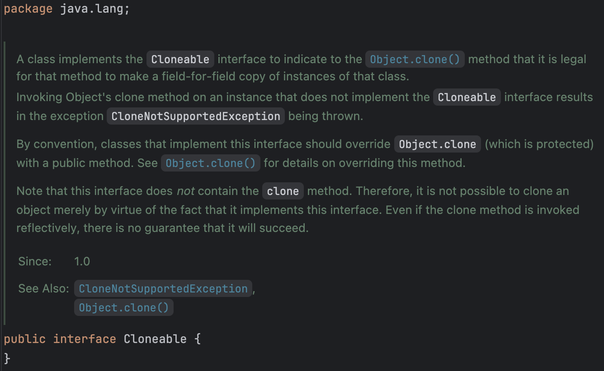
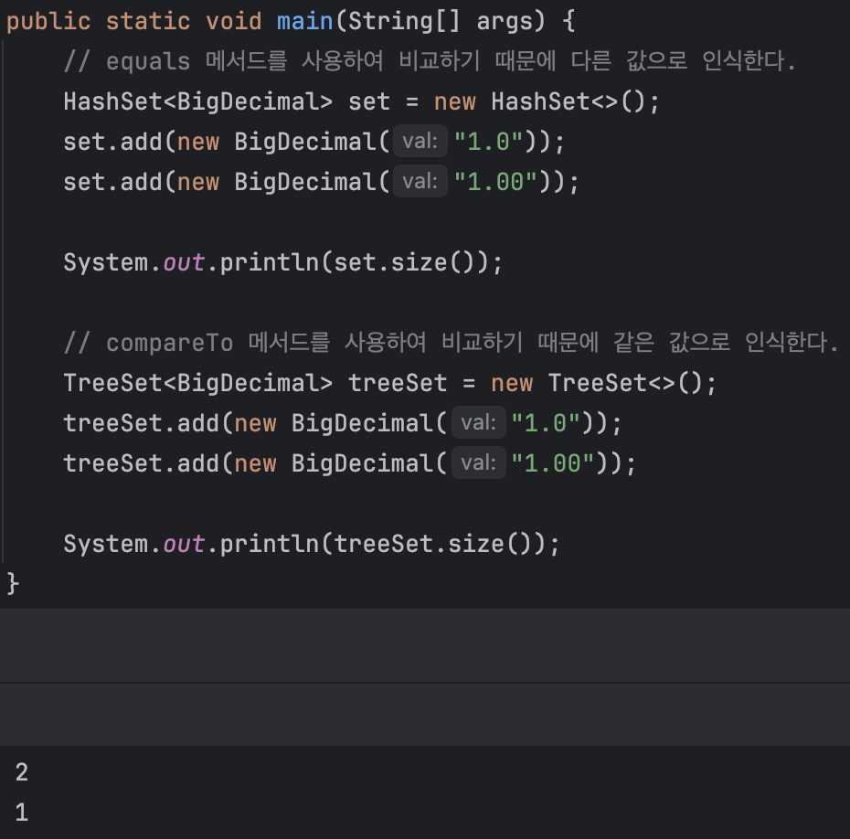

# 3장 모든 객체의 공통 메서드

이번 장에서는 Object의 메서드 중에서 재정의해야 할 메서드에 대해 알아본다. 모든 클래스는 Object를 상속하는데, 이때 final로 선언되지 않은 메서드들은 재정의가 가능하다. 우리는 이 메서드들을 규약에 맞게 재정의해야 하는데, 그렇지 않을 경우 (준수할 것이라 가정하는) HashMap, HashSet과 같은 클래스를 사용할 때 문제가 발생할 수 있다.

- [아이템 10. equals는 일반 규약을 지켜 재정의하라](#아이템-10-equals는-일반-규약을-지켜-재정의하라)
- [아이템 11. equals를 재정의하려거든 hashCode도 재정의하라](#아이템-11-equals를-재정의하려거든-hashcode도-재정의하라)
- [아이템 12. toString을 항상 재정의하라](#아이템-12-tostring을-항상-재정의하라)
- [아이템 13. clone 재정의는 주의해서 진행하라](#아이템-13-clone-재정의는-주의해서-진행하라)
- [아이템 14. Comparable을 구현할지 고려하라](#아이템-14-comparable을-구현할지-고려하라)

## 아이템 10. equals는 일반 규약을 지켜 재정의하라

> ### 핵심 정리
>
> 꼭 필요한 경우가 아니면 equals를 재정의하지 않는 것이 좋다. 재정의해야 할 때는 반드시 일반 규약을 따라야 하며, 재정의할 때는 그 클래스의 핵심 필드 모두를 빠짐없이, 다섯 가지 규약을 확실히 지켜가며 작성해야 한다. 추가로 equals를 재정의할 때는 hashCode도 반드시 재정의해야 한다. (아이템 11), [빠른 구현 방법](#equals-메서드-구현-방법-정리)을 참고하자.

### equals를 재정의하지 않아도 되는 경우

아래의 상황 중 하나에 해당한다면 equals를 재정의하지 않는 것이 좋다.

- 각 인스턴스가 본질적으로 고유하다.
  - 값을 표현하는 게 아니라 동작하는 개체를 표현하는 클래스가 여기에 해당한다. Thread가 대표적인 예이다.
- 인스턴스의 '논리적 동치성(logical equality)'을 검사할 일이 없다.
  - String이 대표적인 예이다. String은 논리적 동치성을 검사하는 메서드를 제공한다.
- 상위 클래스에서 재정의한 equals가 하위 클래스에도 딱 들어맞는다.
- 클래스가 private이거나 package-private이고 equals 메서드를 호출할 일이 없다.
  - 호출할 일이 없고, 위험을 철저히 피하고 싶다면 equals를 재정의하여 예외를 던지는 방법도 있다.
    ```java
    @Override
    public boolean equals(Object o) {
        throw new AssertionError(); // 호출 금지!
    }
    ```

### equals를 재정의해야 하는 경우

객체 식별성(object identity)이 아니라 논리적 동치성을 확인해야 하는 경우에는 equals를 재정의해야 한다. 주로 값 클래스(value class)들이 여기에 해당한다.

> ### 값 클래스(value class)?
>
> Integer와 String처럼 값을 표현하는 클래스를 말한다. 해당 클래스를 사용하는 프로그래머는 물리적으로 두 객체가 같은지가 아니라 논리적으로 같은지를 판단하고 싶어한다. 이러한 클래스들은 equals를 재정의해야 한다.

값 클래스라 하더라도 같은 인스턴스가 2개 이상 만들어지지 않음이 보장되는 경우에는 equals를 재정의하지 않아도 된다. 대표적으로 Enum이 여기에 해당한다. Enum은 인스턴스가 하나만 만들어지는 것이 보장되기 때문에 논리적 동치성과 객체 식별성이 일치한다. (언제나 한 인스턴스만 존재하므로 값이 같다면 참조도 같다.)

### equals 메서드를 재정의할 때 지켜야 할 규약

equals 메서드는 동치관계(equivalence relation)를 구현해야 한다.

1. **반사성(reflexivity)**: null이 아닌 모든 참조 값 x에 대해, x.equals(x)는 true다.

   자기 자신과 비교했을 때 항상 true를 반환해야 한다는 뜻이다. 만약 이를 어긴다면, 해당 인스턴스를 컬렉션에 넣은 다음 contains 메서드를 호출하면 방금 넣은 인스턴스를 찾지 못할 것이다.

   ```java
   public class Person {
       private final String name;
       private final int age;

       public Person(String name, int age) {
           this.name = name;
           this.age = age;
       }

       @Override // 따라하지 말 것!
       public boolean equals(Object obj) {
           // 항상 false 즉, 자기 자신과 비교하더라도 같지 않다고 판단한다.
           return false;
       }
   }

   ...

   public static void main(String[] args) {
       List<Person> people = new ArrayList<>();
       Person alice = new Person("Alice", 25);
       people.add(alice);
       // alice 인스턴스가 있는지 확인하지만, 없다고 판단한다.
       System.out.println(people.contains(alice)); // false 출력
   }
   ```

   equals 메서드를 재정의할 때는 반드시 반사성을 지켜야 한다. 사실 일부러 어기는 경우가 아니라면 반사성을 지키지 않도록 구현될 일은 없다고 생각한다.

2. **대칭성(symmetry)**: null이 아닌 모든 참조 값 x, y에 대해, x.equals(y)가 true면 y.equals(x)도 true다.

   대소문자를 구별하지 않는 문자열을 구현한 클래스와 String을 비교하는 예를 들어보자.

   ```java
   public class CaseInsensitiveString {
        private final String s;

        public CaseInsensitiveString(String s) {
             this.s = Objects.requireNonNull(s);
        }

        @Override
        public boolean equals(Object obj) {
             if (obj instanceof CaseInsensitiveString) {
               return s.equalsIgnoreCase(((CaseInsensitiveString) obj).s);
             }
             if (obj instanceof String) {
               return s.equalsIgnoreCase((String) obj);
             }
             return false;
        }

        public static void main(String[] args) {
             CaseInsensitiveString cis = new CaseInsensitiveString("Polish");
             String s = "polish";
             // cis는 String 클래스를 알고 있지만, String 클래스는 CaseInsensitiveString을 모른다.
             // 따라서 대칭성이 성립하지 않는다.
             System.out.println(cis.equals(s)); // false 출력
             System.out.println(s.equals(cis)); // true 출력
        }
   }
   ```

   컬렉션은 equals 메서드를 사용하여 객체를 비교하므로, 대칭성이 성립하지 않는 equals 메서드는 컬렉션을 오동작하게 만든다. cis를 넣고 s로 찾으려고 하면 찾지 못하게 된다. 이 문제를 해결하기 위해서는 CaseInsensitiveString의 equals를 String과 연동하겠다는 허황된 꿈을 버려야 한다.

3. **추이성(transitivity)**: null이 아닌 모든 참조 값 x, y, z에 대해, x.equals(y)가 true이고 y.equals(z)도 true이면 x.equals(z)도 true다.

   해당 속성은 상위 클래스에 없는 새로운 필드를 하위 클래스에 추가하는 상황에서 어기기 쉽다. 사실 구체 클래스를 확장해 새로운 값을 추가하면서 equals 규약을 만족시킬 방법은 존재하지 않는다. 이러한 문제를 해결하기 위해서는 상속 대신 컴포지션을 사용하는 것이 좋다.

   ```java
   public class Point {
       private final int x;
       private final int y;

       public Point(int x, int y) {
           this.x = x;
           this.y = y;
       }

       @Override
       public boolean equals(Object o) {
           if (!(o instanceof Point)) {
               return false;
           }
           Point p = (Point) o;
           return p.x == x && p.y == y;
       }

       ...
   }
   ```

   간단히 2차원에서의 점을 표현하는 클래스를 확장하여 색을 추가한 클래스를 만들어보자.

   ```java
   public class ColorPoint extends Point {
        private final Color color;

        public ColorPoint(int x, int y, Color color) {
            super(x, y);
            this.color = color;
        }

        ...
   }
   ```

   이때 equals 메서드를 그대로 둔다면 색상 정보는 무시한 채 좌표 정보만 비교하게 된다. equals 규약을 어긴 것은 아니지만, 논리적으로 허용할 수 없는 상황이다. 아니면 다음 코드처럼 비교 대상이 또 다른 ColorPoint인 경우에만 색상 정보를 비교하도록 수정할 수 있다.

   ```java
   @Override // 대칭성 위배
   public boolean equals(Object o) {
       if (!(o instanceof ColorPoint)) {
           return false;
       }
       return super.equals(o) && ((ColorPoint) o).color == color;
   }

   ...

   Point p = new Point(1, 2);
   ColorPoint cp = new ColorPoint(1, 2, Color.RED);

   // p는 cp와 같지만, cp는 p와 같지 않다.
   p.equals(cp); // true
   cp.equals(p); // false
   ```

   그렇다면 ColorPoint일 때와 Point일 때는 다르게 동작하도록 수정하면 어떨까?

   ```java
    @Override
    public boolean equals(Object o) {
        if (!(o instanceof Point)) {
            return false;
        }
        // o가 Point일 때는 좌표만 비교
        if (!(o instanceof ColorPoint)) {
            return o.equals(this);
        }
        // o가 ColorPoint일 때는 좌표와 색상을 비교
        return super.equals(o) && ((ColorPoint) o).color == color;
    }

    ...

    // 대칭성은 성립하지만 추이성은 성립하지 않는다.
    // p1 -> p2 성립, p2 -> p3 성립, p1 -> p3 미성립
    ColorPoint p1 = new ColorPoint(1, 2, Color.RED);
    Point p2 = new Point(1, 2);
    ColorPoint p3 = new ColorPoint(1, 2, Color.BLUE);
   ```

   앞서 말한 것처럼 이 현상은 (객체 지향적 추상화의 이점을 포기하지 않는 한) 모든 객체 지향 언어의 동치관계에서 나타나는 문제이다.

   ```java
   @Override // 리스코프 치환 원칙 위배
   public boolean equals(Object o) {
        // 같은 구현 클래스의 인스턴스인 경우에만 비교하도록 수정
        if (o == null || o.getClass() != getClass()) {
            return false;
        }
        Point p = (Point) o;
        return p.x == x && p.y == y;
   }
   ```

   위 방식은 실전에서 사용할 수 없다. Point의 하위 클래스는 정의상 여전히 Point이므로 어디서든 Point로 취급해야 한다. (다른 하위 클래스랑 비교할 경우
   값이 어떻든 false를 반환하기 때문이다.) 이러한 문제를 해결하기 위해 equals 메서드를 재정의할 때는 상속 대신 컴포지션을 사용하는 우회 방법이 있다.

   ```java
   public class ColorPoint {
        private final Point point;
        private final Color color;

        public ColorPoint(int x, int y, Color color) {
            this.point = new Point(x, y);
            this.color = Objects.requireNonNull(color);
        }

        /**
         * ColorPoint의 Point 뷰를 반환한다.
         */
        public Point asPoint() {
            return point;
        }


        @Override
        public boolean equals(Object o) {
            if (!(o instanceof ColorPoint)) {
                return false;
            }
            ColorPoint cp = (ColorPoint) o;
            return cp.point.equals(point) && cp.color.equals(color);
        }

        ...
   }
   ```

   > ### 추상 클래스의 하위 클래스에서 equals를 재정의할 때
   >
   > 추상 클래스의 하위 클래스라면 equals의 규약을 지키면서도 값을 추가할 수 있다. 상위 클래스를 직접 인스턴스로 만드는 게 불가능하기 때문에 대칭성과 추이성을 위배할 일이 없다.

4. **일관성(consistency)**: null이 아닌 모든 참조 값 x, y에 대해, x.equals(y)를 반복해서 호출해도 항상 true나 false를 반환한다.

   두 객체가 같다면 (수정되지 않는다면) 언제 비교하든 같아야 한다. equals 메서드를 호출할 때마다 객체의 상태가 변할 경우 일관성이 깨진다.

   클래스가 불변이든 가변이든 equals의 판단에 신뢰할 수 없는 자원을 사용해서는 안 된다. (시간 정보, 네트워크 연결 등) 이 제약을 어기면 일관성 규약을 만족시키기가 아주 어려워진다.

5. **null-아님**: null이 아닌 모든 참조 값 x에 대해, x.equals(null)은 false다.

   null과 비교할 때는 항상 false를 반환해야 한다. null이 아닌 참조 값은 null과 같다고 판단해서는 안 된다.

   ```java
   @Override // 명시적으로 null 검사를 할 필요가 없다.
   public boolean equals(Object o) {
        if (o == null) {
            return false;
        }
        ...
   }
   ```

   ```java
   @Override // 묵시적으로 null 검사를 수행한다.
    public boolean equals(Object o) {
        // instanceof 연산자는 첫 번째 피연산자가 null이면 false를 반환한다.
        if (!(o instanceof MyType)) {
            return false;
        }
        MyType mt = (MyType) o;
        ...
    }
   ```

### equals 메서드 구현 방법 정리

1. == 연산자를 사용해 입력이 자기 자신의 참조인지 확인한다.
2. instanceof 연산자로 입력이 올바른 타입인지 확인한다.
3. 입력을 올바른 타입으로 형변환한다. (이때 instanceof로 검사했으므로 실패할 일은 없다.)
4. 입력 객체와 자기 자신의 대응되는 '핵심' 필드들이 모두 일치하는지 하나씩 검사한다.

equals를 다 구현했다면 대칭성, 추이성, 일관성을 지키는지 확인해야 한다. (테스트 코드를 작성하거나, 관련 라이브러리를 활용한다.)

- equals 메서드를 재정의할 때는 hashCode도 반드시 재정의해야 한다. (아이템 11)
- 너무 복잡하게 만들지 말자.
- equals는 오버로딩하지 말자. (매개변수 타입은 Object로 하나만 사용하자.)
- 최상의 성능을 바란다면, 다를 가능성이 크거나 비교하는 비용이 작은 필드부터 비교하자.
- 비교가 복잡한 경우 필드의 표준형(canonical form)을 만들어 비교하자. (물론 값이 바뀌는 경우 표준형도 갱신해야 한다.)

## 아이템 11. equals를 재정의하려거든 hashCode도 재정의하라

> ### 핵심 정리
>
> equals를 재정의한 클래스 모두에서 hashCode도 재정의해야 한다. 그렇지 않으면 hashCode 일반 규약을 어기게 되어 해당 클래스의 인스턴스를 HashMap이나 HashSet 같은 컬렉션의 원소로 사용할 때 문제가 발생할 수 있다. AutoValue, Lombok, Guava의 Objects 클래스를 활용하는 방법도 있다. [좋은 해시 함수를 만드는 요령](#좋은-해시-함수를-만드는-요령)을 참고하자.

equals를 재정의한 클래스 모두에서 hashCode도 재정의해야 한다. 그렇지 않으면 hashCode 일반 규약을 어기게 되어 해당 클래스의 인스턴스를 HashMap이나 HashSet 같은 컬렉션의 원소로 사용할 때 문제가 발생할 수 있다.

```java
// Object 명세의 규약

- equals 비교에 사용되는 정보가 변경되지 않았다면, 객체의 hashCode 메서드는 몇 번을 호출해도 일관된 값을 반환해야 한다. 단, 프로그램이 다시 실행되지 않는 한 같은 객체에 대해 hashCode를 호출할 때마다 같은 값을 반환할 필요는 없다.
- equals(Object)가 두 객체를 같다고 판단했다면, 두 객체의 hashCode는 같아야 한다.
- equals(Object)가 두 객체를 다르다고 판단했더라도, 두 객체의 hashCode가 서로 다를 필요는 없다. 단, 다른 객체에 대해서는 다른 hashCode를 반환해야 해시 테이블의 성능이 좋아진다.
```

hashCode 재정의를 잘못한 경우 두 번째 조항이 큰 문제가 될 수 있다. [아이템 10](#아이템-10-equals는-일반-규약을-지켜-재정의하라)에서 본 것처럼 equals는 구현에 따라 물리적으로 다른 두 객체를 논리적으로 같다고 판단할 수 있다. 하지만, Object의 hashCode 메서드는 물리적으로 다른 두 객체에 대해 다른 해시코드를 반환한다. 이때 두 객체를 같다고 판단하는 equals 메서드를 재정의한 클래스에서 hashCode를 재정의하지 않으면, 두 객체의 hashCode가 다르게 되어 다양한 문제가 발생할 수 있다.

정리하자면 논리적으로 같은 객체는 같은 해시코드를 반환해야 한다는 것이다.

```java
// 여기서 equals는 논리적 동치성을 비교하고, hashCode는 재정의하지 않았다.
Map<PhoneNumber, String> m = new HashMap<>();
m.put(new PhoneNumber(707, 867, 5309), "제니");

m.get(new PhoneNumber(707, 867, 5309)); // null 반환
```

우리는 논리적으로 동치인 PhoneNumber 객체를 사용하여 제니가 반환되길 기대했지만, null이 반환되었다. 이는 논리적으로 동치인 두 객체가 서로 다른 해시코드를 반환했기 때문이다. 이 문제를 해결하기 위해서는 PhoneNumber 클래스에 hashCode 메서드를 재정의해야 한다.

```java
@Override // 따라하지 말 것!
public int hashCode() {
    return 42;
}
```

이렇게 hashCode를 재정의하면 모든 객체가 같은 해시코드를 반환하기 때문에 위 문제는 해결된다. 하지만, 반대로 모든 객체가 같은 해시코드를 반환하기 때문에 모든 객체가 해시 테이블의 버킷 하나에 담기게 되어 마치 LinkedList처럼 동작하게 된다. 이는 해시 테이블의 성능을 떨어뜨리는 원인이 된다. (O(1)의 성능을 기대할 수 없게 된다.)

좋은 해시 함수라면 서로 다른 인스턴스에 다른 해시코드를 반환한다. (세 번째 조항) 이를 위반하면 앞서 말한 것처럼 해시 테이블의 성능이 떨어지게 된다. 따라서 좋은 해시 함수를 만들기 위해서는 객체의 핵심 필드들을 사용하여 해시코드를 계산해야 한다.

이상적인 해시 함수는 주어진 인스턴스들을 32비트 정수 범위에 균일하게 분배해야 한다. 물론 완벽히 이상을 따르기엔 어려움이 있지만, 비슷하게 만드는 것은 크게 어렵지 않다.

### 좋은 해시 함수를 만드는 요령

1. int 변수 result 를 선언한 후 값 c로 초기화한다. 이 때 c는 해당 객체의 첫 번째 핵심필드를 단계 2.1 방식으로 계산한 해시코드이다.
2. 해당 객체의 나머지 핵심필드 f 각각에 대해 다음 작업을 수행한다
   1. 해당 필드의 해시코드 c를 계산한다
      1. 기본타입 필드라면 Type.hashCode(f)를 수행한다
      2. 참조타입 필드면서 이 클래스의 equals 메서드가 이 필드의 equals 를 재귀적으로 호출한다면, 이 필드의 hashCode를 재귀적으로 호출한다. 필드의 값이 null 이면 0을 사용한다.
      3. 필드가 배열이라면, 핵심 원소 각각을 별도 필드처럼 다룬다. 배열에 핵심 원소가 하나도 없다면 상수 0을 사용한다. 모든 원소가 핵심 원소라면 Arrays.hashCode를 사용한다.
   2. 단계 2.1 에서 계산한 해시코드 c로 result를 갱신한다. (예시: result = 31 \* result + c;)
3. result를 반환한다.

파생 필드는 해시코드 계산에서 제외해도 된다. 중요한 것은 `equals 비교에 사용되지 않은 필드는 반드시 제외해야 한다.` 그렇지 않으면 Object 명세의 규약 두 번째 조항을 어기게 된다.

> ### 31을 사용하는 이유?
>
> 2-2 의 곱셈 31 \* result는 클래스에 비슷한 필드가 여러 개일 때 해시효과를 크게 높여준다. 곱하는 숫자가 31인 이유는 31이 홀수이면서 소수이기 때문이다.

### 전형적인 hashCode 메서드 구현 예시

전형적인 hashCode 메서드 구현 예시를 보자.

```java
@Override
public int hashCode() {
    int result = Integer.hashCode(areaCode);
    result = 31 * result + Integer.hashCode(prefix);
    result = 31 * result + Integer.hashCode(lineNum);
    return result;
}
```

PhoneNumber 인스턴스의 핵심 필드 3개만을 사용해 간단한 계산을 수행하고 있다. 이렇게 해시코드를 계산하면 논리적으로 같은 객체는 같은 해시코드를 반환하게 된다.

### Objects 클래스를 활용한 해시코드 계산

Objects 클래스의 hash 메서드를 사용하면 간단하게 해시코드를 계산할 수도 있다.

```java
@Override
public int hashCode() {
    return Objects.hash(areaCode, prefix, lineNum);
}
```

물론 이전의 방식보다는 성능이 떨어진다. Objects.hash는 가변인수를 담기 위한 배열을 만들어야 하고, 기본 타입이 있는 경우 박싱과 언박싱을 수행해야 하기 때문이다. 하지만, 성능이 크게 중요하지 않다면 Objects 클래스를 사용하는 것도 좋은 방법이다.

### 해시코드 캐싱 전략

클래스가 불변이고 해시코드를 계산하는 비용이 크다면, 해시코드를 캐싱하는 방법도 있다.

```java
private int hashCode; // 자동으로 0으로 초기화된다.

@Override
public int hashCode() {
    int result = hashCode;
    if (result == 0) {
        result = Integer.hashCode(areaCode);
        result = 31 * result + Integer.hashCode(prefix);
        result = 31 * result + Integer.hashCode(lineNum);
        hashCode = result;
    }
    return result;
}
```

상황에 따라 다르겠지만, 이 방식을 선택한다면 스레드 안전성을 고려해야 한다. (해시코드를 계산하는 동안 다른 스레드가 hashCode를 읽을 수 있기 때문이다.)

추가로 성능을 높이기 위해 핵심 필드를 제외하고 해시코드를 계산하도록 구현하면 안 된다. 한 버킷으로 모여 해시 테이블의 속도가 선형으로 느려질 수 있다.

### hashCode는 비즈니스 로직이 아니다

hashCode가 반환하는 값의 생성 규칙을 API 사용자에게 자세히 공표하지 말자. API 사용자가 이 값에 의존하는 경우, 나중에 이 값을 바꾸기 어려워진다. (API 사용자가 이 값에 의존하고 있다면, 이 값이 바뀌면 API 사용자의 코드가 깨질 수 있다.)

## 아이템 12. toString을 항상 재정의하라

> ### 핵심 정리
>
> 모든 구체 클래스에서 Object의 toString 메서드를 재정의하자. toString 메서드는 그 객체가 가진 주요 정보 모두를 반환하는 게 좋다. 상위 클래스에서 이미 알맞게 재정의한 toString이 있다면, 그것을 사용하자. 마지막으로 포맷 명시 여부를 결정하고 꼭 명확하게 문서화하자.

Object의 기본 toString 메서드는 `클래스_이름@16진수_해시코드`를 반환한다. 이는 개발자에게 클래스의 내용을 설명하는 데 전혀 쓸모가 없다. 또한, toString의 규약은 `모든 하위 클래스에서 이 메서드를 재정의하라`이다. (간결하면서 사람이 읽기 쉬운 형태의 유익한 정보를 반환해야 한다.)

toString을 잘 구현한 클래스는 사용하기에 훨씬 즐겁고, 그 클래스를 사용한 시스템은 디버깅하기 쉽다. toString 메서드는 객체를 println, printf, 문자열 연결 연산(+), assert 구문에 넘길 때, 디버거가 객체를 출력할 때 자동으로 호출된다. 즉, 개발자가 직접 호출하지 않더라도 여기저기서 호출된다는 뜻이다.

좋은 toString은 컬렉션처럼 이 인스턴스를 포함하는 객체에서 유용하게 쓰인다.

```java
public class Person {
    private final String name;
    private final int age;

    public Person(String name, int age) {
        this.name = name;
        this.age = age;
    }

    @Override
    public String toString() {
        return name + " (" + age + "세)";
    }
}

...

public static void main(String[] args) {
    Person person1 = new Person("Alice", 25);
    Person person2 = new Person("Bob", 30);

    // 순번과 Person 인스턴스를 Map에 넣어 출력
    Map<Integer, Person> people = new HashMap<>();
    people.put(1, person1);
    people.put(2, person2);

    // {1=Alice (25세), 2=Bob (30세)} 출력
    System.out.println(people);
}
```

만약 Person 클래스에 toString 메서드를 재정의하지 않았다면, 출력 결과는 `Person@16진수_해시코드`가 여러 개 출력되었을 것이다. 이처럼 실전에서도 toString 메서드는 그 객체가 가진 주요 정보 모두를 반환하는 게 좋다. 하지만 객체가 거대하거나 객체의 상태가 문자열로 표현하기에 적합하지 않다면, 객체의 상태를 요약하는 방법도 있다.

```java
// 예시: toString 메서드에서 요약하여 name 필드만 출력되도록 재정의한 경우,
// 실제로는 age 필드 때문에 발생한 문제이지만, 보이지 않아 디버깅이 어려워졌다.
Assertion failure: expected {Alice} but was {Alice}
```

그러나 잘못 요약되어 디버깅시 문제가 발생할 수 있으므로, toString 메서드를 재정의할 때는 객체의 상태를 요약하는 방법을 신중하게 선택해야 한다. (별 문제가 없다면 모든 정보를 반환하는 것이 좋다.)

### toString을 구현할 때는 반환값의 포맷을 문서화할지 정해야 한다.

전화번호나 행렬 같은 값 클래스라면 문서화를 권장한다고 한다. 포맷을 명시한 경우 그 객체는 표준적이고 명확해진다. 덕분에 그 값 그대로 입출력에 사용하거나 CSV 파일처럼 사람이 읽을 수 있는 형태로 저장할 수도 있다. 이처럼 포맷을 명시하기로 했다면, 명시한 포맷에 맞는 문자열과 객체를 상호 전환할 수 있는 정적 팩터리나 생성자를 함께 제공하는 것이 좋다. (자바 라이브러리의 대부분 값 클래스가 이 방식을 따르고 있다.)

물론 단점도 있다. 포맷을 한 번 명시하면 평생 그 포맷에 얽매이게 된다. 포맷을 바꾸면 그 포맷을 사용하던 모든 클라이언트가 망가질 수 있다. (포맷을 바꾸는 일은 굉장히 어렵다.)

더 중요한 것은 포맷을 명시하든 아니든 작성하는 개발자의 의도는 명확히 밝혀야 한다는 것이다. (포맷을 명시하지 않았다면, 포맷을 명시하지 않았다는 것을 명확히 밝혀야 한다.)

### 포맷을 명시한 경우 예시

```java
/**
 * 이 전화번호의 문자열 표현을 반환한다.
 * 이 문자열은 "XXX-YYY-ZZZZ" 형태의 12글자로 구성된다.
 * XXX는 지역 코드, YYY는 프리픽스, ZZZZ는 가입자 번호다.
 * 각각의 대문자는 10진수 숫자 하나를 나타낸다.
 *
 * 전화번호의 각 부분 값이 너무 작아서 자릿수가 모자라면,
 * 앞에서부터 0으로 채워나간다. 예컨대 가입자 번호가 123이라면
 * 전화번호의 마지막 네 문자는 "0123"이 된다.
 */
@Override
public String toString() {
    return String.format("%03d-%03d-%04d",
            areaCode, prefix, lineNum);
}
```

### 포맷을 명시하지 않은 경우 예시

```java
/**
 * 이 약물에 관한 대략적인 설명을 반환한다.
 * 다음은 이 설명의 일반적인 형태이나,
 * 상세 형식은 정해지지 않았으며 향후 변경될 수 있다.
 *
 * "[약물 #9: 유형: 사랑, 냄새: 라벤더, 겉모습: 먹물]"
 */
@Override
public String toString() { ... }
```

포맷 명시 여부에 상관없이 의도를 명확히 밝힌 예시들이다. 만약 포맷을 명시하지 않았다는 것을 명확히 밝혔음에도 포맷을 명시한 것처럼 사용한다면, 사용자는 그 포맷이 언제든 바뀔 수 있다는 것을 알아야 한다.

### toString이 반환한 값에 포함된 정보를 얻어올 수 있는 API를 제공하자

예를 들어 PhoneNumber 클래스는 지역 코드, 프리픽스, 가입자 번호를 얻어올 수 있는 접근자 메서드를 제공해야 한다. 그렇지 않으면 이 정보가 필요한 프로그래머는 toString이 반환한 문자열을 파싱해야 한다. 이 방법은 불편하고, 불필요한 과정으로 성능에도 영향을 미침며, 오류 발생 가능성이 높아진다.

마지막으로 정적 유틸 클래스는 toString 메서드를 제공할 이유가 없으며, 대부분의 Enum 타입은 적절한 toString 메서드를 이미 가지고 있다.

## 아이템 13. clone 재정의는 주의해서 진행하라

> ### 핵심 정리
>
> 이번 아이템에서는 clone 메서드를 잘 동작하게끔 해주는 구현 방법과 언제 그렇게 해야 하는지를 알려주고, 가능한 다른 선택지에 관해 논의된다.
>
> 새로운 인터페이스나 클래스에서는 Cloneable을 구현하지 말아야 한다. 최대한 조심스럽게 접근하며, 성능 문제까지 고려해야 한다. 또한 대부분의 복제 기능은 생성자와 팩터리를 이용하는 것이 더 나은 방법이다. 단, 배열을 복사할 때는 clone 메서드를 사용하는 편이 더 나을 수 있다.

Cloneable은 복제해도 되는 클래스임을 명시하는 용도의 mixin interface이지만, 아쉽게도 의도한 목적을 제대로 이루지 못했다고 말한다. clone 메서드가 선언된 곳이 Cloneable이 아닌 Object이며 그마저도 protected로 선언되어 있기 때문이다. (Cloneable 인터페이스를 구현하는 것만으로는 외부 객체에서 clone 메서드를 호출할 수 없다.) 리플렉션을 사용하면 가능하지만, 100% 성공 보장도 아니라고 한다.

이쯤되면 왜 알아야 하나 싶지만, 이런 단점에도 불구하고 Cloneable 방식은 널리 쓰이고 있기 때문에 알아두는 것이 좋다.

### Cloneable?



문서를 번역해서 요약하면, Cloneable 인터페이스는 클래스가 Object.clone() 메서드를 사용하여 그 클래스의 인스턴스를 필드 단위로 복사할 수 있음을 나타내기 위해 존재한다. 만약 Cloneable 인터페이스를 구현하지 않은 클래스의 인스턴스에 대해 Object.clone() 메서드를 호출하면, `CloneNotSupportedException` 예외가 발생한다는 것을 알 수 있다.

즉, clone 메서드는 Object에 있지만, 이 표식이 있는 클래스만 (그마저도 제대로 구현된 경우에만) clone 메서드를 호출할 수 있으며, Cloneable 인터페이스는 이 표식을 제공한다고 볼 수 있다. (clone 메서드를 호출할 수 있는지를 결정하는 표식)

사실 나는 clone 메서드를 한번도 사용한 경험이 없다. (Cloneable은 더더욱) 그래서 이번 아이템은 나에게는 생소한 내용이었다. 그래도 중간에 불변에 관한 내용이나 깊은 복사, 얕은 복사에 관한 내용은 쉽게 이해할 수 있었다. 지금 내가 실천할 수 있는 것은 최대한 clone 메서드를 사용하지 않는 것이고, 이미 Cloneable 인터페이스를 구현한 클래스를 사용할 때는 꼼꼼하게 확인하고 다시 이 아이템을 읽어보는 것이다.

## 아이템 14. Comparable을 구현할지 고려하라

> ### 핵심 정리
>
> 순서를 고려해야 하는 값 클래스를 작성한다면 꼭 Comparable 인터페이스를 구현해서 그 인스턴스들을 쉽게 정렬하거나 검색, 비교 기능 등을 제공하는 컬렉션과 어우러지도록 하자. compareTo 메서드에서 필드의 값을 비교할 때 <, > 연산자 대신 박싱된 기본 타입 클래스의 정적 compare 메서드나 Comparator 인터페이스가 제공하는 비교자 생성 메서드를 사용하자.

이번 아이템에서 다루는 compareTo 메서드는 다음 두 가지를 제외하고는 Object의 equals 메서드와 같다.

- compareTo 메서드는 단순 동치성 비교에 더해 순서까지 비교한다.
- compareTo 메서드는 제네릭하다.

Comparable 인터페이스를 구현했다는 것은 그 클래스의 인스턴스들에는 자연적인 순서(natural order)가 있다는 것을 의미한다. 그래서 Comparable 인터페이스를 구현한 객체들의 배열은 다음과 같이 아주 쉽게 정렬할 수 있다.

```java
// Comparable을 구현한 객체들이 담긴 배열(a)을 정렬하는 코드
Arrays.sort(a);
```

검색, 극단값 계산, 자동 정렬되는 컬렉션 관리도 역시 쉽게 가능하다. 이처럼 Comparable 인터페이스를 제대로 구현한다면 수많은 제네릭 알고리즘과 컬렉션의 힘을 누릴 수 있다. (자바 라이브러리의 모든 값 클래스와 Enum 타입은 Comparable을 구현했다.)

### compareTo 메서드의 일반 규약

이 객체와 주어진 객체의 순서를 비교한다. 이 객체가 주어진 객체보다 작으면 음의 정수를, 같으면 0을, 크면 양의 정수를 반환한다. 이 객체와 비교할 수 없는 타입의 객체가 주어지면 `ClassCastException` 예외를 던진다.

1. Comparable을 구현한 클래스는 모든 x, y에 대해 sgn(x.compareTo(y)) == -sgn(y.compareTo(x))를 만족해야 한다. (따라서 x.compareTo(y)가 예외를 던지면 y.compareTo(x)도 예외를 던져야 한다.)

   쉽게 설명하면, x.compareTo(y)가 0이 아니라면 y.compareTo(x)는 0이어서는 안 된다는 것이다. 두 객체를 비교할 때, 한쪽이 작으면 다른 한쪽은 반드시 크다는 것이다.

2. Comparable을 구현한 클래스는 추이성을 보장해야 한다. (x.compareTo(y) > 0이고 y.compareTo(z) > 0이면 x.compareTo(z) > 0이다.)

   쉽게 설명하면, x가 y보다 크고 y가 z보다 크면 x는 z보다 크다는 것이다. 즉, 방향이 일관적이어야 한다.

3. Comparable을 구현한 클래스는 모든 z에 대해 x.compareTo(y) == 0이면 sgn(x.compareTo(z)) == sgn(y.compareTo(z))이다.

   쉽게 설명하면, x와 y가 같다면, x와 z의 비교 결과가 y와 z의 비교 결과가 같아야 한다는 것이다. 즉, 같은 객체와 비교할 때는 다른 객체와 비교한 결과와 같아야 한다.

4. (선택이지만 필수로 권장되는 규약) x.compareTo(y) == 0이면, 모든 z에 대해 sgn(x.compareTo(z)) == sgn(y.compareTo(z))이다.

   compareTo 메서드로 수행한 동치성 테스트의 결과가 equals와 같아야 한다는 것이다. 이를 잘 지키면 compareTo로 줄지은 순서와 equals의 결과가 일관되게 된다. 물론, 이 규약을 지키지 않아도 동작은 하지만, 이 클래스의 객체를 정렬된 컬렉션에 넣으면 예상과 다른 결과가 나올 수 있다. 그 이유는 정렬된 컬렉션은 동치성을 비교할 때 equals 메서드가 아닌 compareTo 메서드를 사용하기 때문이다.

   ### 일관되지 않는 경우 예시

   

   - HashSet은 내부적으로 equals()와 hashCode()를 사용해 중복을 판단한다.
   - TreeSet은 내부적으로 compareTo()를 사용해 중복을 판단하고, 정렬된 상태로 유지한다.

   BigDecimal 클래스는 equals()와 compareTo()의 동작이 일관되지 않다. equals()는 값과 소수점의 자리 수까지 비교하지만, compareTo()는 값만 비교하며 소수점 자리 수는 무시한다. 따라서 BigDecimal 클래스를 TreeSet에 넣으면 예상과 다른 결과가 나올 수 있다.

   이 권고를 지키지 않은 경우에는 그 사실을 명시해야 한다. (예시: `주의: 이 클래스의 순서는 equals 메서드와 일관되지 않다.`)

### compareTo 작성 요령

compareTo 메서드 작성 요령은 [equals](#아이템-10-equals는-일반-규약을-지켜-재정의하라)와 비슷하다.

우선 Comparable은 타입을 인수로 받는 제네릭 인터페이스이므로 compareTo 메서드의 인수 타입은 컴파일 타임에 정해진다. 따라서 입력 인수의 타입을 확인하거나 형변환할 필요가 없다. (타입이 잘못됐다면 컴파일 오류가 발생한다.)

compareTo 메서드는 각 필드가 동치인지를 비교하는 게 아니라 그 순서를 비교한다. Comparable을 구현하지 않은 필드나 표준이 아닌 순서로 비교해야 한다면 비교자(Comparator)를 사용해야 한다. 비교자는 직접 만들거나 자바가 제공하는 것 중에 골라 쓰면 된다.

compareTo 메서드에서 관계 연산자 <와 >를 사용하는 것은 옛날 방식이며 오류 발생 가능성을 높이니 이제는 권장되지 않는다. 박싱된 기본 타입 클래스의 정적 compare 메서드나 Comparator 인터페이스가 제공하는 비교자 생성 메서드를 사용하는 것이 좋다.

### 박싱된 기본 타입 클래스의 정적 compare 메서드 사용 예시

```java
public class Person implements Comparable<Person> { // Comparable 구현, 제네릭 주의
    private String name;
    private int age;

    public Person(String name, int age) {
        this.name = name;
        this.age = age;
    }

    // 이름을 기준으로 비교하고, 같은 경우 나이를 기준으로 비교한다.
    @Override
    public int compareTo(Person p) {
        int result = this.name.compareTo(p.name); // String 클래스의 compareTo 메서드 사용
        if (result == 0) {
            return Integer.compare(this.age, p.age); // 박싱된 기본 타입 클래스의 정적 compare 메서드 사용
        }
        return result;
    }
}

...

// 결과는 "p1이 p2보다 작다."가 출력된다.
public static void main(String[] args) {
    Person p1 = new Person("Alice", 20);
    Person p2 = new Person("Alice", 25);

    if (p1.compareTo(p2) < 0) {
        System.out.println("p1이 p2보다 작다.");
    } else if (p1.compareTo(p2) == 0) {
        System.out.println("p1과 p2가 같다.");
    } else {
        System.out.println("p1이 p2보다 크다.");
    }
}
```

### Comparator 인터페이스가 제공하는 비교자 생성 메서드 사용 예시

```java
public class Person implements Comparable<Person> {
    // 비교자 생성 메서드를 사용하기 위해 정적 필드 추가
    private static final Comparator<Person> COMPARATOR =
            Comparator.comparing(Person::getName) // static import를 사용하면 더욱 간결해진다.
                    .thenComparingInt(Person::getAge);

    // 생략, getter 추가

    @Override
    public int compareTo(Person p) {
        // 비교자 생성 메서드를 사용하여 비교
        return COMPARATOR.compare(this, p);
    }
}
```

람다 방식과 비교자 생성 메서드를 사용하면 코드가 간결해지고, 가독성이 좋아진다. 그러나 저자의 컴퓨터 환경에서 10% 정도 성능 저하를 경험했다고 말한다. (성능이 중요한 상황이라면 박싱된 기본 타입 클래스의 정적 compare 메서드를 사용하는 것이 좋을 수도 있다.) 참고로 결과는 위의 예시와 같다.

### 값의 차로 비교하는 메서드 주의

값의 차를 기준으로 첫 번째 값이 두 번째 값보다 작으면 음수를, 두 값이 같으면 0을, 첫 번째 값이 크면 양수를 반환하는 compareTo나 compare 메서드를 마주치게 될 수 있다.

```java
// 추이성 위배!!
static Comparator<Object> hashCodeOrder = new Comparator<>() {
    public int compare(Object o1, Object o2) {
        return o1.hashCode() - o2.hashCode();
    }
};
```

그러나 위와 같은 방식은 정수 오버플로우를 일으키거나 IEEE 754 부동소수점 계산 방식에 따라 부정확한 결과를 낼 수 있다. 따라서 이런 방식은 절대 사용하면 안 된다. (크게 장점이 있는 것도 아니다.)

위 방식 대신 아래의 두 방식 중 하나를 사용하자.

```java
// 박싱된 기본 타입 클래스의 정적 compare 메서드를 사용한 방식
static Comparator<Object> hashCodeOrder = new Comparator<>() {
    public int compare(Object o1, Object o2) {
        return Integer.compare(o1.hashCode(), o2.hashCode());
    }
};
```

```java
// 비교자 생성 메서드를 사용한 방식
static Comparator<Object> hashCodeOrder =
    Comparator.comparingInt(o -> o.hashCode());
```
