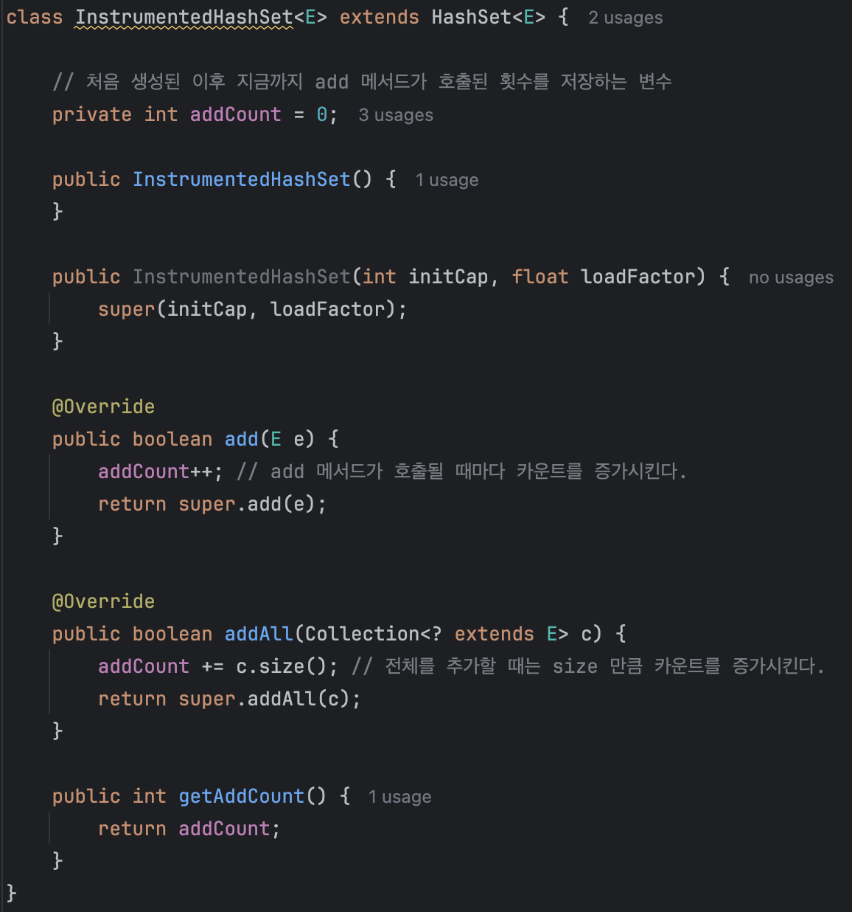
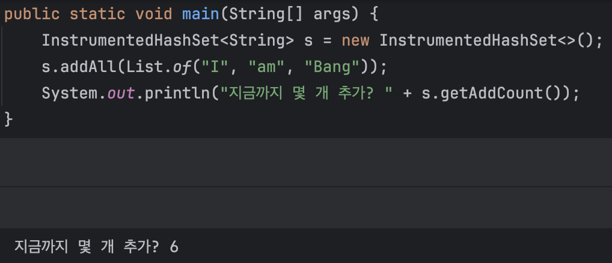
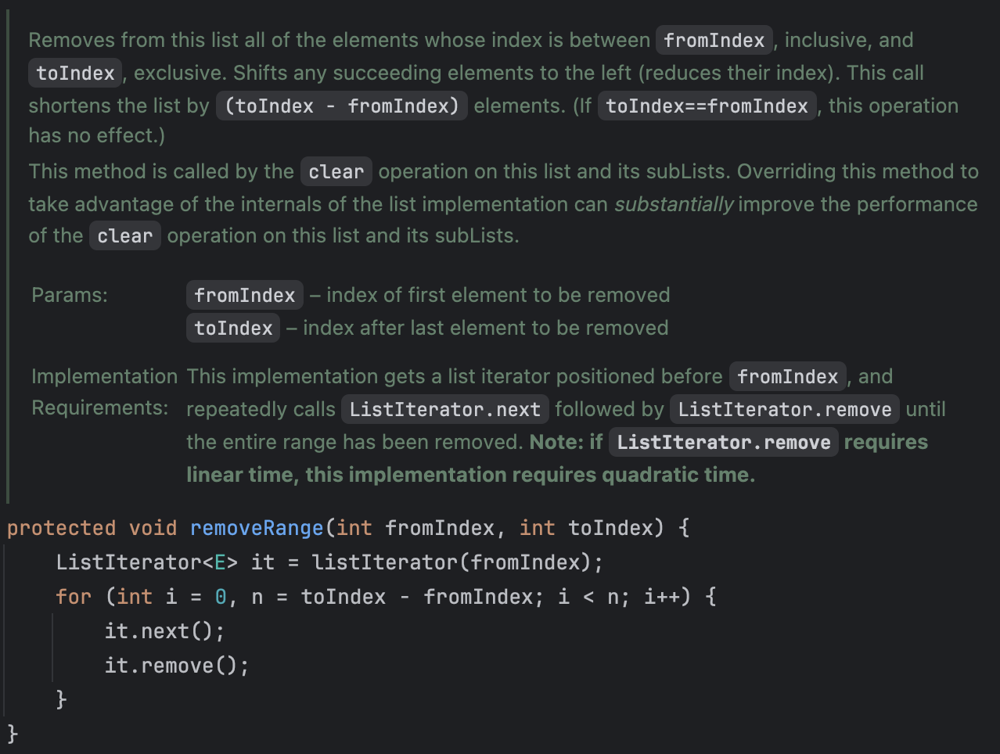
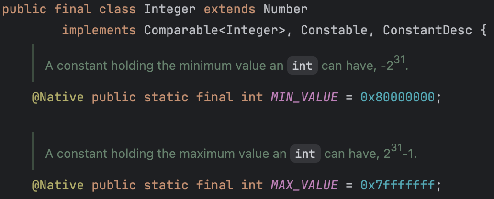

# 4장 클래스와 인터페이스

추상화의 기본 단위인 클래스와 인터페이스는 자바 언어에서 중요한 요소이다. 이번 장에서는 클래스와 인터페이스를 쓰기 편하고, 견고하며, 유연하게 만드는 방법을 알아본다.

- [아이템 15. 클래스와 멤버의 접근 권한을 최소화하라](#아이템-15-클래스와-멤버의-접근-권한을-최소화하라)
- [아이템 16. public 클래스에서는 public 필드가 아닌 접근자 메서드를 사용하라](#아이템-16-public-클래스에서는-public-필드가-아닌-접근자-메서드를-사용하라)
- [아이템 17. 변경 가능성을 최소화하라](#아이템-17-변경-가능성을-최소화하라)
- [아이템 18. 상속보다는 컴포지션을 사용하라](#아이템-18-상속보다는-컴포지션을-사용하라)
- [아이템 19. 상속을 고려해 설계하고 문서화하라. 그러지 않았다면 상속을 금지하라](#아이템-19-상속을-고려해-설계하고-문서화하라-그러지-않았다면-상속을-금지하라)
- [아이템 20. 추상 클래스보다는 인터페이스를 우선하라](#아이템-20-추상-클래스보다는-인터페이스를-우선하라)
- [아이템 21. 인터페이스는 구현하는 쪽을 생각해 설계하라](#아이템-21-인터페이스는-구현하는-쪽을-생각해-설계하라)
- [아이템 22. 인터페이스는 타입을 정의하는 용도로만 사용하라](#아이템-22-인터페이스는-타입을-정의하는-용도로만-사용하라)
- [아이템 23. 태그 달린 클래스보다는 클래스 계층구조를 활용하라](#아이템-23-태그-달린-클래스보다는-클래스-계층구조를-활용하라)
- [아이템 24. 멤버 클래스는 되도록 static으로 만들라](#아이템-24-멤버-클래스는-되도록-static으로-만들라)
- [아이템 25. 톱레벨 클래스는 한 파일에 하나만 담으라](#아이템-25-톱레벨-클래스는-한-파일에-하나만-담으라)

## 아이템 15. 클래스와 멤버의 접근 권한을 최소화하라

> ### 핵심 정리
>
> 프로그램 요소의 접근성은 가능한 한 최소한으로 하자. 의도치 않게 public API로 공개되지 않도록 한다. public 클래스는 상수용 public static final 필드 외에는 어떠한 public 필드도 가져선 안되며, 이것이 불변인지 확인해야 한다.

잘 설계된 컴포넌트는 클래스 내부 데이터와 내부 구현 정보를 외부로부터 잘 숨겨, 구현과 API를 깔끔하게 분리한다. 이를 정보 은닉, 혹은 캡슐화라고 한다. 정보 은닉의 장점은 시스템 개발 속도를 높이고, 시스템 관리 비용을 낮추며, 시스템 보안을 높이는 데 도움이 된다.

자바는 정보 은닉을 위해 접근 제한자(private, protected, public)를 제공한다. 접근 제한자를 잘 활용하면 클래스 내부 데이터와 내부 구현 정보를 외부로부터 잘 숨길 수 있다.

`모든 클래스와 멤버의 접근성을 가능한 한 좁혀야 한다.` 접근 제한자의 기본 원칙이다. 즉, 올바르게 동작하는 한 항상 가장 낮은 접근 수준을 부여해야 한다는 뜻이다.

### 접근 제한자 살펴보기

- `private`: 멤버를 선언한 톱레벨 클래스에서만 접근할 수 있다.
- `package-private`: 멤버가 소속된 패키지 안의 모든 클래스에서 접근할 수 있다. 접근 제한자를 명시하지 않으면 이렇게 된다.
- `protected`: package-private의 접근 범위를 포함하며, 이 멤버를 선언한 클래스의 하위 클래스에서도 접근할 수 있다.
- `public`: 어디서든 접근할 수 있다.

충분히 고민하고 공개 API가 아닌 경우에는 모두 private로 만들어야 한다. 그런 다음 같은 패키지 내의 다른 클래스가 접근해야 하는 멤버에 한정해 package-private로 풀어주는 것이다. private와 package-private 멤버는 모두 해당 클래스의 세부 구현에 해당하므로, 공개 API에 영향을 주지 않는다.

public 클래스에서 protected 필드를 사용하는 것은 좋지 않다. 이는 공개 API에 해당하며, 평생 지원되어야 한다는 것이다. 추가로 내부 동작 방식을 API 문서에 적어 관리해야 할 수도 있다.

상위 클래스의 메서드를 재정의할 때는 접근 제한자를 상위 클래스보다 좁게 설정할 수 없다. 이 제약은 상위 클래스의 인스턴스는 하위 클래스의 인스턴스로 대체해 사용할 수 있어야 한다는 리스코프 치환 원칙을 지키기 위함이다. 이 규칙을 어기면 컴파일러가 에러를 발생시킨다.

### public 클래스의 인스턴스 필드는 되도록 public이 아니어야 한다.

필드가 가변 객체를 참조하거나, final이 아닌 인스턴스 필드를 public으로 선언하면, 해당 필드에 대한 제어권이 없어진다. 이는 클래스의 불변성을 깨뜨리며, 일반적으로 스레드 안전성을 잃게 된다.

길이가 0이 아닌 배열은 항상 가변이므로, public static final 배열 필드를 두거나, public 메서드를 통해 해당 배열을 반환하면 안 된다. 이러한 필드는 public으로 선언하면 안 되며, private로 선언하고 public 불변 리스트를 반환하는 메서드를 만드는 방법을 사용하면 좋다.

마지막으로 자바 9에서는 모듈 시스템이라는 개념이 도입되면서 두 가지 암묵적 접근 수준이 추가되었다. 모듈은 패키지를 그룹으로 묶은 것이며, 모듈은 자신의 패키지를 다른 모듈에 공개할지 여부를 결정할 수 있다. 모듈은 자신의 패키지를 공개하지 않으면, 해당 패키지는 모듈 외부에서 접근할 수 없다.

## 아이템 16. public 클래스에서는 public 필드가 아닌 접근자 메서드를 사용하라

> ### 핵심 정리
>
> public 클래스는 절대 가변 필드를 직접 노출해서는 안 된다. 불변 필드라면 노출해도 덜 위험하지만, 여전히 결코 좋은 생각이 아니다. public 클래스가 필드를 노출한다면, 이 필드들을 수정할 수 없는 방법을 제공해야 한다. 단, package-private 클래스나 private 중첩 클래스에서는 종종 (불변이든 가변이든) 필드를 노출하는 편이 나을 때도 있다.

가끔 인스턴스 필드들을 모아놓는 일 외에는 아무 목적도 없는 퇴보한 클래스를 볼 수 있다.

```java
// 따라하지 말 것
class Point {
    public double x;
    public double y;
}
```

위 클래스는 데이터 필드에 직접 접근할 수 있기 때문에 캡슐화의 이점을 제공하지 못한다. 또한, API를 변경하지 않고는 내부 표현을 바꿀 수 없으며, 불변을 보정할 수 없다.

### 접근자 메서드를 활용한 캡슐화

모든 필드를 private으로 바꾸고, 각 필드에 대해 접근자 메서드를 제공하는 것이 좋다.

```java
class Point {
    private double x;
    private double y;

    public Point(double x, double y) {
        this.x = x;
        this.y = y;
    }

    public double getX() {
        return x;
    }

    public double getY() {
        return y;
    }

    public void setX(double x) {
        this.x = x;
    }

    public void setY(double y) {
        this.y = y;
    }
}
```

public 클래스라면 위 방식이 확실히 맞다. 예를 들어, x 좌표를 변경하려고 할 때, 0에서 10 사이의 값만 허용하고 싶다면, 아래와 같이 수정할 수 있다. public 필드 방식이었다면, 이러한 제약을 걸기 어렵다.

```java
public void setX(double x) {
    if (x < 0 || x > 10) {
        throw new IllegalArgumentException("유효 범위를 벗어난 값");
    }
    this.x = x;
}
```

하지만 package-private 클래스나 private 중첩 클래스에서는 데이터 필드를 노출한다 해도 문제가 없다. 이러한 클래스는 클라이언트가 클래스의 내부 구조에 종속되는 것이다. 따라서, 이러한 클래스는 데이터 필드를 노출해도 문제가 없다.

## 아이템 17. 변경 가능성을 최소화하라

> ### 핵심 정리
>
> 불변 클래스는 가변 클래스보다 활용하기 쉬우며, 오류가 생길 여지도 적고 훨씬 안전하다. 가변성이 필요하지 않다면 반드시 클래스를 불변으로 만들자. 불변으로 만들 수 없는 클래스라도 변경할 수 있는 부분을 최소한으로 줄이자.

자바 라이브러리에도 불변 클래스가 많이 있다. String, 기본 자료형의 박싱 클래스, BigInteger, BigDecimal 등이 있다. 이러한 클래스들은 각자의 불변성을 지키며, 여러 스레드가 동시에 사용해도 안전하다.

### 불변 클래스를 만드는 다섯 가지 규칙

1. 객체의 상태를 변경하는 메서드를 제공하지 않는다.

   불변을 지키기 위해 객체의 상태를 변경하는 메서드를 제공하지 않는다. 대신, 객체의 상태를 변경하는 메서드 대신 새로운 객체를 반환하는 메서드를 제공하는 방법도 있다.

2. 클래스를 확장할 수 없도록 한다.

   하위 클래스에서 부모 클래스의 메서드를 재정의하면서 부모 클래스의 불변성을 깨뜨릴 수 있다. 상속을 금지하려면 클래스를 final로 선언하는 방법도 있지만, 더 유연한 방법은 모든 생성자를 private 혹은 package-private로 만들고, public 정적 팩터리를 제공하는 것이다.

3. 모든 필드를 final로 선언한다.

   시스템이 강제하는 수단을 이용해 설계자의 의도를 명확히 드러내는 방법이다. 새로 생성된 인스턴스를 동기화 없이 다른 스레드로 건네도 문제없이 동작하게끔 보장할 때도 필요하다. [JLS, 17.5. final Field Semantics](https://docs.oracle.com/javase/specs/jls/se21/html/jls-17.html#jls-17.5) 문서에서도 확인할 수 있지만, 생성자 호출이 끝나서 final 필드 초기화가 완료되어야 다른 스레드에서 보이게 된다. 즉, 스레드 간의 안정성을 보장할 수 있다고 한다.

4. 모든 필드를 private로 선언한다.

   클라이언트가 필드에 직접 접근할 수 없도록 한다. 이를 위해 접근자 메서드를 제공한다.

5. 자신 외에는 내부의 가변 컴포넌트에 접근할 수 없도록 한다.

   클래스에 가변 객체를 참조하는 필드가 하나라도 있다면 클라이언트가 그 객체의 참조를 얻을 수 없도록 해야 한다. 또한, 클라이언트가 제공한 객체 참조를 가리키게 하지 않아야 한다. `방어적 복사`를 사용하면 이 규칙을 어기지 않을 수 있다.

### 불변 클래스 복잡한 예시

아래 Complex 클래스는 복소수(실수부와 허수부로 구성된 수)를 표현하는 불변 클래스이다. 실수부와 허수부 값을 반환하는 접근자 메서드와 사칙연산 메서드를 정의했다.

```java
// 참고로 불변을 위한 간단한 예시일 뿐, 실제로 사용하지 말자.
// 반올림, NaN, 무한대 등을 처리하지 않았다.
public final class Complex {
    private final double re;
    private final double im;

    public Complex(double re, double im) {
        this.re = re;
        this.im = im;
    }

    public double realPart() {
        return re;
    }

    public double imaginaryPart() {
        return im;
    }

    public Complex plus(Complex c) {
        return new Complex(re + c.re, im + c.im);
    }

    public Complex minus(Complex c) {
        return new Complex(re - c.re, im - c.im);
    }

    public Complex times(Complex c) {
        return new Complex(re * c.re - im * c.im, re * c.im + im * c.re);
    }

    public Complex dividedBy(Complex c) {
        double tmp = c.re * c.re + c.im * c.im;
        return new Complex((re * c.re + im * c.im) / tmp,
                           (im * c.re - re * c.im) / tmp);
    }

    @Override
    public boolean equals(Object o) {
        if (o == this) {
            return true;
        }
        if (!(o instanceof Complex)) {
            return false;
        }
        Complex c = (Complex) o;
        return Double.compare(re, c.re) == 0
            && Double.compare(im, c.im) == 0;
    }

    @Override
    public int hashCode() {
        return 31 * Double.hashCode(re) + Double.hashCode(im);
    }

    @Override
    public String toString() {
        return "(" + re + " + " + im + "i)";
    }
}
```

사칙 연산 메서드(plus, minus, times, dividedBy)는 자신을 수정하지 않고, 모두 새로운 Complex 인스턴스를 생성해 반환한다. 이렇게 하면 불변성을 보장할 수 있다. 특히, add와 같은 동사 대신 plus와 같은 전치사를 사용한 점도 중요하다. 이는 해당 메서드가 객체의 값을 변경하지 않는다는 사실을 강조하려는 의도이다. 참고로 이 명명 규칙을 따르지 않은 BigInteger와 BigDecimal 사람들이 클래스를 잘못 사용해 오류가 발생하는 일이 종종 있다고 한다.

이처럼 피연산자에 함수를 적용해 그 결과를 반환하지만, 피연산자 자체는 그대로인 프로그래밍 패턴을 함수형 프로그래밍이라고 말한다.

불변 객체는 단순하다. 생성된 시점부터 파괴될 때까지 그 상태가 변하지 않는다. 따라서, 불변 객체는 근본적으로 스레드 안전하여 따로 동기화할 필요가 없다. 불변 객체는 안심하고 공유할 수 있다. 그러니 자주 사용되는 불변 클래스라면 만들어진 인스턴스를 최대한 재활용하기를 권장한다.

### 불변 객체를 구성요소로 사용하기

객체를 만들 때 다른 불변 객체들을 구성요소로 사용하면 이점이 많다. 대표적으로 불변 객체는 Map의 키와 Set의 원소로 사용하기에 안성맞춤이다. 불변 객체는 자유롭게 공유할 수 있으며, 불변 객체로 구성된 객체는 자동으로 불변이 된다.

불변 객체는 그 자체로 실패 원자성을 제공한다. 상태가 절대 변하지 않으니 잠깐이라도 불일치 상태에 빠질 가능성이 없는 것이다.

### 불변 객체의 단점

불변 객체는 값이 다르면 반드시 독립된 객체로 만들어야 한다. 이는 가비지 컬렉터가 더 많은 일을 해야 한다는 뜻이다. 따라서, 불변 객체를 사용할 때는 성능에 주의해야 한다.

### 가변 동반 클래스

때로는 불변 클래스의 객체를 만들기 위해 가변 동반 클래스를 만들어야 할 때도 있다. 예를 들어, String 클래스의 경우, String 인스턴스는 불변이지만, StringBuilder 클래스를 사용해 문자열을 만들 수 있다. 이러한 클래스를 가변 동반 클래스라고 한다.

정리하면, 클래스는 꼭 필요한 경우가 아니라면 불변이어야 한다는 것이다. 또한, 클래스를 불변으로 만들 수 없다면, 변경할 수 있는 부분을 최소한으로 줄여야 한다.

## 아이템 18. 상속보다는 컴포지션을 사용하라

> ### 핵심 정리
>
> 상속은 강력하지만 캡슐화를 해친다. 상속은 상위 클래스와 하위 클래스가 순수한 is-a 관계일 때만 사용하자. 상속의 취약점을 피하려면 상속 대신 컴포지션과 전달을 사용하자. 특히 래퍼 클래스로 구현할 적당한 인터페이스가 있다면 더욱 그렇다. 래퍼 클래스는 하위 클래스보다 견고하고 강력하다.

상속은 코드를 재사용하는 강력한 수단이다. 그러나 항상 최선은 아니다.

상위 클래스와 하위 클래스를 모두 같은 프로그래머가 통제하는 패키지 안에 정의되어 있고, 상위 클래스가 확장을 고려해 설계되었다면 상속은 안전하다. 하지만 일반적인 구체 클래스를 패키지 경계를 넘어서 상속하면 위험하다.

메서드 호출과 달리 상속은 캡슐화를 깨뜨린다. 쉽게 설명하면, 상위 클래스가 어떻게 구현되느냐에 따라 하위 클래스의 동작에 이상이 생길 수 있다. 상위 클래스는 릴리스마다 내부 구현이 달라질 수 있으며, 그 여파로 가만히 있던 하위 클래스에 문제가 생길 수 있다.

### 상속의 취약점

아래는 HashSet을 상속한 클래스이다. 처음 생성된 이후 원소가 몇 개 더해졌는지 세는 기능을 추가했다.



잘 동작할 것 같지만, HashSet의 addAll 메서드를 호출하면 문제가 발생한다.



우리는 addAll 메서드를 호출하여 3개의 원소를 추가했기 때문에 addCount는 3이라고 기대했다. 하지만 실제로는 6이 출력된다. 그 이유는 HashSet의 addAll 메서드가 내부적으로 add 메서드를 호출하기 때문이다. 즉, 재정의한 addAll 메서드를 호출하여 3을 증가시키고, 내부적으로 (재정의한) add 메서드를 호출하면서 원소당 1씩 또 증가시킨 것이다.

물론 addAll 메서드를 재정의하지 않고, add 메서드만 재정의하면 문제가 해결된다. 하지만 이는 HashSet의 내부 구현에 의존(HashSet은 이런 구현이니 내가 이렇게만 재정의해야겠다는 생각 등)하는 것이다. 이는 상속의 취약점을 보여주는 사례이다. 만약 다음 릴리스에서 HashSet의 내부 구현이 변경된다면, 이 클래스는 더 이상 동작하지 않을 수 있다.

### 그러면 새로운 메서드를 제공할까?

재정의 과정에서 의존 문제가 발생했으니 아예 새로운 메서드를 제공하자는 의견도 종종 볼 수 있다고 한다. 이 방식이 더 안전한 것은 맞지만, 위험이 사라지는 것은 아니다. 예를 들어, 다음 릴리스에서 하필 새로 추가한 메서드와 시그니처는 같지만 반환 타입이 다르다면, 컴파일 에러가 발생할 것이다. 아니면 반환 타입까지 같다면, 상위 클래스의 메서드를 재정의한 꼴이다.

### 그러면 어떻게 해? 컴포지션을 사용하자!

기존 클래스를 확장하는 대신, 새로운 클래스를 만들고 private 필드로 기존 클래스의 인스턴스를 참조하게 하자.

이러한 설계를 `컴포지션(Composition)`이라고 하며, 새 클래스의 인스턴스 메서드들은 기존 클래스의 대응하는 메서드를 호출해 그 결과를 반환한다. 이를 `전달(Forwarding)`이라고 한다.

```java
class ForwardingSet<E> implements Set<E> {

    private final Set<E> s;

    public ForwardingSet(Set<E> s) {
        this.s = s;
    }

    // 전달 메서드 구현
    @Override
    public int size() {
        return s.size();
    }

    @Override
    public boolean add(E e) {
        return s.add(e);
    }

    // 더 많다 ...
}

class InstrumentedSet<E> extends ForwardingSet<E> {

    private int addCount = 0;

    public InstrumentedSet(Set<E> s) {
        super(s);
    }

    @Override
    public boolean add(E e) {
        addCount++;
        return super.add(e);
    }

    @Override
    public boolean addAll(Collection<? extends E> c) {
        addCount += c.size();
        return super.addAll(c);
    }

    public int getAddCount() {
        return addCount;
    }
}
```

임의의 Set을 인수로 받고, addCount를 증가시키는 기능을 덧씌워 새로운 Set으로 만드는 것이 핵심이다. 이렇게 하면, 어떤 Set 구현체를 사용하더라도 addCount를 올바르게 증가시킬 수 있다.

다른 Set 인스턴스를 감싸고 있다는 뜻에서 이러한 클래스를 `래퍼 클래스(Wrapper Class)`라고 한다. 래퍼 클래스는 상속보다 더 강력하고 견고하다. 래퍼 클래스는 래퍼 클래스가 감싸고 있는 클래스의 모든 기능을 제공하며, 래퍼 클래스만의 기능을 추가할 수 있다. 이처럼 새로운 기능을 덧씌운다는 뜻에서 데코레이터 패턴(Decorator Pattern)이라고도 한다.

컴포지션과 전달의 조합은 넓은 의미로 위임(Delegation)이라고 부른다. 단, 엄밀히 따지면 래퍼 객체가 내부 객체에 자기 자신의 참조를 넘기는 경우만 위임에 해당한다.

### 단점

래퍼 클래스는 단점이 거의 없다. 한 가지, 래퍼 클래스가 콜백 프레임워크와는 어울리지 않는다. 콜백 프레임워크에서는 자기 자신의 참조를 다른 객체에 넘겨서 다음 호출 때 사용하도록 한다. 내부 객체는 자신을 감싸고 있는 래퍼의 존재를 모르니 대신 자신(this)의 참조를 넘기고, 콜백 때는 래퍼가 아닌 내부 객체를 호출하게 된다. (SELF 문제)

전달 메서드나, 래퍼 객체의 메모리 사용량을 문제로 생각할 수 있지만, 실무에서는 큰 영향이 없다고 밝혀졌다.

### 상속을 사용해도 좋은 경우

상속은 반드시 하위 클래스가 상위 클래스의 `진짜` 하위 타입인 상황에서만 사용해야 한다. 클래스 B가 클래스 A와 is-a 관계일 때만 상속을 사용하자.

`상속은 상위 클래스의 API는 물론이고 결함까지도 하위 클래스에 전파한다.`

## 아이템 19. 상속을 고려해 설계하고 문서화하라. 그러지 않았다면 상속을 금지하라

> ### 핵심 정리
>
> 성속용 클래스를 설계하는 것은 어렵다. 상속을 위해 클래스를 설계할 때는 클래스 내부에서 어떤 일이 일어나는지 정확히 문서로 남겨야 하며, 하위 클래스를 작성할 때는 이 문서를 꼭 따라야 한다. 또한, 효율 좋은 하위 클래스를 위해 일부 구현 메서드를 protected로 제공해야 할 수 있다. 이는 상속용으로 설계한 클래스를 상속해보면서 테스트하고 결정하면 좋다.
>
> 만약, 클래스를 확장해야 할 명확한 이유가 떠오르지 않는다면, 상속을 금지하는 편이 낫다. (final로 선언하거나 생성자들을 외부에서 접근할 수 없게 만들면 된다.)

메서드를 재정의하면 어떤 일이 일어나는지를 정확히 정리하여 문서로 남겨야 한다. 상속용 클래스는 재정의할 수 있는 메서드들을 내부적으로 어떻게 이용하는지(자기사용) 문서로 남겨야 한다.

클래스의 API로 공개된 메서드에서 클래스 자신의 또 다른 메서드를 호출할 수 있다. 그런데 마침 호출되는 메서드가 재정의가 가능한 메서드라면 그 사실을 호출하는 메서드의 API 설명에 작성해야 한다. 어떤 순서로 호출되며, 호출 결과가 어떤 영향을 주는지도 담아야 한다.

API 문서의 메서드 설명에서 `@implSpec` 태그가 사용된 것을 종종 볼 수 있는데, 그 안에는 어떤 메서드를 재정의할 경우 어떤 일이 일어나는지, 어디에서 호출되는지 등을 설명한다. 이러한 문서를 통해 재정의의 영향이 어디까지 미치는지 알 수 있다.

### 훅을 잘 선별하여 protected로 공개해야 할 수도 있다.

이처럼 내부 메커니즘을 문서로 남기는 것만이 전부는 아니다. 효울적인 하위 클래스를 쉽게 만들 수 있게 하려면 클래스의 내부 동작 과정 중간에 끼어들 수 있는 훅(hook)을 잘 선별하여 protected 메서드 형태로 공개해야 할 수도 있다. (드물게는 protected 필드로 공개해야 할 수도 있다.)



위는 java.util.AbstractList의 removeRange 메서드이다. 이 메서드는 리스트의 일부를 삭제하는 메서드이며, 이 메서드를 재정의하면 리스트의 일부를 삭제하는 과정을 변경할 수 있다.

사실 List 구현체의 최종 사용자(클라이언트)는 removeRange 메서드에 관심이 없다. 그러면 왜 protected로 공개했을까? 하위 클래스에서 부분 리스트의 clear 메서드를 고성능으로 쉽게 구현할 수 있게 하기 위해서이다.

문서의 맨 마지막 부분을 보면 ListIterator의 remove 메서드가 선형 시간이 걸리면 해당 구현의 성능은 제곱에 비례한다는 문구를 볼 수 있다. 이는 removeRange 메서드를 재정의하면 성능을 개선할 수 있다는 뜻이다. 만약 이를 공개하지 않았을 경우에는 성능 개선을 위해 부분 리스트의 메커니즘을 다시 구현해야 했을 것이다.

### 그러면 어떻게 그것을 판단할까?

정답은 없다. 직접 하위 클래스를 만들어보는 것이 유일하다. 직접 작성해봐야 공개 여부를 체감할 수 있으며, 앞서 말했 듯이 공개 여부는 추후 릴리스에도 영향을 미치기 때문에 신중하게 결정해야 한다.

릴리스 전에 다른 개발자가 직접 하위 클래스를 작성해 보도록 하여 검증하고 결정하는 것도 좋다.

### 생성자에서 재정의 가능 메서드를 호출하지 말자

상속을 허용하는 클래스라면 꼭 지켜야 하는 규칙이다. 이 규칙을 어기면 의도와 다르게 동작할 것이다.

```java
public class Super {
    // 따라하지 말 것
    public Super() {
        overrideMe();
    }

    public void overrideMe() {
    }
}

public final class Sub extends Super {
    // 생성자에서 초기화된다.
    private final Instant instant;

    public Sub() {
        instant = Instant.now();
    }

    // 재정의 가능 메서드, 상위 클래스의 생성자가 호출한다.
    @Override
    public void overrideMe() {
        System.out.println(instant);
    }

    public static void main(String[] args) {
        Sub sub = new Sub();
        sub.overrideMe();
    }
}
```

상위 클래스의 생성자는 하위 클래스의 생성자가 인스턴스 필드를 초기화하기도 전에 재정의 가능 메서드인 overrideMe를 호출한다. 이 때, 하위 클래스의 인스턴스 필드는 초기화되지 않은 상태이다. 따라서, 하위 클래스의 overrideMe 메서드는 null을 출력하게 된다. (NullPointerException이 발생해야 하지만, System.out.println은 null을 받아들여 출력하므로 예외가 발생하지 않는다.)

즉, 해당 프로그램에서는 final 필드의 상태가 두 가지로 나뉜다. (정상이라면 단 하나여야 한다.)

> 참고로 private, final, static 메서드는 재정의할 수 없기 때문에 생성자에서 호출해도 문제가 없다.

### Cloneable과 Serializable

Cloneable과 Serializable 인터페이스를 구현한 클래스를 상속용으로 설계하는 것을 피해야 한다. 그 클래스를 확장하려는 개발자에게 엄청난 부담을 줄 수 있기 때문이다.

clone과 readObject 메서드도 생성자와 같은 문제를 가지고 있다. 생성자처럼 clone 메서드도 하위 클래스의 생성자가 호출하기 전에 호출되기 때문이다. 즉, 모두 직간접적으로 재정의 가능 메서드를 호출하게 해서는 안 된다.

이 인터페이스의 구현이 필요한 경우에는 하위 클래스에서 구현하도록 하는 것이 좋다.

### 상속을 금지하려면?

클래스를 상속용으로 설계하려면 엄청난 노력이 들고 그 클래스에 생기는 제약도 크다. 절대 가볍게 생각하고 정할 문제가 아니라는 것이다.

추상 클래스나 인터페이스의 골격 구현처럼 상속을 허용하는 게 정당한 상황이 있고, 불변 클래스처럼 잘못된 상황이 있다. 그렇다면 그 외의 일반 구체 클래스들은 어떨까? 대부분 문서화를 하지 않고 final도 아니다. 이렇게 두지 말고 상속을 할 수 없도록 만들면 좋다. (상속용으로 설계되지 않았는데, 상속을 가능하게 둔다면 누군가 잘못 이해하고 하위 클래스를 작성하고 그로 인해 문제가 발생할 수 있다.)

상속을 금지하는 방법은 두 가지다.

- 클래스를 final로 선언한다.
- 모든 생성자를 private 혹은 package-private로 선언하고, 정적 팩터리 메서드를 제공한다.

둘 중 어느 방식이든 좋다. 아이템 18에서 래퍼 클래스를 사용하는 방법을 보았다. 이 방법도 좋은 방법이다. 래퍼 클래스를 사용하면 상속을 금지하면서도 상위 클래스의 기능을 활용할 수 있다.

## 아이템 20. 추상 클래스보다는 인터페이스를 우선하라

> ### 핵심 정리
>
> 일반적으로 다중 구현용 타입으로는 인터페이스가 가장 적합하다. 복잡한 인터페이스라면 구현하는 수고를 덜어주는 골격 구현을 함께 제공하는 방법도 꼭 고려해보자.
>
> 골격 구현은 `가능한 한` 인터페이스의 디폴트 메서드로 제공하여 그 인터페이스를 구현한 모든 곳에서 활용하도록 하는 것이 좋다. 인터페이스에 걸려 있는 구현상의 제약 때문에 골격 구현은 주로 추상 클래스로 제공된다.

자바에서 추상 클래스와 인터페이스의 가장 큰 차이는 추상 클래스가 정의한 타입을 구현하는 클래스는 반드시 추상 클래스의 하위 클래스가 되어야 한다는 점이다. 자바는 단일 상속만 지원하기 때문에 추상 클래스 방식은 새로운 타입을 정의하는 데 커다란 제약이 생기는 것이다. 반면 인터페이스가 선언한 메서드를 모두 정의하고 일반 규약을 잘 지킨 클래스라면 다른 어떤 클래스라도 같은 타입으로 취급된다.

기존 클래스에도 손쉽게 새로운 인터페이스를 구현할 수 있다. 그러나 추상 클래스는 기존 클래스 위에 새로운 추상 클래스를 끼워넣기는 어려운 일이다.

### 믹스인(mixin) 정의

인터페이스는 믹스인 정의에 안성맞춤이다.

믹스인이란 클래스가 구현할 수 있는 타입으로, 믹스인을 구현한 클래스에 원래의 `주된 타입` 외에도 특정 선택적 행위를 제공한다고 선언하는 효과를 준다.

예를 들어, Comparable 인터페이스를 구현한 클래스의 인스턴스들 끼리는 순서를 정할 수 있다고 선언하는 것이다.

### 인터페이스의 장점

인터페이스로는 계층 구조가 없는 타입 프레임워크를 만들 수 있다. 타입을 계층적으로 정의하면 수많은 개념을 구조적으로 잘 표현할 수 있지만, 현실에서는 계층 구조가 어울리지 않는 경우가 많다. 이런 경우에는 인터페이스가 더 적합하다.

```java
public interface Singer {
    AudioClip sing(Song s);
}

public interface Songwriter {
    Song compose(int chartPosition);
}
```

예를 들어, 가수 인터페이스와 작곡가 인터페이스가 있다고 가정해보자. 작곡도 하는 가수가 있는 경우에는 이 두 인터페이스를 모두 구현하면 된다. 또한, 새로운 메서드도 추가할 수 있게 된다.

```java
public interface SingerSongwriter extends Singer, Songwriter {
    AudioClip strum();
    void actSensitive();
}
```

이러한 구조를 클래스로 만들려면 가능한 조합의 전부를 각각의 클래스로 만들어야 한다. 또한 정말 is-a 관계인지도 생각해야 한다.

### 디폴트 메서드

자바 8부터는 인터페이스에 메서드 구현을 추가할 수 있게 되었다. 이를 `디폴트 메서드(default method)`라고 한다. 디폴트 메서드는 인터페이스를 수정하지 않고 새로운 메서드를 추가할 수 있게 해준다.

우리가 인터페이스를 작성할 때 메서드 중 구현 방법이 명백한 것이 있다면, 그 구현을 디폴트 메서드로 제공하여 개발자가 쉽게 활용할 수 있게 하는 것이 좋다. (문서화도 잘 해두자.)

디폴트 메서드로 equals, hashCode, toString 메서드를 제공하는 것은 좋지 않다. 또한 인터페이스는 인스턴스 필드를 가질 수 없고 private 정적 메서드를 제외하고 public이 아닌 정적 멤버도 가질 수 없다.

### 추상 골격 구현 클래스(Abstract Skeleton Implementation Class)

인터페이스와 추상 골격 구현 클래스를 함께 제공하는 방법으로 인터페이스와 추상 클래스의 장점을 모두 가져갈 수 있다.

인터페이스로는 타입을 정의하고 (필요하면 디폴트 메서드 제공) 추상 클래스로는 그 인터페이스를 구현하는 데 필요한 추가 메서드를 구현할 수 있다.

관례상 이름이 Interface라면 그 구현 클래스의 이름은 AbstractInterface로 짓는다. 좋은 예시로 java.util.AbstractCollection, java.util.AbstractSet, java.util.AbstractList 등이 있다.

제공하는 방법은 필요할 때 책을 참고하면 좋을 것 같다.

## 아이템 21. 인터페이스는 구현하는 쪽을 생각해 설계하라

> ### 핵심 정리
>
> 디폴트 메서드라는 도구가 생겼지만, 여전히 인터페이스를 설계할 때는 많은 주의를 기울여야 한다. 인터페이스를 릴리스한 후라도 결함을 수정하는 게 가능한 경우도 있겠지만, 그 가능성에 기대서는 안 된다.

자바 8 전에는 기존 구현체를 깨뜨리지 않고 인터페이스에 메서드를 추가할 수 있는 방법이 없었다. 디폴트 메서드가 등장하면서 이러한 문제가 해결되었다. 하지만, 여전히 위험은 존재한다.

기존 인터페이스에 디폴트 메서드를 추가하면 (이를 재정의하지 않는 경우) 모든 기존 구현체들은 디폴트 구현이 사용된다. 대부분 새로운 메서드가 추가될 것이라고 생각하지 않았기 때문에 큰 문제가 발생할 수 있다.

자바 8에서는 핵심 컬렉션 인터페이스들에 여러 개의 디폴트 메서드(주로 람다를 위한)가 추가되었다. 자바 라이브러리의 코드는 품질이 높고 범용적이기 때문에 대부분 문제가 없었지만, 생각할 수 있는 모든 상황에서 문제가 없다고 확신하며 디폴트 메서드를 추가하는 것은 매우 어렵다.

디폴트 메서드를 추가하면 컴파일에는 성공할 수 있지만, 기존 구현체에 런타임 오류를 일으킬 수 있다. 흔한 일은 아니지만, 내게 일어나지 않을 것이라는 보장은 어디에도 없다.

즉, 꼭 필요한 경우가 아니라면 디폴트 메서드를 추가하는 것은 피해야 한다. 구현체가 수정되기를 기대하는 것은 위험하다. 항상 구현하는 쪽을 생각하고 설계해야 한다.

## 아이템 22. 인터페이스는 타입을 정의하는 용도로만 사용하라

> ### 핵심 정리
>
> 인터페이스는 타입을 정의하는 용도로만 사용해야 한다. 절대 상수 공개용 수단으로 사용하지 말자.

인터페이스는 자신을 구현한 클래스의 인스턴스를 참조할 수 있는 `타입` 역할을 한다. 즉, 인터페이스를 구현한다는 것은 자신의 인스턴스로 무엇을 할 수 있는지를 클라이언트에게 알려주는 수단인 것이다. 인터페이스는 오직 이 목적만을 위해 사용해야 한다.

```java
// 따라하지 말 것
public interface PhysicalConstants {
    // 아보가드로 수 (1/mol)
    static final double AVOGADROS_NUMBER = 6.022_140_857e23;
    // 볼츠만 상수 (J/K)
    static final double BOLTZMANN_CONSTANT = 1.380_648_52e-23;
    // 전자 질량 (kg)
    static final double ELECTRON_MASS = 9.109_383_56e-31;
}
```

위와 같은 상수 인터페이스 안티패턴은 말 그대로 안티패턴이다.

클래스 내부에서 사용하는 상수는 외부 인터페이스가 아니라 `내부 구현`에 해당한다. 내부 구현을 클래스의 API로 노출하는 꼴이다.

### 더 나은 대안

특정 클래스나 인터페이스와 강하게 연관된 상수라면 그 클래스나 인터페이스 자체에 추가해야 한다.



Integer에 선언된 `MIN_VALUE`와 `MAX_VALUE` 상수가 대표적인 예시이다. 이러한 상수는 Integer 클래스와 강하게 연관되어 있으며, Integer 클래스의 일부로 볼 수 있다.

Enum 타입으로 나타내기 적합한 상수라면 그렇게 만들어서 제공해도 된다.

마지막으로 인스턴스화를 막은 유틸리티 클래스에 담아 제공하는 방법도 있다.

```java
public class PhysicalConstants {

    // 인스턴스화 방지
    private PhysicalConstants() {
    }

    // 아보가드로 수 (1/mol)
    public static final double AVOGADROS_NUMBER = 6.022_140_857e23;
    // 볼츠만 상수 (J/K)
    public static final double BOLTZMANN_CONSTANT = 1.380_648_52e-23;
    // 전자 질량 (kg)
    public static final double ELECTRON_MASS = 9.109_383_56e-31;
}
```

## 아이템 23. 태그 달린 클래스보다는 클래스 계층구조를 활용하라

> ### 핵심 정리
>
> 새로운 클래스를 작성할 때 태그 필드가 등장한다면 태그를 없애고 계층 구조로 대체하는 방법을 생각해보자. 기존 클래스가 태그 필드를 사용하고 있다면 계층 구조로 리팩터링하는 방안을 검토해보자.

두 가지 이상의 의미를 표현할 수 있으며, 그중 현재 표현하는 의미를 태그 값으로 알려주는 클래스를 본 적이 있을 것이다. 나도 그런 경험이 있다.

```java
class User {

    enum UserType { MEMBER, ADMIN };

    // 태그 필드
    private final UserType userType;

    // 태그 값에 따라 다른 의미를 가지는 데이터
    // MEMBER라면 이름과 나이, ADMIN이라면 이름만 가짐 (나이는 null)
    private String name;
    private Integer age;

    // 회원용 생성자
    User(String name, Integer age) {
        this.userType = UserType.MEMBER;
        this.name = name;
        this.age = age;
    }

    // 관리자용 생성자
    User(String name) {
        this.userType = UserType.ADMIN;
        this.name = name;
    }

    public String getName() {
        return name;
    }
}
```

위처럼 태그 달린 클래스의 단점을 생각해보자.

- 열거 타입 선언, 태그 필드 등 쓸데없는 코드가 많아진다.
- 여러 구현이 한 클래스에 혼합되어 가독성이 떨어진다.
- 메모리 사용량이 늘어난다. (태그 필드, null 필드)
- 필드를 final로 선언하려면 쓰지 않는 필드도 초기화해야 한다.
- 필드를 의도와 다르게 초기화해도 컴파일러가 알려주지 않는다.
- 또 다른 태그 필드를 추가하려면 코드를 수정해야 한다.

정리하면, 태그 달린 클래스는 장황하고 오류를 내기 쉬우며 비효율적이다.

### 계층 구조로 리팩터링

```java
abstract class User {
    private final String name;

    public User(String name) {
        this.name = name;
    }

    public String getName() {
        return name;
    }
}

class Member extends User {
    private final int age;

    public Member(String name, int age) {
        super(name);
        this.age = age;
    }

    public int getAge() {
        return age;
    }
}

class Admin extends User {
    public Admin(String name) {
        super(name);
    }
}
```

회원(Member)과 관리자(Admin)의 구현을 분리하여, 이제 공통 필드와 공통 동작은 Member 추상 클래스로 통합되었고, 각 하위 클래스는 자신에게 필요한 필드와 동작만 포함하게 되었다.

- `불필요한 필드 제거` : 더 이상 사용하지 않는 필드(예: age가 Admin에서 null이었던 문제)가 사라졌다. 이제 User와 Admin 클래스는 자신이 가지고 있어야 하는 필드만 유지하게 되었다.

- `코드 단순화` : 계층 구조로 분리하면서 UserType, 태그 값 확인, 조건문 등의 번거로운 코드를 작성하지 않아도 된다. 따라서 클래스가 더 읽기 쉽고 확장 가능해졌다.

- `컴파일러 활용` : 각 클래스가 자신의 필드를 잘못 초기화하거나 사용할 경우 컴파일 에러가 발생하여 문제를 미리 방지할 수 있다.

- `유연성` : 새로운 회원 타입을 추가해야 할 때, 단순히 새로운 하위 클래스를 정의하면 된다. 기존 코드를 수정하지 않아도 되니 확장 가능하고 유지 보수가 쉽다.

예시를 직접 생각나는 대로 작성해보았다. 내가 과거에 작성했던 코드들이 생각나는 시간이었다.

## 아이템 24. 멤버 클래스는 되도록 static으로 만들라

> ### 핵심 정리
>
> 멤버 클래스에서 바깥 클래스의 인스턴스에 접근할 필요가 없다면 항상 static을 붙여 정적 멤버 클래스로 선언하자. static을 생략하면 각 인스턴스는 바깥 인스턴스에 대한 참조를 갖게 되며, 이 참조를 통해 메모리 누수가 발생할 수 있다. 익명 클래스와 지역 클래스는 특정 작업을 캡슐화하고 범위 내에서만 사용하는 경우 적합하다.

중첩 클래스(nested class)란 다른 클래스 안에 정의된 클래스를 말한다. 중첩 클래스는 자신을 감싼 바깥 클래스에서만 쓰여야 하며, 그 외의 쓰임새가 없다면 멤버 클래스가 아닌 톱레벨 클래스로 만들어야 한다.

중첩 클래스의 종류는 네 가지가 있다.

- 정적 멤버 클래스(static member class)
- 비정적 멤버 클래스(nonstatic member class, 내부 클래스)
- 익명 클래스(anonymous class)
- 지역 클래스(local class)

정적 멤버 클래스를 제외한 나머지는 내부 클래스(inner class)에 해당한다.

### 정적 멤버 클래스

정적 멤버 클래스는 `static` 키워드로 선언된 중첩 클래스이다. 바깥 클래스와 밀접한 관계를 가지지만, 바깥 클래스의 인스턴스 없이도 독립적으로 동작할 수 있다.

```java
// 예시
public class Calculator {

    // 정적 멤버 클래스
    public static class Operation {
        public static final Operation ADD = new Operation("+") {
            @Override
            public int apply(int x, int y) {
                return x + y;
            }
        };

        private final String symbol;

        private Operation(String symbol) {
            this.symbol = symbol;
        }

        public abstract int apply(int x, int y);

        @Override
        public String toString() {
            return symbol;
        }
    }

    public static void main(String[] args) {
        int result = Operation.ADD.apply(2, 3);
        System.out.println("결과: " + result); // 결과: 5
    }
}
```

정적 멤버 클래스의 객체는 바깥 클래스의 인스턴스 없이도 독립적으로 생성할 수 있다.

정적 멤버 클래스는 바깥 클래스 인스턴스에 대한 참조를 가지지 않으므로, 메모리 누수 위험이 없고 보통 더 효율적이다.

### 비정적 멤버 클래스

정적 멤버 클래스에서 static 키워드를 제거하면 비정적 멤버 클래스가 된다. 단순해 보이지만, 의미상 차이는 매우 크다.

비정적 멤버 클래스는 static 키워드가 없는 멤버 클래스를 의미한다. 이는 바깥 클래스의 인스턴스와 암묵적으로 연결되며, 바깥 클래스의 인스턴스를 참조할 수 있다.(정규화된 this를 사용하여 바깥 클래스의 this 참조를 가져올 수 있다.)

> ### 정규화된 this
>
> 바깥 클래스의 this 참조를 가져오려면 `바깥클래스명.this`를 사용하면 된다.

```java
// 예시
public class OuterClass {
    private final int number = 42;

    // 비정적 멤버 클래스
    public class InnerClass {
        public void printOuterNumber() {
            System.out.println("Outer number: " + number);
        }
    }

    public static void main(String[] args) {
        OuterClass outer = new OuterClass();
        OuterClass.InnerClass inner = outer.new InnerClass();
        inner.printOuterNumber(); // Outer number: 42
    }
}
```

비정적 멤버 클래스의 인스턴스와 바깥 인스턴스 사이의 관계는 멤버 클래스가 인스턴스화될 때 확립되며, 더 이상 변경할 수 없다. 따라서 비정적 멤버 클래스는 바깥 인스턴스 없이는 존재할 수 없다.

즉, 개념상 중첩 클래스의 인스턴스가 바깥 인스턴스와 독립적으로 존재할 수 있다면 static을 붙여서 정적 멤버 클래스로 만들어야 한다. 비정적 멤버 클래스는 바깥 인스턴스 없이는 생성할 수 없기 때문이다.

이러한 관계 정보는 비정적 멤버 클래스의 인스턴스 안에 만들어지기 때문에 메모리 사용량을 늘리며, 생성 시간도 더 걸린다. 더 나쁜 점은 바깥 인스턴스의 참조를 유지하면 가비지 컬렉션이 바깥 인스턴스를 수거하지 못해 메모리 누수가 발생할 수 있다.

### 익명 클래스

익명 클래스는 말 그대로 이름이 없다. 또한 익명 클래스는 바깥 클래스의 멤버도 아니고, 멤버와 달리 쓰이는 시점에 선언과 동시에 인스턴스가 만들어진다. 코드의 어디서든 만들 수 있다.

```java
// 예시
import java.util.Comparator;

Comparator<String> comparator = new Comparator<>() {
    @Override
    public int compare(String s1, String s2) {
        return s1.length() - s2.length();
    }
};
```

익명 클래스는 응용하기 어려운 편이다. 선언한 지점에서만 인스턴스를 만들 수 있고, 여러 인터페이스를 구현하거나 다른 클래스를 상속할 수 없다. 또한 상수 변수 외에는 정적 멤버를 가질 수 없다.

이전에는 작은 함수 객체나 처리 객체를 만드는 데 주로 사용했지만, 람다가 나오면서 익명 클래스의 사용 빈도가 줄었다.

정적 팩터리 메서드를 구현할 때 쓰이기도 한다.

### 지역 클래스

네 가지 중첩 클래스 중 가장 드물게 쓰이는 클래스다. 지역 클래스는 지역 변수를 선언할 수 있는 곳이면 어디서든 선언할 수 있고, 유효 범위도 지역 변수와 같다. 이름도 있고, 반복해서 사용할 수도 있으며, 익명 클래스처럼 비정적 문맥에서 사용될 때만 바깥 인스턴스를 참조할 수 있다.

```java
// 예시
public class OuterClass {

    public void doSomething() {
        // 지역 클래스
        class LocalClass {
            void printMessage() {
                System.out.println("Hello from LocalClass!");
            }
        }

        LocalClass localClass = new LocalClass();
        localClass.printMessage();
    }
}
```

## 아이템 25. 톱레벨 클래스는 한 파일에 하나만 담으라

> ### 핵심 정리
>
> 소스 파일 하나에는 반드시 톱레벨 클래스(혹은 인터페이스)를 하나만 담자. 이 규칙만 따른다면 순서로 인한 종속성 문제나 파일 관리의 어려움을 피할 수 있다.

소스파일 하나에 톱레벨 클래스를 여러 개 선언하더라도 자바 컴파일러는 불평하지 않는다. 하지만 아무런 득이 없을 뿐더러 심각한 위험을 감수해야 하는 행위기 때문에 하지 않아야 한다.

### 예시로 살펴보기

```java
// 두 클래스가 Utensil.java 파일에 정의되어 있다.
class Utensil {
    static final String NAME = "pan";
}

class Dessert {
    static final String NAME = "cake";
}
```

```java
public class Main {
    public static void main(String[] args) {
        System.out.println(Utensil.NAME + Dessert.NAME);
    }
}
```

위 Main을 실행하면 "pancake"가 출력될 것이다.

이제 우연히 똑같은 두 클래스를 담은 Dessert.java 파일을 만들었다고 가정해보자.

```java
// 두 클래스가 Dessert.java 파일에 정의되어 있다.
class Utensil {
    static final String NAME = "pot";
}

class Dessert {
    static final String NAME = "pie";
}
```

운 좋게 `javac Main.java Dessert.java` 명령으로 컴파일한다면 컴파일 오류가 나면서 중복 클래스가 있다는 메시지가 출력될 것이다. 컴파일러는 Main.java를 컴파일하고, 그 안에서 Utensil 참조를 만나면 Utensil 파일을 살펴 Utensil과 Dessert를 모두 찾아낼 것이다. 그런 다음 Dessert.java를 컴파일하려고 할 때 같은 클래스의 정의가 이미 있음을 알게 된다.

한편, `javac Main.java`나 `javac Main.java Utensil.java`로 컴파일한다면 Dessert.java 파일을 작성하기 전처럼 "pancake"가 출력될 것이다. 그러나 `javac Dessert.java Main.java`로 컴파일한다면 "potpie"가 출력될 것이다.

이처럼 컴파일러에 어느 소스 파일을 먼저 건네느냐에 따라 동작이 달라지는 문제가 발생한다.

### 해결 방법

단순하게 톱레벨 클래스들(Utensil, Dessert)을 서로 다른 소스 파일로 분리하면 된다. 이렇게 하면 컴파일러가 두 클래스를 동시에 볼 일이 없어지기 때문에 위와 같은 문제가 발생하지 않는다.

다른 클래스에 딸린 부차적인 클래스라면 정적 멤버 클래스로 만드는 쪽이 일반적으로 더 나을 것이다. (가독성, 접근 제어 등)

```java
// 정적 멤버 클래스로 만든 예제
public class Main {
    public static void main(String[] args) {
        System.out.println(Utensil.NAME + Dessert.NAME);
    }

    private static class Utensil {
        static final String NAME = "pan";
    }

    private static class Dessert {
        static final String NAME = "cake";
    }
}
```
