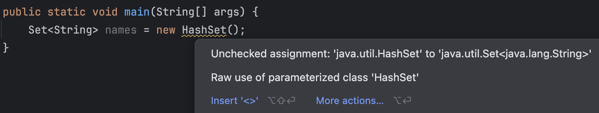
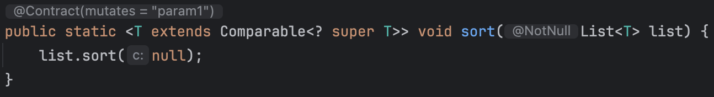
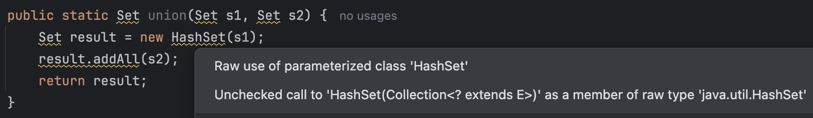
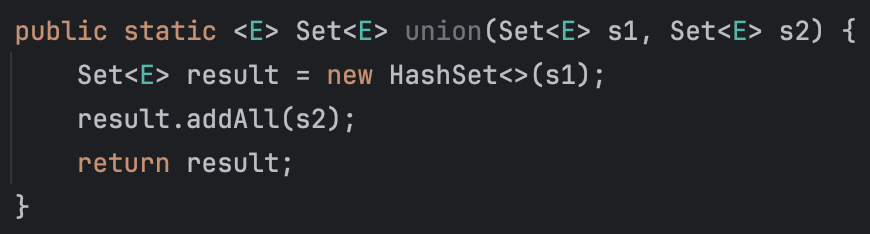
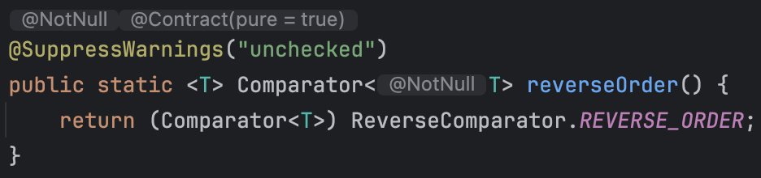

# 5장 제네릭

제네릭(Generic)은 자바 5부터 추가된 기능으로, 클래스나 메서드를 정의할 때 타입을 파라미터로 사용할 수 있도록 해준다. 엉뚱한 타입의 객체를 넣으려고 할 때 컴파일 단계에서 에러를 발생시키므로 안정성을 높여준다. 이번 장에서는 제네릭의 이점을 최대한 살리고 단점을 최소화하는 방법에 대해 알아보자.

- [5장 제네릭 용어 정리](#용어-정리)
- [아이템 26. 로 타입은 사용하지 말라](#아이템-26-로-타입은-사용하지-말라)
- [아이템 27. 비검사 경고를 제거하라](#아이템-27-비검사-경고를-제거하라)
- [아이템 28. 배열보다는 리스트를 사용하라](#아이템-28-배열보다는-리스트를-사용하라)
- [아이템 29. 이왕이면 제네릭 타입으로 만들라](#아이템-29-이왕이면-제네릭-타입으로-만들라)
- [아이템 30. 이왕이면 제네릭 메서드로 만들라](#아이템-30-이왕이면-제네릭-메서드로-만들라)
- [아이템 31. 한정적 와일드카드를 사용해 API 유연성을 높이라](#아이템-31-한정적-와일드카드를-사용해-api-유연성을-높이라)

## 용어 정리

5장 전반에 사용되는 용어이다.

| 한글 용어                | 영문 용어               | 예시                               |
| ------------------------ | ----------------------- | ---------------------------------- |
| 매개변수화 타입          | parameterized type      | `List<String>`                     |
| 실제 타입 매개변수       | actual type parameter   | `String`                           |
| 제네릭 타입              | generic type            | `List<E>`                          |
| 정규 타입 매개변수       | formal type parameter   | `E`                                |
| 비한정적 와일드카드 타입 | unbounded wildcard type | `List<?>`                          |
| 로 타입                  | raw type                | `List`                             |
| 한정적 타입 매개변수     | bounded type parameter  | `<E extends Number>`               |
| 재귀적 타입 한정         | recursive type bound    | `<T extends Comparable<T>>`        |
| 한정적 와일드카드 타입   | bounded wildcard type   | `List<? extends Number>`           |
| 제네릭 메서드            | generic method          | `static <E> List<E> asList(E[] a)` |
| 타입 토큰                | type token              | `String.class`                     |

## 아이템 26. 로 타입은 사용하지 말라

> ### 핵심 정리
>
> 로 타입은 제네릭이 도입되기 전의 호환성을 위해 남아있는 것이다. 로 타입을 사용하면 제네릭의 안전성과 표현력을 모두 잃게 된다. 로 타입 대신 제네릭을 사용하자.

로 타입(raw type)은 제네릭 타입에서 타입 매개변수를 전혀 사용하지 않은 것이다. 예를 들어, `List`는 로 타입이다. 이는 제네릭이 도입되기 전 코드와 호환되도록 하기 위해 남아있는 것이다.

```java
// Stamp 인스턴스만 취급한다. (주석을 작성하긴 했지만, 컴파일러는 이해할 수 없다.)
private final Collection stamps = ...;

// 실수로 동전(Coin) 인스턴스를 넣는다.
stamps.add(new Coin(...)); // unchecked call 경고를 띄운다.
```

제네릭이 도입되기 전에는 위와 같이 컬렉션을 선언했다. 현재도 동작하긴 하지만 좋은 코드라고 할 수 없다. Stamp 인스턴스 대신 Coin 인스턴스를 넣어도 아무 오류 없이 컴파일이 되기 때문이다.

```java
// 위에서 선언한 stamps에서 다시 동전을 꺼내는 순간 ClassCastException이 발생한다.
for (Iterator i = stamps.iterator(); i.hasNext();) {
    Stamp stamp = (Stamp) i.next(); // ClassCastException 발생
    ...
}
```

위처럼 컴파일은 정상적으로 되지만, 런타임에 ClassCastException이 발생한다.

> 오류는 최대한 빨리 발견하는 것이 좋다. 런타임보단 컴파일 타임에 오류를 발견하는 것이 좋다.

```java
// 매개변수화된 컬렉션 타입, 타입 안전성 확보
private final Collection<Stamp> stamps = ...;
```

이렇게 선언하면 컴파일러는 stamps에는 Stamp의 인스턴스만 넣어야 함을 알 수 있게 된다. 만약 다른 타입의 인스턴스를 넣으려고 하면 컴파일러가 경고를 띄워준다.

컴파일러는 컬렉션에서 원소를 꺼내는 모든 곳에 보이지 않는 형변환을 추가하여 절대 실패하지 않음을 보장한다.

예시에서는 Stamp와 Coin을 사용해서 억지스럽게 보일 수 있지만, 현업에서도 종종 일어난다고 한다. 예를 들어, BigDecimal용 컬렉션에 BigInteger를 넣는 실수는 그렇게 억지는 아닌 것 같다.

### 로 타입을 사용하는 경우

class 리터럴에는 로 타입을 써야 한다. [자바 명세](https://docs.oracle.com/javase/specs/jls/se21/html/jls-15.html#jls-15.8.2)는 class 리터럴에 매개변수화 타입을 사용하지 못한다고 명시하고 있다. (배열과 기본 타입은 허용한다.) 예를 들어, `List.class`는 허용되지만 `List<String>.class`는 허용되지 않는다.

instanceof 연산자에도 로 타입을 사용해야 한다. 런타임에는 제네릭 타입 정보가 지워지기 때문에 비한정적 와일드카드 타입 외에는 instanceof 연산자에는 사용할 수 없다. (로 타입과 비한정적 와일드카드 타입 모두 instanceof는 완전히 똑같이 동작하므로 굳이 코드를 지저분하게 만들 필요가 없다.)

```java
if (o instanceof Set) { // 로 타입
    Set<?> s = (Set<?>) o; // 와일드카드 타입
}
```

o의 타입이 Set임을 확인했다면 Set<?>으로 형변환해야 한다. 이렇게 하면 Set의 모든 원소에 대해 안전하게 작업할 수 있다.

사실 자바를 배우고 난 이후로 로 타입을 사용해본 적이 없다. 아무래도 로 타입을 사용한 참고 자료를 본 적이 없기도 하고 실수로 작성하더라도 IDE에서 경고를 띄워주기 때문인 것 같다. 앞으로도 특별한 이유 없이는 로 타입을 사용하지 않도록 해야겠다.

## 아이템 27. 비검사 경고를 제거하라

> ### 핵심 정리
>
> 모든 비검사 경고는 런타임에 ClassCastException을 일으킬 수 있는 잠재적 가능성을 의미하니 최대한 제거하자. 경고를 없앨 방법을 찾지 못하겠다면, 그 코드가 타입 안전함을 증명하고 가능한 한 범위를 좁혀 `@SuppressWarnings("unchecked")` 애너테이션으로 경고를 숨기고 그 근거를 주석으로 남기자.

제네릭을 사용하면 수많은 컴파일러 경고를 마주하게 될 것이다.

- 비검사 형변환 경고
- 비검사 메서드 호출 경고
- 비검사 매개변수화 가변인수 타입 경고
- 비검사 변환 경고
- 등...

제네릭에 익숙해질수록 마주치는 경고 수는 줄어들겠지만, 새로 작성한 코드가 한번에 경고 없이 컴파일되도록 하는 것은 쉽지 않다. 경고를 제거하는 방법을 알아보자.



이렇게 코드를 잘못 작성한 경우 컴파일러는 경고를 띄워준다. 대부분 알려준 대로 수정하면 경고가 사라진다. 자바 7부터 지원하는 다이아몬드 연산자(`<>`)를 사용하면 경고를 없앨 수 있다.

물론 이것보다 제거하기 어려운 경고들이 많다. 하지만 우리는 포기하지 않고 이러한 경고를 제거해야 한다. 그러면 런타임에 ClassCastException이 발생할 일이 없어지고 우리가 의도한 대로 잘 동작할 것이다.

### 경고를 제거할 수 없는 경우

경고를 제거할 수는 없지만 타입 안전성을 확실할 수 있다면 `@SuppressWarnings("unchecked")` 애너테이션을 사용해 경고를 숨기고 그 근거를 주석으로 남기자.

단, 타입 안전성을 검증하지 않고 경고를 숨기면 언제 런타임에 ClassCastException이 발생할지 모른다. 그러니 경고를 숨기는 경우에는 (누군가 함부로 수정하는 일이 없도록) 그 근거를 주석으로 남기는 것이 중요하다.

반대로 타입 안전성이 검증된 비검사 경고를 숨기지 않고 그대로 둔다면, 진짜 문제를 알리는 새로운 경고가 나와도 개발자가 눈치채지 못할 수도 있다.

`@SuppressWarnings` 애너테이션은 가능한 좁은 범위에 적용하자. 메서드나 생성자 등의 선언에 적용하면 그 메서드나 생성자의 모든 호출에 적용되므로, 그보다는 지역 변수 선언에 적용하는 것이 좋다고 한다.

정리하면 컴파일러의 경고를 최대한 제거하고, 제거할 수 없는 경우에는 `@SuppressWarnings("unchecked")` 애너테이션을 사용하되(범위는 필요한 만큼만, 최소한으로) 그 근거를 주석으로 남겨야 한다는 것이다.

## 아이템 28. 배열보다는 리스트를 사용하라

> ### 핵심 정리
>
> 배열은 공변이고 실체화되지만, 제네릭은 불공변이고 타입 정보가 소거된다. 그래서 배열은 런타임에는 타입 안전하지만 컴파일 타임에는 그렇지 않다. 제네릭은 반대다. 즉, 둘을 섞어 쓰는 것은 매우 어렵다. 둘을 섞어 쓰다가 컴파일 오류나 경고를 만나면, 배열을 리스트로 대체하는 방법을 적용해보자.

배열과 제네릭 타입에는 중요한 차이 두 가지가 있다.

- 공변 vs 불공변
- 실체화 vs 소거

### 공변 vs 불공변

배열은 공변(covariant)이다. `Sub`가 `Super`의 하위 타입이라면 `Sub[]`는 `Super[]`의 하위 타입이다. 즉, 함께 변한다는 뜻이다.

제네릭은 불공변(invariant)이다. `List<Sub>`는 `List<Super>`의 하위 타입이 아니다. 즉, 함께 변하지 않는다는 뜻이다.

```java
// 컴파일은 가능하지만 런타임에 ClassCastException이 발생한다.
Object[] objectArray = new Long[1];
objectArray[0] = "타입이 달라 넣을 수 없다."; // ArrayStoreException 발생
```

```java
// 컴파일 오류가 발생한다.
List<Object> ol = new ArrayList<Long>(); // 컴파일 오류
ol.add("타입이 달라 넣을 수 없다.");
```

`Long 배열`이나 `ArrayList<Long>` 어느 쪽이든 String을 넣을 수 없다. 다만 배열에서는 그 실수를 런타임에 깨닫게 되고, 리스트에서는 컴파일 타임에 깨닫게 된다.

### 실체화 vs 소거

배열은 실체화(reify)된다. 런타임에도 자신이 담기로 한 원소의 타입을 인지하고 확인한다. 그래서 위 코드에서 런타임에 ArrayStoreException이 발생한 것이다.

제네릭은 소거(erasure)된다. 런타임에는 제네릭 타입 정보가 소거되어 제네릭 타입의 인스턴스는 자신이 담기로 한 원소의 타입을 인지하지 못한다. 소거는 제네릭이 지원되기 전의 레거시 코드와 제네릭 타입을 함께 사용할 수 있게 해주는 메커니즘이다.

이러한 차이로 인해 배열과 제네릭은 잘 어우러지지 않는다.

### 제네릭 배열 생성을 허용하지 않는 이유

배열은 제네릭 타입, 매개변수화 타입, 타입 매개변수로 사용할 수 없다. 코드를 `new List<E>[]`, `new List<String>[]`, `new E[]`처럼 작성하면 컴파일 오류가 발생한다.

왜 제네릭 배열 생성을 허용하지 않을까? 이유는 타입 안전성이 보장되지 않기 때문이다. 제네릭 배열 생성을 허용한다면 런타임에 ClassCastException이 발생할 수 있다. (제네릭은 런타임에 ClassCastException이 발생하지 않도록 도와주는데 제네릭 배열 생성을 허용한다면 이런 보장이 깨질 수 있다.)

```java
// 제네릭 배열 생성을 허용한다면... (실제로는 컴파일 오류가 발생한다.)
List<String>[] stringLists = new List<String>[1];
List<Integer> intList = List.of(42);
Object[] objects = stringLists;
objects[0] = intList;
String s = stringLists[0].get(0);
```

제네릭 배열 생성이 가능하다고 가정해보자.

- 원소가 하나(정수 42)인 `List<Integer>`를 만든다.
- `objects`에 `stringLists`를 할당한다.
  - 배열은 공변이기 때문에 가능하다. String은 Object의 하위 타입이다.
- `objects`의 첫 번째 원소에 `intList`를 넣는다.
  - 제네릭은 소거 방식으로 동작하기 때문에 실패하지 않는다.
  - 런타임에는 `List<Integer>` 인스턴스의 타입은 단순히 `List`가 된다. 즉, `List[]`가 되는 것이다.

이제 잘 생각해보면 큰 문제가 하나 발생한다. `List<String>` 인스턴스만 담겠다고 선언한 stringLists 배열에는 실제로 `List<Integer>` 인스턴스가 들어가 있게 된다. 그래서 `stringLists[0].get(0)`을 호출하면 `ClassCastException`이 발생한다.

이러한 문제를 방지하기 위해 제네릭 배열이 생성되지 않도록 컴파일 오류를 발생시킨다.

> ### 실체화 불가 타입
>
> `E`, `List<E>`, `List<String>` 등은 컴파일 타임에만 사용되고 런타임에는 소거된다. 그래서 배열을 생성할 때는 컴파일 타임에만 사용되는 타입으로 배열을 생성할 수 없다. [참고 자료](https://docs.oracle.com/javase/specs/jls/se21/html/jls-4.html#jls-4.7)
>
> `List<?>`, `Map<?, ?>` 같은 비한정적 와일드카드 타입은 실체화가 가능하지만, 유용하게 쓰일 일은 거의 없다.

제네릭 컬렉션에서는 보통 자신의 원소 타입을 담은 배열을 반환할 수 없다. (완벽하지는 않지만 이 문제를 해결해주는 방법이 있긴 하다. [아이템 33](#아이템-33-타입-안전-이종-컨테이너를-고려하라) 참고) 또한 제네릭 타입과 가변인수 메서드(varargs method)를 함께 사용하면 경고가 발생한다. 가변인수 메서드를 호출할 때마다 가변인수 매개변수를 담을 배열이 하나 만들어지는데, 이때 그 배열의 원소가 실체화 불가 타입인 경우 발생하는 경고이다. 이 문제는 `@SafeVarargs` 애너테이션을 사용해 해결할 수 있다.

### 배열을 리스트로 대체하자

배열로 형변환활 대 제네릭 배열 생성 오류나 비검사 형변환 경고가 뜨는 경우 배열을 리스트로 대체하자. 배열과 제네릭은 잘 어우러지지 않기 때문에 배열을 리스트로 대체하는 것이 좋다.

물론 코드가 다소 복잡해질 수 있고, 조금은 느릴 수 있지만, 런타임에 ClassCastException을 만날 일이 없다는 것만으로 충분히 가치가 있다.

## 아이템 29. 이왕이면 제네릭 타입으로 만들라

> ### 핵심 정리
>
> 클라이언트에서 직접 형변환해야 하는 타입보다 제네릭 타입이 더 안전하고 쓰기 편하다. 그러니 새로운 타입을 설계할 때는 형변환 없이도 사용할 수 있도록 하고, 기존 타입 중 제네릭이었어야 하는 게 있다면 제네릭 타입으로 변경하자.
>
> 기존 클라이언트에는 아무 영향을 주지 않으면서, 새로운 사용자를 훨씬 편하게 해준다.

JDK가 제공하는 제네릭 타입과 메서드를 사용하는 것은 쉽지만, 제네릭 타입을 새로 정의하는 것은 조금 어렵다.

### 제네릭으로 바꾸는 예시

단순하게 만든 Stack 코드를 제네릭으로 바꿔보자.

```java
public class Stack {
    private Object[] elements;
    private int size = 0;
    private static final int DEFAULT_INITIAL_CAPACITY = 16;

    public Stack() {
        elements = new Object[DEFAULT_INITIAL_CAPACITY];
    }

    public void push(Object e) {
        ensureCapacity();
        elements[size++] = e;
    }

    public Object pop() {
        if (size == 0) {
            throw new EmptyStackException();
        }
        Object result = elements[--size];
        elements[size] = null; // 다 쓴 참조 해제
        return result;
    }

    public boolean isEmpty() {
        return size == 0;
    }

    private void ensureCapacity() {
        if (elements.length == size) {
            elements = Arrays.copyOf(elements, 2 * size + 1);
        }
    }
}
```

이 클래스는 원래 제네릭 타입이었어야 한다. 이 클래스를 제네릭으로 바꾼다고 해도 클라이언트 코드에는 아무 영향을 주지 않는다.

또한, 제네릭을 사용하지 않으면 클라이언트는 항상 형변환을 해야 하지만, 제네릭으로 바꾸면 클라이언트는 형변환을 하지 않아도 된다.

```java
// 제네릭으로 바꾼 Stack, 컴파일 오류가 발생한다.
public class Stack<E> {
    private E[] elements;
    private int size = 0;
    private static final int DEFAULT_INITIAL_CAPACITY = 16;

    public Stack() {
        elements = new E[DEFAULT_INITIAL_CAPACITY];
    }

    public void push(E e) {
        ensureCapacity();
        elements[size++] = e;
    }

    public E pop() {
        if (size == 0) {
            throw new EmptyStackException();
        }
        E result = elements[--size];
        elements[size] = null; // 다 쓴 참조 해제
        return result;
    }

    // 나머지는 그대로
}
```

제네릭으로 바꾼 Stack 클래스는 컴파일 오류가 발생한다. 이유는 [아이템 28](#아이템-28-배열보다는-리스트를-사용하라)에서 설명한 것처럼 제네릭 배열 생성이 불가능하기 때문이다. 이때 사용할 수 있는 해결책은 두 가지가 있다.

1. Object 배열로 형변환 후 제네릭 배열로 형변환

   ```java
   // Object 배열로 형변환 후 제네릭 배열로 형변환
   public Stack() {
   elements = (E[]) new Object[DEFAULT_INITIAL_CAPACITY];
   }
   ```

   제네릭 배열 생성을 금지하는 제약을 대놓고 우회하는 방법이다. 이제 컴파일러는 오류 대신 경고를 띄운다. 일반적으로 타입 안전성이 보장되지 않는다.

   컴파일러는 이 프로그램의 타입 안전성을 증명할 수 없지만 우리는 가능하다. `elements` 배열은 push 메서드만이 접근하고, 그 안에서는 오직 E 타입의 인스턴스만 저장한다. 따라서 타입 안전성이 보장된다고 주장할 수 있다. 이처럼 검증이 되었다면 `@SuppressWarnings("unchecked")` 애너테이션을 사용해 경고를 숨기고 그 근거를 주석으로 남기자.

   ```java
   /**
   * 배열 elements는 push(E)로 넘어온 E 인스턴스만 담는다.
   * 따라서 타입 안전성을 보장하지만,
   * 이 배열의 런타임 타입은 E[]가 아닌 Object[]다.
   */
   @SuppressWarnings("unchecked")
   public Stack() {
       elements = (E[]) new Object[DEFAULT_INITIAL_CAPACITY];
   }
   ```

   위 코드에서는 생성자가 비검사 배열 생성 말고는 하는 일이 없으니 생성자 전체에서 경고를 숨겨도 좋다.

2. elements 필드의 타입을 E[]에서 Object[]로 변경

   ```java
   // elements 필드의 타입을 E[]에서 Object[]로 변경
   private Object[] elements;
   ```

   이 방법은 배열이 반환한 원소를 E로 형변환하면 오류 대신 경고가 뜬다.

   E는 실체화 불가 타입이기 때문에 컴파일러는 런타임에 이뤄지는 형변환이 안전한지 증명할 방법이 없다. 따라서 이번에도 우리가 직접 증명하고 경고를 숨겨야 한다.

   ```java
   public E pop() {
       if (size == 0) {
           throw new EmptyStackException();
       }

       // push에서 E 타입만 넣었으니 안전하다.
       // 가능한 한 적은 범위에 적용하자.
       @SuppressWarnings("unchecked") E result = (E) elements[--size];

       elements[size] = null; // 다 쓴 참조 해제
       return result;
   }
   ```

두 방식 모두 나름의 지지를 얻고 있다고 한다.

첫 번째 방식은 가독성이 좋다. 배열의 타입을 E[]로 선언했기 때문에 오직 E 타입 인스턴스만 받음을 확실히 어필할 수 있고 코드 길이도 더 짧은 편이다.

또한, 형변환을 배열 생성 시 단 한번만 하지만, 두 번재 방식에서는 배열에서 원소를 읽을 때마다 해줘야 한다.

그래서 현업에서는 첫 번째 방식을 더 선호하며 자주 사용된다고 한다.

하지만 E가 Object가 아닌 한 배열의 런타임 타입이 컴파일 타임 타입과 달라 힙 오염(heap pollution)이 발생할 수 있다. 힙 오염이 맘에 걸리는 프로그래머는 두 번째 방식을 고수한다고 한다. (Stack 예시에서는 힙 오염을 일으키는 코드가 없다.)

### 배열보다는 리스트를 우선하라고 했는데...

Stack 예시를 보면 [아이템 28](#아이템-28-배열보다는-리스트를-사용하라)과 모순되는 것처럼 보인다.

사실 제네릭 타입 안에서 리스트를 사용하는 게 항상 가능하지도, 꼭 더 좋은 것도 아니다.

예를 들어, 자바가 리스트를 기본 타입으로 제공하지 않기 때문에 ArrayList 같은 제네릭 타입도 결국은 기본 타입인 배열을 사용해 구현해야 한다. 또한 HashMap 같은 제네릭 타입은 성능 향상을 위해 배열을 사용하기도 한다.

항상 정답은 없고, 상황에 따라 다르다는 말로 이해했다.

### 타입 매개변수에 제약을 두는 방법

타입 매개변수에 제약을 두는 제네릭 타입도 있다.

```java
// java.util.concurrent.DelayQueue
class DelayQueue<E extends Delayed> implements BlockingQueue<E> {
    ...
}
```

이렇게 선언하면 DelayQueue 자신과 이를 사용하는 클라이언트는 DelayQueue의 원소에서 형변환 할 필요 없이 곧바로 Delayed 클래스의 메서드를 호출할 수 있다.

이러한 타입 매개변수 E를 한정적 타입 매개변수(bounded type parameter)라고 한다.

마지막으로 모든 타입은 자기 자신의 하위 타입이므로 `DelayQueue<Delayed>`로도 사용할 수 있다.

## 아이템 30. 이왕이면 제네릭 메서드로 만들라

> ### 핵심 정리
>
> 제네릭 타입처럼 제네릭 메서드는 클라이언트가 형변환을 하지 않아도 되며, 이는 안전하고 사용하기 편하게 해준다.

클래스와 마찬가지로, 메서드도 제네릭으로 만들 수 있다. 매개변수화 타입을 받는 정적 유틸리티 메서드는 보통 제네릭이다.

아래는 Collections의 `sort` 메서드이다. 제네릭을 사용한 것을 볼 수 있다.



### 제네릭 메서드 작성 방법

제네릭 메서드 작성법은 제네릭 타입 작성법과 유사하다.

```java
// 로 타입을 사용했다. 따라하지 말 것.
public static Set union(Set s1, Set s2) {
    Set result = new HashSet(s1);
    result.addAll(s2);
    return result;
}
```

컴파일은 가능하지만, 경고가 발생한다.



위 경고를 제거하려면 이 메서드를 타입 안전하게 만들어야 한다. 타입 매개변수를 사용하면 된다. (타입 매개변수들을 선언하는) 타입 매개변수 목록은 메서드의 제한자와 반환 타입 사이에 온다.



단순한 제네릭 메서드라면 이 정도도 충분하다. 경고가 모두 제거되었으며, 타입 안전하고, 사용하기도 쉽다.

### 제네릭 싱글턴 팩터리

불변 객체를 여러 타입으로 활용할 수 있게 만들어야 할 때가 있다.

제네릭은 런타임에 타입 정보가 소거되기 때문에 하나의 객체를 어떤 타입으로든 매개변수화할 수 있다. 하지만 이렇게 하려면 요청한 타입 매개변수에 맞게 매번 그 객체의 타입을 바꿔주는 정적 팩터리를 만들어야 한다. 이 패턴을 제네릭 싱글턴 팩터리라고 한다.



`Collections.reverseOrder()`는 상태가 없는 싱글턴 Comparator를 반환하는 제네릭 싱글턴 팩터리의 대표적인 예시이다.

내부적으로 동일한 싱글턴 객체를 사용해 역순 정렬을 수행한다. 이렇게 하면 객체 생성 비용을 아낄 수 있고, 불변이기 때문에 여러 스레드가 동시에 사용해도 안전하다.

정적 메서드를 통해 호출 시 전달받은 타입(예: Integer, String 등의 Comparable 구현체)에 따라 적절한 타입의 Comparator를 반환한다.

다만, 비검사 형변환 경고가 발생하는데, 타입 안전성을 개발자가 보장(단순 뒤집는 비교자를 반환하므로 안전하다.)할 수 있으니 `@SuppressWarnings("unchecked")` 애너테이션을 사용해 경고를 숨긴 것이다.

### 재귀적 타입 한정

자주 사용되지는 않지만, 자기 자신이 들어간 표현식을 사용하여 타입 매개변수의 허용 범위를 한정할 수 있다. 이것을 재귀적 타입 한정(recursive type bound)이라고 한다.

재귀적 타입 한정은 주로 타입의 자연적 순서(natural order)를 정하는 Comparable 인터페이스와 함께 사용된다.

```java
public interface Comparable<T> {
    int compareTo(T o);
}
```

실제로 거의 모든 타입은 자신과 같은 타입의 원소와만 비교할 수 있다. 예를 들어, `String`은 `Comparable<String>`을 구현하고 `Integer`는 `Comparable<Integer>`을 구현하는 식이다.

Comparable을 구현한 원소의 컬렉션을 입력받는 메서드들은 주로 그 원소들을 정렬하거나 검색, 비교하는 식으로 사용된다. 이 기능을 구행하려면 컬렉션에 담긴 모든 원소가 상호 비교될 수 있어야 한다.

```java
// 재귀적 타입 한정을 이용해 상호 비교할 수 있는 모든 타입을 허용하는 메서드
public static <E extends Comparable<E>> E max(Collection<E> c);
```

`E extends Comparable<E>`는 `E`가 자신과 비교할 수 있는 타입임을 표현한다. 이렇게 하면 `max` 메서드는 `Comparable`을 구현한 모든 타입의 컬렉션을 입력받을 수 있다. 즉, 모든 타입 E는 자신과 비교할 수 있는 타입이어야 한다. 라고 표현할 수 있다.

```java
// 위 코드를 구현한 max 메서드
@Override
public static <E extends Comparable<E>> E max(Collection<E> c) {
    if (c.isEmpty()) {
        throw new IllegalArgumentException("컬렉션이 비어 있습니다.");
    }

    E result = null;
    for (E e : c) {
        if (result == null || e.compareTo(result) > 0) {
            result = Objects.requireNonNull(e);
        }
    }

    return result;
}
```

모든 타입 E는 자신과 비교할 수 있다. (Comparable을 구현했기 때문에) 따라서 `e.compareTo(result)`는 항상 올바르게 동작하기 때문에 컴파일 오류나 경고가 발생하지 않는다.

재귀적 타입 한정은 다소 복잡해질 가능성이 있지만, 여기에 와일드카드를 사용한 변형, 그리고 셀프 타입 관용구를 이해하고 활용하면 큰 무리 없이 다룰 수 있을 것이라고 한다.

## 아이템 31. 한정적 와일드카드를 사용해 API 유연성을 높이라

> ### 핵심 정리
>
> 조금은 복잡할 수 있지만, 한정적 와일드카드를 사용하면 API가 훨씬 유연해진다.
>
> PECS 공식, 생산자(producer)는 extends, 소비자(consumer)는 super를 사용한다. Comparable과 Comparator는 모두 소비자라는 사실도 기억하자.

매개변수화 타입은 불공변(invariant)이다. 즉, 서로 다른 타입 Type1과 Type2가 있을 때 `List<Type1>`은 `List<Type2>`의 하위 타입도 상위 타입도 아니다.

즉, `List<String>`은 `List<Object>`의 하위 타입이 아니라는 말이다.

`List<Object>`에는 어떤 객체든 넣을 수 있지만, `List<String>`에는 문자열만 넣을 수 있다. 이는 리스코프 치환 원칙(Liskov substitution principle)에 위배된다.

하지만 때로는 불공변 방식보다 유연한 무언가가 필요하다.

```java
public class Stack<E> {
    public Stack();
    public void push(E e);
    public E pop();
    public boolean isEmpty();
}
```

여기에 일련의 원소를 스택에 넣는 메서드를 추가해야 한다고 해보자.

```java
// 와일드카드 타입을 사용하지 않은 경우, 결함이 있다.
public void pushAll(Iterable<E> src) {
    for (E e : src) {
        push(e);
    }
}
```

이 코드는 오류 없이 컴파일에 성공하지만 완벽하지 않다. Iterable src 원소 타입이 Stack의 원소 타입과 일치하는 경우에만 잘 동작한다.

```java
Stack<Number> numberStack = new Stack<>();
Iterable<Integer> integers = ...;
numberStack.pushAll(integers);
```

논리적으로는 잘 동작해야 할 것처럼 보이지만, 오류 메시지가 뜬다. 매개변수화 타입은 불공변이기 때문이다.

### 그럼 어떻게 할까?

한정적 와일드카드 타입을 사용하면 이 문제를 해결할 수 있다.

pushAll의 입력 매개변수 타입은 `E의 Iterable`이 아니라 `E의 하위 타입의 Iterable`이어야 한다. 이를 표현하는 방법이 바로 한정적 와일드카드 타입이다.

```java
// 한정적 와일드카드 타입을 사용한 pushAll 메서드
public void pushAll(Iterable<? extends E> src) {
    for (E e : src) {
        push(e);
    }
}
```

이번 수정으로 Stack은 물론 이를 사용하는 클라이언트 코드도 말끔히 컴파일된다. (타입 안전성이 보장된다는 뜻이다.) 이제 pushAll과 짝을 이루는 popAll 메서드를 작성해보자.

```java
// 와일드카드 타입을 사용하지 않은 경우, 결함이 있다.
public void popAll(Collection<E> dst) {
    while (!isEmpty()) {
        dst.add(pop());
    }
}
```

이번에도 주어진 컬렉션의 원소 타입이 스택의 원소 타입과 일치한다면 컴파일에 성공하지만, 일치하지 않는다면 오류가 발생한다.

```java
Stack<Number> numberStack = new Stack<>();
Collection<Object> objects = ...;
numberStack.popAll(objects);
```

이번에는 `Collection<Object>`에 `Number`를 넣으려고 했기 때문에 오류가 발생한다. 즉, `E의 Collection`이 아니라 `E의 상위 타입의 Collection`이어야 한다.

```java
// 한정적 와일드카드 타입을 사용한 popAll 메서드
public void popAll(Collection<? super E> dst) {
    while (!isEmpty()) {
        dst.add(pop());
    }
}
```

이제 Stack과 클러이언트 코드 모두 컴파일에 성공한다.

정리하면, 유연성을 극대화하려면 원소의 생산자나 소비자용 입력 매개변수에 와일드카드 타입을 사용해야 한다. 단, 입력 매개변수가 생산자와 소비자 역할을 동시에 한다면 와일드카드 타입을 사용해도 이점이 없다. (이때는 타입을 명확히 지정해야 하는 상황인 것이다.)

### PECS(Producer-Extends, Consumer-Super)

매개변수화 타입 T가 생산자라면 `<? extends T>`를 사용하고, 소비자라면 `<? super T>`를 사용하라.

Stack의 예시에서 pushAll의 src 매개변수는 Stack이 사용할 E 인스턴스를 생산하므로 `<? extends E>`를 사용했다. 반면 popAll의 dst 매개변수는 Stack이 E 인스턴스를 소비하므로 `<? super E>`를 사용했다.

`반환 타입에는 한정적 와일드카드 타입을 사용하면 안 된다.` 유연성을 높여주기는 커녕 클라이언트 입장에서 와일드카드 타입을 써야 하기 때문이다. 클래스 사용자가 와일드카드 타입을 신경 써야 한다면, 그 API에 문제가 있을 가능성이 크다.

> ### 매개변수(parameter)와 인수(argument)의 차이
>
> 매개변수는 메서드 선언에 정의한 변수이고, 인수는 메서드 호출 시 넘기는 `실젯값`이다.
>
> ```java
> void add(int value) { ... } // value가 매개변수
> add(10); // 10이 인수
> ```
>
> 이 정의를 제네릭까지 확장하면 다음과 같다.
>
> ```java
> class Set<T> { ... } // T가 타입 매개변수
> Set<String> set = new Set<>(); // String이 타입 인수
> ```
>
> 보통 둘을 명확하게 구분하지 않지만, 자바 명세에서는 이를 명확히 구분하고 있다.

### 타입 매개변수 vs 와일드카드

타입 매개변수와 와일드카드에는 공통되는 부분이 있어서, 메서드를 정의할 때 둘 중 어느 것을 사용해도 괜찮을 때가 많다고 한다.

예를 들어, 주어진 리스트에서 명시한 두 인덱스의 아이템들을 교환(swap)하는 정적 메서드를 작성한다고 해보자.

```java
public static <E> void swap(List<E> list, int i, int j)
public static void swap(List<?> list, int i, int j)
```

public API라면 간단한 두 번째가 낫다고 한다. 어떤 리스트든 이 메서드에 넘기면 명시한 인덱스의 원소들을 교환해준다. 신경 써야 할 매타입 매개변수도 없다.

기본 규칙은 다음과 같다.

- 메서드 선언에 타입 매개변수가 한 번만 나오면 와일드카드로 대체하라.
  - 이때 비한정적 타입 매개변수라면 비한정적 와일드카드로 바꾸고, 한정적 타입 매개변수라면 한정적 와일드카드로 바꾼다.

하지만 두 번째 swap 메서드 선언에는 문제가 하나 있다.

```java
public static void swap(List<?> list, int i, int j) {
    list.set(i, list.set(j, list.get(i)));
}
```

위와 같이 직관적인 코드가 컴파일되지 않는다는 것이다. 리스트의 타입이 `List<?>`인데, 여기에는 null 외에는 어떤 값도 넣을 수 없기 때문이다.

private 도우미 메서드를 따로 작성하면, 형변환이나 리스트의 로 타입을 사용하지 않고도 해결할 수 있다.

```java
public static void swap(List<?> list, int i, int j) {
    swapHelper(list, i, j);
}

// 실제 타입을 알아내려면 제네릭 메서드여야 한다.
private static <E> void swapHelper(List<E> list, int i, int j) {
    list.set(i, list.set(j, list.get(i)));
}
```

swapHelper 메서드는 리스트가 `List<E>`임을 알고 있으므로 꺼낸 값의 타입은 항상 E이고 E라면 항상 넣을 수 있다. 따라서 타입 안전성을 보장한다.

내부는 다소 복잡해졌지만, 외부에서는 와일드카드 기반의 멋진 선언을 유지할 수 있었다. 즉, 클라이언트는 내부의 복잡성을 모른 채 그 혜택을 누리는 것이다. (참고로 도우미 메서드의 시그니처는 위에서 선택하지 않았던 첫 번째 메서드의 시그니처와 완전히 같다.)
