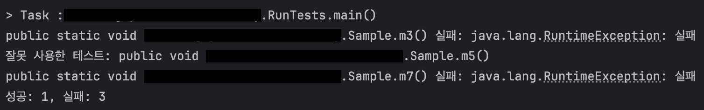
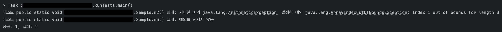
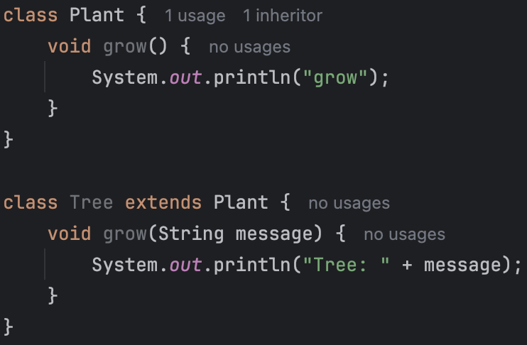
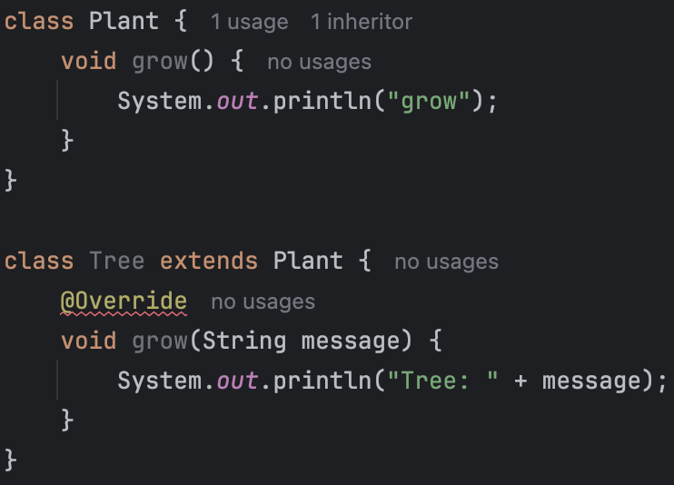

# 6장 열거 타입과 애너테이션

자바에는 특수한 목적의 참조 타입이 두 가지가 있다. 하나는 클래스의 일종인 열거 타입(enum; 열거형)이고, 다른 하나는 인터페이스의 일종인 애너테이션(annotation)이다. 이번 장에서는 이 타입들을 올바르게 사용하는 방법을 알아본다.

- [아이템 34. int 상수 대신 열거 타입을 사용하라](#아이템-34-int-상수-대신-열거-타입을-사용하라)
- [아이템 35. ordinal 메서드 대신 인스턴스 필드를 사용하라](#아이템-35-ordinal-메서드-대신-인스턴스-필드를-사용하라)
- [아이템 36. 비트 필드 대신 EnumSet을 사용하라](#아이템-36-비트-필드-대신-EnumSet을-사용하라)
- [아이템 37. ordinal 인덱싱 대신 EnumMap을 사용하라](#아이템-37-ordinal-인덱싱-대신-EnumMap을-사용하라)
- [아이템 38. 확장할 수 있는 열거 타입이 필요하면 인터페이스를 사용하라](#아이템-38-확장할-수-있는-열거-타입이-필요하면-인터페이스를-사용하라)
- [아이템 39. 명명 패턴보다 애너테이션을 사용하라](#아이템-39-명명-패턴보다-애너테이션을-사용하라)
- [아이템 40. @Override 애너테이션을 일관되게 사용하라](#아이템-40-Override-애너테이션을-일관되게-사용하라)
- [아이템 41. 정의하려는 것이 타입이라면 마커 인터페이스를 사용하라](#아이템-41-정의하려는-것이-타입이라면-마커-인터페이스를-사용하라)

## 아이템 34. int 상수 대신 열거 타입을 사용하라

> ### 핵심 정리
>
> 열거 타입은 확실히 정수 상수보다 뛰어나다. 더 읽기 쉽고 안전하고 강력하다. 각 상수를 특정 데이터와 연결짓거나 상수마다 다르게 동작하게 할 때는 명시적 생성자나 메서드를 함께 제공하자. 드물게는 하나의 메서드가 상수별로 다르게 동작해야 할 때도 있다. 이럴 때는 switch 문 대신 상수별 메서드 구현을 사용하자. 열거 타입 상수 일부가 같은 동작을 공유한다면 전략 열거 타입 패턴을 사용하자.

열거 타입은 일정 개수의 상수 값을 정의한 다음, 그 외의 값은 허용하지 않는 타입이다. 사계절, 태양계의 행성, 카드 게임의 카드 종류 등이 좋은 예시이다.

### 열거 타입 도입 전에는...

열거 타입이 없던 시절에는 아래의 코드처럼 정수 상수를 묶어서 선언하고 사용했다. (정수 열거 패턴)

```java
public static final int APPLE_FUJI = 0;
public static final int APPLE_PIPPIN = 1;
public static final int APPLE_GRANNY_SMITH = 2;

public static final int ORANGE_NAVEL = 0;
public static final int ORANGE_TEMPLE = 1;
public static final int ORANGE_BLOOD = 2;
```

타입 안전성을 보장할 방법이 없으며 표현력도 나쁘다. 오렌지를 건네야 할 메서드에 사과를 보내거나 동등 연산자(==)로 비교하더라도 컴파일러는 경고를 띄우지 않는다.

사과용 상수의 이름은 모두 `APPLE_`로 시작하고, 오렌지용 상수의 이름은 모두 `ORANGE_`로 시작한다. 이는 자바가 별도의 namespace를 지원하지 않기 때문에 어쩔 수 없이 접두어를 붙여 구분한 것이다. 예를 들어, 영어로 둘 다 mercury인 수은(원소)과 수성(행성)을 구분할 방법이 없기 때문에 앞에 접두어를 붙여서 `ELEMENT_MERCURY`, `PLANET_MERCURY`로 구분해서 사용하는 것이다.

또한, 각 상수는 문자열로 출력하기 까다롭다. 그 값을 출력하거나 디버거로 살펴보면 숫자로만 보이기 때문에 어떤 상수인지 알기 어렵다. 이를 해결하기 위해 정수 대신 문자열 상수를 사용하는 문자열 열거 패턴을 사용하기도 한다. 그러나 이 방법은 더욱 나쁘다. 상수의 의미를 출력하기는 쉽지만, 누군가 문자열 상수 대신 직접 문자열을 하드코딩하게 된다면 프로그램이 오동작할 수 있고, 만약 오타가 발생한 경우 이를 찾기는 더욱 어렵다.

상수를 변경할 때도 문제가 될 수 있다. 평범한 상수를 나열한 것이기 때문에 컴파일하면 그 값이 클라이언트 파일에 그대로 새겨진다. 따라서 상수의 값이 바뀌면 클라이언트도 반드시 다시 컴파일해야 한다.

### 열거 타입 등장

수많은 단점을 보완하기 위해 자바는 열거 타입을 도입했다. 이전에 [Enum에 대해 학습하고 공유](https://velog.io/@hyeok_1212/Java-enum-%EC%82%AC%EC%9A%A9%ED%95%98%EC%8B%9C%EB%82%98%EC%9A%94)한 경험이 있다. 간단한 사용법이나 기본으로 제공하는 메서드들은 블로그 글을 참고하면 좋을 것 같다.

```java
// 가장 단순한 열거 타입
public enum Apple { FUJI, PIPPIN, GRANNY_SMITH }
public enum Orange { NAVEL, TEMPLE, BLOOD }
```

겉보기에는 다른 언어의 열거 타입과 비슷하지만, 자바의 열거 타입은 완전한 형태의 클래스라서 보다 강력하다.

자바의 열거 타입은 클래스이며, 상수 하나당 자신의 인스턴스를 하나씩 만들어 `public static final` 필드로 공개한다. 열거 타입은 밖에서 접근할 수 있는 생성자를 제공하지 않는다. 따라서 클라이언트가 인스턴스를 직접 생성하거나 확장할 수 없기 때문에 열거 타입 선언으로 만들어진 인스턴스들은 딱 하나씩만 존재한다. (싱글턴 보장)

유일하기 때문에 `==` 연산자로 비교할 수 있다. 또한, 열거 타입은 `Comparable`과 `Serializable` 인터페이스를 구현했으며, 어떤 변형을 가하더라도 문제 없이 작동하도록 설계되어 있다.

열거 타입은 각자의 namespace를 가지기 때문에 접두어를 붙일 필요가 없다.

열거 타입은 `toString` 메서드를 제공하며, 이를 재정의하면 `name`이 아닌 다른 문자열을 반환할 수 있다.

### 열거 타입에 데이터를 연결하는 방법

열거 타입의 도입으로 거의 대부분의 문제를 해결했다. 그러나 이게 끝이 아니라 열거 타입은 각 상수와 연결된 데이터를 가질 수 있다. 이를 통해 각 상수가 고유한 동작을 할 수 있게 할 수 있다.

열거 타입 상수 각각을 특정 데이터와 연결지으려면 생성자에서 데이터를 받아 인스턴스 필드에 저장하면 된다. 이때 열거 타입은 근본적으로 불변이기 때문에 모든 필드는 final이어야 한다. 접근 지정자는 public이어도 되지만, private로 선언하고 별도의 접근자 메서드를 제공하는 것이 좋다.

```java
public enum Planet {
    MERUCY(3.302e+23, 2.439e6),
    VENUS(4.869e+24, 6.052e6),
    EARTH(5.975e+24, 6.378e6),
    MARS(6.419e+23, 3.393e6),
    JUPITER(1.899e+27, 7.149e7),
    SATURN(5.685e+26, 6.027e7),
    URANUS(8.683e+25, 2.556e7),
    NEPTUNE(1.024e+26, 2.477e7);

    private final double mass; // 질량 (kg)
    private final double radius; // 반지름 (m)
    private final double surfaceGravity; // 표면 중력 (m / s^2)

    private static final double G = 6.67300E-11; // 중력 상수

    Planet(double mass, double radius) {
        this.mass = mass;
        this.radius = radius;
        // 질량과 반지름만 알면 surfaceGravity를 계산할 수 있다. (최적화)
        surfaceGravity = G * mass / (radius * radius);
    }

    public double mass() { return mass; }
    public double radius() { return radius; }
    public double surfaceGravity() { return surfaceGravity; }

    public double surfaceWeight(double mass) {
        return mass * surfaceGravity; // F = ma
    }
}
```

이렇게 하면 각 상수가 고유한 데이터를 가지게 되며, 각 상수가 고유한 동작을 할 수 있게 된다.

```java
public class WeightTable {

    public static void main(String[] args) {
        // 지구에서의 무게를 입력받아 각 행성에서의 무게를 출력한다.
        double earthWeight = Double.parseDouble(args[0]);
        double mass = earthWeight / Planet.EARTH.surfaceGravity();
        for (Planet p : Planet.values()) {
            System.out.printf("%s에서의 무게는 %f이다.%n", p, p.surfaceWeight(mass));
        }
    }
}
```

각 열거 타입 값의 toString 메서드는 상수 이름을 문자열로 반환하기 때문에 println과 같은 메서드를 사용하면 상수 이름을 출력할 수 있다. 마음에 들지 않는다면 toString 메서드를 재정의하면 된다.

만약 태양계에서 퇴출된 명왕성처럼 열거 타입에서 상수 하나를 제거한다면 어떻게 될까? 우선 위 코드에서는 문제가 발생하지 않는다. 단지 출력하는 줄 수가 줄어들 뿐이다. 그러나 만약 `Planet` 열거 타입을 사용하는 다른 코드가 있다면 그 코드는 컴파일되지 않는다. 오류를 빠르게 만날 수 있기 때문에 아주 좋은 현상이다.

널리 쓰이는 열거 타입이라면 톱레벨 클래스로 만들고, 특정 톱레벨 클래스에서만 쓰인다면 해당 클래스의 멤버 클래스로 만들자. 접근 범위도 일반적인 클래스와 동일한 규칙을 생각하자.

### 상수마다 다르게 동작하는 열거 타입

Planet 열거 타입은 서로 다른 데이터와 연결될 수 있다는 것을 보여줬다. 대부분 이 정도만 있으면 충분하지만, 때로는 각 상수가 고유한 동작을 수행해야 할 때도 있다. 이럴 때는 열거 타입에 추상 메서드를 선언하고, 각 상수별로 다르게 동작하게 하면 된다.

```java
public enum Operation {
    PLUS { public double apply(double x, double y) { return x + y; } },
    MINUS { public double apply(double x, double y) { return x - y; } },
    TIMES { public double apply(double x, double y) { return x * y; } },
    DIVIDE { public double apply(double x, double y) { return x / y; } };

    public abstract double apply(double x, double y);
}
```

추상 메서드 방법을 사용하지 않고 switch 문을 통해 구현할 수도 있지만, 이 방법은 열거 타입의 장점을 활용하지 못한다. 예를 들어, 새로운 상수가 추가된다면 매번 swtich 문을 수정해야 하는데 이를 까먹어도 컴파일러가 알려주지 않는다.

### toString을 재정의한다면 fromString도 제공하자

열거 타입은 `valueOf`라는 정적 팩터리 메서드를 제공한다. 이 메서드는 주어진 이름과 일치하는 열거 타입 상수를 반환한다. 이때 주어진 이름은 name 메서드로 얻는 것과 같아야 한다.

만약 `toString` 메서드를 재정의한다면, `fromString`이라는 메서드를 제공하는 것이 좋다. 이 메서드는 주어진 문자열에 해당하는 열거 타입 상수를 반환한다. 이때 `toString` 메서드가 반환하는 값은 각 인스턴스마다 고유해야 한다.

```java
public static final Map<String, Operation> stringToEnum = Stream.of(values()).collect(
    toMap(Object::toString, e -> e));

// 지정한 문자열에 해당하는 Operation을 (존재한다면) 반환한다.
public static Optional<Operation> fromString(String symbol) {
    return Optional.ofNullable(stringToEnum.get(symbol));
}
```

Optional을 사용한 이유는 `fromString` 메서드가 null을 반환할 수도 있기 때문이다. 이 메서드는 null을 반환할 수도 있지만, 이는 클라이언트가 잘못된 문자열을 입력했을 때이므로 직접 대처할 수 있도록 구현한 것이다.

### 전략 열거 타입 패턴

추상 메서드를 구현하는 방법은 열거 타입 상수끼리 코드를 공유하기 어렵다.

예를 들어, 급여명세서에서 쓸 요일을 표현하는 열거 타입을 생각해보자. 이 열거 타입은 직원의 (시간당) 기본 임금과 그날 일한 시간(분 단위)이 주어지면 일당을 계산해주는 메서드를 가지고 있다. 주중에 오버타임이 발생하면 잔업 수당이 주어지고, 주말에는 무조건 잔업수당이 주어진다. switch 문을 사용해보자.

```java
enum PayrollDay {
    MONDAY, TUESDAY, WEDNESDAY, THURSDAY, FRIDAY, SATURDAY, SUNDAY;

    private static final int MINS_PER_SHIFT = 8 * 60;

    int pay(int minutesWorked, int payRate) {
        int basePay = minutesWorked * payRate;
        int overtimePay;
        switch (this) {
            case SATURDAY: case SUNDAY:
                overtimePay = basePay / 2;
                break;
            default:
                overtimePay = minutesWorked <= MINS_PER_SHIFT ? 0 : (minutesWorked - MINS_PER_SHIFT) * payRate / 2;
        }
        return basePay + overtimePay;
    }
}
```

간결하지만, 위험하다. 만약 휴가와 같은 새로운 값을 열거 타입에 추가하려면 그 값을 처리하는 case 문도 잊지 않고 꼭 넣어줘야 한다. 더 큰 문제는 넣지 않았을 때 컴파일러는 이에 대한 경고를 띄우지 않는다는 것이다.

중복(평일은 모두 같은 메서드이다.)이 생기더라도 추상 메서드를 만들고 각 상수가 이를 구현하게 만들거나 도우미 메서드(평일, 주말)를 만들어 각 메서드를 호출하게 만들어도 된다. 그러나 이 방법은 중복이 많아지고 장황해진다는 단점이 있다.

가장 깔끔한 방법은 새로운 상수를 추가할 때 잔업수당 `전략`을 선택하도록 하는 것이다.

```java
enum PayrollDay {
    MONDAY(PayType.WEEKDAY), TUESDAY(PayType.WEEKDAY), WEDNESDAY(PayType.WEEKDAY), THURSDAY(PayType.WEEKDAY), FRIDAY(PayType.WEEKDAY), SATURDAY(PayType.WEEKEND), SUNDAY(PayType.WEEKEND);

    private final PayType payType;

    PayrollDay(PayType payType) { this.payType = payType; }

    int pay(int minutesWorked, int payRate) {
        return payType.pay(minutesWorked, payRate);
    }

    // 전략 열거 타입
    private enum PayType {
        WEEKDAY {
            int overtimePay(int minsWorked, int payRate) {
                return minsWorked <= MINS_PER_SHIFT ? 0 : (minsWorked - MINS_PER_SHIFT) * payRate / 2;
            }
        },
        WEEKEND {
            int overtimePay(int minsWorked, int payRate) {
                return minsWorked * payRate / 2;
            }
        };

        abstract int overtimePay(int mins, int payRate);

        private static final int MINS_PER_SHIFT = 8 * 60;

        int pay(int minsWorked, int payRate) {
            int basePay = minsWorked * payRate;
            return basePay + overtimePay(minsWorked, payRate);
        }
    }
}
```

다소 복잡해지긴 했지만, 매우 안전하고 유연하다. PayrollDay 열거 타입은 잔업 수당 계산을 PayType 전략 열거 타입에 위임했다. 새로운 상수를 추가할 때는 PayType에 새로운 상수를 추가하고, 각 상수가 잔업 수당을 계산하는 메서드를 구현하면 된다. 이렇게 하면 PayrollDay에는 수정할 필요가 없다.

### 그러면 switch는 되도록 쓰지 말아야 하나?

대부분 그렇지만 기존 열거 타입에 상수별 동작을 혼합해 넣을 때는 switch 문이 좋은 선택이 될 수 있다.

```java
// 각 연산의 반대 연산을 반환하는 메서드
public static Operation inverse(Operation op) {
    switch (op) {
        case PLUS: return Operation.MINUS;
        case MINUS: return Operation.PLUS;
        case TIMES: return Operation.DIVIDE;
        case DIVIDE: return Operation.TIMES;
        default: throw new AssertionError("알 수 없는 연산: " + op);
    }
}
```

### 성능?

성능은 이전 방식과 열거 타입 방식이 크게 차이나지 않는다. 그러나 안전성, 유연성, 표현력에서 열거 타입이 훨씬 뛰어나다. 따라서 열거 타입을 사용하자.

특히 태양계 행성, 요일, 체스 말처럼 본질적으로 열거 타입인 타입은 꼭 열거 타입으로 만들자.

## 아이템 35. ordinal 메서드 대신 인스턴스 필드를 사용하라

> ### 핵심 정리
>
> 열거 타입 상수에 연결된 값은 ordinal 메서드로 얻지 말고 인스턴스 필드에 저장하자. ordinal 메서드는 EnumSet과 EnumMap 같이 열거 타입 기반의 범용 자료구조에 쓸 목적으로 설계되었다.

열거 타입은 해당 상수가 그 열거 타입에서 몇 번째 위치인지를 반환하는 `ordinal` 메서드를 제공한다. 열거 타입으로 선언했다면 순서대로 이어지는 경우(카드 덱의 카드, 요일 등)가 많기 때문에 이 메서드를 쓰고 싶은 마음이 든다.

하지만 그 마음은 접는 것이 좋다. 코드로 알아보자.

### ordinal의 문제

합주단의 종류를 연주자가 1명인 솔로부터 10명인 디텍트까지 나타내는 열거 타입이다.

```java
public enum Ensemble {
    SOLO, DUET, TRIO, QUARTET, QUINTET, SEXTET, SEPTET, OCTET, NONET, DECTET;

    public int numberOfMusicians() { return ordinal() + 1; }
}
```

동작은 하지만 유지보수하기 매우 어려운 코드이다. 상수 선언 순서를 바꾸는 순간 `numberOfMusicians` 메서드가 오동작하며 이미 사용 중인 정수와 같은 상수는 추가할 방법이 없다. 예를 들어 이미 8중주 상수가 있으니 똑같이 8명이 연주하는 복4중주는 추가할 수 없는 것이다.

또한, 중간에 값을 비워둘 수도 없다. 올바르게 동작하려면 사용하지 않는 더미 상수를 추가해야 될 수도 있다는 것이다. (잘못된 메서드 때문에)

중간에 새로운 상수를 추가하는 것도 힘들다. 순서에 영향을 주기 때문이다.

### 그러면?

해결 방법은 간단하다. 열거 타입 상수에 연결된 값은 ordinal 메서드로 얻지 말고, 인스턴스 필드에 저장하는 것이다.

```java
public enum Ensemble {
    SOLO(1), DUET(2), TRIO(3), QUARTET(4), QUINTET(5), SEXTET(6), SEPTET(7), OCTET(8), DOUBLE_QUARTET(8), NONET(9), DECTET(10);

    private final int numberOfMusicians;

    Ensemble(int size) { this.numberOfMusicians = size; }
    public int numberOfMusicians() { return numberOfMusicians; }
}
```

이렇게 하면 순서를 바꾸거나 중간에 상수를 추가하거나 빼도 문제가 없으며, 중복도 가능하다. 또한, 각 상수가 연결된 값이 무엇인지 명확히 알 수 있다.

### ordinal 메서드의 용도


마지막으로 Enum의 API 문서를 보면 ordinal 메서드는 EnumSet과 EnumMap 같은 열거 타입 기반의 범용 자료구조를 만들 때 쓰라고 설계되었다고 하며, `대부분의 개발자가 ordinal 메서드를 쓸 일이 없다고 말한다.`

설명된 용도가 아닌 경우에는 ordinal 메서드를 절대 사용하지 말자.

## 아이템 36. 비트 필드 대신 EnumSet을 사용하라

> ### 핵심 정리
>
> 열거 타입 상수의 값으로 구성된 집합을 표현할 때는 EnumSet을 사용하자. 대부분의 열거 타입 집합을 한 개 이상의 원소를 가질 때는 EnumSet이 비트 필드 기반 구현보다 깔끔하고 안전하다.
>
> 유일한 단점이라면 자바 11까지는 불변 EnumSet을 만들 수 없다는 것이다. 수정되기 전까지는 Collections.unmodifiableSet으로 감싸서 사용하자. (명확성과 성능은 조금 희생될 수 있다.)

열거한 값들이 주로 집합으로 사용될 경우, 예전에는 각 상수에 서로 다른 2의 거듭제곱 값을 할당한 [정수 열거 패턴](#아이템-34-int-상수-대신-열거-타입을-사용하라)을 사용했다.

```java
// 따라하지 말 것
public class Text {
    public static final int STYLE_BOLD = 1 << 0; // 1
    public static final int STYLE_ITALIC = 1 << 1; // 2
    public static final int STYLE_UNDERLINE = 1 << 2; // 4
    public static final int STYLE_STRIKETHROUGH = 1 << 3; // 8

    // 매개변수 styles는 0개 이상의 STYLE_ 상수를 비트별 OR한 값이다.
    public void applyStyles(int styles) {
        if ((styles & STYLE_BOLD) != 0) {
            System.out.println("볼드 스타일 적용");
        }
        if ((styles & STYLE_ITALIC) != 0) {
            System.out.println("이탤릭 스타일 적용");
        }
        if ((styles & STYLE_UNDERLINE) != 0) {
            System.out.println("밑줄 스타일 적용");
        }
        if ((styles & STYLE_STRIKETHROUGH) != 0) {
            System.out.println("취소선 스타일 적용");
        }
    }
}
```

비트별 OR 연산자를 사용해 여러 상수를 하나의 집합으로 모을 수 있지만, 이 방식은 매우 낡은 기법이다. 이 방식은 가독성이 떨어지고, 오류를 내기 쉽다.

```java
// 이렇게 만들어진 집합을 비트 필드(bit field)라고 한다.
text.applyStyles(STYLE_BOLD | STYLE_ITALIC);

/**
 * STYLE_BOLD은 1 (2진수로 0001)
 * STYLE_ITALIC은 2 (2진수로 0010)
 * 결합 결과는 0001 | 0010 = 0011 (값: 3)
 */
```

비트 필드를 사용하면 비트별 연산을 사용해 합집합과 교집합 같은 집합 연산을 효율적으로 수행할 수 있다. 하지만 이 방법은 정수 열거 패턴의 단점을 그대로 지니고 있으면서 추가적인 문제가 있다.

- 비트 필드 값이 그대로 출력되면 해석하기 더욱 어렵다.
- 비트 필드 하나에 녹아 있는 모든 원소를 순회하기도 까다롭다.
- 최대 몇 비트가 필요한지를 미리 예측하여 적절한 타입을 선택해야 한다. (int, long, ...)

### EnumSet

위 단점을 해결할 수 있는 더 좋은 대안이 있다. EnumSet이다.

java.util 패키지의 EnumSet 클래스는 열거 타입 상수의 값으로 구성된 집합을 효과적으로 표현해준다. EnumSet은 Set 인터페이스를 완벽히 구현하며, 열거 타입 상수의 값만 포함할 수 있다.

EnumSet의 내부 구현에는 비트 벡터를 사용하며 원소의 개수에 따라 비트 필드와 비슷한 성능을 보이기도 한다. 또한 개발자가 직접 비트 연산을 다룰 때는 오류를 내기 쉽지만, 난해한 작업들은 이미 EnumSet이 다 처리해준다.

```java
// 비트 필드를 EnumSet으로 대체
public class Text {
    public enum Style { BOLD, ITALIC, UNDERLINE, STRIKETHROUGH }

    // 어떤 Set을 넘겨도 되나, EnumSet이 가장 좋다.
    public void applyStyles(Set<Style> styles) { ... }
}
```

```java
// 클라이언트 코드
text.applyStyles(EnumSet.of(Style.BOLD, Style.ITALIC));
```

`applyStyles` 메서드가 `EnumSet<Style>`이 아닌 `Set<Style>`을 받는 이유는 클라이언트가 다른 Set 구현체를 넘기더라도 처리할 수 있게 하기 위함이다.

## 아이템 37. ordinal 인덱싱 대신 EnumMap을 사용하라

> ### 핵심 정리
>
> 배열의 인덱스를 얻기 위해 ordinal을 쓰는 것은 일반적으로 좋지 않으니, 대신 EnumMap을 사용하자. 다차원 관계는 EnumMap<..., EnumMap<...>>으로 표현하자.
>
> [Enum.ordinal을 웬만하면 사용하지 말아야 한다.](#ordinal-메서드의-용도)

EnumMap은 열거 타입을 키로 사용하는 맵 구현체이다. EnumMap은 내부적으로 배열을 사용하며, 열거 타입 상수의 값들을 인덱스로 사용한다. 따라서 EnumMap은 열거 타입 상수의 값들을 배열 인덱스로 사용하는 것보다 훨씬 빠르다.

### ordinal 인덱싱

식물을 간단히 나타낸 클래스를 만들어보자.

```java
class Plant {
    // 하루살이, 여러 해살이, 두해살이
    enum LifeCycle { ANNUAL, PERENNIAL, BIENNIAL }

    final String name;
    final LifeCycle lifeCycle;

    Plant(String name, LifeCycle lifeCycle) {
        this.name = name;
        this.lifeCycle = lifeCycle;
    }
}
```

이제 정원에 심은 식물들을 배열 하나로 관리하고, 이들을 생애주기별로 총 3개의 집합을 만들고 각 식물을 그 집합에 넣어보자. 어떤 개발자는 이 집합들을 배열 하나에 넣고 생애주기의 ordinal 값을 그 배열의 인덱스로 사용하고 싶을 것이다.

```java
// ordinal을 배열 인덱스로 사용 - 따라하지 말 것
Set<Plant>[] plantsByLifeCycle = (Set<Plant>[]) new Set[Plant.LifeCycle.values().length];

for (int i = 0; i < plantsByLifeCycle.length; i++) {
    plantsByLifeCycle[i] = new HashSet<>();
}

for (Plant p : garden) {
    plantsByLifeCycle[p.lifeCycle.ordinal()].add(p);
}

// 결과 출력
for (int i = 0; i < plantsByLifeCycle.length; i++) {
    System.out.printf("%s: %s%n", Plant.LifeCycle.values()[i], plantsByLifeCycle[i]);
}
```

동작은 하겠지만, 문제가 많다.

- 배열은 제네릭과 호환되지 않기 때문에 비검사 형변환을 수행해야 한다. (컴파일러가 경고를 띄운다.)
- 배열은 각 인덱스의 의미를 모르기 때문에 출력 결과에 직접 레이블을 달아야 한다.
- 정숫값이 정확하다는 것을 개발자가 보증해야 한다.
  - 잘못된 정숫값을 사용하면 다른 원소에 접근하게 되거나 운이 좋다면 ArrayIndexOutOfBoundsException을 던질 것이다.

### EnumMap 사용

위 문제를 해결할 수 있는 방법은 EnumMap을 사용하는 것이다.

```java
// EnumMap을 사용해 데이터와 열거 타입을 매핑한다.
Map<Plant.LifeCycle, Set<Plant>> plantsByLifeCycle = new EnumMap<>(Plant.LifeCycle.class);

for (Plant.LifeCycle lc : Plant.LifeCycle.values()) {
    plantsByLifeCycle.put(lc, new HashSet<>());
}

for (Plant p : garden) {
    plantsByLifeCycle.get(p.lifeCycle).add(p);
}

System.out.println(plantsByLifeCycle);
```

더 간결하고 안전하며, 성능도 원래 버전과 비등하다. 성능이 비등한 이유는 EnumMap은 내부적으로 배열을 사용하기 때문이다. 즉, 배열로 구현한 것을 내부로 감추고 Map의 타입 안전성과 배열의 성능을 모두 얻은 사례이다.

맵의 키인 열거 타입이 그 자체로 출력용 문자열(toString)을 제공하기 때문에 출력 결과에 직접 레이블을 작성할 필요도 없어진다. 나아가 배열 인덱스를 계산하는 과정에서 오류가 날 가능성이 사라지게 된다.

### stream을 사용할 수도 있다.

스트림을 사용해 맵을 관리하면 코드를 더 줄일 수 있다.

```java
// 이 버전은 EnumMap을 사용하지 않는다.
System.out.println(
    Arrays.stream(garden)
        .collect(groupingBy(p -> p.lifeCycle))
);
```

```java
// EnumMap을 사용한 버전
System.out.println(
    Arrays.stream(garden)
        .collect(groupingBy(p -> p.lifeCycle,
            () -> new EnumMap<>(Plant.LifeCycle.class), toSet()))
);
```

매개변수 3개짜리 `Collectors.groupingBy` 메서드를 사용하면 EnumMap을 사용할 수 있다. 이 메서드는 맵 팩터리를 제공할 수 있기 때문이다.

단순한 예제에서는 이정도의 최적화가 굳이 필요하지 않을 수 있지만, 빈번하게 사용한다면 이 방법이 꼭 필요할 것이다.

스트림을 사용하면 EnumMap만 사용했을 때와는 살짝 다르게 동작한다. EnumMap 버전은 언제나 식물의 생애주기당 하나씩의 중첩 맵을 만들지만, 스트릠 버전에서는 해당 생애주기에 속하는 식물이 있을 때만 만든다. 만약에 정원에 한해살이와 여러해살이 식물만 있다면 EnumMap 버전은 3개의 중첩 맵을 만들지만, 스트림 버전은 2개의 중첩 맵만 만든다.

### 다차원 관계 표현

두 열거 타입 값들을 매핑하기 위해 ordinal을 두 번이나 사용한 배열들의 배열을 활용해 구현한 코드를 살펴보고 EnumMap으로 바꿔보며 어떤 차이가 있는지 알아보자.

두 가지 상태(Phase)를 전이(Transition)와 매핑하도록 구현한 프로그램이다. 예를 들어, 액체(Phase.LIQUID)에서 고체(Phase.SOLID)로 전이는 응고(Transition.FREEZE)이다.

```java
// ordinal을 배열 인덱스로 사용 - 따라하지 말 것
public enum Phase {
    SOLID, LIQUID, GAS;

    public enum Transition {
        MELT, FREEZE, BOIL, CONDENSE, SUBLIME, DEPOSIT;

        // 행은 from의 ordinal, 열은 to의 ordinal
        private static final Transition[][] TRANSITIONS = {
            { null, MELT, SUBLIME },
            { FREEZE, null, BOIL },
            { DEPOSIT, CONDENSE, null }
        };

        // 한 상태에서 다른 상태로의 전이를 반환한다.
        public static Transition from(Phase from, Phase to) {
            return TRANSITIONS[from.ordinal()][to.ordinal()];
        }
    }
}
```

- 컴파일러는 ordinal과 배열 인덱스의 관계를 알 수 없다.
  - Phase나 Phase.Transition에 새로운 상수를 추가하면서 배열을 수정하지 않거나 실수로 배열을 잘못 수정할 경우 많은 오류가 발생할 수 있다. (이상하게 동작하거나 여러 예외를 던질 것이다.)
- 새로운 상태나 전이가 추가될 수록 배열의 크기는 제곱에 비례하여 증가한다.

EnumMap을 사용하면 이런 문제를 해결할 수 있다.

```java
public enum Phase {
    SOLID, LIQUID, GAS;

    public enum Transition {
        MELT(SOLID, LIQUID), FREEZE(LIQUID, SOLID),
        BOIL(LIQUID, GAS), CONDENSE(GAS, LIQUID),
        SUBLIME(SOLID, GAS), DEPOSIT(GAS, SOLID);

        private final Phase from;
        private final Phase to;

        Transition(Phase from, Phase to) {
            this.from = from;
            this.to = to;
        }

        // 상태 전이 맵을 초기화한다.
        private static final Map<Phase, Map<Phase, Transition>> m = Stream.of(values())
            .collect(groupingBy(t -> t.from, () -> new EnumMap<>(Phase.class), toMap(t -> t.to, t -> t, (x, y) -> y, () -> new EnumMap<>(Phase.class))));

        public static Transition from(Phase from, Phase to) {
            return m.get(from).get(to);
        }
    }
}
```

상태 전이 맵을 초기화하는 코드는 많이 복잡해졌다. 하지만 이 코드는 EnumMap을 사용하면서도 EnumMap의 장점을 모두 살릴 수 있게 해준다.

참고로 두 번째 수집기인 `toMap` 메서드의 병합 함수인 `(x, y) -> y`는 선언만 하고 실제로는 쓰이지 않는데, 이는 단지 EnumMap을 얻으려면 맵 팩터리가 필요하고 수집기들은 점층적 팩터리(teloscopic factory)를 제공하기 때문이다.

이제 여기에 새로운 상태인 플라스마(PLASMA)와 새로운 전이인 이온화(IONIZE)와 탈이온화(DEIONIZE)를 추가해보자. 이전 방식에서는 Phase 1개, Transition 2개를 추가했을 때 원소 9개짜리인 배열들의 배열을 원소 16개짜리로 교체해야 했지만, EnumMap을 사용하면 추가된 상태와 전이만 추가하면 된다.

```java
public enum Phase {
    SOLID, LIQUID, GAS, PLASMA; // PLASMA를 추가했다.

    public enum Transition {
        MELT(SOLID, LIQUID), FREEZE(LIQUID, SOLID),
        BOIL(LIQUID, GAS), CONDENSE(GAS, LIQUID),
        SUBLIME(SOLID, GAS), DEPOSIT(GAS, SOLID),
        IONIZE(GAS, PLASMA), DEIONIZE(PLASMA, GAS); // IONIZE와 DEIONIZE를 추가했다.

        // 나머지 코드는 이전과 동일하다.
    }
}
```

EnumMap을 사용하면 이런 유연성을 얻을 수 있다. 실제 내부에서는 맵들의 맵이 배열들의 배열로 구현되니 낭비되는 공간이나 성능이 거의 없이 명확하고 안전하다.

## 아이템 38. 확장할 수 있는 열거 타입이 필요하면 인터페이스를 사용하라

> ### 핵심 정리
>
> 열거 타입 자체는 확장할 수 없지만, 인터페이스와 그 인터페이스를 구현하는 기본 열거 타입을 함께 사용해 같은 효과를 낼 수 있다. 이렇게 하면 클라이언트는 이 인터페이스를 구현해 자신만의 열거 타입(혹은 다른 타입)을 만들 수 있다. 그리고 API가 기본 열거 타입을 직접 명시하지 않고 인터페이스 기반으로 작성되었다면 기본 열거 타입의 인스턴스가 쓰이는 모든 곳을 새로 확장한 열거 타입의 인스턴스로 대체할 수 있다.

열거 타입은 확장할 수 없다. 그러나 인터페이스와 그 인터페이스를 구현하는 기본 열거 타입을 함께 사용하면 같은 효과를 낼 수 있다.

### 열거 타입을 확장하기?

사실 열거 타입을 확장하는 것은 좋지 않은 생각이다. 확장한 타입의 원소는 기존 타입의 원소로 취급하지만 그 반대는 성립하지 않는다. 또한 기반 타입과 확장된 타입들의 원소 모두를 순회할 방법도 딱히 없다. 마지막으로 확장성을 높이려면 자연스럽게 설계와 구현이 복잡해진다.

### 그러면 어디에 쓰려고 고민하는가?

확장할 수 있는 열거 타입이 어울리는 쓰임이 최소한 하나는 있다. 바로 연산 코드다.

예를 들어, 계산기에 사용하는 사칙 연산을 나타내는 열거 타입이 있다고 하자.

```java
// 계산기에 사용할 연산 코드
public enum Operation {
    PLUS("+") {
        public double apply(double x, double y) { return x + y; }
    },
    MINUS("-") {
        public double apply(double x, double y) { return x - y; }
    },
    TIMES("*") {
        public double apply(double x, double y) { return x * y; }
    },
    DIVIDE("/") {
        public double apply(double x, double y) { return x / y; }
    };

    private final String symbol;

    Operation(String symbol) {
        this.symbol = symbol;
    }

    @Override
    public String toString() {
        return symbol;
    }
}
```

이제 새로운 연산(지수 연산 등)을 추가하고 싶다면 어떻게 해야 할까? 아마 기존 코드를 수정하거나 새로운 열거 타입을 만들어야 할 것이다. 그러나 이 방법은 확장성이 떨어진다.

### 인터페이스를 활용하기

열거 타입은 인터페이스를 구현할 수 있다는 사실을 이용한 방법이다.

우선 연산 코드를 나타내는 인터페이스를 작성한다.

```java
public interface Operation {
    double apply(double x, double y);
}
```

그리고 기본 연산 코드를 나타내는 열거 타입을 작성한다.

```java
public enum BasicOperation implements Operation {
    PLUS("+") {
        public double apply(double x, double y) { return x + y; }
    },
    MINUS("-") {
        public double apply(double x, double y) { return x - y; }
    },
    TIMES("*") {
        public double apply(double x, double y) { return x * y; }
    },
    DIVIDE("/") {
        public double apply(double x, double y) { return x / y; }
    };

    private final String symbol;

    BasicOperation(String symbol) {
        this.symbol = symbol;
    }

    @Override
    public String toString() {
        return symbol;
    }
}
```

열거 타입인 BasciOperation을 확장할 수는 없지만, 인터페이스인 Operation은 구현할 수 있다. 해당 인터페이스를 연산의 타입으로 사용하면 되는 것이다.

```java
// 지수 연산과 나머지 연산을 작성한 연산 코드
public enum ExtendedOperation implements Operation {
    EXP("^") {
        public double apply(double x, double y) { return Math.pow(x, y); }
    },
    REMAINDER("%") {
        public double apply(double x, double y) { return x % y; }
    };

    private final String symbol;

    ExtendedOperation(String symbol) {
        this.symbol = symbol;
    }

    @Override
    public String toString() {
        return symbol;
    }
}
```

API에서 Operation을 사용하도록 작성되어 있기만 하면 클라이언트는 BasicOperation이나 ExtendedOperation을 사용할 수 있다. 즉, API가 기본 열거 타입을 직접 명시하지 않고 인터페이스 기반으로 작성되었다면 기본 열거 타입의 인스턴스가 쓰이는 모든 곳을 새로 확장한 열거 타입의 인스턴스로 대체할 수 있다는 말이다.

이를 활용하는 방법은 두 가지가 있다.

첫번째 방법은 class 리터럴을 넘겨 확장된 연산들이 무엇인지 알려주는 방법이다.

```java
public static void main(String[] args) {
    double x = Double.parseDouble(args[0]);
    double y = Double.parseDouble(args[1]);

    test(ExtendedOperation.class, x, y);
}

private static <T extends Enum<T> & Operation> void test(Class<T> opEnumType, double x, double y) {
    for (Operation op : opEnumType.getEnumConstants()) {
        System.out.printf("%f %s %f = %f%n", x, op, y, op.apply(x, y));
    }
}
```

`test` 메서드에 `opEnumType` 매개변수의 선언(`<T extends Enum<T> & Operation>`)의 의미는 Class 객체가 열거 타입이면서 Operation 인터페이스를 구현하는 타입이어야 한다는 것이다. 열거 타입이어야 원소를 순회할 수 있고, Operation을 구현해야 `apply` 메서드를 호출할 수 있다.

두 번째 방법은 Class 객체 대신 한정적 와일드카드 타입인 `Collection<? extends Operation>`을 사용하는 것이다.

```java
public static void main(String[] args) {
    double x = Double.parseDouble(args[0]);
    double y = Double.parseDouble(args[1]);

    test(Arrays.asList(ExtendedOperation.values()), x, y);
}

private static void test(Collection<? extends Operation> opSet, double x, double y) {
    for (Operation op : opSet) {
        System.out.printf("%f %s %f = %f%n", x, op, y, op.apply(x, y));
    }
}
```

이 방법은 그나마 덜 복잡하고 test 메서드가 살짝 더 유연해졌다. 다시 말해 여러 구현 타입의 연산을 조합해 호출할 수 있게 되었다. 반면, 특정 연산에서는 EnumSet과 EnumMap을 사용하지 못한다.

### 단점

인터페이스를 이용해 확장 가능한 열거 타입을 흉내 내는 방법에도 한 가지 단점이 있다. 바로 열거 타입끼리 구현을 상속할 수 없다는 점이다.

아무 상태에도 의존하지 않는 경우에는 인터페이스의 디폴트 구현을 이용할 수 있지만, Operation 예시에서는 연산 기호를 저장하고 찾는 로직이 BasicOperation과 ExtendedOperation 모두에 필요하다. 이렇게 공유하는 기능이 많다면 별도의 도우미 클래스나 정적 도우미 메서드로 분리하는 방식으로 중복을 줄일 수 있을 것이다.

## 아이템 39. 명명 패턴보다 애너테이션을 사용하라

> ### 핵심 정리
>
> 애너테이션으로 할 수 있는 일을 명명 패턴으로 처리할 이유는 없다.

전통적으로 도구나 프레임워크가 특별히 다뤄야 할 프로그램 요소에는 딱 구분되는 명명 패턴을 적용해왔다. 예를 들어, JUnit은 테스트 메서드를 `test`로 시작하게 했다.

효과적인 방법이지만, 단점이 많다.

- 오타가 발생하면 안 된다.
  - 실수로 tset로 작성하면 JUnit은 해당 메서드를 테스트 메서드로 인식하지 않는다.
- 올바른 프로그램 요소에만 적용되도록 강제할 방법이 없다.
  - 메서드가 아닌 클래스가 Test로 시작하게 만들어도 JUnit은 이를 인식할 수 없다.
- 프로그램 요소를 매개변수로 전달할 방법이 없다.
  - 테스트 메서드 이름에 덧붙이는 방법이 있지만, 보기도 나쁘고 유지보수하기도 어렵다.

다행히 애너테이션이 이 모든 문제를 해결해준다. JUnit도 버전 4부터 적극적으로 애너테이션을 도입했다.

### 사용 예시 - @Test

작은 테스트 프레임워크를 만들어보자.

예외가 발생하면 해당 테스트를 실패로 처리할 것이다.

```java
import java.lang.annotation.*;

/**
 * 테스트 메서드임을 표시하는 애너테이션이다.
 * 매개변수가 없는 정적 메서드 전용이다.
 */
@Retention(RetentionPolicy.RUNTIME)
@Target(ElementType.METHOD)
public @interface Test {
}
```

`@Retention(RetentionPolicy.RUNTIME)`은 이 애너테이션을 런타임에도 유지되어야 한다는 의미이다. `@Target(ElementType.METHOD)`는 이 애너테이션을 메서드에만 적용할 수 있다는 의미이다. 이렇게 애너테이션 선언에 작성하는 애너테이션을 메타애너테이션(meta-annotation)이라고 한다.

주석에는 매개변수 없는 정적 메서드 전용이라고 쓰여있지만, 이는 애너테이션을 사용하는 쪽에서 강제할 수 있는 것이 아니다. 이런 제약을 강제하려면 적절한 애너테이션 처리기를 구현해야 한다. (처리기를 구현하지 않고 인스턴스 메서드나 매개변수가 있는 메서드에 달면 컴파일을 잘 되겠지만, 런타임에 오류가 발생할 것이다.)

아래는 `@Test` 애너테이션을 사용한 예시이다. 아무 매개변수 없이 단순히 대상에 마킹(marking)한다는 뜻에서 마커 애너테이션(marker annotation)이라고도 한다.

````java
public class Sample {
    @Test public static void m1() { } // 성공해야 한다.
    public static void m2() { }
    @Test public static void m3() { // 실패해야 한다.
        throw new RuntimeException("실패");
    }
    public static void m4() { }
    @Test public void m5() { } // 잘못 사용한 예: 정적 메서드가 아니다.
    public static void m6() { }
    @Test public static void m7() { // 실패해야 한다.
        throw new RuntimeException("실패");
    }
    public static void m8() { }
}

`@Test` 애노테이션을 붙이지 않는 메서드는 테스트 도구가 무시할 것이다.

`@Test` 애너테이션이 Sample 클래스의 의미에 직접적인 영향을 주지는 않는다. 그저 이 애너테이션에 관심 있는 도구가 특별한 작업을 수행할 수 있게 해줄 뿐이다. 아래 RunTest 클래스가 그 도구의 예시이다.

```java
import java.lang.reflect.InvocationTargetException;

public class RunTests {
    public static void main(String[] args) throws Exception {
        int tests = 0;
        int passed = 0;
        Class testClass = Class.forName(args[0]);
        for (Method m : testClass.getDeclaredMethods()) {
            if (m.isAnnotationPresent(Test.class)) {
                tests++;
                try {
                    m.invoke(null);
                    passed++;
                } catch (InvocationTargetException wrappedExc) {
                    Throwable exc = wrappedExc.getCause();
                    System.out.println(m + " 실패: " + exc);
                } catch (Exception exc) {
                    System.out.println("잘못 사용한 테스트: " + m);
                }
            }
        }
        System.out.printf("성공: %d, 실패: %d%n", passed, tests - passed);
    }
}
````

명령줄로부터 완전 정규화된 클래스 이름을 받아서 그 클래스에서 `@Test` 애노테이션이 달린 메서드를 차례로 호출한다. isAnnotationPresent가 실행할 메서드를 찾아주는 역할을 한다. 테스트 메서드가 예외를 던지면 리플렉션 메커니즘이 `InvocationTargetException`으로 감싸서 다시 던진다. 이 예외는 `getCause` 메서드를 통해 원래 예외에 담긴 실패 정보를 추출해 출력한다.



이렇게 예외가 발생한다면 `@Test` 애너테이션을 잘못 사용했다는 뜻이다. 실제로 작성한 8개 중 4개는 인식조차 되지 않았고, 3개는 실패한 것을 볼 수 있다.

### 사용 예시 - @ExceptionTest

이번에는 특정 예외를 던져야만 성공하는 테스트를 지원하도록 애너테이션을 추가해보자.

```java
import java.lang.annotation.*;

/**
 * 명시한 예외를 던져야만 성공하는 테스트 메서드용 애너테이션
 */
@Retention(RetentionPolicy.RUNTIME)
@Target(ElementType.METHOD)
public @interface ExceptionTest {
    Class<? extends Throwable> value();
}
```

이 애너테이션의 매개변수 타입은 `Class<? extends Throwable>`이다. Throwable을 확장한 클래스의 Class 객체라는 의미인데, 모든 예외(와 오류) 타입을 다 수용한다고 볼 수 있다. 이 클래스 리터럴을 매개변수로 받는 것이다.

```java
public class Sample {
    @ExceptionTest(ArithmeticException.class)
    public static void m1() { // 성공해야 한다.
        int i = 0;
        i = i / i;
    }

    @ExceptionTest(ArithmeticException.class)
    public static void m2() { // 실패해야 한다. (다른 예외 발생)
        int[] a = new int[0];
        int i = a[1];
    }

    @ExceptionTest(ArithmeticException.class)
    public static void m3() { } // 실패해야 한다. (예외가 발생하지 않음)
}
```

`@ExceptionTest` 애너테이션을 다룰 수 있도록 테스트 도구를 수정해보자. 위에서 사용한 `RunTests` 클래스의 `main` 메서드를 수정하면 된다.

```java
if (m.isAnnotationPresent(ExceptionTest.class)) {
    tests++;
    try {
        m.invoke(null);
        System.out.printf("테스트 %s 실패: 예외를 던지지 않음%n", m);
    } catch (InvocationTargetException wrappedExc) {
        Throwable exc = wrappedExc.getCause();
        Class<? extends Throwable> excType = m.getAnnotation(ExceptionTest.class).value();
        if (excType.isInstance(exc)) {
            passed++;
        } else {
            System.out.printf("테스트 %s 실패: %s 기대한 예외 %s, 발생한 예외 %s%n", m, excType.getName(), exc);
        }
    } catch (Exception exc) {
        System.out.println("잘못 사용한 @ExceptionTest: " + m);
    }
}
```

`@ExceptionTest` 애너테이션을 사용하면서 예외를 던지지 않거나 다른 예외를 던지는 경우를 모두 처리할 수 있다.



### 배열 매개변수를 받는 애너테이션

`@ExceptionTest` 애너테이션을 조금 더 변형하면 예외를 여러 개 명시하고 그중 하나가 발생하면 성공하게 만들 수도 있다.

```java
import java.lang.annotation.*;

/**
 * (배열 매개변수를 받는) 명시한 예외를 던져야만 성공하는 테스트 메서드용 애너테이션
 */
@Retention(RetentionPolicy.RUNTIME)
@Target(ElementType.METHOD)
public @interface ExceptionTest {
    Class<? extends Throwable>[] value(); // 배열 매개변수
}
```

이제 `@ExceptionTest` 애너테이션을 사용할 때 여러 예외를 명시할 수 있다.

```java
public class Sample {
    @ExceptionTest({ IndexOutOfBoundsException.class,
                     NullPointerException.class })
    public static void m() { ... }
}
```

새로운 `@ExceptionTest` 애너테이션을 다룰 수 있도록 테스트 도구를 수정해보자.

```java
if (m.isAnnotationPresent(Exception.class)) {
    tests++;
    try {
        m.invoke(null);
        System.out.printf("테스트 %s 실패: 예외를 던지지 않음%n", m);
    } catch (Throwable wrappedExc) {
        Throwable exc = wrappedExc.getCause();
        int oldPassed = passed;
        Class<? extends Throwable>[] excTypes = m.getAnnotation(ExceptionTest.class).value();
        for (Class<? extends Throwable> excType : excTypes) {
            if (excType.isInstance(exc)) {
                passed++;
                break;
            }
        }
        if (passed == oldPassed) {
            System.out.printf("테스트 %s 실패: %s %n", m, exc);
        }
    }
}
```

### @Repeatable 메타 애너테이션

배열 매개변수를 사용하는 대신 애너테이션에 `@Repeatable` 메타 애너테이션을 다는 방식도 있다. 필요할 때 찾아서 구현하면 좋을 것 같다.

지금까지 간단한 테스트프레임워크를 만들어보면서 명명 패턴보다 확실히 나은 대안임을 알 수 있었다. 자바 개발자라면 예외 없이 자바가 제공하는 애너테이션 타입들을 사용해야 한다. IDE나 정적 분석 도구가 제공하는 애너테이션을 사용하면 그 도구를 사용할 때 코드의 품질을 높일 수 있다. 다만, 도구를 바꾸거나 새로운 표준이 만들어지면 수정 작업이 필요할 수 있다.

## 아이템 40. @Override 애너테이션을 일관되게 사용하라

> ### 핵심 정리
>
> 재정의한 모든 메서드에 `@Override` 애너테이션을 의식적으로 달자. 그러면 실수했을 때 컴파일러가 바로 알려줄 것이다.
>
> 구체 클래스에서 상위 클래스의 추상 메서드를 재정의한 경우에는 `@Override` 애너테이션을 달지 않아도 된다. (물론 단다고 해서 문제가 되는 것은 아니다.)

`@Override` 애너테이션을 사용하면 컴파일러가 재정의한 메서드가 상위 메서드를 정확히 오버라이드하는지 검사해준다. 만약 오버라이드하지 않는다면 컴파일러가 오류를 발생시킨다.



위 코드는 재정의를 한 것처럼 보이지만, 시그니처가 다르기 때문에 오버라이드하지 않은 것이다. 이런 실수를 방지하기 위해 `@Override` 애너테이션을 사용하자.



`@Override` 애너테이션을 사용하면 컴파일러가 재정의한 메서드가 상위 메서드를 정확히 오버라이드하는지 검사해준다. 만약 오버라이드하지 않는다면 컴파일러가 오류를 발생시킨다. 예시에서는 시그니처를 잘못 작성했기 때문에 오류가 발생했다.

## 아이템 41. 정의하려는 것이 타입이라면 마커 인터페이스를 사용하라

> ### 핵심 정리
>
> 새로 추가하는 메서드 없이 단지 타입 정의가 목적이라면 마커 인터페이스를 선택하자.
>
> 클래스나 인터페이스 외의 프로그램 요소에 마킹해야 하거나, 애너테이션을 적극 활용한느 프레임워크의 일부로 그 마커를 편입시키고자 한다면 마커 애너테이션이 올바른 선택이다.
>
> `Element.TYPE`인 마커 애너테이션을 작성하고 있다면, 다시 고민해보자.

아무런 메서드도 없고 단지 자신을 구현하는 클래스가 특정 속성을 가진다는 것을 표시해주는 인터페이스를 마커 인터페이스(marker interface)라고 한다.

Serializable 인터페이스가 대표적인 마커 인터페이스이다. 이 인터페이스를 구현한 클래스는 직렬화할 수 있다는 것을 나타낸다.

마커 인터페이스는 이를 구현한 클래스의 인스턴스들을 구분하는 `타입`으로 쓸 수 있지만, 마커 애너테이션을 그렇지 않다. 마커 인터페이스는 어엿한 타입이기 때문에, 마커 애너테이션을 사용했다면 런타임에야 발견될 오류를 더 빠른 컴파일 타임에 잡을 수 있게 된다.

마커 인터페이스는 적용 대상을 더 정밀하게 지정할 수 있다. 적용 대상(`@Target`)을 `Element.TYPE`으로 선언한 애너테이션은 모든 타입(클래스, 인터페이스, 열거 타입, 애너테이션)에 달 수 있다. 즉, 부착할 수 있는 타입을 더 세밀하게 제한할 수 없다는 뜻이다. 반대로 마커 인터페이스는 클래스 또는 인터페이스에만 적용할 수 있다.

마커 애너테이션이 마커 인터페이스보다 나은 점은 거대한 애너테이션 시스템의 지원을 받는다는 점이다.

마커 인터페이스를 특정 메서드의 매개변수로 받아야 한다면 마커 인터페이스를 사용하자.
