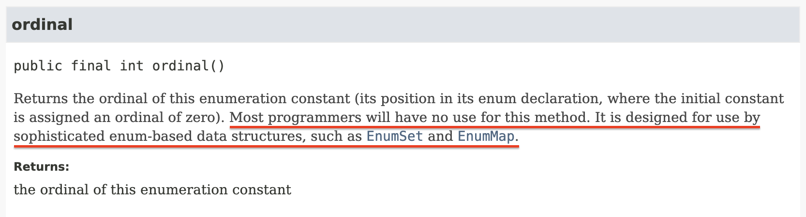

# 6장 열거 타입과 애너테이션

자바에는 특수한 목적의 참조 타입이 두 가지가 있다. 하나는 클래스의 일종인 열거 타입(enum; 열거형)이고, 다른 하나는 인터페이스의 일종인 애너테이션(annotation)이다. 이번 장에서는 이 타입들을 올바르게 사용하는 방법을 알아본다.

- [아이템 34. int 상수 대신 열거 타입을 사용하라](#아이템-34-int-상수-대신-열거-타입을-사용하라)
- [아이템 35. ordinal 메서드 대신 인스턴스 필드를 사용하라](#아이템-35-ordinal-메서드-대신-인스턴스-필드를-사용하라)

## 아이템 34. int 상수 대신 열거 타입을 사용하라

> ### 핵심 정리
>
> 열거 타입은 확실히 정수 상수보다 뛰어나다. 더 읽기 쉽고 안전하고 강력하다. 각 상수를 특정 데이터와 연결짓거나 상수마다 다르게 동작하게 할 때는 명시적 생성자나 메서드를 함께 제공하자. 드물게는 하나의 메서드가 상수별로 다르게 동작해야 할 때도 있다. 이럴 때는 switch 문 대신 상수별 메서드 구현을 사용하자. 열거 타입 상수 일부가 같은 동작을 공유한다면 전략 열거 타입 패턴을 사용하자.

열거 타입은 일정 개수의 상수 값을 정의한 다음, 그 외의 값은 허용하지 않는 타입이다. 사계절, 태양계의 행성, 카드 게임의 카드 종류 등이 좋은 예시이다.

### 열거 타입 도입 전에는...

열거 타입이 없던 시절에는 아래의 코드처럼 정수 상수를 묶어서 선언하고 사용했다. (정수 열거 패턴)

```java
public static final int APPLE_FUJI = 0;
public static final int APPLE_PIPPIN = 1;
public static final int APPLE_GRANNY_SMITH = 2;

public static final int ORANGE_NAVEL = 0;
public static final int ORANGE_TEMPLE = 1;
public static final int ORANGE_BLOOD = 2;
```

타입 안전성을 보장할 방법이 없으며 표현력도 나쁘다. 오렌지를 건네야 할 메서드에 사과를 보내거나 동등 연산자(==)로 비교하더라도 컴파일러는 경고를 띄우지 않는다.

사과용 상수의 이름은 모두 `APPLE_`로 시작하고, 오렌지용 상수의 이름은 모두 `ORANGE_`로 시작한다. 이는 자바가 별도의 namespace를 지원하지 않기 때문에 어쩔 수 없이 접두어를 붙여 구분한 것이다. 예를 들어, 영어로 둘 다 mercury인 수은(원소)과 수성(행성)을 구분할 방법이 없기 때문에 앞에 접두어를 붙여서 `ELEMENT_MERCURY`, `PLANET_MERCURY`로 구분해서 사용하는 것이다.

또한, 각 상수는 문자열로 출력하기 까다롭다. 그 값을 출력하거나 디버거로 살펴보면 숫자로만 보이기 때문에 어떤 상수인지 알기 어렵다. 이를 해결하기 위해 정수 대신 문자열 상수를 사용하는 문자열 열거 패턴을 사용하기도 한다. 그러나 이 방법은 더욱 나쁘다. 상수의 의미를 출력하기는 쉽지만, 누군가 문자열 상수 대신 직접 문자열을 하드코딩하게 된다면 프로그램이 오동작할 수 있고, 만약 오타가 발생한 경우 이를 찾기는 더욱 어렵다.

상수를 변경할 때도 문제가 될 수 있다. 평범한 상수를 나열한 것이기 때문에 컴파일하면 그 값이 클라이언트 파일에 그대로 새겨진다. 따라서 상수의 값이 바뀌면 클라이언트도 반드시 다시 컴파일해야 한다.

### 열거 타입 등장

수많은 단점을 보완하기 위해 자바는 열거 타입을 도입했다. 이전에 [Enum에 대해 학습하고 공유](https://velog.io/@hyeok_1212/Java-enum-%EC%82%AC%EC%9A%A9%ED%95%98%EC%8B%9C%EB%82%98%EC%9A%94)한 경험이 있다. 간단한 사용법이나 기본으로 제공하는 메서드들은 블로그 글을 참고하면 좋을 것 같다.

```java
// 가장 단순한 열거 타입
public enum Apple { FUJI, PIPPIN, GRANNY_SMITH }
public enum Orange { NAVEL, TEMPLE, BLOOD }
```

겉보기에는 다른 언어의 열거 타입과 비슷하지만, 자바의 열거 타입은 완전한 형태의 클래스라서 보다 강력하다.

자바의 열거 타입은 클래스이며, 상수 하나당 자신의 인스턴스를 하나씩 만들어 `public static final` 필드로 공개한다. 열거 타입은 밖에서 접근할 수 있는 생성자를 제공하지 않는다. 따라서 클라이언트가 인스턴스를 직접 생성하거나 확장할 수 없기 때문에 열거 타입 선언으로 만들어진 인스턴스들은 딱 하나씩만 존재한다. (싱글턴 보장)

유일하기 때문에 `==` 연산자로 비교할 수 있다. 또한, 열거 타입은 `Comparable`과 `Serializable` 인터페이스를 구현했으며, 어떤 변형을 가하더라도 문제 없이 작동하도록 설계되어 있다.

열거 타입은 각자의 namespace를 가지기 때문에 접두어를 붙일 필요가 없다.

열거 타입은 `toString` 메서드를 제공하며, 이를 재정의하면 `name`이 아닌 다른 문자열을 반환할 수 있다.

### 열거 타입에 데이터를 연결하는 방법

열거 타입의 도입으로 거의 대부분의 문제를 해결했다. 그러나 이게 끝이 아니라 열거 타입은 각 상수와 연결된 데이터를 가질 수 있다. 이를 통해 각 상수가 고유한 동작을 할 수 있게 할 수 있다.

열거 타입 상수 각각을 특정 데이터와 연결지으려면 생성자에서 데이터를 받아 인스턴스 필드에 저장하면 된다. 이때 열거 타입은 근본적으로 불변이기 때문에 모든 필드는 final이어야 한다. 접근 지정자는 public이어도 되지만, private로 선언하고 별도의 접근자 메서드를 제공하는 것이 좋다.

```java
public enum Planet {
    MERUCY(3.302e+23, 2.439e6),
    VENUS(4.869e+24, 6.052e6),
    EARTH(5.975e+24, 6.378e6),
    MARS(6.419e+23, 3.393e6),
    JUPITER(1.899e+27, 7.149e7),
    SATURN(5.685e+26, 6.027e7),
    URANUS(8.683e+25, 2.556e7),
    NEPTUNE(1.024e+26, 2.477e7);

    private final double mass; // 질량 (kg)
    private final double radius; // 반지름 (m)
    private final double surfaceGravity; // 표면 중력 (m / s^2)

    private static final double G = 6.67300E-11; // 중력 상수

    Planet(double mass, double radius) {
        this.mass = mass;
        this.radius = radius;
        // 질량과 반지름만 알면 surfaceGravity를 계산할 수 있다. (최적화)
        surfaceGravity = G * mass / (radius * radius);
    }

    public double mass() { return mass; }
    public double radius() { return radius; }
    public double surfaceGravity() { return surfaceGravity; }

    public double surfaceWeight(double mass) {
        return mass * surfaceGravity; // F = ma
    }
}
```

이렇게 하면 각 상수가 고유한 데이터를 가지게 되며, 각 상수가 고유한 동작을 할 수 있게 된다.

```java
public class WeightTable {

    public static void main(String[] args) {
        // 지구에서의 무게를 입력받아 각 행성에서의 무게를 출력한다.
        double earthWeight = Double.parseDouble(args[0]);
        double mass = earthWeight / Planet.EARTH.surfaceGravity();
        for (Planet p : Planet.values()) {
            System.out.printf("%s에서의 무게는 %f이다.%n", p, p.surfaceWeight(mass));
        }
    }
}
```

각 열거 타입 값의 toString 메서드는 상수 이름을 문자열로 반환하기 때문에 println과 같은 메서드를 사용하면 상수 이름을 출력할 수 있다. 마음에 들지 않는다면 toString 메서드를 재정의하면 된다.

만약 태양계에서 퇴출된 명왕성처럼 열거 타입에서 상수 하나를 제거한다면 어떻게 될까? 우선 위 코드에서는 문제가 발생하지 않는다. 단지 출력하는 줄 수가 줄어들 뿐이다. 그러나 만약 `Planet` 열거 타입을 사용하는 다른 코드가 있다면 그 코드는 컴파일되지 않는다. 오류를 빠르게 만날 수 있기 때문에 아주 좋은 현상이다.

널리 쓰이는 열거 타입이라면 톱레벨 클래스로 만들고, 특정 톱레벨 클래스에서만 쓰인다면 해당 클래스의 멤버 클래스로 만들자. 접근 범위도 일반적인 클래스와 동일한 규칙을 생각하자.

### 상수마다 다르게 동작하는 열거 타입

Planet 열거 타입은 서로 다른 데이터와 연결될 수 있다는 것을 보여줬다. 대부분 이 정도만 있으면 충분하지만, 때로는 각 상수가 고유한 동작을 수행해야 할 때도 있다. 이럴 때는 열거 타입에 추상 메서드를 선언하고, 각 상수별로 다르게 동작하게 하면 된다.

```java
public enum Operation {
    PLUS { public double apply(double x, double y) { return x + y; } },
    MINUS { public double apply(double x, double y) { return x - y; } },
    TIMES { public double apply(double x, double y) { return x * y; } },
    DIVIDE { public double apply(double x, double y) { return x / y; } };

    public abstract double apply(double x, double y);
}
```

추상 메서드 방법을 사용하지 않고 switch 문을 통해 구현할 수도 있지만, 이 방법은 열거 타입의 장점을 활용하지 못한다. 예를 들어, 새로운 상수가 추가된다면 매번 swtich 문을 수정해야 하는데 이를 까먹어도 컴파일러가 알려주지 않는다.

### toString을 재정의한다면 fromString도 제공하자

열거 타입은 `valueOf`라는 정적 팩터리 메서드를 제공한다. 이 메서드는 주어진 이름과 일치하는 열거 타입 상수를 반환한다. 이때 주어진 이름은 name 메서드로 얻는 것과 같아야 한다.

만약 `toString` 메서드를 재정의한다면, `fromString`이라는 메서드를 제공하는 것이 좋다. 이 메서드는 주어진 문자열에 해당하는 열거 타입 상수를 반환한다. 이때 `toString` 메서드가 반환하는 값은 각 인스턴스마다 고유해야 한다.

```java
public static final Map<String, Operation> stringToEnum = Stream.of(values()).collect(
    toMap(Object::toString, e -> e));

// 지정한 문자열에 해당하는 Operation을 (존재한다면) 반환한다.
public static Optional<Operation> fromString(String symbol) {
    return Optional.ofNullable(stringToEnum.get(symbol));
}
```

Optional을 사용한 이유는 `fromString` 메서드가 null을 반환할 수도 있기 때문이다. 이 메서드는 null을 반환할 수도 있지만, 이는 클라이언트가 잘못된 문자열을 입력했을 때이므로 직접 대처할 수 있도록 구현한 것이다.

### 전략 열거 타입 패턴

추상 메서드를 구현하는 방법은 열거 타입 상수끼리 코드를 공유하기 어렵다.

예를 들어, 급여명세서에서 쓸 요일을 표현하는 열거 타입을 생각해보자. 이 열거 타입은 직원의 (시간당) 기본 임금과 그날 일한 시간(분 단위)이 주어지면 일당을 계산해주는 메서드를 가지고 있다. 주중에 오버타임이 발생하면 잔업 수당이 주어지고, 주말에는 무조건 잔업수당이 주어진다. switch 문을 사용해보자.

```java
enum PayrollDay {
    MONDAY, TUESDAY, WEDNESDAY, THURSDAY, FRIDAY, SATURDAY, SUNDAY;

    private static final int MINS_PER_SHIFT = 8 * 60;

    int pay(int minutesWorked, int payRate) {
        int basePay = minutesWorked * payRate;
        int overtimePay;
        switch (this) {
            case SATURDAY: case SUNDAY:
                overtimePay = basePay / 2;
                break;
            default:
                overtimePay = minutesWorked <= MINS_PER_SHIFT ? 0 : (minutesWorked - MINS_PER_SHIFT) * payRate / 2;
        }
        return basePay + overtimePay;
    }
}
```

간결하지만, 위험하다. 만약 휴가와 같은 새로운 값을 열거 타입에 추가하려면 그 값을 처리하는 case 문도 잊지 않고 꼭 넣어줘야 한다. 더 큰 문제는 넣지 않았을 때 컴파일러는 이에 대한 경고를 띄우지 않는다는 것이다.

중복(평일은 모두 같은 메서드이다.)이 생기더라도 추상 메서드를 만들고 각 상수가 이를 구현하게 만들거나 도우미 메서드(평일, 주말)를 만들어 각 메서드를 호출하게 만들어도 된다. 그러나 이 방법은 중복이 많아지고 장황해진다는 단점이 있다.

가장 깔끔한 방법은 새로운 상수를 추가할 때 잔업수당 `전략`을 선택하도록 하는 것이다.

```java
enum PayrollDay {
    MONDAY(PayType.WEEKDAY), TUESDAY(PayType.WEEKDAY), WEDNESDAY(PayType.WEEKDAY), THURSDAY(PayType.WEEKDAY), FRIDAY(PayType.WEEKDAY), SATURDAY(PayType.WEEKEND), SUNDAY(PayType.WEEKEND);

    private final PayType payType;

    PayrollDay(PayType payType) { this.payType = payType; }

    int pay(int minutesWorked, int payRate) {
        return payType.pay(minutesWorked, payRate);
    }

    // 전략 열거 타입
    private enum PayType {
        WEEKDAY {
            int overtimePay(int minsWorked, int payRate) {
                return minsWorked <= MINS_PER_SHIFT ? 0 : (minsWorked - MINS_PER_SHIFT) * payRate / 2;
            }
        },
        WEEKEND {
            int overtimePay(int minsWorked, int payRate) {
                return minsWorked * payRate / 2;
            }
        };

        abstract int overtimePay(int mins, int payRate);

        private static final int MINS_PER_SHIFT = 8 * 60;

        int pay(int minsWorked, int payRate) {
            int basePay = minsWorked * payRate;
            return basePay + overtimePay(minsWorked, payRate);
        }
    }
}
```

다소 복잡해지긴 했지만, 매우 안전하고 유연하다. PayrollDay 열거 타입은 잔업 수당 계산을 PayType 전략 열거 타입에 위임했다. 새로운 상수를 추가할 때는 PayType에 새로운 상수를 추가하고, 각 상수가 잔업 수당을 계산하는 메서드를 구현하면 된다. 이렇게 하면 PayrollDay에는 수정할 필요가 없다.

### 그러면 switch는 되도록 쓰지 말아야 하나?

대부분 그렇지만 기존 열거 타입에 상수별 동작을 혼합해 넣을 때는 switch 문이 좋은 선택이 될 수 있다.

```java
// 각 연산의 반대 연산을 반환하는 메서드
public static Operation inverse(Operation op) {
    switch (op) {
        case PLUS: return Operation.MINUS;
        case MINUS: return Operation.PLUS;
        case TIMES: return Operation.DIVIDE;
        case DIVIDE: return Operation.TIMES;
        default: throw new AssertionError("알 수 없는 연산: " + op);
    }
}
```

### 성능?

성능은 이전 방식과 열거 타입 방식이 크게 차이나지 않는다. 그러나 안전성, 유연성, 표현력에서 열거 타입이 훨씬 뛰어나다. 따라서 열거 타입을 사용하자.

특히 태양계 행성, 요일, 체스 말처럼 본질적으로 열거 타입인 타입은 꼭 열거 타입으로 만들자.

## 아이템 35. ordinal 메서드 대신 인스턴스 필드를 사용하라

> ### 핵심 정리
>
> 열거 타입 상수에 연결된 값은 ordinal 메서드로 얻지 말고 인스턴스 필드에 저장하자. ordinal 메서드는 EnumSet과 EnumMap 같이 열거 타입 기반의 범용 자료구조에 쓸 목적으로 설계되었다.

열거 타입은 해당 상수가 그 열거 타입에서 몇 번째 위치인지를 반환하는 `ordinal` 메서드를 제공한다. 열거 타입으로 선언했다면 순서대로 이어지는 경우(카드 덱의 카드, 요일 등)가 많기 때문에 이 메서드를 쓰고 싶은 마음이 든다.

하지만 그 마음은 접는 것이 좋다. 코드로 알아보자.

### ordinal의 문제

합주단의 종류를 연주자가 1명인 솔로부터 10명인 디텍트까지 나타내는 열거 타입이다.

```java
public enum Ensemble {
    SOLO, DUET, TRIO, QUARTET, QUINTET, SEXTET, SEPTET, OCTET, NONET, DECTET;

    public int numberOfMusicians() { return ordinal() + 1; }
}
```

동작은 하지만 유지보수하기 매우 어려운 코드이다. 상수 선언 순서를 바꾸는 순간 `numberOfMusicians` 메서드가 오동작하며 이미 사용 중인 정수와 같은 상수는 추가할 방법이 없다. 예를 들어 이미 8중주 상수가 있으니 똑같이 8명이 연주하는 복4중주는 추가할 수 없는 것이다.

또한, 중간에 값을 비워둘 수도 없다. 올바르게 동작하려면 사용하지 않는 더미 상수를 추가해야 될 수도 있다는 것이다. (잘못된 메서드 때문에)

중간에 새로운 상수를 추가하는 것도 힘들다. 순서에 영향을 주기 때문이다.

### 그러면?

해결 방법은 간단하다. 열거 타입 상수에 연결된 값은 ordinal 메서드로 얻지 말고, 인스턴스 필드에 저장하는 것이다.

```java
public enum Ensemble {
    SOLO(1), DUET(2), TRIO(3), QUARTET(4), QUINTET(5), SEXTET(6), SEPTET(7), OCTET(8), DOUBLE_QUARTET(8), NONET(9), DECTET(10);

    private final int numberOfMusicians;

    Ensemble(int size) { this.numberOfMusicians = size; }
    public int numberOfMusicians() { return numberOfMusicians; }
}
```

이렇게 하면 순서를 바꾸거나 중간에 상수를 추가하거나 빼도 문제가 없으며, 중복도 가능하다. 또한, 각 상수가 연결된 값이 무엇인지 명확히 알 수 있다.



마지막으로 Enum의 API 문서를 보면 ordinal 메서드는 EnumSet과 EnumMap 같은 열거 타입 기반의 범용 자료구조를 만들 때 쓰라고 설계되었다고 하며, `대부분의 개발자가 ordinal 메서드를 쓸 일이 없다고 말한다.`

설명된 용도가 아닌 경우에는 ordinal 메서드를 절대 사용하지 말자.
