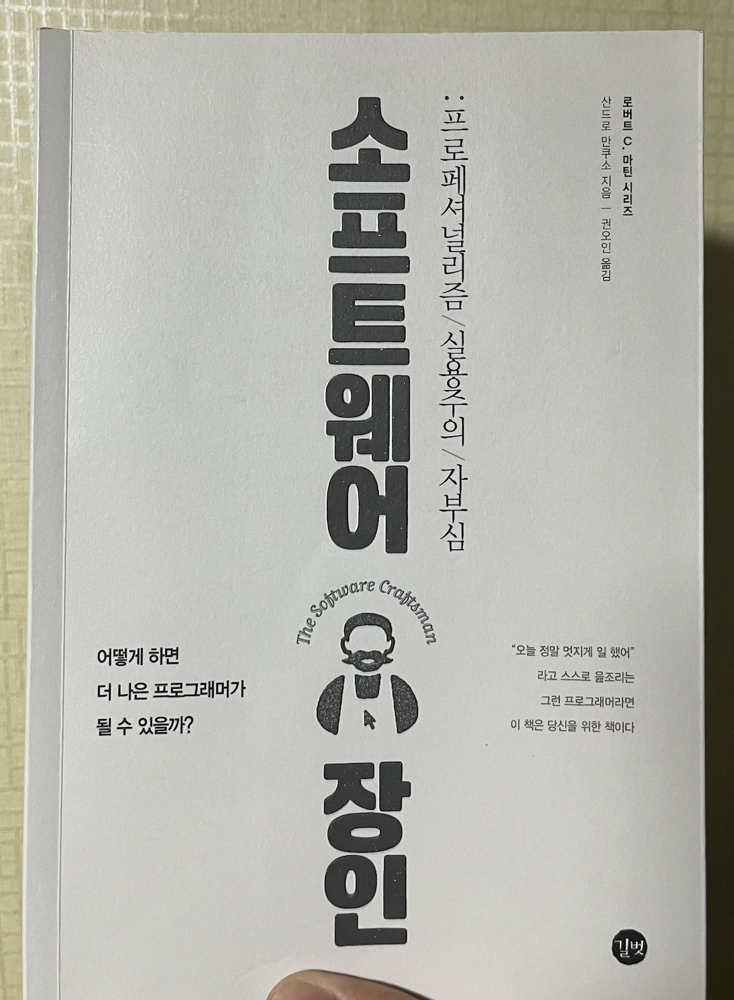

# 소프트웨어 장인

## 읽게 된 이유

[함께 자라기](함께_자라기.md)와 비슷한 시기에 추천을 받아 구매했던 책이다. 예전에 반 정도 읽고 방치했다가 이번에 다시 처음부터 읽기로 했다.

## 읽은 후 느낀 점

좋은 개발자가 되기 위해 단순히 경험(실무 경력 등)을 쌓거나 특정 분야에 대한 깊은 지식을 가지는 것을 매우 중요하게 생각했었다. 그러나 이 책을 읽으면서 개발자로서의 가져야 할 마음가짐을 다시 한번 생각해보게 되었다.

특히, 하는 일에 주인의식을 가지고 프로페셔널하게 행동하고 고객이 원하는 것을 달성하기 위해 노력하고 다른 개발자와 지식을 나누며 전반적인 소프트웨어 산업(생태계)에 기여하는 것이 중요하다는 것을 깨달았다.

사실 더 많은 개념이 등장하고 이를 뒷받침하는 이야기가 나오지만, 이를 온전히 글로 정리하는 것은 쉽지 않은 것 같다.

이 책은 크게 1부(이념과 태도)와 2부(완전한 전환)로 나뉜다.

1부에서는 이전 소프트웨어 개발자의 인식과 태도에 대해 돌아본 후 애자일과 프로페셔널리즘, 실행 관례 등을 바탕으로 소프트웨어 장인정신이라는 개념을 소개한다.

2부에서는 소프트웨어 장인을 채용하는 과정을 소개하며 어떻게 서로에게 도움이 되는지에 대해 다루고 배움의 문화, 여러 회의론을 상대하는 방법, 실용주의, 스스로 만드는 장인의 커리어 등에 대해 다룬다.

대부분의 챕터가 인상적이었지만, 나는 '아니오'라고 말하는 방법 배우기 부분이 기억에 남는다.

저자는 고객이 (도덕적, 일정, 구현 가능성 등) 좋지 못한 의사결정을 내릴 때 그것이 적절치 않다고 지적하는 정직함과 용기가 필요하다고 말한다. 이때 '아니오'라고 답하는 것뿐만 아니라 항상 대안을 마련하여 고객이 원하는 것을 달성할 수 있도록 도와주어야 하며, 책임감을 가지고 일을 해야 한다는 내용은 매우 인상적이었다.

여러 매체로 경험할 수 있는 회사에서는 상사의 지시를 어떻게든 따르는 것이 책임감을 가지고 일하는 것이라고 생각했었는데, 그 생각에 변화를 준 책이었다.

이 책은 아픔에 대한 책이며 모든 프로그래머가 겪는 아픔을 이야기한다는 후기를 표지에서도 볼 수 있다. 책의 많은 곳에서 프로페셔널하지 않은 방법이나 행동 등을 언급하며 이를 개선하는 방법을 제시하는데, 그때마다 나를 다시 돌아보게 만들었다.

마지막으로 내가 중요하게 생각하는 가치나 실행 관례 등 모든 것은 변할 수 있다는 것을 인지하고 메타인지를 통해 항상 프로페셔널리즘을 유지하려 노력해야 하는 것이 중요하다는 것을 배웠다.

가까운 사람들에게 적극 추천하고 싶은 책이다.

## 밑줄 친 문장

- 커리어 패스를 정할 때는 내가 열정이 있는 것, 진정 즐겁게 할 수 있는 것을 따라야 한다는 것이다. 모든 역할이 필요하고 중요하다. (p.31)
- 소프트웨어 개발자의 권한 영역이 더 넓어지고, 책임은 더 무거워지고 있다. (p.35)
- 애자일은 문제 자체를 해결해 주지는 않는다. 애자일은 문제를 드러나게 한다. (p.40)
- 코드를 잘 작성하는 것은 소프트웨어 프로페셔널이 가져야 할 최소한의 요건이다. 그에 더해 오늘날에는 테스트, 분석, 비즈니스에 대한 이해, 커뮤니케이션 능력, 보다 외향적인 성격을 소프트웨어 프로페셔널에게 요구한다. (p.41)
- 중요한 점은 어떤 문제가 있는지 재빨리 인식하고 대응하는 것이다. (p.53)
- 소프트웨어 장인정신은 소프트웨어 개발의 프로페셔널리즘에 대한 것이다. (p.58)
  - 자신이 하는 일에 주인의식을 가지고 프로페셔널하게 행동하고, 고객이 원하는 것은 무엇이든 달성할 수 있도록 돕는다. 다른 개발자들에게 배우고 자신의 지식을 나누며, 경험이 부족한 개발자들을 멘토링하는 것이다.
- 고객과 협업하는 것뿐만 아니라, 생산적인 동반자 관계를 (p.72)
  - 생산적인 동반자 관계는 어떤 순간이든 고객에게 가치를 제공하는 것을 의미한다.
- 오래 전에 작성했던 코드를 지금에 와서도 고칠 부분이 없어 보인다면, 그것은 그동안 배운 것이 없다는 뜻이다. (p.77)
- 소프트웨어 프로페셔널로 대우받기를 원한다면 프로처럼 행동해야 한다. (p.79)
- 열정적인 개발자들은 항상 배우려 하고 그들이 아는 것을 공유하려 하기 때문에 그들과 어울리는 것은 대단히 좋은 일이다. (p.95)
- 소프트웨어 프로페셔널이 할 수 있는 최대의 실수는 자신이 모르는 것을 모른다고 받아들이지 않는 것이다. (p.95)
  - 모르는 것을 배우는 기회로 만들기 위해 항상 노력해야 한다.
- 차드 파울러는 저서 [열정적인 프로그래머]에서 그저 실망시키지 않기 위해 말하는 '네'는 거짓말에 지나지 않는다고 했다. (p.115)
  - '네'라고 말할 때 사람들은 그 말을 믿고 그에 의존해서 계획을 짠다는 것을 반드시 기억해야 한다.
  - 항상 '아니오'라고만 얘기하는 것은 프로다운 태도가 아니다. 모든 '아니오'에는 반드시 하나 이상의 대안들이 따라와야 한다.
- 고객은 문제를 들고 프로페셔널을 찾아간다. 프로페셔널들이 그들의 경험과 지식을 활용해 그 문제를 다룰 방법들에 어떤 것들이 있고 각각의 장단점은 무엇인지를 알려주길 기대한다. (p.123)
- 빨리하는 것과 허술한 것은 다르다. (p.133)
- 기능 구현이 완료되었다고 할 수 있으려면 반드시 테스트까지 되어야 한다. (p.138)
  - 제품 오너가 원하는 것은 아무런 문제없이 의도대로 동작하는 시스템이고 그에 대한 책임은 우리에게 있다.
- 실행 관례의 도입 자체를 관리자나 팀 구성원들에게 설득하려 하지 말고 현재 일하는 방식과 비교해서 그것이 가져올 이익에 집중을 해야 한다. (p.153)
  - 실행 관례에 대한 도입을 이야기하기 전에, 먼저 우리가 이루려는 것이 무엇인지 논의해야 한다.
- 요기 베라는 '어디로 가고 있는지 모르고 있다면, 결국 가고 싶지 않은 곳으로 간다.'라는 말을 남겼다. (p.168)
  - 커리어 방향은 딱 한번 결정하고 나면 그 이후로는 아무 생각없이 내달리기만 하면 되는 그런 것이 아니다. 우리는 지속적으로 그 결정을 재평가하고 다시 목표를 세워야 한다.
- 일을 선택할 때는 자율성, 통달, 목적의식을 쫓아야 한다.
  - 자율성: 우리가 무엇을, 어떻게, 언제할지 통제할 수 있는 상태를 뜻한다.
  - 통달: 더 나은 프로페셔널, 더 나은 인간이 되기 위해 계속 배우고 진화하는 것을 뜻한다.
  - 목적의식: 지금 하고 있는 일이 중요하고 무언가를 더 나아지게 하고 있다고 느끼는 것을 뜻한다. 아무런 이해없이 시키는 대로 일하는 것의 반대 개념이다. (p.173)
- 면접은 쌍방향이다. (p.200)
  - 회사는 그들의 목적을 달성하는 데 도움을 줄 수 있는 개발자를 찾으려 하고, 개발자는 자신의 열망과 커리어 방향에 적합한 회사를 찾으려 한다.
- 구성원들이 동기가 부여되어 있지 않거나 자신의 일 자체에 별 관심이 없으면 그 어떤 변화도 효과적으로 일으킬 수 없다. (p.241)
  - 사람들 스스로 모든 것을 더 나아지게 하고 싶어하는 동기를 부여할 수 있어야 한다.
- 배움의 문화를 만드는 것은 관리자나 애자일 코치의 전담 업무가 아니다. 개발자를 포함해서 모두가 해야 할 일이다. (p.259)
- 자기가 하는 말이 무엇인지 스스로도 제대로 모르면서 다른 사람을 설득할 수는 없다. (p.265)
- 성공적으로 변화를 일으키려면 여러 종류의 사람들마다 어떻게 다르게 대응하고 어떻게 설득할지 알고 있어야 한다.
- 분명한 필요에 의해 시스템을 변경하고, 그 와중에 작은 리펙토링을 꾸준히 하는 것이 실용적인 관점에서 바람직한 애플리케이션 개선 방법이다. (p.293)
  - 전체적인 복잡도를 낮추는 데 도움이 된다. 당연하지만 복잡도가 낮은 시스템이 높은 시스템보다 유지보수 비용이 낮다.
- 소프트웨어 개발자들은 우리가 살고 있는 세상이 진화해 나가는 데 꼭 필요한 존재다. (p.309)
