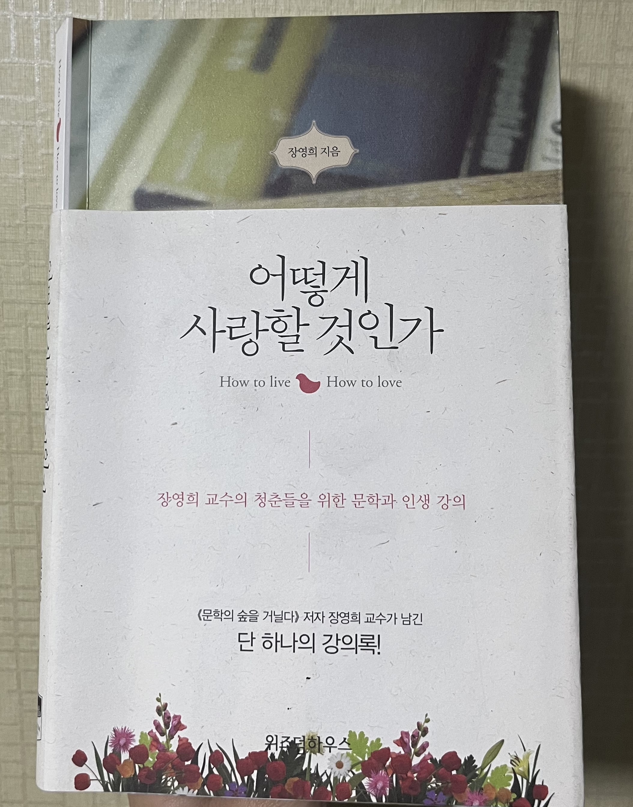

# 어떻게 사랑할 것인가

## 읽게 된 이유

무려 24년 12월 생일 선물로 받은 책이다.
고전 소설, 시 등 문학 작품을 지루하다고 생각해왔다.
그래서 거의 1년 넘게 모니터 받침대로 사용하다가 갑자기 눈에 들어와서 읽게 되었다.

책이 집 안 여기저기 굴러다니고 꽂혀 있으면 인간인 이상 저게 무슨 책일까 호기심이 생겨 집어 들게 된다고 말하며, 집어 든 이상 궁금해서 읽게 되고, 읽다보면 다 읽을 수도 있다고 했다.

그런 케이스로 읽게 된 것 같아서 기억에 남는다.

## 읽은 후 느낀 점

개발자를 꿈꾸며 살아가는 나는 기술 관련 책이나 아티클을 주로 읽는다.
그리고 앞서 말한 것처럼 문학 작품은 지루하기도 하고 개발자에게 큰 도움이 되지 않는다고 생각했다.
하지만 이 책을 읽으면서 생각이 꽤 바뀔 것 같다.
어떤 직업이더라도 인간의 마음을 이해하는 것이 중요하며, 문학 작품이 일종의 대리 경험처럼 그 이해에 큰 도움이 될 수 있다는 생각이 들었다.
같은 인간으로서 공감하는 능력, 타인의 입장에서 생각하는 능력은 개발자에게도 매우 중요한 덕목일 것이다.
좋은 선생님과 대화를 나눈 기분이 들었다.

## 밑줄 친 문장

- 문학은 나와 남이 결국은 같다는 것, 인간적인 보편성을 갖는다는 것을 보여줍니다. (p.16)
- 어떤 것을 더 좋아하고, 어떤 관계를 맺고, 어떻게 해야 더 행복하게 살 수 있는지를 말해 주는 것이 바로 문학입니다. (p.28)
- 비단 의사뿐만이 아니라 어떤 직업을 갖더라도 문학이 가장 기본이며 인간다움을 이해할 수 있는 학문이라고 생각합니다. (p.32)
- 저는 여러분 안에도 진정한 가치를 추구하고 나 혼자가 아니라 남을 생각하고, 또 사랑하고 사랑받고 싶은 마음이 늘 존재한다고 생각합니다. (p.34)
- 문학은 존경하는, 또는 알고 싶은 사람과의 대화입니다. (p.45)
- 남의 책을 많이 읽어라. 남이 고생하여 얻은 지식을 아주 쉽게 내 것으로 만들 수 있고, 그것으로 자기 발전을 이룰 수 있다. - 소크라테스 (p.55)
- 당장 필요한 정보는 인터넷이나 영상매체를 통해 금방 얻을 수 있겠지만, 내가 살아가는 의미, 그러니까 내가 다른 사람과 어떤 관계를 맺고 그 안에서 어떤 의미를 찾으며 한평생을 어떻게 살아갈 것인가에 대한 가장 기본적인 정보와 지혜는 책을 통해서만 얻을 수 있습니다. (p.72)
- 영국 전래동요 중에... '하지만 하지만 우리 집에는 책 읽어 주는 엄마가 있단다'라는 노랫말처럼 책 읽어 주는 부모, 책 읽는 모습을 보여 주는 부모가 얼마나 중요한지 깨닫기를 바랍니다. (p.77)
- 결국 문학이란 인생의 모습, 어떻게 인간답게 서로 사랑하며 살아가는가를 여러 사례를 통해 우리 모두가 공감할 수 있게 알려 주는 것입니다. (p.85)
- 단도직입적으로 정보만 교환하는 것이 아니라 어떻게 하면 저 사람의 마음에 들어가, 결국 같은 인간이며 공동체 운명을 타고난 사람임을 느끼게 해주는가, 그것이 바로 문학의 기본적인 목표입니다. (p86)
- 나는 '어려운(difficult) 것'과 '불가능한(impossible) 것'을 구별하고자 노력했습니다. - 루스 시몬즈 (p.106)
- "항아리에 자갈이나 모래를 먼저 집어넣으면 큰 돌은 결코 집어넣을 수 없다는 것입니다. 여러분 인생의 큰 돌, 즉 가장 소중한 것이 무엇인가를 생각하십시오. 그리고 그것을 우선적으로 여러분의 마음 항아리에 집어넣으십시오." (p.112)
- 글을 쓴다는 건 결국 '나눔'이니까요. "나는 이렇게 생각하는데 당신은 어떤가요?" 하고 묻는 과정이고요. (p.145)
- 글이란 내가 아는 길을 상대가 모를 경우 친절하게 가르쳐 주는 거지요. (p.147)
- 네 잎 클로버가 행운의 상징이라면, 세 잎 클로버는 행복을 상징한다고 합니다. (p.160)
- 다른 이의 입장에서 이해할 수 있는 능력은 리더가 되고 자기 분야에서 성공하기 위한 가장 기본적인 조건입니다. (p.168-9)
