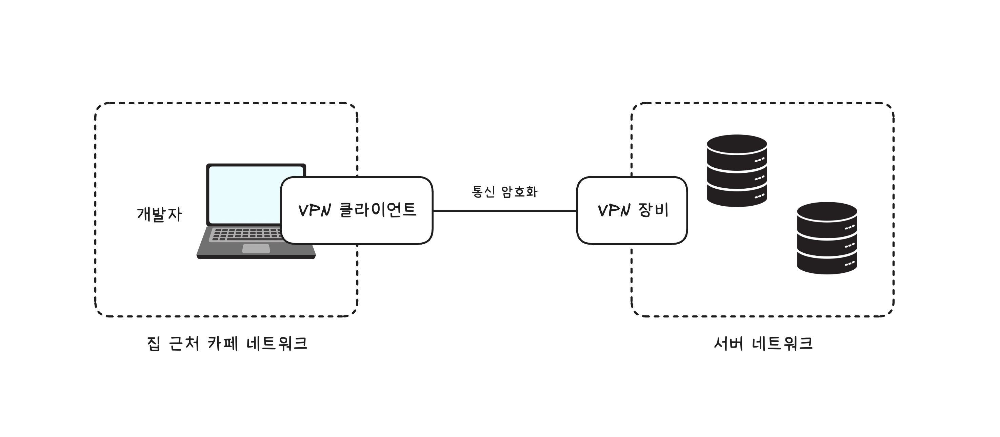

# 10장 모르면 답답해지는 네트워크 기초

서버 개발자가 네트워크 엔지니어만큼 네트워크 관련 지식을 잘 알아야 하는 것은 아니겠지만, 네트워크 지식이 전무하면 관련 문제가 발생했을 때 쉽게 해결할 수 있는 문제도 오랜 시간 동안 처리하지 못하게 된다.
기초적인 네트워크 지식 정도는 알아두는 것이 좋다.

- [노드, 네트워크, 라우터](#노드-네트워크-라우터)
- [IP 주소와 도메인](#ip-주소와-도메인)
- [NAT(Network Address Translation)](#natnetwork-address-translation)
- [VPN(Virtual Private Network)](#vpnvirtual-private-network)
- [프로토콜과 TCP, UDP, QUIC](#프로토콜과-tcp-udp-quic)
- [마무리](#마무리)

## 노드, 네트워크, 라우터

데이터를 송수신하는 모든 장치를 노드(node)라고 표현한다.
스마트폰, 노트북, 서버 장비 등이 모두 노드에 해당한다.
이런 각 노드가 서로 데이터를 주고받기 위해 연결된 통로를 네트워크(network)라고 한다.

노드가 네트워크를 통해 전송하는 데이터의 단위를 패킷(packet)이라고 한다.
패킷은 헤더와 페이로드로 구성되며, 헤더에는 송수신지 주소, 프로토콜 정보 등이 담기고, 페이로드에는 실제 전송하는 데이터가 담긴다.
데이터는 일정 크기를 가진 여러 패킷으로 나뉘어 전송된다.

서로 다른 네트워크에 속한 노드는 직접 통신할 수 없다.
이때 서로 다른 네트워크를 연결해주는 장치를 라우터(router)라고 한다.
라우터는 패킷의 헤더 정보를 확인하여 목적지에 가장 적합한 경로를 찾아 패킷을 전달한다.

## IP 주소와 도메인

네트워크에서 각 노드를 구분하기 위해 사용하는 주소를 IP 주소라고 한다.
일반적으로 사용하는 IP 주소는 IPv4 주소이다. (v4는 버전 4를 의미한다.)

### IPv4 주소

IPv4 주소는 32비트(4바이트)로 구성되며, 8비트씩 4부분으로 나누어 표현한다.
각 부분은 0부터 255까지의 값을 가지며, 점(.)으로 구분한다.
`223.130.192.248` 같은 형식이 IPv4 주소의 예이다.

> ### IPv6 주소
>
> IPv4 주소는 32비트로 구성되어 약 43억 개의 주소를 제공한다.
> 인터넷 사용자가 급증하면서 IPv4 주소가 부족해지는 문제가 발생할 것으로 예상되었다.
> 이를 해결하기 위해 128비트로 구성된 IPv6 주소가 개발되었다
> 그러나 여전히 많은 시스템이 IPv4 주소를 사용하고 있다.
> IP 주소가 고갈되지 않은 이유에는 사설 IP와 NAT(네트워크 주소 변환) 기술이 있다.

### 도메인과 DNS

각 노드의 IP 주소를 일일이 외우는 것은 매우 어렵다.
이를 해결하기 위해 도메인(domain)이라는 개념이 등장했다.
도메인은 사람이 이해하기 쉬운 문자열로 된 주소 체계이다.
예를 들어, `www.example.com` 같은 문자열이 도메인에 해당한다.
도메인은 계층 구조로 구성되며, 최상위 도메인, 2차 도메인, 서브도메인 등으로 나뉜다.

도메인 이름을 IP 주소로 변환하는 시스템을 DNS(Domain Name System)라고 한다.
DNS는 분산된 데이터베이스 시스템으로, 도메인 이름과 IP 주소 간의 매핑 정보를 저장하고 관리한다.

> ### 도메인 이름과 IP 주소 개수
>
> 도메인 이름에 매핑되는 IP 주소는 여러 개일 수 있다.
> nslookup 같은 도구를 사용하면 도메인 이름에 매핑된 여러 IP 주소를 확인할 수 있다.
> 여러 개를 매핑하는 이유는 부하 분산과 가용성 향상 때문이다.
> DNS 서버는 등록된 IP를 번갈아가며 응답하여 여러 서버에 부하를 분산시킨다.

### 고정 IP와 동적 IP

같은 네트워크 상에서 각 노드는 서로 다른 IP 주소를 가져야 한다.
그 이유는 IP 주소가 노드를 식별하는 유일한 값이기 때문이다. (같을 경우 충돌이 발생한다.)

노드의 IP 주소는 2가지 방식으로 할당될 수 있다.
- 고정 IP(static IP)는 노드에 영구적으로 할당된 IP 주소이다.
- 동적 IP(dynamic IP)는 노드가 네트워크에 연결될 때마다 새로운 IP 주소가 할당되는 방식이다.

동적 IP 주소는 DHCP(Dynamic Host Configuration Protocol) 서버에 의해 관리된다.
DHCP 서버는 네트워크에 연결된 노드에 사용 가능한 IP 주소를 동적으로 할당한다.
집에서 사용하는 공유기가 주로 동적 IP 방식을 사용한다.

> ### Memo
>
> 동적 IP 주소를 사용한다고 해서 매번 다른 IP 주소가 할당되는 것은 아니다.
> DHCP 서버는 일정 기간 동안 같은 IP 주소를 할당하는 경우가 많다.
> 보안이 중요한 곳은 IP로 사용자를 식별하기 위해 노드마다 고정 IP를 할당하는 경우도 있다.

### 공인 IP와 사설 IP

인터넷에서 접근할 수 있는 IP 주소를 공인 IP(public IP)라고 한다.
공인 IP 주소는 인터넷에 접속하는 모든 네트워크에 고유해야 하며, 방화벽으로 막지 않는 한 인터넷 어디에서나 접근할 수 있다.

사설 IP(private IP)는 특정 네트워크 내부에서만 유효한 IP 주소이다.
사설 IP 주소는 공인 IP 주소와 달리 인터넷 전체에서 고유할 필요가 없다.
사설 IP 주소는 주로 가정이나 기업 내의 로컬 네트워크에서 사용된다.

사설 IP 주소는 다음과 같은 범위 내에서 할당된다.
- 192.168.x.x
- 10.x.x.x
- 172.16.x.x ~ 172.31.x.x

## NAT(Network Address Translation)

NAT은 네트워크 주소를 변환하는 기술이다.
인터넷에 연결하려면 내부에서 사용하는 사설 IP 주소를 공인 IP 주소로 변환해야 한다.
NAT은 주로 라우터에서 구현되며, 내부 네트워크의 여러 노드가 하나의 공인 IP 주소를 공유하여 인터넷에 접속할 수 있도록 한다.
소스 IP의 주소를 변환한다고 해서 SNAT(Source NAT)라고도 한다.
반대로 인터넷에서 들어오는 패킷의 목적지 IP 주소를 내부 네트워크의 사설 IP 주소로 변환하는 기능도 있다.
이를 DNAT(Destination NAT)라고 한다.

### 서버 개발자로서의 정리

NAT 환경에서는 여러 서버가 하나의 공인 IP를 공유한다.
따라서 외부에서 들어오는 요청은 IP 주소만으로는 어떤 서버로 가야 하는지 판단할 수 없다.

이 문제를 해결하기 위해 포트 번호, 로드밸런서, 포트 포워딩 같은 추가적인 네트워크 설정이 필요해진다.

이제 인프라 설정이 복잡해 보였던 이유가 IP를 공유하는 구조 때문이라는 것을 이해하게 되었다.

## VPN(Virtual Private Network)

서버를 개발하고 운영하는 과정에서 서버 노드에 접속하거나 DB에 접속해야 할 일이 생긴다.
서버 노드에 SSH로 접속해서 프로세스를 확인하거나 OS 설정을 변경해야 할 때가 있고, DB에 접속해서 쿼리를 실행하거나 데이터를 확인해야 할 때도 있다.

그러나 서버 네트워크에 존재하는 노드는 사설 IP 주소를 사용하기 때문에 외부에서 직접 접속할 수 없다.
이 문제를 해결하기 위해 VPN(Virtual Private Network)을 사용한다.

VPN은 인터넷과 같은 공용 네트워크에서 서로 다른 네트워크 간에 암호화된 연결을 제공한다.
두 네트워크는 마치 하나의 사설 네트워크에 존재하는 것처럼 연결될 수 있다.

이미지처럼 외부 환경에서는 별도 VPN 클라이언트를 통해 VPN에 연결한다.

## 프로토콜과 TCP, UDP, QUIC

네트워크 상에서 두 노드가 데이터를 주고받기 위해 정의한 규칙을 프로토콜(protocol)이라고 한다.
네트워크는 여러 계층으로 구성되며 각 계층마다 사용하는 프로토콜이 존재한다.

TCP/IP 모델에서 개발자는 주로 전송 계층(Transport Layer)과 응용 계층(Application Layer)의 프로토콜을 신경 쓰게 된다.

### TCP

TCP(Transmission Control Protocol)는 연결 기반 프로토콜이다.
두 노드끼리 먼저 연결을 설정한 후 데이터를 주고받는다.
그 과정을 3-Way Handshake라고 한다.

TCP의 장점은 신뢰성이다. 
패킷 순서를 보장하고 패킷이 유실될 경우 재전송하는 기능을 제공하기 때문에 안정적으로 데이터를 전송할 수 있다.
이러한 이유로 애플리케이션 계층의 HTTP, SMTP와 같은 프로토콜이 TCP를 기반으로 동작한다.

다만 TCP는 연결 과정과 신뢰성을 보장하기 위한 추가적인 작업이 필요하기 때문에 UDP에 비해 속도가 느리다.

### UDP

UDP(User Datagram Protocol)는 비연결형 프로토콜이다.
데이터를 전송하기 전에 별도의 연결 설정 과정이 필요하지 않다.

UDP는 패킷 순서를 보장하지 않으며, 패킷이 유실되더라도 재전송하지 않는다.
이러한 특성 때문에 UDP는 실시간성이 중요한 애플리케이션에서 주로 사용된다.
예를 들어, 온라인 게임, 실시간 스트리밍, VoIP(Voice over IP) 등이 UDP를 사용한다.

### QUIC

TCP의 신뢰성과 UDP의 속도 장점을 결합하기 위한 목적으로 개발된 프로토콜이 QUIC(Quick UDP Internet Connections)이다.

QUIC는 UDP를 기반으로 하면서도 TCP와 유사한 신뢰성 기능을 제공한다.
예를 들어 QUIC는 데이터에 연결 ID를 포함시켜 두 노드 간의 연결을 유지하고, TCP의 혼잡 제어나 패킷 유실 복구와 같은 기능을 프로토콜 수준에서 제어한다.

QUIC은 TLS(Transport Layer Security)를 기본적으로 통합했다.
TCP 기준의 HTTPS는 3-Way Handshake와 TLS 핸드셰이크를 별도로 수행해야 하지만, QUIC은 이 과정을 하나로 통합하여 연결 설정 시간을 단축한다.

QUIC는 멀티플렉싱(multiplexing)을 지원한다.
한 연결에서 여러 스트림을 동시에 처리할 수 있어, 하나의 스트림에서 패킷 유실이 발생해도 다른 스트림에 영향을 주지 않는다.
