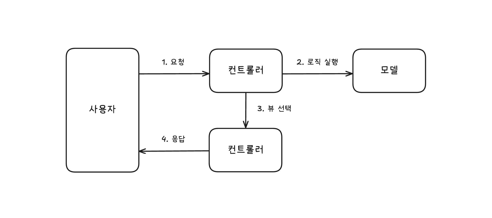
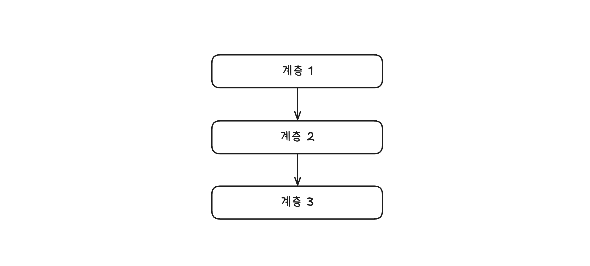
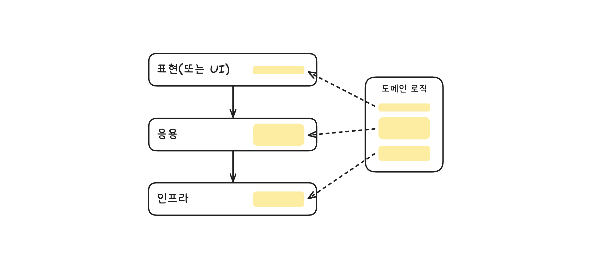
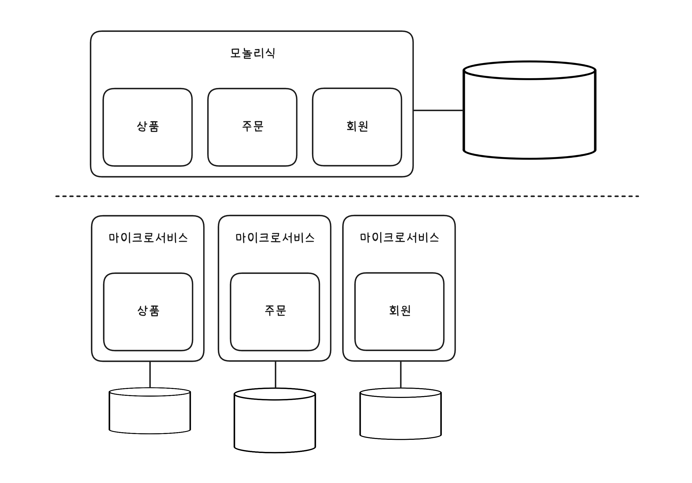

# 11장 자주 쓰는 서버 구축과 설계 패턴

- [MVC 패턴](#mvc-패턴)
- [계층형 아키텍처](#계층형-아키텍처)
- [DDD와 전술 패턴](#ddd와-전술-패턴)
- [마이크로서비스 아키텍처](#마이크로서비스-아키텍처)
- [이벤트 기반 아키텍처](#이벤트-기반-아키텍처)
    - [이벤트 브로커와 단일 진실 공급원](#이벤트-브로커와-단일-진실-공급원)
- [CQRS 패턴](#cqrs-패턴)

## MVC 패턴

자바의 스프링 프레임워크는 전형적인 MVC 패턴을 사용한다.
MVC는 Model-View-Controller의 약자로, 애플리케이션을 3개의 요소로 구성된 패턴이다.



사용자의 요청을 컨트롤러에 보낸다.
컨트롤러는 사용자의 요청을 해석하고, 모델에 비즈니스 로직 처리를 위임한다.

- 컨트롤러는 사용자가 POST 방식으로 전송한 데이터를 요청 객체로 변환하고 모델이 제공하는 기능을 호출한다.

모델은 요청받은 기능을 처리하고, 처리 결과를 컨트롤러에 반환한다.

- 주문 배송지 변경과 같은 로직을 처리하고 결과를 반환한다.

컨트롤러는 모델의 처리 결과를 기준으로 응답할 뷰를 선택하고 보여준다.

- 웹 페이지를 구현한 컨트롤러는 HTML 응답을 생성하는 뷰를 선택한다. 
- Spring 기준 API를 구현한 컨트롤러는 ViewResolver를 거치지 않고, 반환 객체를 HttpMessageConverter를 통해 JSON으로 직렬화한다.

뷰가 결과를 생성하려면 데이터가 필요한데, 이 데이터는 컨트롤러를 통해 전달받는다.

MVC 패턴의 핵심은 2가지로 볼 수 있다.
1. 비즈니스 로직을 처리하는 모델과 결과를 생성하는 뷰를 분리한다.
2. 애플리케이션의 흐름 제어나 사용자 요청 해석은 컨트롤러가 담당한다.

뷰와 모델은 컨트롤러에 의존하지 않으며, 컨트롤러만 모델과 뷰에 의존한다.
모델과 뷰가 분리되어 있기 때문에 서로의 변화에 영향을 덜 받는다.

컨트롤러에 상관없이 모델과 뷰를 변경할 수 있게 해주기에 유지보수성이 높아진다고 말한다.

### Spring MVC?

MVC 패턴은 개념적으로 비즈니스 로직(Model)과 화면 표현(View), 그리고 요청 흐름 제어(Controller)를 분리하려는 설계 패턴이다.

Spring Web MVC는 이 MVC 개념에 Front Controller 패턴을 결합해 구현한 프레임워크다. 모든 요청은 Front Controller에 해당하는 DispatcherServlet으로 들어오고, DispatcherServlet은 요청을 처리할 실제 `@Controller`를 찾아 위임한다.

Spring MVC에서 `@Controller`는 MVC 패턴의 Controller 역할을 담당하며, Service나 Domain, Entity 계층이 비즈니스 로직을 처리하는 Model 역할을 나눠 가진다.

> ### Spring MVC Model?
>
>  Spring MVC에서 Model은 “도메인/비즈니스 로직 계층”과 “View에 전달할 데이터(Model 객체)”라는 두 의미로 사용된다.

`@Controller`는 비즈니스 처리 결과를 반환하고, View에 전달할 데이터는 Model 객체에 담는다. DispatcherServlet은 이 정보를 바탕으로 ViewResolver를 통해 View를 찾고, View를 렌더링하여 최종 응답을 생성한다.
한편, `@ResponseBody`를 사용하거나 `@RestController`를 사용하는 경우에는 View를 선택하지 않는다. 이 경우 DispatcherServlet은 반환된 객체를 HttpMessageConverter에 위임하여 JSON과 같은 형태로 직렬화한다.
즉, HTML을 렌더링하는 View 대신 “JSON 응답을 생성하는 처리 경로”가 선택되는 것이며, 이는 API 서버에서 View의 역할을 데이터 직렬화가 대신 수행하는 구조라고 볼 수 있다.

이처럼 Spring Web MVC는 전통적인 MVC 구조뿐 아니라, REST API 형태의 응답까지 동일한 요청 처리 흐름 안에서 유연하게 지원한다.

## 계층형 아키텍처

이름에서 알 수 있듯이, 계층형 아키텍처는 각 계층마다 자신의 역할을 수행하고, 하위에 위치한 계층에만 의존하는 구조를 가진다.



계층형 아키텍처에서 하위 계층은 상위 계층에 대한 의존을 갖지 않는다.

웹 애플리케이션을 계층형 아키텍처로 구현할 때는 일반적으로 4개 계층을 구성한다.

```
 표현(또는 UI) 
     ↓
    응용
     ↓
도메인(또는 모델)
     ↓
인프라(또는 영속)
```

표현(Presentation) 또는 UI(User Interface) 계층은 사용자와 상호작용을 담당한다.
사용자의 요청 처리를 응용 계층에 위임한다.
MVC 패턴에서 컨트롤러와 뷰가 표현 계층에 해당한다고 볼 수 있다.

응용(Application) 계층은 모델 계층이나 인프라 계층을 사용해서 필요한 기능을 처리하고 결과를 표현 계층에 반환한다.
흔히 서비스(Service)라고 부른다.

도메인/모델(Domain/Model) 계층은 도메인 로직을 구현한다.
주문 모델의 취소 제약 조건과 상태 변경과 같은 로직이 여기에 해당한다.

인프라(Infrastructure) 또는 영속(Persistence) 계층은 DB 연동이나 문자 발송과 같은 구현 기술을 담당한다.

계층형 아키텍처는 구조가 단순하고 규칙이 명확하기 때문에 실행 흐름을 추적하기 쉽다는 장점이 있다.

### 흩어지는 도메인 로직

단순히 서비스/DAO로 구성된 계층형 아키텍처를 사용하는 경우 도메인 로직이 인프라와 응용 계층으로 분산되는 경향이 있어 코드 유지보수를 어렵게 만들기도 한다.



```sql
-- MemberDao#updateMemberStatus(id)의 쿼리 예시
UPDATE members SET status = 'active' WHERE id = ? AND status = 'waiting';
```

이 쿼리는 status가 'waiting'인 회원의 상태를 'active'로 변경한다.

```java
// 위 쿼리와 연동되는 코드 예시
int count = memberDao.updateMemberStatus(id);
if (count == 0) {
    // 변경 건이 없으므로 상태 변경 실패 처리   
}
```

위 쿼리를 실행하는 코드에는 어떤 도메인 로직도 없다.
단지 회원의 상태를 변경하는 DAO 메서드를 실행하고 변경 건수가 0이면 실패 처리하는 코드가 있을 뿐이다.
어떤 조건일 때 상태가 변경되는지를 확인하려면 쿼리를 살펴봐야 한다.

도메인 로직이 흩어어져 있다고 볼 수 있다.
흩어짐 문제를 방지하려면 도메인 로직을 최대한 하나의 계층으로 모아야 한다.
도메인 로직을 한 곳에 모으는 방법 중 하나는 DDD의 전술 패턴을 활용하는 것이다.

## DDD와 전술 패턴

로직이 복잡한 도메인을 구현할 때는 DDD(Domain-Driven Design)에 소개된 패턴 사용을 검토해보자.

| 개념 | 설명 |
|---|---|
| 도메인 (Domain) | 소프트웨어가 해결하고자 하는 문제 영역을 의미합니다. 예를 들어 여신 시스템에서는 대출, 심사, 승인과 같은 업무 영역이 도메인이 됩니다. |
| 유비쿼터스 언어 (Ubiquitous Language) | 도메인 전문가와 개발자가 공통으로 사용하는 언어입니다. 도메인 모델과 코드 전반에 동일한 용어를 사용함으로써 의사소통 비용을 줄이고 도메인 이해를 높입니다. |
| 바운디드 컨텍스트 (Bounded Context) | 도메인을 명확하게 구분하는 경계입니다. 각 컨텍스트는 독립적인 모델과 언어를 가지며, 다른 컨텍스트와는 명확한 인터페이스를 통해 상호작용합니다. |
| 애그리거트 (Aggregate) | 도메인 모델의 일관성을 유지하기 위해 관련 객체를 하나의 단위로 묶은 개념입니다. 하나의 애그리거트는 반드시 하나의 애그리거트 루트를 가집니다. |
| 애그리거트 루트 (Aggregate Root) | 애그리거트의 진입점이 되는 엔티티입니다. 외부에서는 애그리거트 루트를 통해서만 내부 객체에 접근할 수 있습니다. |
| 엔티티 (Entity) | 고유한 식별자를 가지며, 시간에 따라 상태가 변할 수 있는 객체입니다. 동일성(identity)이 중요한 도메인 객체입니다. |
| 값 객체 (Value Object) | 고유한 식별자를 가지지 않고 값 자체로 의미를 가지는 객체입니다. 불변성을 가지며, 속성 표현이나 개념 캡슐화에 사용됩니다. |

- 개념도 출처: [카카오페이 여신코어 DDD(Domain Driven Design, 도메인 주도 설계)로 구축하기](https://tech.kakaopay.com/post/backend-domain-driven-design/)

더 많은 개념이 있으며, 이러한 구성 요소를 사용해 도메인 로직을 애그리거트 단위로 묶는다.
복잡한 모델을 애그리거트 단위로 관리할 수 있게 함으로써 복잡도를 낮추고, 애그리거트에 관련 로직을 모아 응집도를 높인다.

```java
// p.306 예시 DDD 전술 패턴
public class CancelOrderService {
    
    private OrderRepository orderRepository;

    @Transactional
    public void cancel(OrderNumber orderNumber) {
        // 응용 서비스는 도메인 모델을 사용해서 사용자 요청을 처리한다.
        Order order = orderRepository.findById(orderNumber)
                .orElseThrow(() -> new NoOrderException());
        // 주문 취소 로직은 Order 애그리거트에 위치한다.
        order.cancel();
    }
}
```

전술 패턴 외에도 바운디드 컨텍스트(Bounded Context)는 도메인 간의 경계를 설정해준다.
상위 수준에서 복잡한 도메인을 관리하는 데 도움을 주며, MSA(Microservice Architecture)와도 잘 어울린다고 한다.

## 마이크로서비스 아키텍처

하나의 애플리케이션에 모든 것을 구현하는 모놀리식 아키텍처는 단순하고 이해하기 쉽다는 장점이 있다.
마이크로서비스 아키텍처는 더 작은 단위로 서비스를 분리하고 각 서비스가 연동되는 구조를 갖는다.



| 구분 | 모놀리식 | 마이크로서비스 |
|---|---|---|
| 장점 | - 배포가 단순하다.<br> - 코드 관리가 쉽다.<br> - 테스트와 디버깅이 쉽다.<br> - 구조가 단순하다. | - 독립적 배포가 가능하다.<br> - 확장성이 좋다.<br> - 기술 선택이 자유롭다.<br> - 개발자 만족도가 높다. |
| 단점 | - 규모가 커질수록 개발 속도가 느려진다.<br> - 전체 재배포가 필요하다. | - 인프라가 복잡하다.<br> - 테스트와 디버깅이 어렵다. |

### MSA 6가지 핵심 개념 (좋은 기준)

1. 독립적 배포: 다른 마이크로서비스를 배포하지 않고도 개별적으로 변경, 배포, 출시할 수 있어야 한다.
2. 도메인을 중심으로 모델링: 각 마이크로서비스는 도메인을 기준으로 구분해야 한다. 한 도메인의 기능 구현이 여러 마이크로서비스에 걸쳐 있으면 출시 비용이 증가한다.
3. 자신의 상태를 가짐: 마이크로서비스는 DB를 공유하지 않는다. 다른 마이크로서비스의 데이터를 사용할 경우 API를 통해서만 접근해야 한다.
4. 크기: 절대적인 크기 기준은 없다. 조직이 감당할 수 있는 수준과 마이크로서비스 경계 정의에 집중해야 한다.
5. 유연함: 마이크로서비스는 비용을 들여 기술, 확장, 견고함과 같은 유연함을 얻는 구조다. 비용을 감당할 수 있는 수준에서 도입을 고려해야 한다.
6. 아키텍처와 조직을 맞춤: 조직 구조는 아키텍처에 영향을 준다. ([콘웨이 법칙](https://en.wikipedia.org/wiki/Conway%27s_law)) 비즈니스 도메인이 시스템 아키텍처를 주도하는 주요 원동력이 되도록 설계한다.

MSA를 설계하거나 분리할 계획이라면 독립적 배포를 최우선으로 고려하자.
각 마이크로서비스 간 결합도를 최대한 낮추고, 독립적으로 배포할 수 있도록 설계해야 한다.

## 이벤트 기반 아키텍처

이벤트 기반 아키텍처(Event-Driven Architecture, EDA)는 두 시스템 간 통신에서 이벤트를 사용하는 구조다.

여기서 말한 이벤트는 [5장. 비동기 연동, 언제 어떻게 해야 할까?](5장_비동기_연동_언제_어떻게_써야_할까.md#메시징을-이용한-비동기-연동)에서 학습한 것처럼 과거에 발생한 사실을 의미한다.

이벤트 기반 아키텍처는 3가지 구성 요소로 이루어진다.

- 이벤트 생산자
- 이벤트 소비자
- 이벤트 브로커(또는 라우터)

이벤트 생산자는 이벤트를 생성해서 브로커에 전달하고, 브로커는 해당 이벤트에 관심 있는 소비자에게 이벤트를 전달한다. 이벤트 소비자는 이벤트를 받아 적절하게 반응한다.

이벤트를 전달하는 데 보통 메시징 기술을 사용하며 대표적으로 Kafka, RabbitMQ 같은 메시지 브로커가 있다.

이벤트 기반 아키텍처의 장점 중 하나는 생산자와 소비자가 직접 연결되지 않고 브로커를 통해 간접적으로 연결된다는 점이다.
덕분에 서로 간섭하지 않고 독립적으로 배포할 수 있으며, 새로운 소비자 추가도 용이하다.
그러나 이벤트가 중간 브로커를 거치기 때문에 지연 시간이 길어질 수 있고, 이벤트의 처리 상태를 추적하려면 별도의 추가 수단이 필요하다.

### 이벤트 브로커와 단일 진실 공급원

> ### 이벤트 브로커와 단일 진실 공급원 (p.311)
>
> 이벤트 브로커를 단일 진실 공급원(Single Source of Truth, SSOT)으로 확장해서 사용하는 방식도 있다.
> 예를 들어 Kafka는 메시지를 삭제하지 않고 저장할 수 있으며, 이를 활용하여 생산자가 보낸 모든 이벤트를 영구 보관할 수 있다.
>
> 시스템의 모든 상태 변화가 이벤트로 발생한다면, 이벤트 기록이 곧 시스템 상태의 변화를 나타내는 단일 진실 공급원이 된다.
> 더 나아가 Kafka 같은 브로커를 이벤트 소싱 패턴의 이벤트 저장소로도 활용할 수 있다.

일반적인 시스템에서는 보통 DB가 단일 진실 공급원(SSOT)이고, Kafka 같은 메시지 브로커는 “DB 변경 사실을 다른 서비스에 알려주는 용도”로 사용된다.

이 구조에서는 DB 상태만 남고 왜 그렇게 됐는지는 사라진다.

장애가 발생했을 때 DB 상태를 복원할 수는 있지만,
- “언제 값이 바뀌었는지?”
- “누가 바꿨는지?”
- “중간에 어떤 상태를 거쳤는지?”
등을 알기 어렵다.
즉, 다른 시스템이 과거 시점 상태를 재구성할 수 없다.

그래서 현재 상태가 아니라, 모든 상태 변경 이벤트가 진실이라는 개념이 등장했다.
모든 상태 변경 이벤트를 저장하는 메시지 브로커가 단일 진실 공급원이 된다.

```
// DB가 단일 진실 공급원인 경우
orders
---------
id | status
---------
1  | SHIPPED // 왜 SHIPPED가 되었는지 알 수 없음

// 이벤트 브로커가 단일 진실 공급원인 경우
OrderCreated(orderId=1)
OrderPaid(orderId=1)
OrderPacked(orderId=1)
OrderShipped(orderId=1) // 모든 상태 변경 이벤트가 있으니 순서대로 재구성 가능
```

위 구조에 적당한 브로커가 바로 Kafka다.
Kafka는 메시지를 삭제하지 않고 저장할 수 있으며, 이를 활용하여 생산자가 보낸 모든 이벤트를 영구 보관할 수 있다.
나아가 partition 단위로 순서를 보장하고, offset을 통해 특정 시점부터 다시 읽을 수 있다.

이런 특징들로 인해 Kafka를 이벤트 소싱 패턴의 이벤트 저장소로도 활용할 수 있다.

- 새로운 서비스가 생기면? → 과거 이벤트부터 다시 읽어서 상태 재구성
- 버그로 데이터 망가졌다면? → 이벤트 다시 replay 해서 DB 재생성

좋아보이지만, 단순한 CRUD가 불가능하고, 사고방식이 생소해서 도입 장벽이 높다.
그리고 이벤트를 전부 재생하면 느리기 때문에 별도의 스냅샷 저장소를 두어 성능을 보완하는 경우가 많다고 한다.

## CQRS 패턴

단순한 시스템은 상태 변경과 상태 조회가 동일한 모습을 갖지만, 조금만 복잡해져도 상태 변경에 사용하는 데이터와 상태 조회 시 사용하는 데이터에 차이가 발생한다.

주문을 생각해보자.
주문을 생성할 때는 주문 ID, 회원 ID, 상품 ID, 수량, 주소와 같은 데이터가 필요하다.
반면 주문 목록을 조회할 때는 위 데이터 외에도 상품명, 주문 상태 등의 데이터가 필요하다.
명령과 조회에서 사용하는 데이터가 서로 다른 것이다.

명령과 조회에서 사용하는 데이터가 다른데도 하나의 모델로 명령과 조회를 모두 구현하면, 모델이 복잡해지고 코드 유지보수가 어려워진다. 
예를 들어 주문의 상태를 변경하는 코드를 보는데 조회에서만 사용하는 속성이 함께 있다면 코드 분석이 어려워진다.

도메인이 복잡해질 경우에는 CQRS(Command Query Responsibility Segregation) 패턴을 사용해서 단일 모델 사용으로 인해 발생하는 복잡도 문제를 해소할 수 있다.

- Command: 상태 변경을 의미한다.
- Query: 상태 조회를 의미한다.

CQRS는 명령 모델과 조회 모델을 구분하여 구현함으로써 서로의 변경이 영향을 주지 않도록 한다.
또한, 조회 모델이 별도로 존재하므로 조회 성능을 향상시키기 쉽다. (캐시 적용, 조회 전용 DB 구축 등)

단점으로는 당연히 따로 구현하기 때문에 작성해야 할 코드가 많아진다.
반드시 추가되는 코드 대비 얻는 이점이 더 큰지 검토해야 한다.

분리 이후 성능을 위해 조회 모델을 캐시나 별도 DB로 구축하는 경우, 명령 모델과 조회 모델 간 데이터 동기화 문제도 고려해야 한다.

## 마무리

학습한 패턴들은 정답이 아닐 것이다.
나아가 사용하기만 하면 복잡도가 낮아지는 것이 아니라, 복잡도를 관리하기 위한 도구일 것이다.

중요한 것은 어떤 패턴을 아는지가 아니라 지금 문제에 적합한 패턴(꼭 정형화된 패턴이 아니어도 됨)을 선택하고 적용하는 능력일 것 같다.
