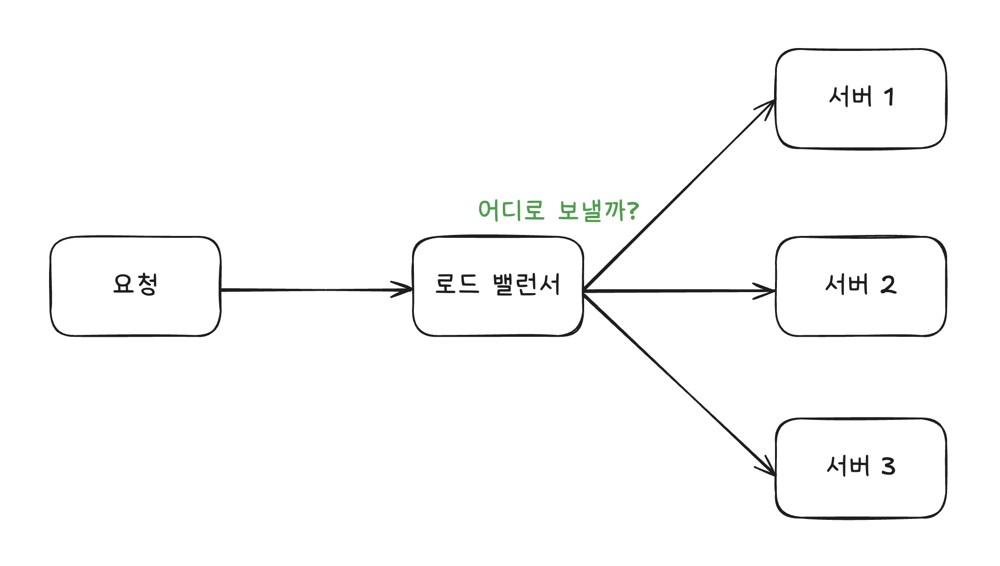
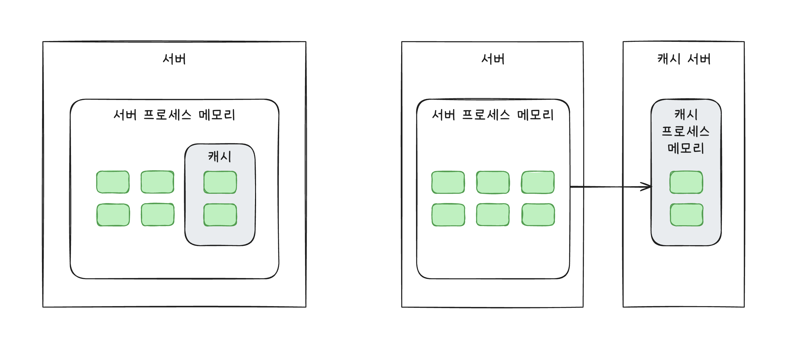
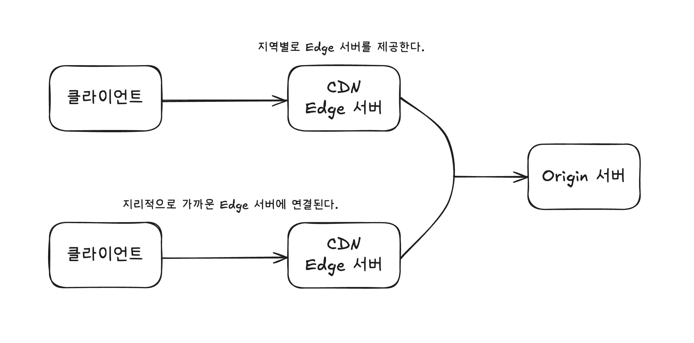

# 2장 느려진 서비스 어디부터 봐야 할까

앱을 실행했을 때 로딩 중인 이미지가 10초 후에 나타난다면, 사용자는 앱이 느리다고 느낄 것이다. 성능이 저하되면 가장 눈에 띄는 현상을 결과가 늦게 나타나는 것이다. 너무 오래 걸려서 타임아웃 에러가 발생하기도 한다. 이를 방지하려면 서버 성능을 개선해야 한다.

- [처리량과 응답 시간](#처리량과-응답-시간)
- [병목 지점](#병목-지점)
- [수직 확장과 수평 확장](#수직-확장과-수평-확장)
- [DB 커넥션 풀](#db-커넥션-풀)
- [서버 캐시](#서버-캐시)
- [가비지 컬렉터와 메모리 사용](#가비지-컬렉터와-메모리-사용)
- [응답 압축](#응답-압축)
- [정적 자원과 캐시/CDN](#정적-자원과-캐시cdn)
- [대기 처리](#대기-처리)

## 처리량과 응답 시간

사용자는 무언가를 실행할 때 동작하기까지 걸린 시간으로 성능을 판단하지만 실제로는 다양한 요소가 복합적으로 연관되어 있다. (네트워크 속도, 디스크 속도, 메모리 크기, 디바이스 성능 등도 여기에 해당한다.) 다양한 지표 중에서 서버 성능과 밀접한 관련이 있는 지표는 처리량과 응답 시간이다.

### 응답 시간

응답 시간은 사용자의 요청을 처리하는 데 걸리는 시간을 의미한다. API를 호출하고 응답을 받는 데 걸리는 시간으로 측정할 수 있다.

응답 시간을 다음과 같이 2가지로 나누어 측정하기도 한다. 응답 데이터가 작다면 큰 차이가 없지만, 파일 다운로드처럼 전송할 데이터가 크거나 네트워크 속도가 느리면 둘의 차이가 커질 수 있다.

- TTFB(Time To First Byte): 응답 데이터 중 첫 번째 바이트가 도착하는 데 걸리는 시간
- TTRB(Time To Last Byte): 응답 데이터 중 마지막 바이트가 도착하는 데 걸리는 시간

응답 시간은 1초보다 짧을 때가 많다. 그래서 성능 측정을 위해 밀리초(ms, 1/1000초) 단위를 사용한다.

> ### Tip
>
> 응답 시간이 사업에 주는 영향은 크다고 알려져 있다. 구글이 공개한 'Speed Matters for Google Web Search'에 따르면, 검색 지연 시간이 길어질수록 사용자당 검색 횟수가 줄어드는 경향이 있다고 한다. 추가로 매출엥 영향을 끼친다는 보고도 있다.

응답 시간을 자세하게 살펴보면, 서버 연결, 서버로 요청 전송, 서버 처리, 클라이언트로 응답 전송 정도로 나눌 수 있다. 서버 개발자는 주로 서버의 처리 시간에 집중한다.

- 로직 수행 (if, for 등)
- DB 연동(SQL 실행)
- 외부 API 연동
- 응답 데이터 생성(전송)

이 중에서 DB 연동과 외부 API 연동이 가장 많은 시간을 차지한다. (책에서는 외부 API 연동이 없는 경우에는 DB 연동이 전체 처리 시간의 7~8할을 차지한다고 한다.) 따라서 응답 시간을 줄이려고 할 때 DB 연동과 외부 API 연동을 우선적으로 살펴보는 것이 좋다.

### 처리량

처리량은 단위 시간당 시스템이 처리하는 작업량을 의미한다. 흔히 TPS(Transactions Per Second)나 RPS(Requests Per Second)로 표현한다. 처리량이 높을수록 시스템이 많은 작업을 처리할 수 있다.

처리량의 한계로 사용자의 요청이 밀린다면, 결국 응답 시간이 길어지게 된다. 이를 방지하려면 다음 2가지 방법을 고려해야 한다.

- 서버가 동시에 처리할 수 있는 요청 수를 늘려 대기 시간을 줄이기
- 처리 시간 자체를 줄여 대기 시간을 줄이기

성능을 개선하려면 가장 먼저 현재 서버의 처리량과 응답 시간을 측정해야 한다. 책에서는 막연하게 성능이 느리다고 이것저것 시도하는 것보다 트래픽이 많은 시간대의 처리량과 응답 시간이 얼마인지 측정하고, 결과를 바탕으로 성능 개선안을 도출하는 것이 좋다고 말한다.

처리량을 확인하는 가장 간단한 방법은 모니터링 시스템을 활용하는 것이다. (스카우터, 핀포인트, 뉴렐릭 등)

## 병목 지점

서비스 초기에는 성능 문제가 잘 발생하지 않지만, 사용자가 늘면서 점점 문제가 발생한다. 이는 트래픽이 증가하면서 시스템이 수용할 수 있는 최대 처리량을 초과하기 때문이다. 즉, 최대 처리량을 높이지 않으면 해결할 수 없다.

처리량을 높이려면 먼저 성능 문제가 발생하는 지점을 찾아야 한다. 모니터링 도구나 로그 전략을 활용하여 실행 시간을 측정하고 가장 오래 걸리는 부분인 병목 지점을 찾아야 한다. 저자는 경험상 주로 DB나 외부 API 연동에서 병목 지점이 발견되었다고 한다.

## 수직 확장과 수평 확장

성능 문제를 일으키는 원인을 찾았다면 빠르게 적용할 수 있는 개선안을 도출해야 한다. 사용자가 서비스를 이용하지 못하는 상황에서 오래 고민하는 것은 좋지 않으며, 우선은 빠르게 적용할 수 있는 개선안을 도출하고 이후에 더 나은 개선안을 고민하는 것이 좋다고 한다.

### 수직 확장

급한 불을 끄는 방법 중 하나는 수직 확장(scale up)이다. 서버의 CPU, 메모리, 디스크 등 자원을 늘려서 처리량을 높이는 방법이다. 특히 클라우드 환경이라면 비교적 빠르게 적용할 수 있는 방법이다.

수직 확장은 즉각적인 효과를 볼 수 있지만 트래픽이 지속해서 증가한다면 결국 한계에 도달하게 된다. 또한 비용이 많이 들고, 자원을 낭비할 수 있다는 단점도 있다.

### 수평 확장

이때 서버를 늘리는 방법인 수평 확장(scale out)을 고려할 수 있다. 서버를 여러 대 운영하여 전체 처리량을 높이는 방법이다. 수평 확장은 트래픽이 지속해서 증가하더라도 서버를 계속 늘릴 수 있다. 또한 특정 서버에 장애가 발생하더라도 다른 서버가 서비스를 계속 제공할 수 있어 가용성이 높아진다.

> ### 로드 밸런서
>
> 서버가 두 대 이상이면 로드 밸런서(load balancer)가 필요하다. 로드 밸런서는 사용자 트래픽을 각 서버에 골고루 분배해서 한 서버에 사용자 트래픽이 몰리지 않도록 한다. (효율적인 자원 활용)
>
> 로드 밸런서가 트래픽을 분산시키는 방법은 크게 정적인 방법과 동적인 방법으로 나눌 수 있다.
>
> - 정적인 방법: 라운드 로빈(Round Robin), 가중 라운드 로빈(Weighted Round Robin), IP 해시(IP Hash) 등
> - 동적인 방법: 최소 연결(Least Connections), 최소 응답 시간(Least Response Time) 등

(위) 로드 밸런서 구조

처리량을 높이기 위해 무턱대고 서버를 늘리는 것은 좋은 방법이 아니다. 만약 실제 병목 지점이 DB 부분이라면, 서버를 늘릴 경우 오히려 DB에 더 큰 부하가 걸릴 수 있으며 문제는 악화될 것이다. 따라서 서버를 늘리기 전에 병목 지점을 먼저 찾고, DB나 외부 API 호출에 성능 문제가 발생하지 않는 범위 내에서 서버를 늘리는 것이 좋다.

## DB 커넥션 풀

DB를 사용하려면 크게 3단계를 거친다.

1. DB에 연결한다.
2. 쿼리를 실행한다.
3. 사용이 끝나면 연결을 종료한다.

서버와 DB는 네트워크 통신이 필요하고 이때 네트워크 연결을 생성하고 종료하는 데 걸리는 시간은 0.5초에서 1초 이상 소요되기도 한다. 작아보이지만, 실행 시간이 10ms인 짧은 쿼리를 실행하기 위해 연결과 종료에 1초가 걸린다면 단순하게 계산해도 전체 처리 시간인 1.01초 중에서 1초가 연결과 종료에 사용된다. 즉, 전체 처리 시간의 99%가 연결과 종료에 사용되는 것이다.

이런 문제를 피하기 위해 DB 커넥션 풀(connection pool)을 사용한다. DB 커넥션 풀은 미리 일정 개수의 DB 연결을 생성해두고, 필요할 때마다 이 연결을 재사용하는 기법이다. 따라서 DB에 연결하고 종료하는 데 걸리는 시간을 줄일 수 있다. (실제로 많이 사용되는 프레임워크나 언어도 DB 커넥션 풀을 지원하고 있다.)

커넥션 풀은 다양한 설정을 제공한다. 그중 중요한 설정은 다음과 같다.

- 커넥션 풀 크기(또는 최소 크기, 최대 크기)
- 풀에 커넥션이 없을 때 커넥션을 구할 때까지 대기할 시간
- 커넥션의 유지 시간(최대 유후 시간, 최대 유지 시간)

### 커넥션 풀 크기

커넥션 풀 크기는 미리 생성해둘 커넥션의 개수를 지정하는 설정이다.

예시로 살펴보자.

- 커넥션 풀 크기는 5다.
- 한 요청에서 쿼리를 실행하는 데 1초 걸린다.
- 쉬운 계산을 위해 데이터 전송 시간은 무시한다.

서버에 6개의 요청이 동시에 들어온다면, 처음 5개 요청은 풀에서 커넥션을 가져올 수 있지만, 6번째 요청은 커넥션을 가져올 수 없다. 따라서 6번째 요청은 커넥션이 반환될 때까지 기다려야 한다. 즉, 6번째 요청은 1초 후에야 커넥션을 가져올 수 있고, 이후에 쿼리를 실행하는 데 1초가 더 걸리므로 총 2초가 걸린다.

풀에서 커넥션을 얻기 위해 대기하는 시간을 줄이려면 전체 응답 시간과 처리량을 고려하여 커넥션 풀 크기를 지정해야 한다.

구현 방식에 따라 다르지만 일반적인 커넥션 풀은 최소, 최대 크기를 설정할 수 있다. 최소 크기는 애플리케이션이 시작할 때 미리 생성해둘 커넥션의 개수를 의미하고, 최대 크기는 필요에 따라 생성할 수 있는 커넥션의 최대 개수를 의미한다.

일반적으로 트래픽은 증가했다가 감소하는 패턴을 보인다. 은행 서비스는 낮 시간대에 트래픽이 높고, 게임 서비스는 저녁 시간대에 트래픽이 높은 경향이 있다. 최소, 최대 크기를 적절히 설정하면 트래픽이 낮을 때는 커넥션 수를 줄여 자원을 절약하고, 트래픽이 높을 때는 커넥션 수를 늘려 처리량을 높일 수 있다.

> ### Tip
>
> 트래픽이 순간적으로 급증하는 패턴을 보인다면 커넥션 풀의 최소 크기를 최대 크기에 맞추는 것이 좋다. 트래픽이 점진적으로 증가할 때는 DB 연결 시간이 성능에 큰 영향을 주지 않지만 트래픽이 급증할 경우 DB 연결 시간도 성능 저하의 주요 원인이 될 수 있기 때문이다.

다시 한번 정리하면, 커넥션 풀 크기를 늘리면 처리량을 높일 수 있다. 그러나 무턱대고 늘리면 DB 서버에 부하가 커져 오히려 성능이 저하될 수 있다. 따라서 전체 응답 시간과 처리량을 고려하여 적절한 크기를 지정하는 것이 중요하다.

### 커넥션 대기 시간

커넥션 대기 시간은 풀에 사용할 수 있는 커넥션이 없을 때 커넥션을 얻기 위해 기다릴 수 있는 최대 시간을 의미한다. 지정된 대기 시간 안에 커넥션을 얻지 못한다면 DB 연결 실패 에러가 발생한다.

커넥션을 얻기 위해 대기하는 시간만큼 응답 시간도 길어진다. 참고로 HikariCP의 기본 대기 시간은 30초다. 바꿔 말하면 최악의 경우 응답 시간이 30초를 넘길 수도 있다는 것이다. 응답 시간이 중요하다면 커넥션 대기 시간을 가능한 짧게 지정해야 한다. 보통 0.5초에서 3초 이내로 지정한다고 한다.

대기 시간을 짧게 설정하면 커넥션 풀이 모두 사용 중일 때 빠르게 "일시적 오류"와 같은 에러 응답을 사용자에게 보여줄 수 있다. 긴 시간 무응답 상태로 유지되는 것보단 나은 상황이다. 이후에 재시도 로직을 구현하여 다시 요청을 시도할 수도 있고, 덕분에 서버의 부하가 증가하는 것을 막을 수도 있다.

커넥션 풀의 크기가 10이고 대기 시간이 30초라고 가정하자. 동시에 30개의 요청이 발생했는데 순간적으로 DB 서버에 부하가 걸리면서 쿼리 실행 시간이 10초로 늘어났다.

- 처음 10개의 요청은 커넥션을 바로 얻어 쿼리를 실행한다.
- 다음 요청 20개는 커넥션이 반환될 때까지 대기해야 한다.

대기하는 사람 중 절반이 기다리지 못하고 5초 만에 요청을 취소하고 다시 요청한다면 아직 처음 10개의 요청은 쿼리가 실행 중(10초)이므로 20개 또한 대기 중(30초)일텐데, 새로운 요청이 쌓이게 된다. 클라이언트가 요청을 취소하더라도 서버는 그 요청을 즉시 중단하지 않기 때문에 결론적으로 동시 요청 수가 늘어난 것과 같다.

이때 대기 시간을 1초로 설정했다면, 1초 후에 커넥션을 얻지 못한 요청은 바로 에러 응답을 받게 된다. 따라서 서버에 부하가 증가하는 것을 막을 수 있는 것이다.

### 최대 유휴 시간, 유효성 검사, 최대 유지 시간

커넥션이 사용되지 않는 시간이 길어지면 연결이 끊길 수도 있다.

MySQL 같은 DB는 클라이언트와 일정 시간 동안 상호작용이 없으면 자동으로 연결을 끊는 기능을 제공한다. 따라서 풀에 있는 커넥션이 오랫동안 사용되지 않으면 DB와의 연결이 끊길 수 있다. 이렇게 끊긴 커넥션을 사용하려고 하면 에러가 발생한다.

이런 문제를 방지하기 위해 커넥션 풀은 최대 유휴 시간 및 유효성 검사 기능을 제공한다.

최대 유휴 시간은 사용되지 않는 커넥션을 유지할 수 있는 최대 시간을 의미한다. 이 시간을 DB에 설정된 비활성화 유지 시간보다 짧게 설정하면, DB가 연결을 끊기 전에 풀에서 커넥션을 제거할 수 있다.

커넥션이 정상적으로 사용할 수 있는 상태인지 확인하는 기능을 유효성 검사라고 한다. 커넥션을 풀에서 가져올 때마다 유효성 검사를 수행하거나 주기적으로 검사할 수 있으며, 유효성 검사를 통과하지 못한 커넥션은 풀에서 제거할 수 있다.

일부 커넥션 풀은 유효성 검사를 위해 실제 쿼리를 실행하기도 한다. (예: SELECT 1)

커넥션 풀은 최대 유지 시간도 제공한다. 8시간으로 설정했다면, 커넥션이 생성된 지 8시간이 지나면 유효한 커넥션이라도 풀에서 제거한다.

> ### Tip
>
> 최대 유휴 시간과 최대 유지 시간을 무한대로 설정하지 않는 것이 좋다. 커넥션 풀의 기본값을 확인한 뒤 이 두 설정의 기본값이 무제한으로 되어 있다면 DB 설정을 참고하여 적절한 값으로 지정하는 것이 좋다.

## 서버 캐시

응답 시간을 줄이고 처리량을 높이기 위해 DB 서버를 확장할 수 이다. 하지만 DB 서버를 확장하려면 비용이 많이 든다. 또한 DB 서버를 확장하더라도 마음에 드는 성능이 나오지 않을 수도 있다.

DB 서버를 확장하지 않고도 응답 시간과 처리량을 개선하고 싶다면 캐시(cache)를 고려할 수 있다. 캐시는 일종의 (키, 값) 쌍을 저장하는 Map과 같은 형태의 데이터 저장소다. 자주 조회하는 데이터를 캐시에 저장해두고, 다음에 동일한 데이터를 조회할 때 캐시에서 가져오도록 한다. 따라서 DB에 접근하는 횟수를 줄여 응답 시간을 줄이고 처리량을 높일 수 있다.

DB 뿐만 아니라 복잡한 계산 결과나 외부 API 연동 결과도 캐시에 보관한다면 응답 시간을 줄이는 데 활용할 수 있다.

> ### Tip
>
> 캐시는 (키, 값) 형태로 저장하므로 저장하는 대상에 따라 적절한 캐시 키를 선택해야 한다. 겹치지 않도록 주의하자.

### 적중률

캐시가 얼마나 효율적으로 사용되는지는 적중률(hit rate)로 알 수 있다. 적중률은 전체 요청 중에서 캐시에서 값을 찾은 비율을 의미한다. 예를 들어, 100번의 요청 중에서 80번 캐시에서 값을 찾았다면 적중률은 80%다. 적중률이 높을수록 캐시가 효율적으로 사용되고 있다고 볼 수 있다.

적중률을 높이는 가장 쉬운 방법은 모든 데이터를 적재하는 것이다. 그러나 캐시 저장 공간은 제한적이므로 자주 조회하는 데이터만 저장해야 한다. 따라서 어떤 데이터를 캐시에 저장할지 결정하는 것이 중요하다.

### 삭제 규칙

캐시에 보관할 수 있는 데이터에 제한이 있으므로, 캐시가 가득 차 있는 상태에서 새로운 데이터를 캐시에 저장하면 기존에 있던 데이터 중 하나를 삭제해야 한다.

주로 사용하는 규칙은 다음과 같다.

- LRU(Least Recently Used): 가장 오랫동안 사용되지 않은 데이터를 삭제한다.
- LFU(Least Frequently Used): 가장 적게 사용된 데이터를 삭제한다.
- FIFO(First In First Out): 가장 먼저 저장된 데이터를 삭제한다.

어떤 규칙을 적용할지는 서비스 특성에 따라 다른다. 예를 들어, 카카오 선물하기 서비스에서는 생일 선물 데이터는 꾸준히 조회되지만, 크리스마스 선물 데이터는 크리스마스가 지나면 거의 조회되지 않는다. 특성에 맞게 규칙을 선택하는 것이 좋다.

만료 시간을 설정하는 것도 좋은 방법일 수 있다.

### 로컬 캐시와 리모트 캐시

(좌) 로컬 캐시 (우) 리모트 캐시

서버가 사용하는 캐시에는 크게 로컬 캐시(local cache)와 리모트 캐시(remote cache)가 있다. 로컬 캐시는 서버 프로세스와 동일한 메모리를 캐시 저장소로 사용한다. 리모트 캐시는 별도의 서버 프로세스로 동작하며, 네트워크를 통해 접근한다.

로컬 캐시는 구현이 간단하고 접근 속도가 빠르다. 그러나 서버 프로세스가 사용할 수 있는 메모리의 양은 한정적이기 때문에 크기에 제한이 있고, 서버가 여러 대라면 각 서버마다 캐시를 관리해야 하므로 캐시 일관성을 유지하기 어렵다. 또한 서버가 재시작되면 캐시가 모두 사라진다는 단점도 있다.

리모트 캐시는 정반대의 장단점을 가진다. 캐시 크기를 유연하게 조절(확장)할 수 있고, 여러 서버가 하나의 캐시를 공유하므로 캐시 일관성을 유지하기 쉽다. 또한 서버가 재시작되더라도 캐시가 유지된다. 그러나 네트워크를 통해 접근하므로 로컬 캐시보다 접근 속도가 느리고 구조가 복잡하다는 단점이 있다.

### 캐시 사전 적재

트래픽이 순간적으로 급증하는 패턴을 보인다면 캐시에 데이터를 미리 저장하는 방법을 고려하자. 이 방법으로 캐시 스탬피드(cache stampede) 현상을 방지할 수 있다.

서버 구조에 따라 캐시 스탬피드 현상이 다른 서비스에 영향을 끼칠 수 있기 때문에 주의해야 한다.

관련해서는 [대용량 트래픽 아니면 안 보셔도 됩니다! 선물하기 서비스 캐싱 전략 / if(kakaoAI)2024](https://youtu.be/BUV4A2F9i7w?si=bkYbJ3g4qNBHnKdo) 영상이 많은 도움이 됐다.

### 캐시 무효화

캐시 사용 시 반드시 고려해야 하는 사항은 캐시 무효화(cache invalidation)다. 캐시에 저장된 데이터가 오래되었거나 변경되었다면 캐시에서 삭제하거나 갱신해야 한다.

캐시에 보관된 데이터의 원본이 변경되었지만, 여전히 캐시에 적재되어 있다면 사용자는 큰 혼란을 겪을 수 있다.

변경에 민감한 데이터는 로컬 캐시가 아닌 리모트 캐시에 보관하여 일관성을 유지하는 것이 좋다.

## 가비지 컬렉터와 메모리 사용

[가비지 컬렉터(garbage collector, GC)](../../Java/GarbageCollection.md)는 프로그래밍 언어에서 더 이상 사용되지 않는 메모리를 자동으로 해제하는 기능이다. 자바, C# 같은 언어는 가비지 컬렉터를 제공한다.

GC가 동작하면 애플리케이션의 실행이 잠시 멈춘다. 이때 응답 시간이 길어질 수 있다. 따라서 GC가 자주 동작하지 않도록 메모리를 효율적으로 사용하는 것이 중요하다. 적절한 최대 힙 크기를 지정하거나 객체 생성을 최소화하는 방법을 고려할 수 있다.

한번에 너무 많은 객체를 생성한다면 GC가 많이 동작하거나 메모리 부족 문제가 발생할 수 있다. 예를 들어 큰 파일을 다룬다면 스트림으로 처리하거나 데이터 자체를 여러 조각으로 볼 수 있게 기획을 변경하는 방법도 고려할 수 있다.

## 응답 압축

응답 시간에는 데이터 전송 시간이 포함된다. 이때 네트워크 속도와 전송 데이터 크기가 중요하다. 네트워크 속도는 서버에서 제어할 수 없지만, 전송 데이터 크기는 서버에서 제어할 수 있다.

Accept-Encoding 헤더를 사용하여 클라이언트가 지원하는 압축 방식을 서버에 알릴 수 있다. 서버는 이 헤더를 확인하고 응답 데이터를 압축하여 전송할 수 있다. 대표적인 압축 방식은 gzip이 있다.

html, css, js, json 같은 텍스트 형식의 응답은 압축률이 높아 매우 효과적이다. (약 70% ) 반면 이미지, 동영상, 이미 압축한 데이터는 압축률이 낮아 효과가 크지 않다.

> ### Tip
>
> 서버 방화벽 설정에서 gzip 압축된 응답을 차단하는 경우가 있다. 따라서 gzip 압축이 제대로 동작하지 않는다면 방화벽 설정을 확인해보자.

응답 데이터의 크기는 곧 비용으로 직결된다. 클라우드 환경에서는 전송한 데이터 양에 따라 비용이 청구되기 때문이다. 따라서 응답 데이터를 압축하면 비용 절감 효과도 기대할 수 있다.

## 정적 자원과 캐시/CDN

브라우저가 요청할 때마다 결과가 바뀌는 HTML이나 JSON 응답이 아닌, 자주 변경되지 않는 정적 자원(css, js, 이미지 등)은 캐시나 CDN(Content Delivery Network)을 활용하는 것이 좋다.

동일한 페이지에 접속할 때마다 css, js, 이미지 같은 정적 자원을 매번 다운로드한다면 불필요한 네트워크 트래픽이 발생한다. 따라서 정적 자원에 캐시 관련 헤더(Cache-Control, Expires 등)를 설정하여 브라우저가 캐시를 활용하도록 유도하는 것이 좋다.

브라우저 캐시를 사용하면 네트워크 트래픽을 줄일 수 있지만, 여전히 브라우저 단위로 적용되기 때문에 많은 사용자가 접속하는 서비스라면 빠르게 네트워크가 포화될 수 있다. 이때 CDN을 활용하면 네트워크 트래픽을 줄이는 데 도움이 된다.

(위) CDN 구조

CDN은 전 세계에 분산된 캐시 서버를 활용하여 사용자와 가까운 위치에서 정적 자원을 제공하는 서비스다. CDN을 사용하면 네트워크 지연 시간을 줄이고, 원본 서버의 부하를 줄일 수 있다.

정적 파일을 관리할 때는 큰 용량 업로드를 피하자. 웹 서버에 크기 제한 설정을 추가할 수도 있다.

## 대기 처리

콘서트 예매처럼 순간적으로 트래픽이 급증하는 패턴을 보인다면, 대기 처리(queueing)를 고려할 수 있다.

문제의 핵심은 짧은 시간 동안 폭증하는 트래픽이다. 이때 이 짧은 시간을 대응하기 위해 서버 또는 DB를 무턱대고 확장한다면 고정 비용이 커진다. 더군다나 DB는 한번 확장하면 줄일 수 없기 때문에 신중해야 한다.

대기 처리는 수용할 수 있는 수준의 트래픽만 받아들이고, 나머지 트래픽은 대기열에 넣어 순차적으로 처리하는 방법이다. 따라서 순간적인 트래픽 급증에도 시스템이 안정적으로 동작할 수 있다.

서버를 증성하지 않고도 서비스를 안정적으로 제공할 수 있고, 사용자가 많아도 일정 수준의 응답 시간을 유지할 수 있으며, 사용자가 새로고침을 반복하는 것을 막을 수 있다는 장점이 있다.

당연히 사용자는 대기 없는 서비스를 사용하고 싶겠지만, 대기 시간이 길어지더라도 서비스가 안되는 것보단 낫다고 생각할 것이다. 자기 차례가 오면 결국은 서비스를 이용할 수 있기 때문이다.

# 마무리

성능 개선에는 정답이 없다. 좋은 인스턴스를 사용할 수도 있고, DB 인덱스를 튜닝할 수도, 캐시를 둘 수도, 서버를 늘릴 수도 있다.

중요한 건 지금 우리 서비스에서 병목이 어디에 있는가?이다. 괜히 서버만 늘려도 해결이 안 될 수 있고, 작은 쿼리 하나 바꾸는 게 더 큰 효과를 낼 수도 있습니다.

결국 성능은 데이터를 보고, 가설을 세우고, 실험하는 과정이러고 느꼈다.

아래는 Gemini가 추천해준 목차 별 학습 키워드다.

## 추천 키워드

처리량과 응답 시간

- 레이턴시(latency) vs 처리량(throughput)
- 99th percentile 응답 시간(P99 latency)
- APM(Application Performance Monitoring) 도구 → New Relic, Datadog, Pinpoint

병목 지점

- Amdahl’s Law (암달의 법칙)
- 분산 트레이싱(distributed tracing)
- N+1 쿼리 문제

수직 확장과 수평 확장

- CAP 이론
- Scale-up vs Scale-out 한계 비교
- 로드 밸런싱 알고리즘 (Round Robin, Least Connection 등)

DB 커넥션 풀

- Connection Pool 라이브러리 비교 (HikariCP, C3P0, DBCP2)
- Pool Exhaustion(풀 고갈) 현상
- DB max_connections 설정

서버 캐시

- Cache Aside 패턴
- Write-through / Write-back 캐시 전략
- 캐시 일관성(Cache Consistency) 문제

가비지 컬렉터와 메모리 사용

- JVM GC 알고리즘 (Serial, Parallel, CMS, G1, ZGC)
- GC 튜닝 지표 (Stop-The-World 시간, Heap 사용량 모니터링)
- 메모리 누수(memory leak) 탐지

응답 압축

- gzip vs brotli 압축률 비교
- HTTP/2, HTTP/3 전송 방식 차이
- MTU, TCP 패킷 단편화(Fragmentation)

정적 자원과 캐시/CDN

- Cache-Control 헤더 (max-age, immutable, no-store)
- ETag / Last-Modified 기반 검증
- CDN 동작 원리 (PoP, Edge 서버, Origin Shield)

대기 처리

- 큐 시스템 비교 (RabbitMQ, Kafka, SQS)
- Backpressure 개념
- 레이트 리미팅(Rate limiting) 알고리즘 (Token Bucket, Leaky Bucket)
