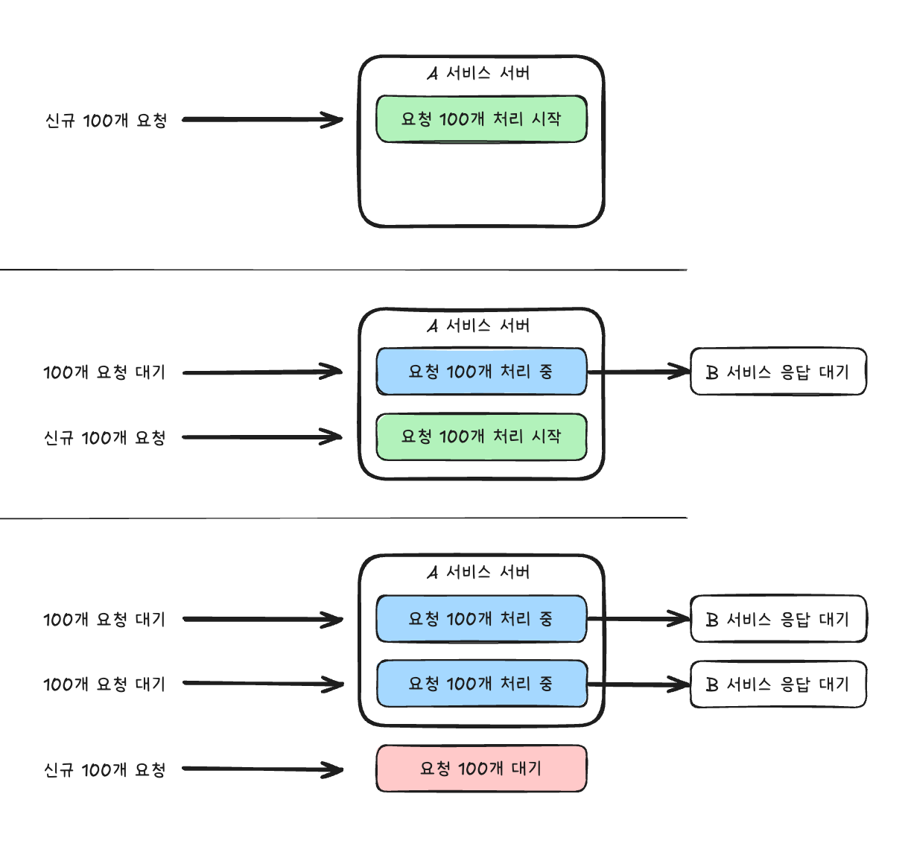
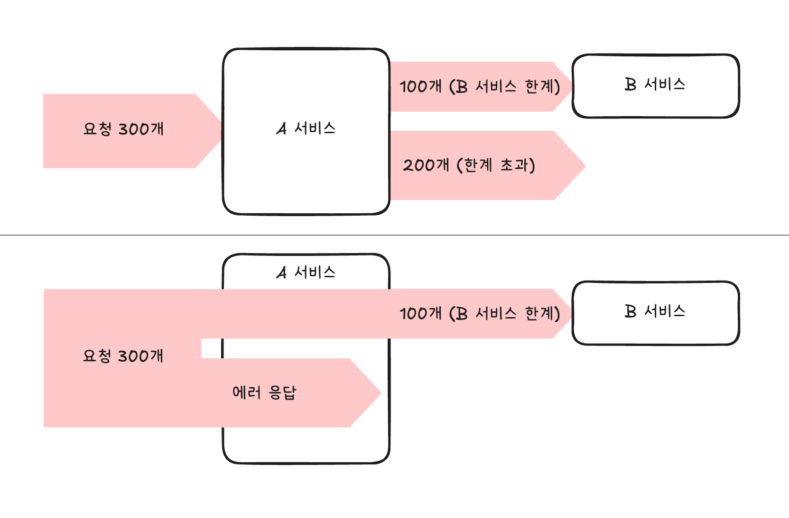
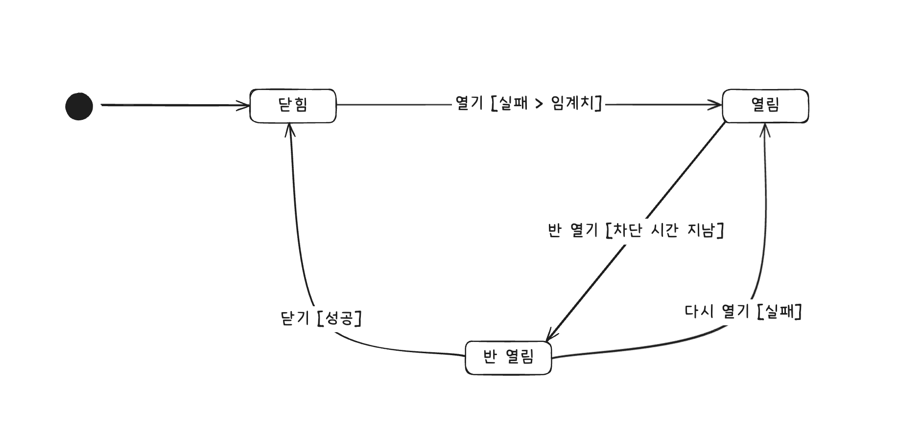

# 4장 외부 연동이 문제일 때 살펴봐야 할 것들

내가 읽고 이해한 내용을 바탕으로 다시 누군가에게 설명하는 형태로 작성하려고 한다.

- [타임아웃](#타임아웃)
  - [연결 타임아웃, 읽기 타임아웃](#연결-타임아웃-읽기-타임아웃)
- [재시도](#재시도)
  - [재시도 가능 조건](#재시도-가능-조건)
  - [재시도 횟수와 간격](#재시도-횟수와-간격)
- [동시 요청 제한](#동시-요청-제한)
  - [벌크헤드(Bulkhead) 패턴](#벌크헤드bulkhead-패턴-p-101)
- [서킷 브레이커](#서킷-브레이커)
  - [빠른 실패 (Fail Fast)](#빠른-실패-fail-fast-p-103)
- [외부 연동과 DB 연동](#외부-연동과-db-연동)
- [HTTP 커넥션 풀](#http-커넥션-풀)
- [연동 서비스 이중화](#연동-서비스-이중화)
- [마무리](#마무리)
  - [추천 키워드](#추천-키워드)

## 우리는 문제가 없는데

인터넷 초창기와 달리 이제 외부 연동은 매우 흔한 일이다. 소셜 로그인, 결제, 지도 등 당연하게 여겨지는 기능들이 모두 외부 연동을 통해 제공된다. 또한 MSA(Micro Service Architecture)와 같은 아키텍처가 유행하면서 내부적으로도 외부 연동이 빈번하게 일어나고 있다. 이제 연동도 품질을 고려해야 하는 시대가 되었다.

연동 서비스는 말 그대로 외부에 있는 서비스이기 때문에 우리가 통제할 수 없다. 따라서 연동 서비스에 문제가 생기면 우리 서비스도 영향을 받게 된다. 외부 시스템의 장애를 완벽하게 차단할 수는 없겠지만, 영향을 최소화할 수는 있다. 이번에는 외부 연동이 문제일 때 살펴봐야 할 것들을 알아본다.

## 타임아웃

타임아웃은 응답 시간과 깊이 연관되어 있다. 예를 들어 다음과 같은 상황을 생각해보자.

- A 서비스는 톰캣을 사용하고 있고, 스레드 풀 크기는 200이다. 즉 A 서비스는 동시에 200개의 요청을 처리할 수 있다.
- A 서비스는 B 서비스를 호출한다.
- B 서비스에 성능 문제가 생겨 응답 시간이 60초를 넘기기 시작했다.

10초마다 100개의 신규 요청이 들어온다고 가정해보자. A 서비스는 동시에 200개의 요청을 처리할 수 있으므로, 2초 안에 200개의 요청을 모두 처리할 것이다. 그런데 B 서비스의 응답 시간이 60초로 늘어나면서 A 서비스의 요청 처리 시간이 60초로 늘어나게 된다. 결국 A 서비스는 60초 동안 스레드가 모두 사용되기 때문에, 10초마다 들어오는 신규 요청을 처리하지 못하게 된다. 나아가 그림에서 세 번째 요청이 B 서비스 연동이 필요하지 않은 요청이라도 A 서비스는 스레드가 모두 사용되었기 때문에 요청을 처리하지 못하게 된다.

즉, 연동 서비스에 타임아웃을 설정하지 않으면 연동 서비스의 응답이 느려질 때 전체 처리량이 급격히 떨어지게 된다.
또한 응답 없이 대기하는 시간이 길어질수록 사용자는 새로고침을 누르거나, 앱을 다시 실행하는 등 불필요한 행동을 하게 될 가능성이 높아지고, 이는 곧 추가적인 부하로 이어진다.

### 연결 타임아웃, 읽기 타임아웃

- 연결 타임아웃(Connection Timeout)은 클라이언트에서 설정한 시간까지 서버에 연결되지 않으면 발생한다.
- 읽기 타임아웃(Read Timeout)은 클라이언트에서 설정한 시간까지 서버에서 응답이 오지 않으면 발생한다.

[타임아웃(Timeout), 토스 용어사전](https://docs.tosspayments.com/resources/glossary/timeout)

책에서는 처음 연동하는 서비스라면 타임아웃 시간을 아래와 같이 설정한 뒤, 추이를 보면서 조정하는 것이 좋다고 한다.

- 연결 타임아웃: 3초 ~ 5초
- 읽기 타임아웃: 5초 ~ 30초

타임아웃은 서비스마다 적절하게 설정해야 한다. 연동할 API 문서를 참고하거나 서비스 담당자와 협의하여 결정하는 것이 좋다.

## 재시도

외부 연동에 실패했을 때 처리 방법 중 하나는 재시도를 하는 것이다. 네트워크 통신 과정에서 간헐적으로 연결에 실패하거나 일시적으로 응답이 느려지는 경우가 있다. 이럴 때는 재시도로 문제를 해결할 수 있다.

### 재시도 가능 조건

항상 재시도를 할 수 있는 것은 아니다. 재시도를 해도 되는 조건을 반드시 확인해야 한다.

- 단순 조회 기능
  - 단순 조회 기능은 다시 호출하더라도 결과가 바뀌지 않기 때문에 다시 조회할 경우 정상적으로 처리될 가능성이 높다.
- 연결 타임아웃
  - 연결 타임아웃이 발생했다는 것은 연동 서비스에 아직 연결조차 되지 않았다는 의미이므로, 재시도를 해도 문제가 없다.
- [멱등성(Idempotency)](https://docs.tosspayments.com/blog/what-is-idempotency)을 가진 변경 기능
  - 상태를 변경하는 연동 API를 재시도할 때는 멱등성을 고려해야 한다.

### 재시도 횟수와 간격

재시도 횟수만큼 응답 시간도 함께 증가하기 때문에 대부분 1~2번 정도의 재시도가 적당하다. 2번 재시도했다면 총 3번의 요청을 보낸 것인데, 이쯤이면 연동 서비스 자체에 문제가 있을 가능성이 높기 때문이다.

재시도 간격은 고정 간격, 점진적 증가, 지수적 증가 등이 있다. 점진적 증가와 지수적 증가는 재시도 간격이 점점 길어지기 때문에 연동 서비스에 부하를 줄일 수 있다. 따라서 점진적 증가나 지수적 증가가 고정 간격보다 더 좋은 방법으로 여겨진다.

## 동시 요청 제한

선착순 이벤트를 시작하면 사용자 트래픽이 급격히 증가한다. 이 트래픽이 연동 서비스로 그대로 전달되면, 연쇄적으로 응답 시간이 느려지는 상황이 발생할 수 있다.

연동 서비스에 임계치 이상의 요청을 보내면서 발생하는 성능 저하 문제를 완화하는 방법은 연동 서비스에 요청을 일정 수준 이상으로 보내지 않는 것이다.

B 서비스가 최대 100개의 요청을 처리할 수 있을 때, A 서비스에서 동시에 300개의 요청이 들어오면 B 서비스는 100개의 요청만 처리하고 나머지 200개의 요청은 대기하게 된다. 결국 B 서비스의 응답 시간이 느려지게 되고, A 서비스도 영향을 받게 된다.

A 서비스에서 동시에 100개의 요청만 B 서비스로 보내도록 제한하면, B 서비스가 처리할 수 있는 만큼의 요청만 보내기 때문에 B 서비스의 응답 시간이 느려지는 문제를 완화할 수 있다. 이때 서비스에 보내지 않은 요청은 바로 에러를 응답한다. (503 Service Unavailable)

> ### 벌크헤드(Bulkhead) 패턴 (p. 101)
>
> 벌크헤드 패턴은 시스템을 여러 개의 독립된 부분으로 나누어, 한 부분에 문제가 생겨도 다른 부분에 영향을 주지 않도록 하는 패턴이다. 선착순 이벤트와 같은 상황에서 동시 요청 제한은 벌크헤드 패턴의 일종으로 볼 수 있다.

## 서킷 브레이커

서킷 브레이커는 연동 서비스에 장애가 발생했을 때, 장애가 난 서비스로의 요청을 차단하여 장애 확산을 막는 패턴이다. 서킷 브레이커는 전기 회로에서 과부하가 걸렸을 때 회로를 차단하는 장치에서 이름을 따왔다.

서킷 브레이커는 닫힘(Closed), 열림(Open), 반 열림(Half-Open) 3가지 상태를 가진다.

서킷 브레이커는 닫힘 상태로 시작한다. 닫힘 상태일 때는 모든 요청을 연동 서비스에 전달한다. 외부 연동 과정에서 오류가 발생하기 시작하면, 지정한 임계치를 초과했는지 확인한다. 실패 건수가 임계치를 초과하면 서킷 브레이커는 열림 상태가 된다. 보통 임계치는 다음 조건 중 하나를 사용한다.

- 시간 기준 오류 발생 비율: 예) 10초 동안 오류 비율이 50% 초과
- 요청 횟수 기준 오류 발생 비율: 예) 100개 요청 중 오류 비율이 50% 초과

열림 상태가 되면 연동 요청을 수행하지 않고, 바로 에러를 응답한다. 열림 상태는 지정된 시간 동안 유지된다. 이 시간이 지나면 반 열림 상태로 전환되며, 반 열림 상태에서는 일부 요청만 연동 서비스에 전달한다. 이때 연동 서비스에 전달된 요청이 성공하면 서킷 브레이커는 닫힘 상태로 전환된다. 반대로 연동 서비스에 전달된 요청이 실패하면 다시 열림 상태로 전환된다.

> ### 빠른 실패 (Fail Fast) (p. 103)
>
> 서킷 브레이커는 문제 상황이 감지되면 해당 기능을 더 이상 실행하지 않고 바로 실패로 처리한다. 이처럼 실패를 빠르게 감지하고, 문제가 있는 기능을 실행하지 않고 중단시키는 방식을 빠른 실패라고 한다.
>
> 빠른 실패는 장애가 발생한 기능에 부하가 더해지는 것을 방지할 뿐 아니라, 불필요한 자원 낭비를 줄여 전체 서비스의 안정성을 유지하는 데도 도움이 된다.

## 외부 연동과 DB 연동

DB에 데이터를 저장하는 과정에서도 실패할 수 있고, 외부 연동이 실패할 수도 있다. 이 두 가지가 모두 성공해야 하는 상황이라면, 외부 연동과 DB 연동을 어떻게 처리해야 할까?

### 외부 연동에 실패했을 때 트랜잭션 롤백

외부 연동에 실패했을 때 트랜잭션을 롤백하면, 변경한 데이터가 DB에 반영되지 않는다. 단순하면서 DB 데이터에 이상이 생기지 않는 장점이 있다. 하지만 읽기 타임아웃이 발생해 트랜잭션을 롤백할 때는 외부 서비스가 실제로는 성공했을 수도 있음을 염두에 두어야 한다. 이 경우 DB에는 반영되지 않았지만, 외부 서비스에는 반영된 상태가 된다. 따라서 외부 서비스와 DB의 상태가 달라질 수 있다.

예를 들어, 결제 API를 호출했는데 읽기 타임아웃이 발생해 트랜잭션을 롤백했다고 하자. 이때 실제로는 결제가 성공했을 수도 있다. 이 경우 DB에는 결제 내역이 남지 않지만, 실제로는 결제가 된 상태가 된다.

트랜잭션을 롤백했는데 외부 서비스가 실제로는 성공했을 때를 대비하려면...

- 일정 주기로 두 시스템의 데이터가 일치하는지 확인하고 보정하기
- 읽기 타임아웃이 발생한 경우, 일정 시간 후에 이전 호출이 실제로 성공했는지 확인하는 API를 호출하기
  - 아니면 취소하는 API를 호출하기
  - 그러나 위 방법은 외부 서비스가 이런 API를 제공해야 한다. (또한 이 API를 호출할 때도 실패할 수 있다.)

두 시스템 간 데이터 일관성이 중요한 기능이라면 정기적으로 데이터 일치를 확인하는 프로세스를 마련해야 한다.

### 외부 연동은 성공했는데 DB 연동에 실패해서 트랜잭션 롤백

외부 연동은 성공했지만, DB 연동에 실패해 트랜잭션을 롤백한 경우에는 취소 API를 호출하여 외부 연동을 이전 상태로 되돌려야 한다. 이 경우에는 DB 연동에 실패했기 때문에 성공 확인 API를 호출해도 의미가 없다. 따라서 취소 API를 호출하여 외부 연동을 롤백해야 한다.

### 외부 연동이 느려질 때 DB 커넥션 풀 문제

DB 트랜잭션 범위 안에서 외부 연동을 수행할 때, 트랜잭션 처리 외에도 주의해야 할 점이 있다. 바로 외부 연동이 느려지면서 발생하는 커넥션 풀 부족 현상이다.

요청 처리 시간에 대부분이 외부 연동에 소요된다면, 사실 DB 커넥션을 불필요하게 오랫동안 점유하는 셈이다. 이로 인해 DB 커넥션 풀이 부족해지고, 결국 진짜 필요한 경우에 DB 커넥션을 얻지 못해 요청이 지연되거나 실패할 수 있다.

따라서 DB 연동과 무관하게 외부 연동을 실행할 수 있다면, DB 커넥션을 사용하기 전이나 후에 외부 연동을 시도하는 방법을 고려하면 좋다.
단, 이 방법은 트랜잭션 범위가 DB 연동과 외부 연동을 모두 포함하지 않기 때문에, 두 연동 간 데이터 일관성을 보장하기 어렵다는 단점이 있기 때문에 주의해야 한다.

후처리 방법으로는 트랜잭션으로 반영된 데이터를 되돌리는 보상 트랜잭션을 사용하는 방법 또는 기능 특성에 따라 데이터를 후보정하는 방법이 있다.

## HTTP 커넥션 풀

DB 커넥션 풀이 DB 연결에 걸리는 시간을 줄여 성능을 높이는 것처럼, HTTP 커넥션 풀은 외부 연동에 걸리는 시간을 줄여 성능을 높인다.

HTTP 커넥션 풀을 사용할 때는 다음 3가지 사항을 고려해야 한다.

- HTTP 커넥션 풀의 크기
- 풀에서 HTTP 커넥션을 가져올 때까지 대기하는 시간
- HTTP 커넥션을 유지할 시간(keep alive)

### HTTP 커넥션 풀의 크기

HTTP 커넥션 풀의 크기는 외부 연동을 동시에 몇 개까지 처리할 수 있는지를 결정한다. 따라서 외부 연동이 자주 발생하는 서비스라면, HTTP 커넥션 풀의 크기를 충분히 크게 설정해야 한다. 그러나 무턱대고 크게 설정한다면 순간적으로 트래픽이 몰릴 때, 외부 연동 서비스에 과도한 부하가 걸릴 수 있다. 따라서 외부 연동 서비스의 특성을 고려하여 적절한 크기로 설정해야 한다.

### 풀에서 HTTP 커넥션을 가져올 때까지 대기하는 시간

책에서는 1~5초 사이가 적당했다고 말한다. 너무 짧게 설정하면, 순간적으로 트래픽이 몰릴 때 HTTP 커넥션을 가져오지 못해 불필요한 에러가 발생할 수 있다. 반대로 너무 길게 설정하면, HTTP 커넥션을 가져오기 위해 오랫동안 대기하게 되어 응답 시간이 느려질 수 있다.

### HTTP 커넥션을 유지할 시간(keep alive)

커넥션은 무한정 유지되지 않는다. 연동 서비스가 일정 시간 동안만 커넥션을 유지한 뒤 연결을 끊는 경우도 있다. 끊어진 커넥션을 사용하면 에러가 발생하므로 연동 서비스에 맞춰 유지 시간을 적절히 설정해야 한다.

HTTP/1.1에서는 서버가 Keep-Alive 헤더를 통해 커넥션 유지 시간을 알려준다. 이 시간이 지나면 커넥션이 끊어지므로, 이 시간을 참고하여 커넥션 풀의 유지 시간을 설정하면 된다.

## 연동 서비스 이중화

서비스가 대량 트래픽을 처리할 만큼 성장했다면 연동 서비스의 이중화를 고려해야 한다.

예를 들어, 쇼핑 서비스에서 결제는 핵심 기능이다. 결제가 되지 않으면 상품을 구매할 수 없기 때문이다.
이때 연동된 외부 결제 서비스에 장애가 발생하면, 장애가 발생한 시간 동안 쇼핑 서비스의 매출은 0원이 된다.

이런 문제를 방지하기 위해 결제 서비스를 이중화할 수 있다. 즉, 결제 서비스를 2개 이상 연동하는 것이다.
한 곳에 장애가 발생하더라도 다른 결제 서비스로 연동할 수 있기 때문에, 쇼핑 서비스의 매출이 0원이 되는 상황을 막을 수 있다.

물론 연동 기능을 이중화하면 연동할 서비스가 늘어나고 그만큼 개발 및 유지보수 등 운영 비용이 증가한다. 따라서 서비스의 특성과 상황에 맞게 신중하게 결정해야 한다.

- 해당 기능이 서비스의 핵심인지 여부
- 이중화 비용이 감당 가능한지 여부

핵심이 아닌 기능에 예산을 쓰는 것은 매우 쉽지 않으므로 신중하게 결정해야 한다.

## 마무리

소셜 로그인, 결제 등 자연스럽게 사용했던 외부 연동 기능도 품질을 고려해야 한다는 점이 인상 깊었다. 외부 연동이 문제일 때 살펴봐야 할 것들을 잘 정리해주어, 앞으로 외부 연동 기능을 개발할 때 큰 도움이 될 것 같다. 특히, 재시도나 서킷 브레이커와 같은 부분으로 서비스의 안정성을 높일 수 있다는 점이 흥미로웠다.

아래는 Gemini가 추천해준 학습 키워드이다.

## 추천 키워드

### 1. 타임아웃 (Timeout)

SLA (Service Level Agreement, 서비스 수준 협약): 타임아웃 시간은 임의로 정하는 것이 아니라, 연동하는 외부 서비스가 보장하는 응답 시간(SLA)을 기반으로 설정해야 합니다. 이는 시스템의 신뢰성을 예측하고 설계하는 기준이 됩니다.

꼬리 지연 시간 (Tail Latency): 평균 응답 시간은 빠르더라도, 간헐적으로 발생하는 P99, P99.9 응답 시간(상위 1%, 0.1%의 느린 응답)이 전체 시스템에 큰 영향을 줄 수 있습니다. 타임아웃은 이러한 꼬리 지연 시간이 시스템 전체로 전파되는 것을 막는 효과적인 방어 장치입니다.

### 2. 재시도 (Retry)

지수 백오프와 지터 (Exponential Backoff with Jitter): 재시도 간격을 지수적으로 늘리는 것(Exponential Backoff)만으로는 부족할 수 있습니다. 여러 클라이언트가 동시에 재시도를 시작하면 장애가 발생한 서비스에 또 다른 부하가 몰리는 'Thundering Herd' 문제가 발생할 수 있습니다. 여기에 약간의 임의성(Jitter)을 더하면 재시도 요청을 분산시켜 시스템을 보호할 수 있습니다.

소비자-주도 계약 테스트 (Consumer-Driven Contract Testing): 재시도 정책을 수립하기 전, 외부 API가 멱등성을 보장하는지, 어떤 오류 코드에 재시도가 가능한지 등을 명확히 해야 합니다. 계약 테스트는 이러한 API의 동작 방식을 코드로 명세화하고 검증하여, 양측 시스템 간의 신뢰를 높이는 테스트 전략입니다.

### 3. 동시 요청 제한 & 서킷 브레이커

세마포어 (Semaphore): '동시 요청 제한'을 구현하는 가장 기본적인 동시성 제어 기법입니다. 운영체제(OS) 수준의 개념으로, 특정 리소스에 접근할 수 있는 스레드(또는 프로세스)의 수를 제한하는 원리를 이해하는 데 도움이 됩니다.

부하 차단 (Load Shedding): 시스템이 처리할 수 있는 임계치를 넘는 요청이 들어올 때, 시스템 전체의 장애를 막기 위해 의도적으로 일부 요청을 거부(Fail Fast)하는 전략입니다. 동시 요청 제한과 서킷 브레이커는 부하 차단의 구체적인 구현 패턴입니다.

서비스 메시 (Service Mesh, e.g., Istio): MSA 환경에서는 재시도, 타임아웃, 서킷 브레이커 같은 회복성 패턴을 애플리케이션 코드에 직접 구현하기보다, '서비스 메시'라는 인프라 계층에서 설정으로 관리하는 추세입니다. 이는 비즈니스 로직과 인프라 로직의 분리를 도와주며, 시니어 개발자로 성장하기 위해 알아두면 좋은 키워드입니다.

### 4. 외부 연동과 DB 연동

Saga 패턴: 분산 트랜잭션(2PC)의 대안으로, 여러 서비스에 걸친 데이터 일관성을 보장하기 위한 패턴입니다. 각 서비스가 자신의 로컬 트랜잭션을 완료한 뒤, 다음 서비스를 호출하는 이벤트를 발행하는 방식으로 동작합니다. 만약 중간에 실패하면 이전에 성공했던 트랜잭션들을 되돌리는 '보상 트랜잭션(Compensating Transaction)'을 실행합니다. 외부 연동과 DB 연동의 일관성 문제를 해결하는 핵심적인 고급 패턴입니다.

커넥션 풀 고갈 (Connection Pool Exhaustion): DB 트랜잭션 내에서 외부 API를 호출하면, 해당 API의 응답 시간만큼 DB 커넥션을 점유하게 됩니다. 이로 인해 다른 요청들이 DB 커넥션을 얻지 못해 서비스 전체가 마비될 수 있습니다. 이는 실무에서 매우 흔하게 발생하는 장애 유형이므로 반드시 경계해야 합니다.

### 5. HTTP 커넥션 풀

TCP 3-way Handshake: HTTP 통신에 앞서 왜 '커넥션'을 맺는 과정이 비용이 큰지 이해하려면 TCP의 3-way handshake 과정을 알아야 합니다. 커넥션 풀은 이 과정의 반복을 줄여 통신 성능을 최적화하는 핵심 원리입니다.

Stale Connection (오래된 커넥션): 커넥션 풀에 있는 커넥션이 클라이언트 모르게 서버 측에서 먼저 끊어졌을 때 발생하는 문제입니다. 이 상태의 커넥션을 사용하려 하면 예외가 발생하므로, 풀에서 커넥션을 꺼내기 전 유효성을 검사하는 (validation) 옵션이 중요합니다.
