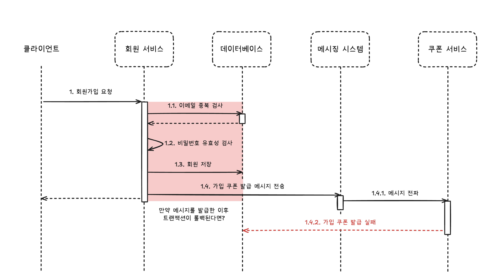

# 5장 비동기 연동, 언제 어떻게 해야 할까?

내가 읽고 이해한 내용을 바탕으로 다시 누군가에게 설명하는 형태로 작성하려고 한다.

- [동기 연동과 비동기 연동](#동기-연동과-비동기-연동)
- [별도 스레드를 이용한 비동기 연동](#별도-스레드를-이용한-비동기-연동)
- [메시징을 이용한 비동기 연동](#메시징을-이용한-비동기-연동)
- [트랜잭션 아웃박스 패턴](#트랜잭션-아웃박스-패턴)
- [배치 전송](#배치-전송)
- [CDC](#cdc)
- [마무리 및 추천 키워드](#마무리)

## 동기 연동과 비동기 연동

새로운 기능을 개발할 때, 실행되는 순서를 먼저 생각할 수 있다. 예를 들어, 회원가입에 성공하면 가입 환영 쿠폰을 발급하는 기능을 개발해야 하는 경우 자연스럽게 아래와 같은 코드를 떠올릴 수 있다.

```java
public void signUp(User user) {
    // 1. 이메일 중복 검사
    if (userRepository.existsByEmail(user.getEmail())) {
        throw new DuplicateEmailException();
    }
    // 2. 비밀번호 유효성 검사
    if (!passwordValidator.isValid(user.getPassword())) {
        throw new InvalidPasswordException();
    }
    // 3. 회원 저장
    userRepository.save(user);
    // 4. 가입 환영 쿠폰 발급
    couponService.issueWelcomeCoupon(user);
}
```


<p style="text-align: center;">(위) 일반적인 동기 연동 과정</p>

이 코드는 전형적인 동기(synchronous) 방식이다. 각 단계가 순차적으로 실행되고, 이전 단계가 완료되어야 다음 단계로 넘어간다. 이메일 중복 검사를 통과해야 비밀번호 유효성 검사를 하고, 비밀번호가 유효해야 회원을 저장하고, 회원이 저장되어야 쿠폰을 발급한다. 마지막으로 쿠폰 발급이 완료되어야 회원가입이 완료된다.

동기 방식은 프로그램의 흐름을 직관적으로 이해할 수 있으며, 디버깅이 수월하다.

하지만 동기 방식이 외부 연동을 만나면 고려할 부분이 많아진다. 예를 들어, 외부(couponService) 연동 실패가 전체 기능의 실패인지 확인해야 한다.

```
- 가입 환영 쿠폰 발급 실패가 회원가입의 실패인가?
- 쿠폰 서비스의 장애가 발생하면 회원가입이 불가능한데 괜찮은가?
- 쿠폰 서비스의 부하가 회원가입에 영향을 미치는데 괜찮은가?
```

이게 맞는지 생각해보면 대부분 그렇지 않다. 가입 환영 쿠폰 발급이 실패해도 회원가입은 성공할 수 있어야 하며, 영향을 최소화해야 한다.

이를 위해 쿠폰 발급에 실패하면 나중에 처리할 수 있도록 지급 실패 내역을 저장해두는 방식으로 구현할 수 있지만, 코드가 다소 복잡해지고 여전히 외부 연동 장애(응답 지연 등)가 회원가입에 영향을 미친다.

다음 작업에 외부 연동 결과가 꼭 필요하지 않다면, 비동기(asynchronous) 연동을 고려할 수 있다. 비동기 연동은 외부 연동이 완료될 때까지 기다리지 않고 다음 작업을 바로 진행한다. 예를 들어, 회원가입 예시에서는 쿠폰 발급이 끝날 때까지 기다리지 않고 회원가입을 완료할 수 있다. 더 빠르게 응답할 수 있다.


<p style="text-align: center;">(위) 별도 스레드를 활용한 비동기 연동 과정</p>

회원가입이 성공한 시점에 쿠폰 발급이 완료되지 않는 것이 문제가 될 것 같지만, 사실 그렇게 큰 문제가 되지 않는다. 쿠폰 발급이 완료되지 않았더라도 회원가입은 성공했기 때문에, 쿠폰 발급이 완료되면 사용자에게 알림을 보내거나 다음 로그인 시점에 지급할 수 있다. 사용자에게 중요한 것은 회원가입의 성공과 쿠폰 지급 여부이지, 쿠폰이 즉시 지급되는 것이 아닌 경우가 많다.

책에서는 아래와 같은 경우에 비동기 방식을 선택해도 큰 문제가 없다고 설명한다.

```
- 쇼핑몰에서 주문이 들어오면 판매자에게 푸시 알림을 보내는 경우
- 학습을 완료하면 학생에게 포인트를 지급하는 경우
- 컨텐츠를 등록할 때 검색 서비스에도 등록하는 경우
- 인증 번호를 요청하면 SMS로 인증 번호를 발송하는 경우
```

예시들의 공통적인 특징은 약간의 시차가 발생해도 큰 문제가 없다는 것이다. 즉시 처리되지 않아도 되는 작업에 비동기 방식을 적용할 수 있다. 또한 실패했을 때 재시도하거나, 실패 내역을 저장해두고 나중에 처리할 수 있다. 나아가 실패했을 때 무시해도 되는 작업도 있다.

다음으로 비동기 연동을 구현하는 5가지 방식을 살펴본다.

## 별도 스레드를 이용한 비동기 연동

가장 쉬운 비동기 연동은 별도 스레드를 이용하는 것이다. 자바에서는 `Thread` 클래스를 이용해 별도 스레드를 생성할 수 있다. 예를 들어, 쿠폰 발급을 별도 스레드에서 처리하도록 구현할 수 있다.

```java
public void signUp(User user) {
    // 1. 이메일 중복 검사
    // 2. 비밀번호 유효성 검사
    // 3. 회원 저장
    userRepository.save(user);
    // 4. 가입 환영 쿠폰 발급 (별도 스레드에서 처리)
    new Thread(() -> couponService.issueWelcomeCoupon(user)).start();
}
```

매번 스레드를 생성하는 대신 스레드 풀을 사용하는 방법도 있다.

```java
private final ExecutorService executorService = Executors.newFixedThreadPool(10);

...

public void signUp(User user) {
    // 1. 이메일 중복 검사
    // 2. 비밀번호 유효성 검사
    // 3. 회원 저장
    userRepository.save(user);
    // 4. 가입 환영 쿠폰 발급 (스레드 풀에서 처리)
    executorService.submit(() -> couponService.issueWelcomeCoupon(user));
}
```

프레임워크가 제공하는 비동기 기능을 활용할 수도 있다. 예를 들어, 스프링에서는 `@Async` 애노테이션을 이용해 비동기 메서드를 쉽게 구현할 수 있다.

```java
public class CouponService {

    @Async
    public void issueWelcomeCoupon(User user) {
        // 쿠폰 발급 로직
    }
}
```

> ### @Async 사용 시 권장 사항 (p. 121)
>
> 저자는 @Async를 사용할 때 메서드 이름에 'Async'를 붙여서 비동기 메서드임을 나타내는 것을 권장한다. 다른 사람이 해당 메서드가 비동기 메서드임을 쉽게 알 수 있기 때문이다. 특히, 비동기 메서드의 예외는 호출한 쪽에서 잡을 수 없기 때문에, 비동기 메서드임을 명확히 알리는 것이 중요하다고 말한다.

## 메시징을 이용한 비동기 연동

메시징 시스템은 서로 다른 시스템 간에 비동기로 연동할 때 주로 사용하는 방식이다.


<p style="text-align: center;">(위) 메시징 시스템 위치</p>

메시징 시스템은 구조가 더 복잡해졌지만, 다른 이점을 제공한다.

두 시스템이 완전히 분리되어 서로 영향을 주지 않는다. 메시지를 보내는 쪽은 메시지를 받는 쪽이 정상적으로 동작하는지 신경 쓰지 않아도 된다. 메시지를 받는 쪽이 다운되더라도 메시지를 보내는 쪽은 계속 동작할 수 있다.

그리고 확장에 용이하다. 새로운 시스템이 추가되어도 기존 시스템에 영향을 주지 않으며, 메시징 시스템에 연결하기만 하면 된다.

> ### 생산자/소비자, 게시자/구독자 (p. 125)
>
> 메시징 시스템에서 사용하는 용어로 생산자(producer)와 소비자(consumer)가 있다. 메시지를 생성해서 메시징 시스템에 본는 측을 생산자. 메시지를 받아서 처리하는 측을 소비자라고 한다.
>
> 메시징 시스템을 사용하는 구조는 게시자/구독자(pub/sub)라고도 표현한다. 메시지를 생성하고 보내는 측을 게시자(publisher). 메시지를 받아서 처리하는 측을 구독자(subscriber)라고 한다.

카프카, 래빗MQ, 레디스 Pub/Sub 등이 메시징 시스템으로 자주 사용된다. 각 기술은 서로 다른 특징을 가지므로 사용 목적에 맞는 기술을 선택해야 한다. 이외에도 클라우드가 제공하는 메시징 시스템도 좋을 수 있다. (AWS SQS 등)

```
- 처리량
- 확장성
- 메시지 순서 보장
- 메시지 중복 허용 여부
- 메시지 영속성
- 운영 편의성
- pull, push 방식 등
```

### 메시지 생성 측 고려 사항

메시지를 생성할 때는 메시지 유실에 대한 고려가 필요하다. 예를 들어 메시지 전송 과정에서 타임아웃이 발생할 수 있다. 타임아웃은 네트워크 문제, 메시징 시스템의 부하 등 다양한 원인으로 발생할 수 있다. 이때 오류 처리를 위해 선택할 수 있는 3가지 방법이 있다.

- 무시한다.
- 재시도한다.
- 실패 로그를 남긴다.

가장 쉬운 방법은 오류를 무시하는 것이다. 말 그대로 유실된 메시지를 신경 쓰지 않는 것이다. 메시지 유실이 큰 문제가 되지 않는 경우에 사용할 수 있다.

두번째 방법은 재시도하는 것이다. 메시지 전송이 실패하면 일정 횟수 재시도한다. 재시도 횟수와 간격을 적절히 설정해야 한다. 너무 자주 재시도하면 시스템에 부하가 될 수 있다. 또한 재시도할 때 메시지 중복이 발생할 수 있으므로, 중복 처리 가능 여부를 확인해야 한다.

메시지마다 고유 식별자를 사용하면 메시지 소비자가 중복 메시지 여부를 판단하는 데 도움이 된다.

마지막 방법은 실패 로그를 남기는 것이다. 로그는 나중에 후처리를 위해 사용된다. 실패 로그는 DB 또는 파일에 남길 수 있을 것이다. 또한 후처리를 위한 데이터를 꼭 가지고 있어야 한다.

메시지 생산자는 DB 트랜잭션과의 연동도 고려해야 한다. DB 트랜잭션을 실패했는데 메시지가 발송되면 문제가 발생할 수 있기 때문이다. 예를 들어, 회원가입 트랜잭션이 실패했는데 쿠폰 발급 메시지가 발송되면, 쿠폰 발급 시스템에서 회원 정보를 찾지 못해 오류가 발생할 수 있다.




<p style="text-align: center;">(위) 메시지와 DB 트랜잭션 연동 문제 (빨간 블록을 트랜잭션 단위로 가정)</p>

잘못된 메시지가 전송되는 문제를 방지하려면 트랜잭션이 끝난 뒤(커밋/롤백)에 메시지를 전송해야 한다.

> ### 글로벌 트랜잭션과 메시지 연동 (p. 129-130)
>
> 여러 DB를 하나의 트랜잭션으로 묶어서 처리할 수 있는 글로벌 트랜잭션(Global Transaction)도 있다. 글로벌 트랜잭션을 구현하는 알고리즘으로 2단계 커밋(2PC, Two-Phase Commit)이 있다.
>
> 모든 메시징 시스템이 글로벌 트랜잭션을 지원하지 않고, 동시에 처리할 수 있는 양이 줄어들게 되기 때문에 반드시 필요한 상황이 아니라면 DB 처리와 메시지 연동을 묶지 않는 것을 권장한다. 만약 DB에 데이터를 반영한 뒤에 유실없이 메시지를 보내고 싶다면 트랜잭션 아웃박스 패턴을 고려해보자.

### 메시지 소비 측 고려 사항

메시지 소비자는 아래 2가지 이유로 동일 메시지를 중복해서 처리할 수 있다.

- 메시지 생산자가 같은 데이터를 가진 메시지를 메시징 시스템에 두 번 이상 전송한 경우
- 소비자가 메시지를 처리하는 과정에서 오류가 발생해서 메시지를 재수신한 경우

수신자 입장에서는 메시지에 고유한 ID를 부여하여 이미 처리했는지 여부를 추적할 수 있다. 이미 처리한 메시지는 무시하면 된다.

```java
while (true) {
    ConsumerRecords<String, String> records = consumer.poll(Duration.ofMillis(100));
    for (ConsumerRecord<String, String> record : records) {
        Message m = messageConverter.convert(record.value());
        if (processedMessageIds.contains(m.getId())) {
            continue; // 이미 처리한 메시지 무시
        }
        handle(m)
        recordHandleLog(m.getId()); // 처리 로그 기록
    }
}
```

이 방식을 사용하려면 메시지 생산자는 메시지마다 고유의 ID를 부여해야 한다.

메시지 처리 여부는 DB 테이블에 기록하거나 메모리에 Set으로 관리할 수 있다. 이때 메모리 초과를 막기 위해 일정 개수 또는 일정 기간이 지난 ID는 제거하는 것이 좋다.

메시지 재수신이 가능한 경우 소비자가 메시지를 처리하는 과정에서 오류가 발생하면 재처리를 위해 메시지를 다시 수신할 수 있다. 예를 들어 메시지 처리를 위해 외부 API를 호출했는데 읽기 타임아웃이 발생한 경우 소비자는 메시지 처리에 실패했다고 생각하여 메시징 시스템으로부터 같은 메시지를 다시 수신하여 재시도할 수 있다. 하지만 실제로는 외부 API가 정상적으로 처리되었을 수 있다. 이 경우 동일 메시지를 중복 처리하게 된다.

메시지 재수신에 따른 중복 처리를 대응하는 방법은 API가 멱등성을 가지도록 구현하는 것이다.

메시지를 잘 소비하고 있는지 모니터링하는 것도 중요하다. 메시지 소비자가 다운되거나 메시지 처리가 느려지면 메시지가 쌓이게 된다. 메시지 적체는 시스템 장애로 이어질 수 있으므로, 적체 여부를 모니터링하고 적체가 심해지기 전에 알림을 받도록 설정하는 것이 좋다.

### 메시지 종류: 이벤트와 커맨드

메시지는 크게 이벤트(event)와 커맨드(command)로 나눌 수 있다.

| 이벤트                                                                         | 커맨드                                                                  |
| :----------------------------------------------------------------------------- | :---------------------------------------------------------------------- |
| 어떤 일이 발생했음을 알리는 메시지                                             | 어떤 일을 수행하라는 요청 메시지                                        |
| - 주문함 <br> - 로그인에 실패함 <br> - 상품 정보를 조회함 <br> - 배송을 완료함 | - 포인트 지급하기 <br> - 로그인 차단하기 <br> - 배송 완료 문자 발송하기 |

이벤트는 과거 시점에 발생한 일을 알리는 메시지이다. 데이터의 변경이나 사용자의 활동을 알리는 데 주로 사용된다. 이벤트는 발생 사실을 알리는 것이 목적이다. 이벤트는 특정 수신자가 정해져 있지 않기 때문에 소비자 확장에 유리하다.

반면 커맨드는 어떤 일을 수행하라는 요청 메시지이다. 커맨드는 반드시 처리되어야 한다. 예를 들어, 포인트 지급하기 커맨드를 수신하는 쪽에서 포인트를 지급하지 못하면 사용자가 손해를 보기 때문에 반드시 처리되어야 한다. 즉 커맨드는 정해진 수신자가 존재한다.

> ### 궁극적 일관성(eventual consistency) (p. 133)
>
> 최종적 또는 결과적 일관성이라고도 한다. 주로 분산 시스템에서 데이터 복제를 다룰 때 사용된다. 두 데이터 저장소 간의 일관성을 보장하긴 하지만, 즉시가 아닌 일정 시간이 지난 후에야 일관성이 맞춰진다는 특징을 가진다.
>
> 비동기 메시징 방식도 이 궁극적 일관성과 유사한 특성을 갖는다. 예를 들어, 회원가입이 완료된 후에 쿠폰 발급 메시지를 보내면, 쿠폰 발급이 완료되는 시점은 회원가입이 완료된 시점과 다를 수 있다. 즉시 일관성이 아닌 궁극적 일관성을 갖는다.

## 트랜잭션 아웃박스 패턴

앞서 잘못된 메시지 발송을 막기 위해 트랜잭션이 끝난 뒤에 메시지를 전송해야 한다고 했다. 하지만 이 방식은 메시지 유실 문제가 발생할 수 있다. 예를 들어, 회원가입 트랜잭션이 커밋된 후에 쿠폰 발급 메시지를 보내는 과정에서 네트워크 장애가 발생하면 메시지가 유실될 수 있다.

트랜잭션 아웃박스 패턴(Transaction Outbox Pattern)은 메시지 유실 문제를 해결하는 방법이다. 메시지 생산자가 DB 트랜잭션과 메시지 전송을 하나의 트랜잭션으로 묶지 않고도 메시지 유실 문제를 해결할 수 있다.

트랜잭션 아웃박스 패턴은 하나의 DB 트랜잭션 내에서 2가지 작업을 수행한다.

- 실제 업무 로직에 필요한 DB 변경 작업을 수행한다.
- 메시지 데이터를 아웃박스 테이블에 추가한다.

아웃박스 테이블에 쌓인 메시지 데이터는 별도의 메시지 중계 프로세스가 주기적으로 읽어서 메시징 시스템에 전송한다.

DB 트랜잭션 범위에서 아웃박스 테이블에 메시지 데이터를 추가하기 때문에 메시지 유실 문제를 해결할 수 있다. 트랜잭션이 커밋되면 아웃박스 테이블에 메시지 데이터가 반드시 저장된다. 롤백되는 경우에는 메시지 데이터가 저장되지 않기 때문에 잘못된 메시지 발송 문제도 해결할 수 있다.

아웃박스 테이블에는 ID, 메시지, 상태, 시간(메시지 발생, 처리, 실패 등), 재시도 횟수 등을 기록한다.

- 상태 컬럼 대신 중계 서비스가 마지막으로 처리한 메시지 ID를 저장하는 방법도 있다.
- 상태 컬럼을 활용하여 처리되지 않은 메시지만 조회하거나, 재시도 횟수를 활용하여 일정 횟수 이상 실패한 메시지는 별도로 처리할 수 있다.

## 배치 전송

데이터를 비동기로 연동하는 가장 전통적인 방법이라고 할 수 있다. 메시지 시스템이 거의 실시간으로 데이터를 연동한다면, 배치 전송은 일정 시간 간격으로 데이터를 모아서 한꺼번에 전송한다.

배치의 전형적인 과정은 아래와 같다.

1. DB에서 전송할 데이터를 조회한다.
2. 조회한 데이터를 파일로 저장한다.
3. 파일을 연동 대상 시스템에 전송한다.

파일 전송이라면 FTP, SFTP, SCP 등을 사용할 수 있다. 클라우드 환경이라면 S3, GCS, Azure Blob Storage 등을 사용할 수도 있다.

지정한 시간에 전송하지 못할 때가 있다. 이때 재처리 기능을 구현되어 있다면 번거로움을 많이 줄일 수 있다고 한다.

## CDC

CDC(Change Data Capture)는 변경된 데이터를 추적하고 판별해서 변경된 데이터로 작업을 수행할 수 있도록 하는 소프트웨어 설계 패턴이라고 한다.

오라클이나 MySQL 같은 DBMS는 데이터가 변경되면 그 변경 내용을 통지하는 기능을 제공한다. CDC는 이 기능을 활용해서 구현한다. CDC 패턴에서는 3개의 컴포넌트가 필요하다. (DB, CDC 프로세스, 대상 시스템)

INSERT, UPDATE, DELETE 같은 DML이 실행되면 DB는 변경 내용을 CDC 프로세스에 통지한다. CDC 프로세스는 변경 내용을 판별해서 대상 시스템에 전송한다.

- CDC 프로세스에는 롤백된 데이터가 전달되지 않으며, 잘못된 순서로 전달되지 않는다고 한다.
- 변경 데이터는 레코드 단위로 전달된다. 예를 들어, 1개 레코드를 추가하고 2개 레코드를 수정한 다음 3개 레코드를 삭제했다면 6개의 변경 데이터가 전달된다. 이때 어떤 작업인지 알 수 있는 플래그를 함께 전달한다.

> ### Tip.
>
> 애플리케이션이 직접 변경 내용을 추적하는 것이 아니라 DBMS가 제공하는 변경 내용을 활용하기 때문에, 애플리케이션에 부하를 주지 않고도 변경 내용을 정확하게 추적할 수 있다고 한다.

목적에 따라 CDC 프로세스는 DB, 메시징 시스템, API 등 다양한 대상에 데이터를 전파할 수 있다.

- 두 시스템 간 데이터 동기화가 목적이라면 DB와 DB 사이에 CDC를 적용할 수 있다.
- 메시징 시스템을 결합하면 여러 시스템에 변경 데이터를 전파할 수 있다.

# 마무리

생각보다 많은 부분에서 비동기 연동을 사용할 수 있을 것 같다. 비동기 연동을 사용하면 사용자에게 더 빠른 응답을 제공할 수 있고, 시스템 간 결합도를 낮출 수 있으며, 확장에 유리한 것 같다. 단점들은 개발자의 노하우로 극복할 수 있을 것처럼 느껴지면서 재밌어 보인다.

아래는 Gemini가 추천해준 목차별 키워드이다.

## 1. 동기(Sync) vs 비동기(Async)

Blocking I/O vs Non-Blocking I/O: 동기와 비동기 동작의 가장 근본적인 운영체제(OS) 및 네트워크 레벨의 개념입니다.

처리량 (Throughput) & 지연 시간 (Latency): 비동기 방식 도입이 시스템 전체의 성능(처리량)과 사용자 응답 시간(지연 시간)에 어떤 영향을 주는지 설명하는 핵심 지표입니다.

느슨한 결합 (Loose Coupling): 비동기 연동이 시스템 간의 의존성을 어떻게 낮춰주는지 설명하는 중요한 아키텍처 원칙입니다.

## 2. 별도 스레드 / @Async

ThreadPoolTaskExecutor: Spring에서 @Async를 사용할 때 반드시 직접 설정해야 하는 스레드 풀 구현체입니다. (자원 고갈 방지)

CompletableFuture (Java): 비동기 작업의 결과를 조합하거나 예외를 처리하는 등, 단순 Thread 실행보다 훨씬 정교한 비동기 프로그래밍을 가능하게 하는 클래스입니다.

우아한 종료 (Graceful Shutdown): 애플리케이션 종료 시, 실행 중이던 비동기 작업이 유실되지 않고 안전하게 마무리될 수 있도록 처리하는 기법입니다.

## 3. 메시징 시스템

### 메시지 생성 (Producer) 측면

At-least-once Delivery (최소 한 번 전송 보장): 메시징 시스템에서 가장 일반적인 메시지 전송 보장 수준으로, 유실은 없지만 중복은 발생할 수 있다는 의미입니다.

지수 백오프 (Exponential Backoff): 메시지 전송 실패 시, 재시도 간격을 점진적으로 늘려 대상 시스템의 과부하를 막는 스마트한 재시도 전략입니다.

서킷 브레이커 (Circuit Breaker) 패턴: 메시징 시스템이나 연동 대상에 장애가 발생했을 때, 추가적인 요청을 즉시 차단하여 시스템 전체의 안정성을 확보하는 패턴입니다.

### 메시지 소비 (Consumer) 측면

멱등성 (Idempotency): 동일한 요청을 여러 번 수행해도 결과가 항상 같은 특성입니다. 메시지 중복 처리 문제의 핵심 해결책입니다.

데드 레터 큐 (Dead Letter Queue, DLQ): 반복적으로 처리에 실패하는 메시지를 격리하여 별도로 보관하는 큐입니다. 전체 시스템의 장애 전파를 막고 문제 분석을 용이하게 합니다.

컨슈머 렉 (Consumer Lag): 메시지 처리 속도가 생산 속도를 따라가지 못해 큐에 쌓여있는 메시지의 양. 메시징 시스템의 핵심 모니터링 지표입니다.

### 메시지 종류

이벤트 기반 아키텍처 (Event-Driven Architecture, EDA): '이벤트'를 시스템의 핵심 통신 매개체로 사용하는 아키텍처 스타일입니다.

CQRS (Command Query Responsibility Segregation): 상태를 변경하는 '커맨드'와 데이터를 조회하는 '쿼리'의 책임을 분리하는 패턴으로, 이벤트 기반 시스템과 자주 함께 사용됩니다.

## 4. 트랜잭션 아웃박스 패턴

폴링 발행기 (Polling Publisher): 스케줄러를 이용해 주기적으로 아웃박스 테이블을 조회(Polling)하여 메시지를 발행하는 가장 일반적인 '메시지 중계기' 구현 방식입니다.

이중 쓰기 문제 (Dual Write Problem): 단일 트랜잭션 내에서 두 개 이상의 외부 시스템(e.g., DB와 메시지 큐)에 데이터를 일관성 있게 써야 할 때 발생하는 고전적인 문제입니다. 아웃박스 패턴이 이 문제의 효과적인 해결책입니다.

## 5. CDC (Change Data Capture)

트랜잭션 로그 마이닝 (Transaction Log Mining): CDC가 데이터베이스의 **트랜잭션 로그(e.g., MySQL의 Binlog)**를 직접 읽어 변경분을 감지하는 핵심 동작 원리입니다.

Debezium: Kafka Connect 기반의 대표적인 오픈소스 CDC 도구입니다.

데이터 복제 (Data Replication): CDC의 주요 사용 사례 중 하나로, 운영 DB의 데이터를 분석용 데이터 웨어하우스(DW)나 검색 엔진으로 실시간 복제하는 것을 의미합니다.
