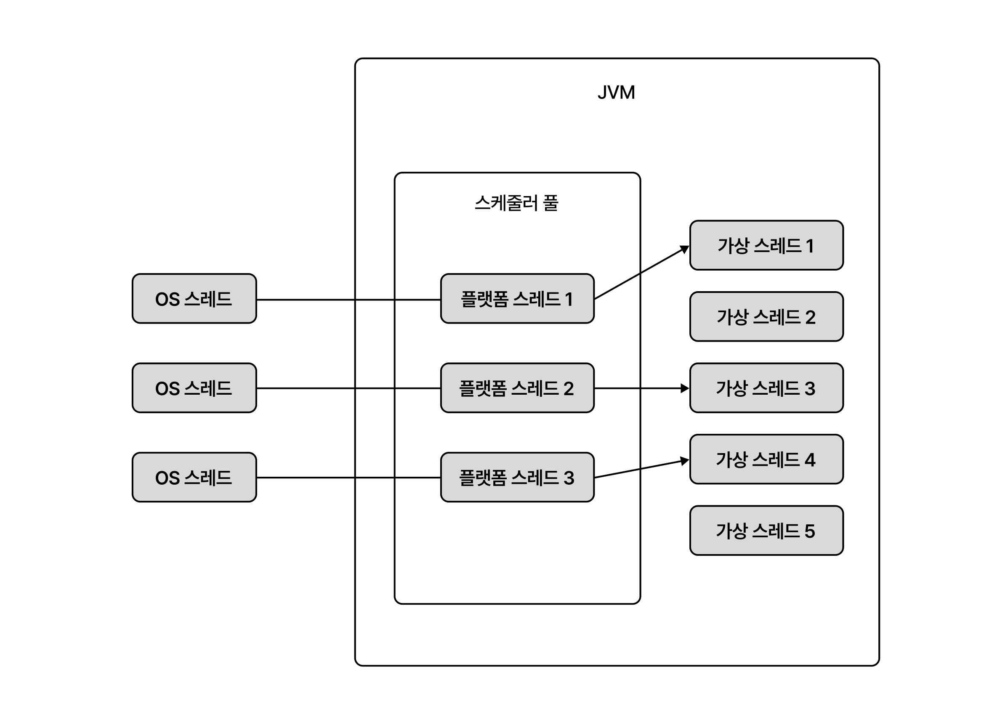
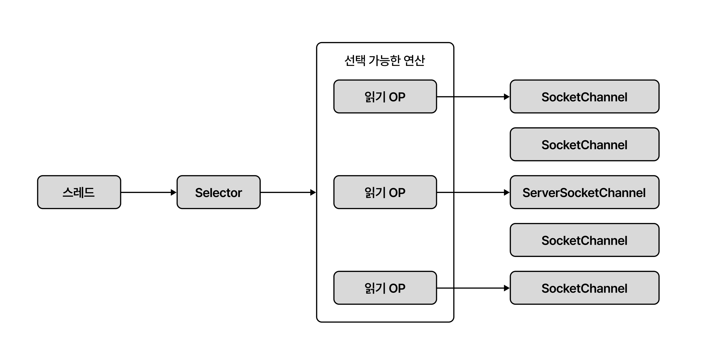

# IO 병목, 어떻게 해결하지

- [네트워크 IO와 자원 효율](#네트워크-io와-자원-효율)
- [가상 스레드로 자원 효율 높이기](#가상-스레드로-자원-효율-높이기)
- [논블로킹 IO로 성능 더 높이기](#논블로킹-io로-성능-더-높이기)
- [언제 어떤 방법을 택할까](#언제-어떤-방법을-택할까)

## 네트워크 IO와 자원 효율

많은 서버는 네트워크 통신을 기반으로 동작한다.
클라이언트의 요청, 데이터베이스 접근, 외부 API 호출 등 다양한 작업이 네트워크 IO를 포함한다.
물론 서버 개발자가 직접 네트워크 프로그램을 작성하는 경우는 드물지만, 네트워크 IO가 병목이 되는 상황을 이해하고 적절히 대응하는 것은 중요하다.

네트워크를 통해 데이터를 주고받는 과정은 간단하게 아래처럼 표현할 수 있다.

```java
outputStream.write(...); // 출력 스트림으로 데이터 보내기
inputStream.read(...); // 입력 스트림으로 데이터 받기
```

SELECT 쿼리를 실행한다고 가정해보자.
서버는 데이터베이스와 연결된 출력 스트림을 이용해 쿼리문을 전송하고, 데이터베이스가 보내는 데이터를 입력 스트림으로 받는다.
이 과정에서 스레드의 상태를 살펴보면 다음과 같다.

```
- 코드 실행
- write() 호출
- 스레드 대기(데이터 전송)
- write() 반환
- 코드 실행 -> read() 호출
- 스레드 대기(데이터 수신)
- read() 반환
- 코드 실행
```

데이터 입출력이 완료될 때까지 스레드는 아무 작업도 하지 않고 끝나기를 기다린다.
이를 스레드가 블로킹(blocking)되었다고 표현한다.
보통 입출력에 소요되는 시간은 코드를 실행하는 시간보다 훨씬 길다.
네트워크 연동이 많은 프로그램이라면 전체 처리 시간의 대부분이 네트워크 IO에 소요될 수 있다.

> ### 블로킹(blocking)
>
> 작업이 완료될 때까지 스레드가 대기하는 것을 의미한다. 주로 데이터 입출력 과정에서 발생하기 때문에 이런 방식을 블로킹 IO라고도 한다.

스레드가 대기한다는 것은 그 스레드를 실행하는 CPU도 아무것도 하지 않는다는 뜻이다.
CPU 사용률을 높이려면 CPU가 일을 할 수 있도록 많은 스레드를 준비하면 된다.
스프링 MVC처럼 요청당 스레드(thread per request) 방식으로 구현한 서버라면 동시에 실행되는 스레드 수를 늘려 IO 대기에 따른 CPU 낭비를 줄일 수 있다.

그러나 스레드 수를 무한정 늘릴 수는 없다.
스레드는 수백 KB에서 수 MB에 이르는 메모리를 사용한다.
요청당 스레드 방식으로 구현된 웹소켓 서버에 1만 명의 사용자가 동시에 접속한다면, 스레드 1만 개를 생성하는 것만으로 수 GB의 메모리가 필요하다.
즉, 사용자 증가가 곧바로 메모리 부족으로 이어질 수 있다는 것이다.

메모리를 늘린다면 해결될 것 같지만, 여전히 한계가 있다.
동시에 실행되는 스레드가 증가하면 컨텍스트 스위칭(context switching)에 사용되는 시간도 증가한다.

> ### 컨텍스트 스위칭(context switching)
>
> OS는 여러 스레드를 번갈아 가면서 CPU에 할당한다. 한 스레드를 아주 짧은 시간 동안 실행하고 다음 스레드를 실행하는 식이다.
> CPU가 스레드를 전환하려면 현재 실행 중인 스레드의 상태를 저장하고 다음에 실행할 스레드의 상태를 복원해야 한다.
> 이렇게 스레드를 전환하는 과정을 컨텍스트 스위칭이라고 한다.
>
> 컨텍스트 스위칭에 들어가는 시간은 매우 짧지만(마이크로초 단위) 컨텍스트 스위칭을 하는 동안 CPU는 실질적인 작업을 수행하지 않기 때문에 과도한 스레드 수는 오히려 전체 처리량을 저하시킬 수 있다.
> (스레드 수가 증가할수록 각 스레드가 CPU를 다시 할당받기까지의 대기 시간도 함께 늘어난다.)

정리하면 `IO 대기와 컨텍스트 스위칭에 따른 CPU 낭비`와 `요청당 스레드 방식에 따른 메모리 사용량 증가`를 이유로 자원 효율이 떨어지게 된다.

저자는 다수의 서비스는 서버의 자원 낭비를 걱정할 정도로 트래픽이 많지 않기 때문에 트래픽이 증가하면 처리량을 더 높이기 위한 방법을 고민하면 된다고 말한다.
가장 쉬운 방법은 수직 또는 수평 확장이지만 비용과 직결되는 것을 고려해야 한다.

서버 성능을 높이는 또 다른 방법은 자원 효율을 높이는 것이다.
IO 대기로 인한 CPU 낭비를 줄이고, 요청을 처리하는 데 필요한 메모리 사용량을 낮추는 방법들을 고민할 수 있다.
- 가상 스레드나 고루틴 같은 경량 스레드 사용
- 논블로킹 또는 비동기 IO 사용

> ### Tip.
>
> 성능을 높이겠다고 처음부터 비동기 IO를 도입하는 것은 권장하지 않는다. 실제로 IO 성능을 높여야 할만큼 트래픽이 증가하고 있거나 예상 트래픽이 충분히 높을 때 도입을 고려하자.

## 가상 스레드로 자원 효율 높이기

코드를 블로킹 IO로 작성하고 입출력 동안 스레드가 대기하지 않고 다른 일을 할 수 있다면 자원 효율이 높아져 더 많은 요청을 처리할 수 있을 것이다.
이처럼 특별한 노력 없이 CPU 효율을 높일 수 있는 방법이 자바의 가상 스레드나 Go의 고루틴이다.

언어는 다르지만, 가상 스레드와 고루틴은 경량 스레드라는 공통점이 있다.
경량 스레드는 OS가 관리하는 스레드가 아니라 JVM 같은 언어의 런타임이 관리하는 스레드다.
OS가 CPU로 스레드를 스케줄링하듯, 언어 런타임이 OS 스레드로 실행할 경량 스레드를 스케줄링한다.

책에서는 자바를 기준으로 설명하고 있으므로 가상 스레드를 중심으로 살펴보자.



JVM은 OS 스레드에 1:1로 매핑되는 플랫폼 스레드로 구성된 스레드 풀을 관리한다.
CPU가 OS 스케줄러에 의해 여러 스레드를 번갈아 실행하는 것처럼 플랫폼 스레드도 JVM 스케줄러에 의해 여러 가상 스레드를 번갈아 실행한다.
JVM은 기본적으로 풀에 CPU 코어 수만큼 플랫폼 스레드를 생성하고 필요에 따라 플랫폼 스레드 수를 늘린다.

가상 스레드를 경량 스레드라고 부르는 이유는 플랫폼 스레드보다 더 작은 자원을 사용하기 때문이다.
간단한 비교로도 자원 효율이 얼마나 높은지 알 수 있다.

- 1만 개의 플랫폼 스레드를 생성 (스레드당 1MB 사용 시 약 10GB 메모리 사용)
- 1만 개의 가상 스레드를 생성 (스레드당 20KB 사용 시 약 20MB 메모리 사용)

> ### 가상 스레드와 메모리
>
> 가상 스레드는 수백 바이트에서 수 KB~수십 KB 정도의 힙 메모리를 사용한다.
> 호출 스택의 깊이에 따라 사용하는 메모리를 동적으로 늘렸다가 줄인다.

스레드를 생성하는 시간도 차이가 많이 나는데, 책에서는 10만 개 기준 약 100배 정도 차이가 난다고 한다.

- 플랫폼 스레드: 21,467 ms
- 가상 스레드: 196 ms

> ### 캐리어 스레드(carrier thread)
>
> 가상 스레드를 실행하는 플랫폼 스레드를 캐리어 스레드라고 표현한다.
> CPU가 여러 스레드를 실행하는 것처럼, 한 개의 캐리어 스레드도 여러 가상 스레드를 실행하게 된다.
> 특정 캐리어 스레드에 연결되는 것을 마운트되었다고 표현한다.
> 가상 스레드가 캐리어 스레드에 마운트되면 실행되는 것이고, 반대로 가상 스레드가 캐리어 스레드에서 언마운트되면 실행을 멈춘다.

### 네트워크 IO와 가상 스레드

가상 스레드는 실행되는 과정에서 블로킹되면 플랫폼 스레드로부터 언마운트되어 실행이 멈춘다.
이때 언마운트된 플랫폼 스레드는 실행 대기 중인 다른 가상 스레드와 연결된 뒤 실행을 재개한다.

> ### 블로킹 연산과 synchronized
>
> IO 기능, ReentrantLock, Thread.sleep() 등은 모두 블로킹 연산이다.
> 블로킹 연산으로 가상 스레드가 블로킹되면 플랫폼 스레드는 대기 중인 다른 가상 스레드를 실행한다.
> 반면 자바 23 또는 이전 버전에서 synchronized 키워드로 동기화한 블록이나 메서드에 진입하려고 하면 가상 스레드는 블로킹되지만 플랫폼 스레드는 언마운트되지 않는다. 
> 이를 고정됐다고 표현한다.
>
> 버전마다 유의할 점이 다를 수 있으므로 사용할 때는 공식문서를 참고하자.

### 가상 스레드와 성능

가상 스레드는 IO 바운드 작업일 때 성능이 크게 향상된다.
반대로 CPU 바운드 작업일 때는 성능 개선 효과가 거의 없거나 오히려 저하될 수 있다.

이미지를 처리하는 코드에는 블로킹 연산이 없다. (CPU 바운드 작업)
블로킹 연산이 없으므로 언마운트되는 일이 없고, 가상 스레드가 플랫폼 스레드에 계속 마운트된 상태로 실행된다.
즉, 플랫폼 스레드는 계속 1개의 가상 스레드만 실행하게 된다.

IO 바운드 작업이라고 해서 무조건 가상 스레드가 성능을 높여주는 것은 아니다.
스케줄링에 사용되는 플랫폼 스레드 개수보다 가승 스레드의 개수가 많아야 효과를 기대할 수 있다.

가상 스레드를 사용해서 높일 수 있는 것은 처리량이다.
가상 스레드를 사용한다고 해서 실행 속도가 플랫폼 스레드보다 빨라지지 않는다.
결국 같은 CPU에서 실행되기 때문이다.

> ### 가상 스레드와 스레드 풀
>
> 요청당 스레드 방식을 사용하는 서버는 스레드 풀을 사용할 때가 많다.
> 미리 생성한 스레드를 재사용하여 스레드 생성에 드는 오버헤드를 줄이기 위해서다.
> 또한, 동시에 실행되는 스레드 수를 제한하여 포화 상태를 방지하는 효과도 있다.
>
> 가상 스레드는 플랫폼 스레드보다 생성 비용이 훨씬 적기 때문에 스레드 풀을 미리 준비할 필요가 없다.
> 필요한 시점에 가상 스레드를 생성하고 필요 없으면 제거하면 된다.

### 가상 스레드의 중요한 장점

가상 스레드의 중요한 장점은 기존 코드를 거의 수정하지 않고도 자원 효율을 높일 수 있다는 것이다.
스프링 프레임워크나 MySQL JDBC 드라이버 같은 주요 라이브러리는 가상 스레드를 지원한다.
따라서 조금만 신경을 쓴다면 기존 코드를 거의 수정하지 않고도 가상 스레드를 도입하여 자원 효율을 높일 수 있다.

## 논블로킹 IO로 성능 더 높이기

가상 스레드 같은 경량 스레드를 사용하면 IO 바운드 작업을 하는 서버의 처리량을 높일 수 있다.
하지만 경량 스레드 자체도 메모리를 사용하고 스케줄링이 필요하다.
경량 스레드가 많아질수록 메모리 사용량과 스케줄링 오버헤드도 증가한다.

사용자가 폭발적으로 증가하면 경량 스레드로도 감당하기 어려울 수 있다.
이때는 서버의 IO 구현 방식을 논블로킹 IO로 바꾸는 방법을 고려할 수 있다.

논블로킹 IO는 새로운 것이 아니며, 오래 전부터 네트워크 서버의 성능을 높이기 위해 사용되어 왔다.
여기에 비동기 API를 사용하면 덜 복잡하게 높은 성능을 기대할 수 있다.

### 논블로킹 IO 동작 개요

입출력이 끝날 때까지 스레드가 대기하지 않는다는 점이 논블로킹 IO의 핵심이다.

```java
// channel: SocketChannel, buffer: ByteBuffer
int bytesRead = channel.read(buffer); // 데이터를 읽을 때까지 대기하지 않음
// 읽은 데이터가 없어도 다음 코드 계속 실행
```

위 코드에서 channel.read(buffer)는 데이터를 읽을 때까지 대기하지 않는다.
읽을 데이터가 없으면 바로 0을 반환하고 다음 코드를 계속 실행한다.

데이터를 조회했는지 여부에 상관없이 대기하지 않고 바로 다음 코드를 실행하므로 블로킹 IO처럼 데이터를 조회했다는 가정하에 코드를 작성할 수 없다.
대신 루프 안에서 조회를 반복해서 호출한 뒤 데이터를 읽었을 때만 처리하는 방식으로 구현할 수 있다.

```java
while (true) {
    int bytesRead = channel.read(buffer);
    if (bytesRead > 0) {
        // 읽은 데이터 처리
        break;
    }
    // 읽은 데이터가 없으면 다른 작업 수행
}
```

그러나 위 코드처럼 작성하면 CPU 낭비가 심하다.
읽은 데이터가 없어도 while 루프가 무한히 실행되기 때문이다.
실제로 논블로킹 IO를 사용할 때는 read() 호출을 바로 시도하기보다는 어떤 연산을 수행할 수 있는지 확인하고 해당 연산을 실행하는 방식으로 구현한다.

1. 실행 가능한 IO 연산 목록을 구한다.
2. 1에서 구한 IO 연산 목록을 차례대로 순회한다.  
    A. 각 IO 연산을 처리한다.
3. 이 과정을 반복한다.

Selector 같은 API를 사용하면 실행 가능한 IO 연산 목록을 쉽게 구할 수 있다.
Selector#select() 메서드를 호출하면 실행 가능한 IO 연산이 있을 때까지 대기한 뒤, 실행 가능한 IO 연산 목록을 반환한다.
이 메서드가 반환되면 실행 가능한 IO 연산이 있다는 뜻이므로, 해당 연산을 처리하면 된다.
실행 가능한 연산 목록은 Selector#selectedKeys() 메서드로 구할 수 있다.



> ### Selector
>
> busy-wait 없이 IO 준비 상태를 알려주는 도구라고 생각하면 된다.
> Selector는 여러 채널의 IO 준비 상태를 감시할 수 있다.
> 채널을 Selector에 등록해두면, Selector가 해당 채널의 IO 준비 상태를 감시한다.
> 채널에서 읽기 또는 쓰기 작업을 수행할 준비가 되면 Selector가 알려준다.
>
> 앞서 살펴본 while 루프는 “읽을 데이터 있어?” 계속 물어보는 busy-wait 방식이었고, Selector는 “읽을 수 있을 때만 나 불러줘”라고 부탁하는 방식이다.

일반적으로 블로킹 IO로 구현한 서버는 커넥션별로(또는 요청별로) 스레드를 할당한다.
동시 연결 클라이언트가 1,000개면 스레드도 1,000개가 필요하다.
반면 논블로킹 IO로 구현한 서버는 소수의 스레드로 많은 커넥션을 처리할 수 있다.
즉, 동시 접속하는 클라이언트가 증가해도 스레드 개수는 일정하게 유지된다. (같은 메모리로 더 많은 연결을 처리할 수 있다.)

> ### IO 멀티플렉싱(IO multiplexing)
>
> 우리말로 IO 다중화는 단일 이벤트 루프에서 여러 IO 작업을 처리하는 개념을 표현할 때 사용한다.
> 논블로킹 IO와 Selector를 이용한 입출력 처리가 IO 멀티플렉싱에 해당한다.
> OS에 따라 epoll(리눅스), IOCP(윈도우) 같은 IO 멀티플렉싱을 지원하는 API가 있다.

논블로킹 IO를 1개 스레드로 구현하면 동시성이 떨어진다.
동시성을 높이기 위해서 채널들을 N개 그룹으로 나누고, 각 그룹마다 스레드를 생성하는 방법을 사용한다.
보통 CPU 개수만큼 그룹을 나누고 각 그룹마다 입출력을 처리할 스레드를 할당한다.

### 리액터 패턴

리액터 패턴은 논블로킹 IO를 이용해서 구현할 때 자주 사용하는 패턴 중 하나다.

리액터 패턴은 동시에 들어오는 여러 이벤트를 처리하기 위한 이벤트 처리 방법이다.
크게 리액터와 핸들러 두 가지 구성 요소로 이루어진다.

- 리액터는 이벤트가 발생할 때까지 대기하다가 이벤트가 발생하면 알맞은 핸들러에 이벤트를 전달한다.
- 핸들러는 리액터로부터 전달받은 이벤트를 처리한다.

```java
while (isRunning) {
    List<Event> events = getEvents(); // 이벤트가 발생할 때까지 대기
    for (Event event : events) {
        Handler handler = getHandler(event); // 이벤트를 처리할 핸들러 구함
        handler.handle(event); // 핸들러가 이벤트 처리함
    }
}
```

리액터는 이벤트를 대기하고 핸들러에 전달하는 과정을 반복하는 것을 볼 수 있다.
그래서 이벤트 루프(event loop)라고도 부른다.

리액터 패턴에서 이벤트 루프는 단일 스레드로 실행된다.
멀티 코어를 가진 서버에서 단일 스레드만 사용하면 처리량을 높이기 어렵다.
또 핸들러에서 CPU 연산이나 블로킹을 유발하는 연산을 수행하면 그 시간만큼 전체 이벤트 처리 시간이 지연된다.
이런 한계를 보완하기 위해 핸들러나 블로킹 연산을 별도 스레드 풀에서 실행하기도 한다.

### 논블로킹/비동기 IO와 성능

자세한 수치는 p.206에서 볼 수 있다.
상황마다 다르겠지만, 동시 접속자가 많아질수록 논블로킹/비동기 IO의 성능이 더 뛰어나다는 것을 알 수 있다.

## 언제 어떤 방법을 택할까

- 문제가 실제로 존재하는가?
    - 응답 시간이 느리거나 처리량이 부족한가?
    - 트래픽 증가 시 CPU, 메모리, 스레드 수가 빠르게 증가하는가?
	- 문제가 명확하지 않다면 IO 모델 변경보다 병목 분석이 우선이다.
- 문제가 네트워크 IO로 인한 것인가?
	- 전체 처리 시간 중 IO 대기 비중이 높은가?
	- DB, 외부 API 호출로 인해 스레드가 자주 블로킹되는가?
	- 클라이언트와의 연결이 장시간 유지되는 구조인가? (SSE, WebSocket 등)
- 연결 특성과 트래픽 형태는 어떠한가?
	- 요청이 짧고 연결이 빠르게 종료되는가?
	- 동시 연결 수가 많고 연결이 오래 유지되는가?
- 구현 변경이 가능한가?
	- 기존 코드가 블로킹 IO(JDBC, RestTemplate 등)에 강하게 의존하는가?
	- 프레임워크 전환(WebFlux 등)이 현실적인가?
	- 디버깅 및 운영 복잡도를 감당할 수 있는가?
