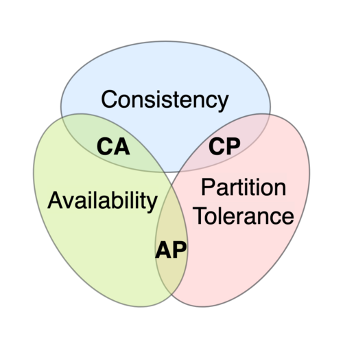

# 부록 B NoSQL 이해하기

- [NoSQL이란?](#nosql이란)
- [NoSQL을 사용하는 주된 이유](#nosql을-사용하는-주된-이유)
- [NoSQL의 종류](#nosql의-종류)
- [NoSQL 도입 시 고려 사항](#nosql-도입-시-고려-사항)
- [CAP 정리](#cap-정리)
- [마무리](#마무리)

## NoSQL이란?

서비스가 다루는 데이터의 성격이 다양해지면서, 데이터를 저장하고 조회하는 방식 또한 하나의 패러다임으로는 충분하지 않게 되었다.

RDBMS로도 많은 요구사항을 처리할 수 있지만,

- 관계 탐색이 중요한 경우
- 대규모 데이터를 여러 노드에 분산 저장해야 하는 경우
- 스키마가 자주 바뀌거나 비정형 데이터가 많은 경우

이처럼 특정 요구사항에 더 적합한 데이터베이스 모델이 존재한다.
이처럼 관계형 모델이 아닌 다양한 데이터 모델을 사용하는 데이터베이스를 통칭하여 NoSQL이라고 부른다.

> ### Non-SQL, Not only SQL (p.330)
>
> 초기에는 SQL을 사용하지 않는다는 의미에서 Non-SQL로 불렸지만, 시간이 지나며 SQL과 함께 사용되거나 SQL과 유사한 쿼리 언어를 제공하는 NoSQL도 등장했다.
> 현재는 “SQL만이 유일한 해법은 아니다”라는 의미의 Not only SQL로 이해하는 것이 더 적절하다.

## NoSQL을 사용하는 주된 이유

### 1. 대용량 데이터와 수평 확장

일부 NoSQL은 처음부터 분산 환경을 전제로 설계되었다.
단일 장비의 성능을 키우는 수직 확장보다, 여러 노드를 추가하는 수평 확장을 통해 데이터 양과 트래픽 증가에 대응한다.

### 2. 고속의 읽기/쓰기 처리

NoSQL은 높은 처리량을 위해 다음과 같은 선택을 하는 경우가 많다.

- 강한 트랜잭션(ACID) 일부 포기
- 인덱스 최소화
- 메모리 친화적인 자료구조 사용
- Append-only write, LSM-tree 기반 구조 등

즉, 정합성의 일부를 양보하는 대신 처리 성능과 확장성을 얻는 선택이다.

### 3. 특정 요구사항에 최적화된 데이터 모델

NoSQL은 하나의 범용 모델이 아니라, 용도별로 특화된 데이터 모델을 제공한다.

- Key-Value
- Document
- Column-Family
- Graph

### RDBMS 샤딩과 NoSQL 클러스터의 차이

RDBMS도 샤딩을 통해 수평 확장이 가능하다.
하지만 이 방식은 NoSQL의 클러스터와 본질적으로 다르다.

**RDBMS 샤딩의 특징**

- 여러 개의 독립된 데이터베이스
- 샤딩 키 계산과 라우팅을 애플리케이션이 인지
- 각 DB는 “전체 중 일부를 맡고 있다”는 사실을 모름

즉, DB 하나가 장애 나면 그 DB가 가진 데이터는 그대로 사용할 수 없게 된다.

**NoSQL 클러스터의 특징**

NoSQL 클러스터는 개념적으로 하나의 데이터베이스처럼 동작한다.

그 이유는 데이터의 소유권과 책임 구조가 다르기 때문이다.

- 데이터는 단일 노드의 소유가 아님
- 여러 노드에 복제(replication) 되어 저장됨
- 클러스터 전체가 데이터를 공동으로 책임짐

예를 들어 replication factor가 3이라면, 특정 노드가 장애 나더라도 다른 노드의 복제본을 통해 읽기/쓰기가 가능하다.

그래서 NoSQL 클러스터에서는 일부 노드 장애가 전체 서비스 장애로 이어지지 않는다.

이런 차이로 인해 RDBMS 샤딩과 NoSQL 클러스터는 다음과 같이 요약할 수 있다.

- RDBMS 샤딩은 “DB 여러 개를 나눠 쓰는 느낌”
- NoSQL 클러스터는 “노드 여러 개인 하나의 DB”

### 특정한 요구사항에 맞는 데이터 설계

전통적인 관계형 모델을 사용하는 RDBMS와 달리, NoSQL은 특정한 용도에 맞는 데이터 모델을 사용한다. (예시: Key-Value, Document, BSON 등)

## NoSQL의 종류

### Key-Value DB

Key-Value DB는 키와 값의 쌍으로 데이터를 저장하는 가장 단순한 형태의 NoSQL 데이터베이스이다.
대표적으로 AWS의 DynamoDB, Redis 등이 있다.

세션 관리, 캐시, 간단한 설정 저장 등에 적합하다.

### Document DB

Document DB는 주로 JSON과 유사한 형식으로 데이터를 저장하는 NoSQL 데이터베이스이다.
특징으로는 스키마가 고정되어 있지 않고, 복잡하고 중첩된 데이터 구조를 저장할 수 있다는 점이 있다.

콘텐츠(유연한 스키마를 통해 다양한 종류의 콘텐츠를 관리) 관리, 제품 카탈로그(다양한 메타데이터를 가짐) 등에 적합하다.

### Column-Family DB

Key-Value DB의 확장 버전이라고 볼 수 있다.
대표적으로는 Cassandra, HBase가 있다.

각 DB마다 데이터 구조에 차이가 있지만, 각 행에 여러 컬럼을 그룹화하여 관리한다는 공통점이 있다.

채팅 플랫폼의 채팅 메시지나 IoT 데이터 등 대규모 데이터 관리에 적합하다.

### Graph DB

이름 그대로 데이터를 그래프 형태로 관리한다.
노드와 엣지로 데이터를 표현하며, 노드는 엔티티를, 엣지는 엔티티 간의 관계를 나타낸다.
대표적으로는 Neo4j가 있다.

소셜 네트워크(사용자 간의 관계를 효과적으로 표현) 분석, 추천 시스템(사용자 행동과 선호도를 기반으로 추천) 등에 적합하다.

## NoSQL 도입 시 고려 사항

- 트랜잭션 지원 여부를 고려하자.
    - NoSQL은 RDBMS와 달리 트랜잭션을 완벽하게 지원하지 않는 경우가 많다.
    - 원하는 수준의 트랜잭션을 위해 애플리케이션에서 따로 보완해야 할 수도 있다.
    - RDBMS와 NoSQL을 함께 사용할 경우 둘 사이의 데이터 동기화 문제도 고려해야 한다.
- 데이터 모델이 요구사항에 적합한지 확인하자.
    - NoSQL은 다양한 데이터 모델을 제공하므로, 요구사항에 맞는 모델을 선택해야 한다.
- 확장성과 성능 요구사항을 고려하자.
    - 일반적으로 NoSQL은 RDBMS보다 확장성이 뛰어나고 속도가 빠르지만, 높은 일관성을 지원하는 RDBMS와 달리 궁극적 일관성을 지원하는 경우가 많다.
- 운영과 개발 역량을 확보하자.
    - NoSQL은 RDBMS와 다른 운영 및 개발 방식을 요구할 수 있다.
    - 팀이 NoSQL을 효과적으로 운영하고 개발할 수 있는 역량을 갖추고 있는지 확인해야 한다.

## CAP 정리

CAP 정리는 분산 시스템에서 다음 세 가지를 동시에 만족할 수 없다는 이론이다.

- Consistency (일관성): 모든 노드가 같은 데이터를 본다.
- Availability (가용성): 모든 요청이 응답을 받는다.
- Partition Tolerance (분할 내성): 네트워크 분리 상황에서도 동작한다.

[이미지 출처](https://en.wikipedia.org/wiki/CAP_theorem)

분산 시스템에서는 네트워크 분할을 가정해야 하므로, 결국 CP 또는 AP 중 하나를 선택하게 된다.

- AP: 가용성을 우선 (예: Cassandra)
- CP: 일관성을 우선 (예: MongoDB)

## 마무리

이번 학습을 통해 NoSQL을 성능이 좋은 DB(혹은 RDBMS를 대체하는 DB)로 이해하기보다, 장애 상황과 확장 상황에서 어떤 일관성을 포기할 수 있는지를 명시적으로 선택하는 기술로 보게 되었다.

- 확장성과 가용성이 중요한 경우
- 일부 정합성 손실을 감수할 수 있는 경우
- 데이터 모델이 관계형에 맞지 않는 경우

이러한 조건이 맞을 때 NoSQL은 강력한 도구가 될 수 있을 것 같다.

중요한 것은 “어떤 DB가 더 좋은가”가 아니라 “이 요구사항에서 어떤 트레이드오프를 선택할 것인가”이다.
