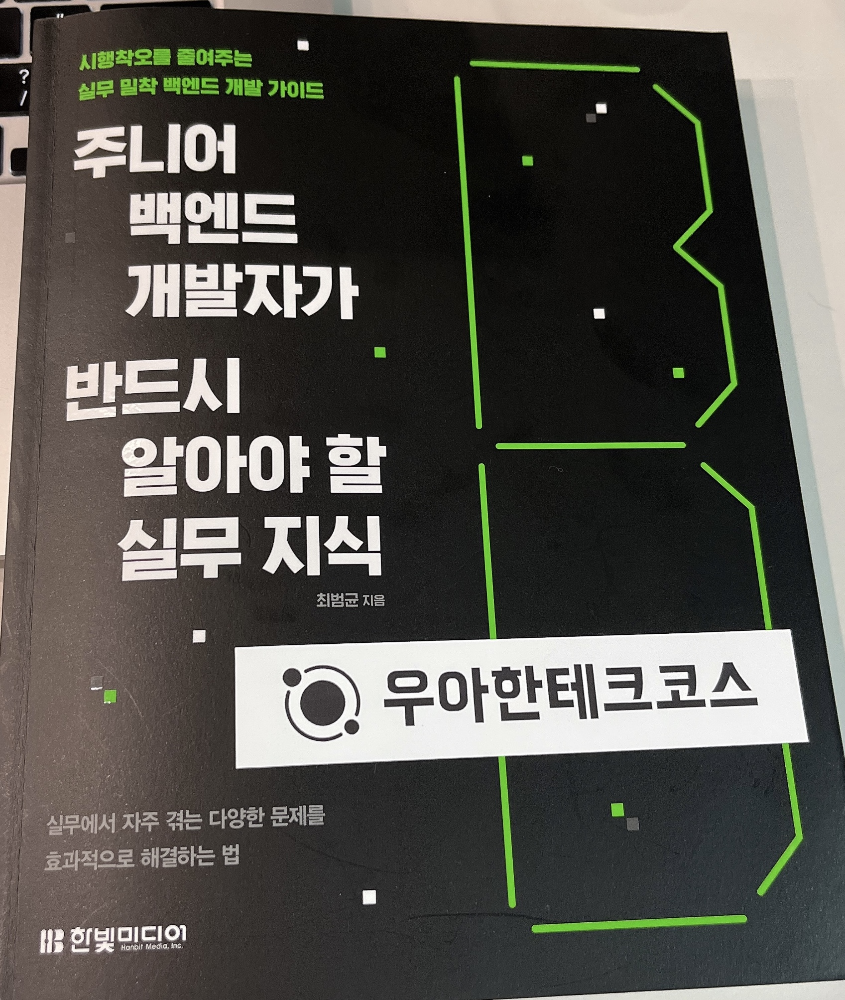

# 주니어 백엔드 개발자가 반드시 알아야 할 실무 지식

## 읽게 된 이유

우아한테크코스 캠퍼스 책장에 꽂혀있는 것을 보고 읽게 되었다. 책 제목이 마음에 들었고, 잠깐 살펴본 목차에서도 흥미로운 주제가 많아 보였다.

### 추가 내용

실제로 책을 구매하여 읽고 있다.

## 읽은 후 느낀 점

더 많은 챕터를 읽고 작성할 예정이다.

## 정리

- [2장 느려진 서비스 어디부터 봐야 할까?](2장_느려진_서비스_어디부터_봐야_할까.md)
- [3장 성능을 좌우하는 DB 설계와 쿼리](3장_성능을_좌우하는_DB_설계와_쿼리.md)
- [4장 외부 연동이 문제일 때 살펴봐야 할 것들](4장_외부_연동이_문제일_때_살펴봐야_할_것들.md)
- [5장 비동기 연동, 언제 어떻게 해야 할까?](5장_비동기_연동_언제_어떻게_써야_할까.md)
- [7장 IO 병목, 어떻게 해결하지](7장_IO_병목_어떻게_해결하지.md)
- [10장 모르면 답답해지는 네트워크 기초](10장_모르면_답답해지는_네트워크_기초.md)
- [11장 자주 쓰는 서버 구조와 설계 패턴](11장_자주_쓰는_서버_구조와_설계_패턴.md)
- [부록 A 처음 해보는 성능 테스트를 위한 기본 정리](부록_A_처음_해보는_성능_테스트를_위한_기본_정리.md)
- [부록 B NoSQL 이해하기](부록_B_NoSQL_이해하기.md)
