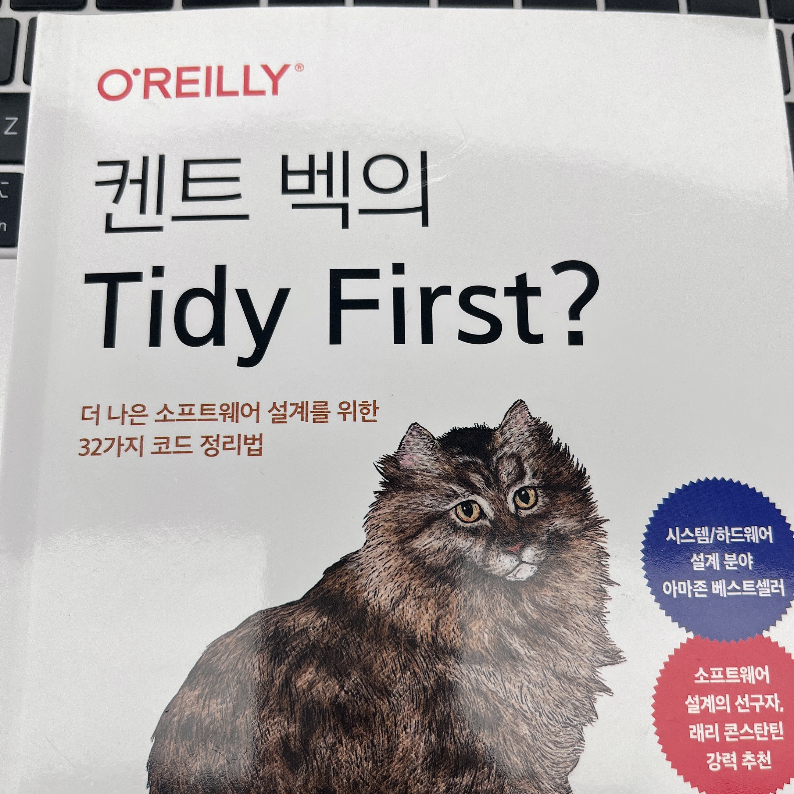

# 켄트 백의 Tidy First?

## 읽게 된 이유

페어 프로그래밍이나 협업 중 코딩 스타일의 일관성을 유지하려고 노력하고 있다.  
하지만 요구사항이 복잡해질수록 정리 작업이 숙제처럼 느껴질 때가 있었다.  
그러던 중, 책 제목의 `Tidy First?`라는 질문이 눈에 띄었고, 먼저 정리를 해야 한다는 뜻인지, 아니면 우선 구현을 해야 한다는 뜻인지 궁금해서 읽게 되었다.

## 읽은 후 느낀 점

질문에 명확한 `정답`을 제시하진 않았지만, 다양한 관점과 원칙을 소개해주며 스스로 답을 찾아가도록 유도하는 책이었다.

특정 언어나 패턴에 얽매이지 않고, 어떤 환경에서도 적용할 수 있는 `정리의 기준(원칙?)`을 제시하고 있다는 점이 인상 깊었다.
다만, 책에서 사용한 비유(예: 경제 이론 등)가 생소한 경우엔 이해가 어렵게 느껴졌다.
독자도 이를 이미 알고 있다는 전제로 설명하고 있다는 느낌이 들었다.

전체적으로 part1에서는 정리의 원칙, part2에서는 정리의 시점, part3에서는 정리의 필요성과 효과를 설명하고 있다.
비용, 수익, 결합도, 응집도 측면에서 정리의 필요성을 판단하고,
앞으로 코드 정리를 할 때 `내가 이 작업에서 즐거움을 느끼고 있는지`를 의식적으로 지켜보면 좋을 것 같다.

## 밑줄 친 문장

이번에는 밑줄을 긋지 않았다.
책이 짧기도 하고, 목차를 보는 것으로도 큰 흥미와 추측을 하게 만든다고 생각했다.

떠오르는 원칙을 코드에 적용해보는 것과 이후에 다시 한번 읽어보는 것을 해보면 좋을 것 같다.
