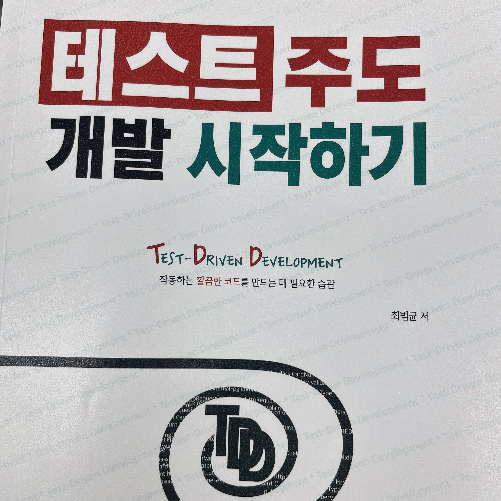

# 테스트 주도 개발 시작하기

## 읽게 된 이유

우아한테크코스 레벨 1에서는 순수 자바로 구성된 미션을 TDD로 진행했다.
레벨 2에서는 스프링을 사용하여 TDD를 진행하려고 했지만, 이전 미션과 괴리감을 느꼈던 기억이 있다.
TDD를 잘 이해하고 싶은 마음도 있고, 목차에 `테스트 범위와 종류`가 재밌어 보여서 읽게 되었다.

## 읽은 후 느낀 점

초반에는 계산기 덧셈을 예시로 TDD 사이클에 대해 설명하길래 큰 기대를 하지 않고 읽었다.
그런데 더 복잡하고 있을 법한 요구사항을 예시로 TDD 사이클을 설명하니 흥미로웠다.

가장 좋았던 부분은 끝 부분에 있는 `테스트 범위와 종류`, `테스트 코드와 유지보수` 파트였다.

`테스트 범위와 종류` 파트에서는 단위 테스트와 통합 테스트, 외부 연동이 필요한 테스트를 예시로 접하게 되었고,
지금 `내가 무엇을 검증(테스트)하고 싶은지` 고민해보는 계기가 되었다.

`테스트 코드와 유지보수` 파트에서는 하지 말아야 할 것들에 대해 설명하고 있다.
내가 지금까지 작성했던 테스트 코드와 꽤 겹쳐서 반성하게 되었다.

## 밑줄 친 문장

- 해당 기능이 온전하게 동작한다는 것을 검증해주는 테스트가 있으면 코드 수정에 대한 심리적 불안감을 줄여준다. (p.58)
- TDD가 주는 이점은 코드 수정에 대한 피드백이 빠르다는 점이다. (p.58)
- 구현이 막히면, 과감하게 코드를 지우고 미련 없이 다시 시작하라. 함께 다음을 상기하라. (p.97)
  - 쉬운 테스트, 예외적인 테스트
  - 완급 조절
- 테스트가 어려운 주된 이유는 의존하는 코드를 교체할 수 있는 수단이 없기 때문이다. (p.184)
- 깨지는 테스트를 방치할 경우(feat. 깨진 유리창 이론) (p.210)
  - 실패한 테스트가 새로 발생해도 무감각해지며, 테스트 실패 여부에 상관 없이 빌드하고 배포하기 시작한다.
  - 빌드를 통과시키기 위해 실패한 테스트를 주석 처리하고 실패한 테스트는 고치지 않는다.
  - 결과적으로 버그가 발생했을 때 놓칠 가능성이 높아지고, 소프트웨어 품질이 낮아진다.
- 유지보수 관점 (p.210~244)
  - 변수나 필드를 사용해서 기댓값 표현하지 않기
  - 두 개 이상을 검증하지 않기
  - 정확하게 일치하는 값으로 모의 객체 설정하지 않기
  - 과도하게 구현 검증하지 않기
  - 셋업을 이용해서 중복된 상황을 설정하지 않기 (데이터 공유 문제 등)
  - 실패 환경 혹은 실행 시점(순서, 랜덤 등)이 다르다고 실패하지 않기 (테스트 격리)
  - 필요하지 않은 값은 설정하지 않기
  - 조건부로 검증하지 않기
  - 통합 테스트는 필요하지 않은 범위까지 연동하지 않기
  - 더 이상 사용하지 않는 테스트는 과감하게 삭제하기
