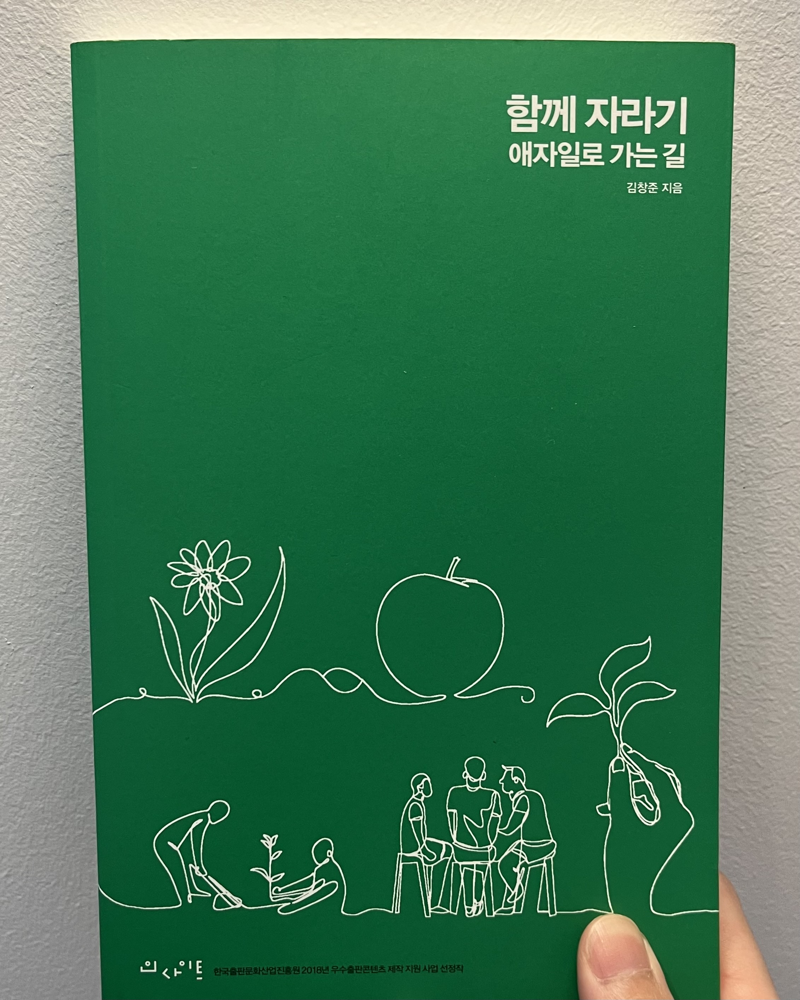

# 함께 자라기

## 읽게된 이유

교내 개발 동아리의 선배가 선물해준 책이다. 작년 12월에 받았으나 이제서야 읽게 되었다.

나는 동아리에서 멤버로 활동하다가 운영진으로 지원해 활동하거나, 여러 스터디를 주도적으로 진행했던 경험이 있다. 이 과정에서 자연스럽게 함께 성장하는 것에 대한 관심이 많아졌다. 그러나 대부분 내가 누군가에게 지식을 전달하는 역할을 맡다 보니, 진솔한 피드백을 받는 기회는 부족하다고 느꼈다. (아마도 내가 더 많은 것을 알고 있다고 생각해 피드백을 주는 것을 부담스러워했을지도 모른다. 아니면 내가 부족하거나..)

이러한 고민으로 미루고 미루던 이 책을 찾아서 읽게 되었다.

## 읽은 후 느낀 점

책은 크게 자라기, 함께, 애자일 파트로 나뉜다. `자라기 파트`에서는 의도적 수련으로 성장하는 방법과 성장을 위한 피드백에 대해 다루고, `함께 파트`에서는 협업으로 더 나은 결과를 만들어낸다는 이야기와 사람의 신뢰와 사회적 자본에 대해 다룬다. 마지막으로 `애자일 파트`에서는 함께 자라기를 실천하고, 애자일 방법론 도입에 관한 이야기를 다루고 있다.

거의 모든 주장에 구체적인 사례와 연구 결과를 바탕으로 설명하고 있어서 더욱 설득력이 있었다. 가볍게 보면 당연한 이야기처럼 보이지만, 직관에 반하는 내용도 꽤 있어서 더 재밌게 읽었다.

추가로 내용 배치도 매우 신경 쓴 티가 났다. 저자의 주장에 반하는 생각이 들 때가 있었지만, 얼마 안 가서 그것을 해소해주는 내용이 나와서 더욱 집중해서 읽게 되었다.

## 밑줄 친 문장

- 일찍, 그리고 자주 실패하라. 실패에서 학습하라. (p.40)
- 완벽한 도구와 환경을 갖추는 데에 집착해선 안된다. (p.41)
- 꾸준한 반복으로 달인이 되려면 적어도 (p.55)
  - 실력을 개선하려는 동기가 있어야 하고
  - 구체적인 피드백을 적절한 시기에 받아야 한다.
- 의도적 수련의 필수조건, 적절한 난이도 (p.61)
- 실수에 대해 서로 이야기하고 거기에서 배우는 분위기가 생깁니다. (p.91)
- 자기가 어떻게 생각하면서 이 문제를 풀었는지 (메타인지를 통한) 그 인지적 과정을 선생에게 알려주는 것도 매우 효과적입니다. (p.97)
- 어떤 기술적 실천법이라도 그걸 현실에서 적용하기 위해서는 사회적 자본과 기술이 필요합니다. (p.100)
- 뛰어난 연구자는 (그렇지 않은 연구자보다) 훨씬 더 짧은 시간 안에 타인의 도움을 얻었습니다. (p.102)
- 복수 공유는 (같은 시간을 투자했을 때) 신뢰도 높아지고 성과도 더 좋았다. (p.134)
  - 가장 좋은 시안 하나를 골라 공유하는 것보다 여러 개의 시안을 공유하는 것이 더 좋았다.
  - 단일 공유인 경우 나 = 작품으로 인식되어 피드백을 주기 어려워지고, 때로는 자기 효능감이 떨어지기도 한다.
- "이번 일은 복잡하고 불확실하니까 철저하게 계획하고 단계적으로 접근하자!" 이 말은 곧, 이번 일은 불확실하니까 초보처럼 일하자는 말과 똑같습니다. (p.156)
- 심리적 안전감, 내 생각이나 의견, 질문, 걱정, 혹은 실수가 드러났을 때 처벌받거나 놀림받지 않을 거라는 믿음을 말한다. (p.168)
  - 실수율이 낮은 조직은 실수를 적게 하는 게 아니라 실수를 공개하는 것이 공격을 받을 수 있는, 그래서 실수를 감추는 조직이었습니다.
- 파킨슨의 법칙, 교수가 숙제 기한을 일주일 늘려줬을 때 학생들이 숙제를 하는 데 걸리는 시간도 일주일 늘어나는 현상 (p.187)
- 고객에게 매일 가치를 전하라. (p.198)
  - 고객은 누구인가?
  - 어떻게 매일 점진적으로 가치를 전할 것인가.
  - 지금 우리가 하고 있는 일이 정말 가치를 만드는 일인가?
  - 고객이 정말 가치를 얻고 있는가?
  - 고객 참여의 중요성
- 두려워도 중요하다면 시도해봐야 하지 않겠는가. (p.205)
