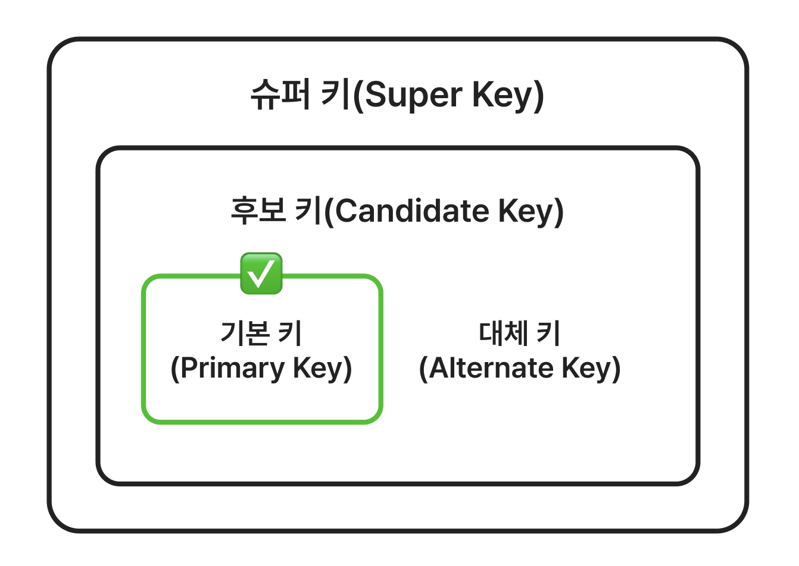

# 데이터베이스 키와 무결성 제약 조건

데이터베이스에서 무결성 제약 조건은 잘못된 데이터 입력을 방지하고, 데이터 간의 논리적 관계를 지켜주는 필수적인 장치다. 단순한 규칙 이상의 역할로, 데이터의 품질을 장기적으로 보장하고 시스템 전반의 안정성을 유지하는 핵심 요소이다.

[이전 글](RDBMS&RelationalModel.md)에서는 RDBMS와 관계형 모델의 기본 개념에 대해 학습했다. 이번에는 데이터베이스 키와 무결성 제약 조건에 대해 학습하려고 한다. (MySQL을 기준으로 학습했다.)

## 목차

- [데이터베이스 키](#데이터베이스-키)
  - [슈퍼 키(Super Key)](#슈퍼-키super-key)
  - [후보 키(Candidate Key)](#후보-키candidate-key)
  - [기본 키(Primary Key)](#기본-키primary-key)
  - [대체 키(Alternate Key)](#대체-키alternate-key)
  - [대리 키(Surrogate Key)](#대리-키surrogate-key)
  - [외래 키(Foreign Key)](#외래-키foreign-key)
- [무결성 제약 조건(Integrity Constraints)](#무결성-제약-조건integrity-constraints)
  - [무결성 제약 조건의 종류](#무결성-제약-조건의-종류)
    - [도메인 제약 조건(Domain Constraints)](#도메인-제약-조건domain-constraints)
    - [키 제약 조건(Key Constraints)](#키-제약-조건key-constraints)
    - [엔티티 무결성 제약 조건(Entity Integrity Constraints)](#엔티티-무결성-제약-조건entity-integrity-constraints)
    - [참조 무결성 제약 조건(Referential Integrity Constraints)](#참조-무결성-제약-조건referential-integrity-constraints)
    - [트리거(Triggers)](#트리거triggers)
    - [주장(Assertion)](#주장assertion)

## 데이터베이스 키

`키(Key)`는 데이터베이스에서 각 레코드를 고유하게 식별하는 데 사용되는 속성(컬럼)이다. 키는 데이터베이스의 무결성을 유지하고, 데이터를 효율적으로 검색하는 데 중요한 역할을 한다.



- `슈퍼 키(Super Key)`: 테이블에서 각 레코드를 고유하게 식별할 수 있는 속성의 집합이다. 슈퍼 키는 중복된 값을 가질 수 있다.
- `후보 키(Candidate Key)`: 슈퍼 키 중에서 기본 키로 선택될 수 있는 속성이다. 후보 키는 NULL 값을 가질 수 없다.
- `기본 키(Primary Key)`: 후보 키 중에서 하나를 선택하여 테이블의 각 레코드를 고유하게 식별하는 속성이다. 기본 키는 NULL 값을 가질 수 없다.
- `대체 키(Alternate Key)`: 기본 키로 선택되지 않은 후보 키이다. 대체 키는 NULL 값을 가질 수 있다.
- `외래 키(Foreign Key)`: 다른 테이블의 기본 키를 참조하는 속성이다. 외래 키는 NULL 값을 가질 수 있다.

### 슈퍼 키(Super Key)

슈퍼 키는 테이블에서 각 레코드를 고유하게 식별할 수 있는 (하나 이상) 속성의 집합이다. 후보 키, 기본 키, 대체 키 모두 슈퍼 키에 포함된다.

크루 테이블이 있다고 가정하자.
여기서 각 크루를 구분할 수 있는 속성을 생각해보자.

| 닉네임 | 기수 | 파트 | 이메일      | 전화번호    |
| ------ | ---- | ---- | ----------- | ----------- |
| 벨로   | 7    | BE   | bello@mail  | 01011112222 |
| 도기   | 7    | BE   | dogi@mail   | 01022223333 |
| 리건   | 6    | BE   | ligen@mail  | 01033334444 |
| 리건   | 7    | BE   | leegun@mail | 01044445555 |
| 오이   | 7    | AN   | oe@mail     | 01055556666 |

한 기수에서 닉네임 중복을 허용하지 않는다면 `닉네임+기수` 조합이 슈퍼 키가 된다.
한번 참여한 크루는 다시 참여할 수 없다면 `이메일`, `전화번호`도 슈퍼 키가 된다.
`닉네임+기수+파트+이메일+전화번호` 조합도 각 레코드를 고유하게 식별할 수 있으므로 슈퍼 키가 된다.

어떤 속성 조합이라도 각 레코드를 고유하게 식별할 수 있다면 슈퍼 키가 된다.

### 후보 키(Candidate Key)

후보 키는 슈퍼 키 중에서 `최소성`을 만족하는 속성의 집합이다. 즉, 후보 키는 각 레코드를 고유하게 식별할 수 있는 속성 중에서 최소한의 속성 조합이다.

`닉네임+기수`, `이메일`, `전화번호`, `닉네임+기수+파트+이메일+전화번호` 등의 조합은 모두 슈퍼 키지만, 이 중에서 최소한의 속성 조합은 `이메일(1개)`과 `전화번호(1개)`이기 때문에 후보 키가 된다.

`닉네임+기수` 조합은 `닉네임`과 `기수`가 모두 필요하므로 최소성을 만족하지 않는다.

### 기본 키(Primary Key)

기본 키는 후보 키 중에서 하나를 선택한 것으로, 테이블 내 레코드를 고유하게 식별하는 대표 식별자 역할을 한다. (즉, 유일성과 최소성을 만족하는 속성이다.)

기본 키는 NULL 값을 가질 수 없으며, 중복된 값을 허용하지 않는다. 기본 키는 테이블의 무결성을 유지하는 데 중요한 역할을 한다.

`이메일`과 `전화번호` 중에서 하나를 기본 키로 선택할 수 있다.

만약 `이메일`과 `전화번호`가 없었더라면, `닉네임+기수` 조합을 기본 키로 선택할 수 있다. 이처럼 두 개 이상의 속성 조합도 기본 키로 선택할 수 있다. 이를 `복합 키(Composite Key)`라고 부른다.

### 대체 키(Alternate Key)

대체 키는 기본 키로 선택되지 않은 후보 키이며, 일반적으로 NULL을 허용하지 않고 중복될 수 없다.

`이메일`을 기본 키로 선택했다면 `전화번호`는 대체 키가 된다.  
`전화번호`를 기본 키로 선택했다면 `이메일`은 대체 키가 된다.

### 대리 키(Surrogate Key)

대리 키는 실제 의미를 가지지 않는, 데이터베이스 내부에서 인위적으로 생성된 식별자다. 주로 자동 증가 숫자나 UUID 같은 값으로 구성되며, 각 레코드를 고유하게 식별하기 위한 목적으로만 사용된다.

후보 키가 너무 복잡하거나 길 경우에 대리 키를 사용한다. 예를 들어, 후보 키가 이름 + 생년월일 + 이메일 조합이라면, 이를 기본 키로 사용하기엔 비효율적이다. 이 경우 id라는 이름의 대리 키를 생성하여 기본 키로 사용하는 것이 관리와 성능 측면에서 더 유리하다.

또는 후보 키의 값이 변경될 가능성이 있을 때 사용한다. 이메일이나 전화번호와 같이 시간이 지나면서 변경될 수 있는 속성을 기본 키로 사용할 경우, 여러 테이블에 영향을 줄 수 있다. 이런 경우 대리 키를 사용하면 외래 키 제약에 대한 문제를 줄일 수 있다.

| id (대리 키) | 닉네임 | 이메일     |
| ------------ | ------ | ---------- |
| 1            | 벨로   | bello@mail |
| 2            | 도기   | dogi@mail  |

id는 실제 데이터와는 무관한 인위적인 식별자이지만, 각 레코드를 구분하는 데 사용된다.
이처럼 단순하고 불변인 값으로 기본 키를 구성하는 것이 일반적이라고 한다.

### 왜래 키(Foreign Key)

외래 키는 다른 테이블의 기본 키를 참조하는 속성이다. 외래 키는 두 테이블 간의 관계를 표현하는 데 사용되며, 참조된 테이블의 존재하는 값만 가질 수 있다.

외래 키로 데이터의 `참조 무결성(Referential Integrity)`을 유지할 수 있다.

외래 키는 NULL을 가질 수 있으며, 하나의 값이 여러 번 등장할 수 있다. 하지만 반드시 참조 대상이 존재해야만 한다는 점에서 무결성 제약 조건의 핵심 요소이다.

크루와 소속 미션 정보를 따로 관리한다고 가정하자.

**크루 테이블**
| id (기본 키) | 닉네임 |
| ------------ | ------ |
| 1 | 벨로 |
| 2 | 도기 |

**미션 테이블**
| mission_id | crew_id (외래 키) | 미션명 |
| ---------- | ----------------- | ------------ |
| 101 | 1 | 문자열 계산기 구현 |
| 102 | 2 | 방탈출 예약 관리 구현 |

`Mission.crew_id`는 `Crew.id`를 참조하는 외래 키다. 만약 존재하지 않는 crew_id를 삽입하려 하면 오류가 발생한다.

외래 키를 통해 두 테이블 간의 논리적인 연결이 가능해지고, 관계형 데이터베이스의 구조적 강점을 잘 살릴 수 있다.

## 무결성 제약 조건(Integrity Constraints)

데이터베이스의 데이터를 정확하고 일관되며 신뢰할 수 있도록 보장하는 규칙이다.

앞서 말한 것처럼 무결성 제약 조건은 DBMS에 사용되는 일련의 규칙으로 데이터베이스의 데이터가 정확하고 일관되며 신뢰할 수 있게 한다. 이 규칙은 데이터를 추가하거나 수정, 삭제와 같은 작업이 데이터베이스의 무결성에 위배하지 못하도록 하여 데이터 품질을 유지할 수 있게 한다. 간단히 말해서, 데이터베이스를 보호하고 오류가 없도록 지켜주는 역할을 한다.

예를 들어, 주문을 추가할 때, 주문의 외래 키가 존재하지 않는 고객 ID를 참조하지 않도록 하는 것이 무결성 제약 조건이다. 만약 존재하지 않는 고객 ID를 참조하려고 하면 오류가 발생한다.

### 무결성 제약 조건의 종류


출처: [DBMS Integrity Constraints: GeeksForGeeks](https://www.geeksforgeeks.org/dbms-integrity-constraints/)

### 도메인 제약 조건(Domain Constraints)

도메인 제약 조건은 컬럼에 저장될 수 있는 값의 유형과 범위를 지정한다. 컬럼에 들어갈 수 있는 데이터의 형식, 값의 범위, 형식 등을 제한하여 유효하지 않은 데이터를 차단하는 역할을 한다.

예를 들어, 나이를 저장하는 컬럼은 정수형이어야 하고, 0보다 큰 값만 허용해야 한다. 이와 같은 제약 조건을 도메인 제약 조건이라고 한다.

**NOT NULL 제약 조건**

NOT NULL 제약 조건은 컬럼이 NULL 값을 가질 수 없도록 강제한다. 즉, 해당 컬럼에는 반드시 값이 입력되어야 한다.

```sql
CREATE TABLE users (
    id INT PRIMARY KEY,
    name VARCHAR(100) NOT NULL -- 이름은 NULL이 될 수 없다
);
```

**CHECK 제약 조건**

CHECK 제약 조건은 컬럼 값이 특정 조건을 만족해야 함을 강제한다. 예를 들어, 상품의 가격이 0보다 커야 한다는 조건을 설정할 수 있다.

```sql
CREATE TABLE products (
    price INT CHECK (price > 0) -- 가격은 0보다 커야 한다
);
```

### 키 제약 조건(Key Constraints)

키 제약 조건은 테이블의 특정 컬럼이 고유한 값을 가져야 함을 강제한다. 즉, 중복된 값이 존재할 수 없도록 한다.

**PRIMARY KEY 제약 조건**

PRIMARY KEY 제약 조건은 테이블의 기본 키를 정의한다. 기본 키는 각 레코드를 고유하게 식별하는 속성으로, NULL 값을 가질 수 없다.

```sql
CREATE TABLE users (
    id INT PRIMARY KEY, -- id는 기본 키
    name VARCHAR(100)
);
```

**UNIQUE KEY 제약 조건**

UNIQUE KEY 제약 조건은 특정 컬럼이 고유한 값을 가져야 함을 강제한다. 즉, 중복된 값이 존재할 수 없다. 하지만 NULL 값은 허용된다.

```sql
CREATE TABLE users (
    id INT PRIMARY KEY,
    email VARCHAR(100) UNIQUE -- 이메일은 고유해야 한다
);
```

### 엔티티 무결성 제약 조건(Entity Integrity Constraints)

엔티티 무결성 제약 조건은 테이블의 각 행(row)이 고유하게 식별될 수 있도록 보장하는 제약 조건이다. 보통 `기본 키(PK)`를 통해 보장된다.

### 참조 무결성 제약 조건(Referential Integrity Constraints)

참조 무결성 제약 조건은 `외래 키(Foreign Key)`를 통해 두 테이블 간의 관계가 논리적으로 유지되도록 보장한다. 외래 키가 참조하는 기본 키가 존재해야 함을 보장하는 제약 조건이다. 즉, 외래 키는 항상 참조되는 테이블의 기본 키와 일치해야 한다.

```sql
CREATE TABLE orders (
    id INT PRIMARY KEY,
    user_id INT,
    FOREIGN KEY (user_id) REFERENCES users(id)
);
```

```sql
ON DELETE CASCADE  -- 참조된 행이 삭제되면, 해당 행도 함께 삭제됨
ON DELETE SET NULL -- 참조된 행이 삭제되면, 외래 키 값을 NULL로 설정
ON DELETE RESTRICT -- 참조 중인 데이터가 있으면 삭제 제한
```

### 트리거(Triggers)

트리거는 특정 이벤트(INSERT, UPDATE, DELETE)가 발생할 때 자동으로 실행되는 프로시저이다. 데이터베이스의 무결성을 유지하고, 특정 작업을 자동화하는 데 사용된다.

예를 들어, 사용자가 삭제될 때 해당 사용자의 모든 주문을 삭제하는 트리거를 만들 수 있다.

```sql
CREATE TRIGGER delete_user_orders
AFTER DELETE ON users
FOR EACH ROW
BEGIN
    DELETE FROM orders WHERE user_id = OLD.id;
END;
```

또는 주문이 추가될 때마다 재고 수량을 자동으로 감소시키거나, 특정 조건을 만족하지 않으면 삽입을 차단하는 데 활용할 수 있다.

```sql
CREATE TRIGGER check_stock
BEFORE INSERT ON orders
FOR EACH ROW
BEGIN
    DECLARE stock_count INT;
    SELECT COUNT(*) INTO stock_count FROM products WHERE id = NEW.product_id;
    IF stock_count <= 0 THEN
        SIGNAL SQLSTATE '45000' SET MESSAGE_TEXT = 'Out of stock';
    END IF;
END;
```

트리거는 데이터베이스의 무결성을 유지하고, 특정 작업을 자동화하는 데 유용하다. 하지만 과도한 트리거 사용은 성능 저하를 초래할 수 있다. 추가로 내가 생각했을 때 트리거를 과도하게 사용하면, 비즈니스 로직을 이해하기 힘들 수도 있을 것 같다.

### 주장(Assertion)

주장은 데이터베이스의 특정 조건이 항상 참인지를 검사하는 제약 조건이다. 주장은 데이터베이스의 무결성을 유지하기 위해 사용되며, 특정 조건이 위배될 경우 오류를 발생시킨다.

```sql
-- 일부 DBMS (예: PostgreSQL)에서는 사용 가능
-- 전체 급여 총합이 일정 금액을 넘지 않아야 한다는 제약 조건
CREATE ASSERTION salary_check
CHECK ((SELECT SUM(salary) FROM employees) <= 1000000);
```

MySQL에서는 지원하지 않는다. 그러니 [트리거](#트리거triggers)를 사용하여 비슷하게 구현하거나 애플리케이션에서 검사하는 방법을 사용해야 한다.

## 마무리

데이터베이스 키와 무결성 제약 조건에 대해 학습했다. 무결성 제약 조건을 학습하면서 이전에 받았던 질문인 `파일로도 데이터를 저장할 수 있는데, 왜 DBMS를 사용해야 할까?`에 대해 조금 더 확실한 기준이 생긴 것 같다.

## 생각해볼 부분

- 트리거를 정말 많이 사용할까?
  - 트리거를 과도하게 사용하면 비즈니스 로직을 이해하기 힘들지 않을까?
- 대부분 대리 키를 사용하는 것 같은데, 정말 장점만 있어서 그런 걸까?
  - 대리 키를 사용하지 않는 경우는 어떤 경우일까?
