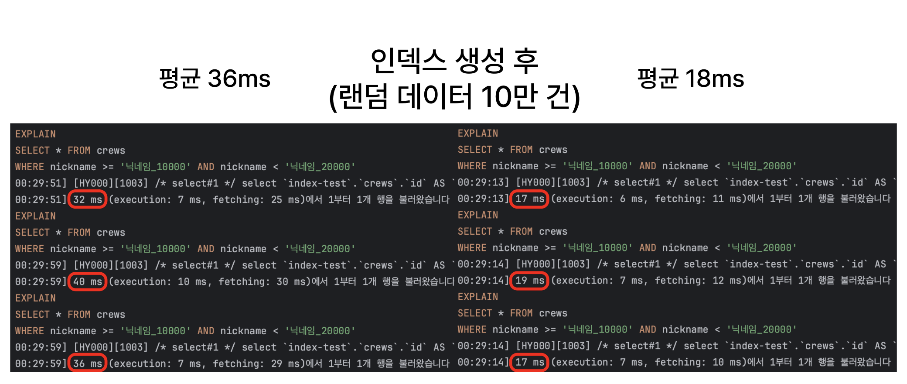

# 인덱스란? 개념과 작동 방식 이해하기

이번에는 데이터베이스에서 말하는 인덱스가 어떤 개념인지, 왜 필요한지, 그리고 어떻게 동작하는지를 알아보려고 한다.

- [인덱스란?](#인덱스란)
- [왜 인덱스가 필요한가?](#왜-인덱스가-필요한가)
- [인덱스 기본 동작 방식](#인덱스-기본-동작-방식)
- [인덱스 어떻게 만들까?](#인덱스-어떻게-만들까)
- [인덱스는 무조건 좋은가?](#인덱스는-무조건-좋은가)
- [마무리](#마무리)

## 인덱스란?

데이터베이스에서 `인덱스(index)`는 특정 조건의 데이터를 빠르게 찾기 위해 사용하는 부가적인 자료구조이다.
덕분에 테이블 내 실제 데이터를 직접 순회하지 않고도, 원하는 데이터를 효율적으로 조회할 수 있다.

인덱스의 주된 목적은 SELECT, DELETE, UPDATE 문의 `WHERE 절이나 JOIN 조건과 같이 특정 조건을 만족하는 튜플(행)을 빠르게 조회`하는 것이다.
또한, 상황에 따라서는 데이터를 빠르게 `정렬(ORDER BY)`하거나 `그룹핑(GROUP BY)`하는 데에도 사용될 수 있다.

> ### 배열의 인덱스랑 같나요?
>
> 프로그래밍에서 배열을 다룰 때, 특정 위치에 바로 접근할 수 있는 `인덱스(index)`를 사용한다.
>
> 반면, 데이터베이스에서의 인덱스는 배열처럼 `위치` 그 자체라기보단, 원하는 데이터를 더 빨리 찾기 위해 만들어지는 정렬된 탐색 도구에 가깝다.
> 마치 책의 목차처럼, 인덱스는 많은 데이터 중에서 원하는 내용을 빠르게 찾아갈 수 있도록 돕는다.

## 왜 인덱스가 필요한가?

앞서 말한 것처럼 인덱스가 없는 경우, RDBMS는 특정 조건의 데이터를 찾기 위해 테이블 `전체를 순회(Full Table Scan)`해야 한다.
데이터 양이 적을 때는 문제가 되지 않지만, 데이터가 수천만 건에 달하는 경우 심각한 성능 저하가 발생할 수 있다.

### 성능 차이 예시

간단하게 10만 개의 크루 데이터가 있는 테이블을 구성하고 범위 조건으로 데이터를 조회한 결과이다.



- 인덱스가 없을 때: 테이블의 모든 데이터를 순회하며 조건을 만족하는지를 일일이 검사한다. `O(n)`
- 인덱스가 있을 때: 인덱스 구조를 통해 원하는 범위를 이진 탐색으로 좁혀간다. `O(log n)`

생각보다 적은 데이터와 간단한 조건이지만, 평균적으로 2배 정도의 성능 차이를 보인다.
데이터가 많아지거나 복잡한 조건이 추가되면 성능 차이는 더욱 커질 것이다.

## 인덱스 기본 동작 방식

그래서 인덱스는 어떻게 동작할까? [B-tree](https://en.wikipedia.org/wiki/B-tree) 기반 인덱스로 알아보자.


[출처: https://dev-yyh.github.io/DB/1]

인덱스는 특정 컬럼의 값을 정렬된 구조로 저장하고, 각 값에 해당하는 `데이터 위치(포인터)`를 함께 보관한다.
데이터를 찾을 때 인덱스에서 `바이너리 서치 방식`을 사용하여 탐색 범위를 빠르게 줄여나가므로, `풀스캔(O(n))`에 비해 훨씬 빠른 `O(log n)`의 시간 복잡도를 가진다.

### 탐색 방식

1. 인덱스 구조에서 이진 탐색으로 조건에 맞는 키를 찾는다.
2. 키가 가리키는 포인터를 통해 실제 테이블에서 데이터를 가져온다.
3. 전체 테이블을 스캔할 필요 없이 원하는 데이터를 빠르게 조회할 수 있다.

예를 들어, `nickname = 'David'` 조건이라면 인덱스에서 ‘David’ 키를 검색하고 해당 포인터를 따라가 테이블에서 값을 가져온다.

## 인덱스 어떻게 만들까?

인덱스는 `CREATE INDEX` 문을 사용하여 생성할 수 있다.

```sql
CREATE INDEX idx_nickname ON crews(nickname);
```

`idx_nickname`: 인덱스 이름
`crews`: 대상 테이블
`nickname`: 인덱스를 만들 컬럼

인덱스는 테이블과 별도로 저장되며, 데이터가 변경될 때 자동으로 갱신된다.

### 복합 인덱스(Composite Index)

두 개 이상의 컬럼을 조합해 인덱스를 생성할 수도 있다.

```sql
CREATE INDEX idx_nickname_part ON crews(nickname, part);
```

복합 인덱스는 `선두 컬럼(nickname)`을 기준으로 정렬되며, 이후 컬럼(part)은 선두 컬럼이 조건에 포함될 때만 효율적으로 활용된다.

우선순위는 생성 순서에 따라 정해지며, `WHERE nickname = ? AND part = ?` 쿼리에는 유용하지만, `WHERE part = ?`처럼 선두 컬럼이 빠진 조건에는 제대로 동작하지 않는다.

## 인덱스는 무조건 좋은가?

인덱스는 성능을 향상시키는 데 큰 도움이 되지만, 무조건 좋은 것은 아니다.

- 저장 공간을 추가로 차지한다.
- 쓰기 작업(INSERT/UPDATE/DELETE)에 인덱스도 함께 갱신되므로 오버헤드가 발생한다.

요약하자면, `읽기 성능 향상 vs 쓰기 성능 저하` 사이의 균형이 중요하다.

### 유지보수 관점

- 불필요한 인덱스는 만들지 않는 것이 좋다.
  - 나아가 주기적으로 인덱스를 점검하고, 사용하지 않는 인덱스는 삭제하는 것이 좋다.
- `EXPLAIN` 키워드로 쿼리 계획을 확인하여 어떤 인덱스가 실제로 사용되는지 분석할 수 있다.
- 특정 인덱스 사용 여부를 직접 제어할 수도 있다.
  - `USE INDEX`, `FORCE INDEX`, `IGNORE INDEX` 키워드를 사용하여 인덱스 사용을 강제하거나 무시할 수 있다.
- 풀스캔이 더 빠를 수도 있다.
  - 테이블 크기가 작거나 조건에 해당하는 데이터가 대부분일 경우, 풀스캔이 효율적일 수 있습니다. (옵티마이저가 판단하기 때문에 직접 제어할 필요는 없다.)

## 마무리

언제나 그렇듯, 인덱스도 성능을 향상시키는 도구일 뿐이며, 상황에 따라 적절히 사용해야 한다.

### 생각해볼 부분

- 인덱스 갱신 과정도 안전성이 보장될까?
- 해시 구조를 사용하면, 더 빠르지 않나?
  - 이상적인 조건인 경우 빠르긴 하겠지만, 범위 검색이 불가능할 것이다.
- 인덱스는 어디에 어떻게 저장될까?
  - 물리적으로 같은 디스크에 저장되는 것 아닌가?

### 참고

- [DB 인덱스(DB index) 핵심만 모아서 설명합니다: 쉬운코드](https://youtu.be/IMDH4iAQ6zM?si=IRklsEHnc_-pdEKX)
- [데이터베이스 인덱스(Index)의 중요성과 활용 방법: dev-yyh](https://dev-yyh.github.io/DB/1)
