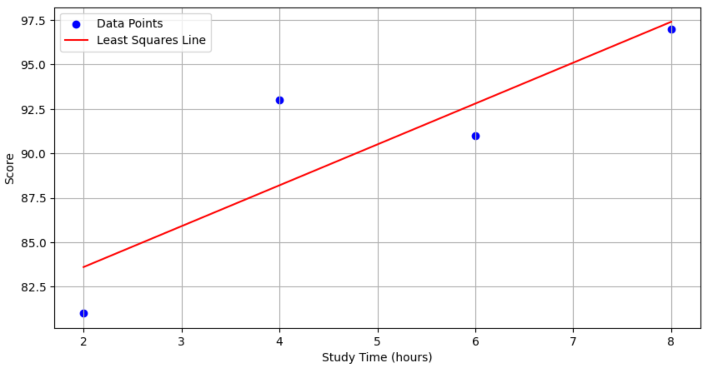

# 최소 제곱법 (Least Squares Method)

최소 제곱법은 데이터를 가장 잘 설명하는 직선을 찾는 방법이다.
데이터를 가장 잘 설명하는 직선이란, 데이터와 직선 사이의 거리(데이터의 y값과 직선의 y값의 차이)를 최소화하는 직선을 의미한다.

## 우리의 목표

| 공부한 시간 (x) |   2    |   4    |   6    |   8    |
| :-------------: | :----: | :----: | :----: | :----: |
|  **성적 (y)**   | **81** | **93** | **91** | **97** |

위 표는 공부한 시간에 따른 성적 데이터이다. 아래에 그래프를 확인해보자.


위 그래프에서 x축은 공부한 시간, y축은 성적을 나타낸다. 우리는 시간에 따른 성적의 변화를 가장 잘 설명하는 직선을 찾아서 이 직선을 통해 시간에 따른 성적을 예측하고 싶은 것이다.

## 선형 회귀

최소 제곱법은 선형 회귀(Linear Regression)의 한 형태이다. 선형 회귀는 입력 변수와 출력 변수 간의 선형 관계를 모델링하는 방법이다.

독립적으로 변하는 입력 변수 $x$와 종속적으로 변하는 출력 변수 $y$ 사이의 관계를 다음과 같은 선형 관계로 나타낼 수 있다.

$$y = ax + b$$

여기서 $a$는 기울기, $b$는 y절편을 의미한다.

하나의 독립 변수 $x$와 하나의 종속 변수 $y$ 사이의 선형 관계를 모델링하는 것을 단순 선형 회귀(Simple Linear Regression)이라고 하고, 독립 변수가 여러 개인 경우에는 다중 선형 회귀(Multiple Linear Regression)이라고 한다.

## 최소 제곱법을 이용한 직선 찾기

1. 주어진 데이터를 이용하여 기울기 $a$를 구한다.
2. 구한 기울기 $a$를 이용하여 y절편 $b$를 구한다.
3. 구한 기울기 $a$와 y절편 $b$를 이용하여 직선의 방정식을 구한다.

### 기울기 $a$ 구하기

기울기 $a$는 다음과 같이 구할 수 있다.

$$a = \frac{\sum_{i=1}^{n} (x_i - \bar{x})(y_i - \bar{y})}{\sum_{i=1}^{n} (x_i - \bar{x})^2}$$

여기서 $n$은 데이터의 개수, $x_i$는 i번째 데이터의 x값(입력값), $y_i$는 i번째 데이터의 y값(출력값), $\bar{x}$는 x값의 평균, $\bar{y}$는 y값의 평균을 의미한다.

### y절편 $b$ 구하기

y절편 $b$는 다음과 같이 구할 수 있다.

$$b = \bar{y} - a\bar{x}$$

## 데이터를 보고 기울기 $a$와 y절편 $b$ 구하기

위 공부한 시간에 따른 성적 데이터를 이용하여 기울기 $a$와 y절편 $b$를 구해보자.

### 기울기 $a$ 구하기

1. $x$의 평균 $\bar{x}$ 구하기

$$\bar{x} = \frac{2 + 4 + 6 + 8}{4} = 5$$

2. $y$의 평균 $\bar{y}$ 구하기

$$\bar{y} = \frac{81 + 93 + 91 + 97}{4} = 90.5$$

3. 기울기 $a$ 구하기

$$a = \frac{(2-5)(81-90.5) + (4-5)(93-90.5) + (6-5)(91-90.5) + (8-5)(97-90.5)}{(2-5)^2 + (4-5)^2 + (6-5)^2 + (8-5)^2} = \frac{46}{20} = 2.3$$

### y절편 $b$ 구하기

$$b = 90.5 - 2.3 \times 5 = 90.5 - 11.5 = 79$$

### 직선의 방정식 구하기

위에서 구한 기울기 $a$와 y절편 $b$를 이용하여 직선의 방정식을 구할 수 있다.

$$y = 2.3x + 79$$

위 방정식을 이용하여 그래프를 그려보면 다음과 같다.



위 그래프에서 빨간색 선이 최소 제곱법을 이용하여 구한 직선이다. 이 직선을 이용하여 공부한 시간에 따른 성적을 예측할 수 있다. 5시간 공부한 학생의 성적은 90.5점($2.3 \times 5 + 79$)로 예측할 수 있다.

## 파이썬 코드로 구현하기

```python
# 넘파이 라이브러리 불러오기
import numpy as np

# 공부한 시간과 점수를 각각 x, y라는 이름의 넘파이 배열로 만들기
x = np.array([2, 4, 6, 8])
y = np.array([81, 93, 91, 97])

# x의 평균값 구하기
mx = np.mean(x)

# y의 평균값 구하기
my = np.mean(y)

print(mx)
print(my)

# 기울기 공식의 분모 부분 구하기
divisor = sum([(i - mx)**2 for i in x])

# 기울기 공식의 분자 부분 구하기
def top(x, mx, ym, my):
	d = 0
	for i in range(len(x)):
		d += (x[i] - mx) * (y[i] - my)
	return d
dividend = top(x, mx, y, my)

# 기울기 a 구하기
a = dividend / divisor

# y 절편 b 구하기
b = my - (mx * a)

# 출력
print("기울기 a = ", a)
print("y 절편 b = ", b)
```

```
# 결과
5.0
90.5
기울기 a =  2.3
y 절편 b =  79.0
```

위 코드를 실행하면 기울기 $a$와 y절편 $b$를 구할 수 있다.

## 최소 제곱법의 한계

최소 제곱법은 주어진 데이터에 대해 선형 관계를 가정하고, 이에 가장 적합한 직선을 찾아내기 위한 방법이다. 하지만, 최소 제곱법은 여러 가지 한계를 가지고 있다.

1. 여러 개의 입력 변수를 처리하는 데 한계가 있다.

- 최소 제곱법은 주로 하나의 입력 변수와 하나의 출력 변수 간의 선형 관계를 가정하고 사용된다. 그러나 실제 데이터는 종종 여러 입력 변수가 있고, 여러 개의 입력 변수들 간의 관계를 고려해야 할 때가 많다. 예를 들어, 폐암 수술 환자의 생존율을 예측하기 위해서 나이, 성별, 수술 유형 등 다양한 변수를 고려해야 한다. 이러한 경우에는 다중 선형 회귀 분석과 같은 다른 방법을 사용해야 한다.

2. 데이터가 비선형적인 관계를 가질 경우에는 적합하지 않을 수 있다.

- 최소 제곱법은 선형 관계를 가정하고 있기 때문에, 데이터가 비선형적인 관계를 가질 경우에는 적합하지 않다. 예를 들어, 가격 변동에 따른 수요 데이터가 있다. 이러한 경우에는 다항 회귀 분석이나 신경망과 같은 비선형 모델을 사용할 수 있다.

3. 데이터에 잡음이 많거나 이상치가 있는 경우에는 취약하다.

- 잡음이 많은 데이터나 이상치가 있는 경우에는 최소 제곱법을 사용하여 얻은 모델이 과적합(overfitting)되어 일반화 성능이 좋지 않을 수 있다. 즉, 새로운 데이터를 입력값으로 넣었을 때 결과가 안좋을 수 있다는 말이다. 이러한 경우에는 데이터 전처리나 정규화, 더 강력한 모델을 사용하는 것이 좋다.

## 마무리

최소 제곱법은 간단하고 직관적이지만, 모든 상황에 적용하기에는 한계가 있다. 다양한 데이터와 상황에 따라 적절한 모델과 방법을 선택하는 것이 중요하다.
