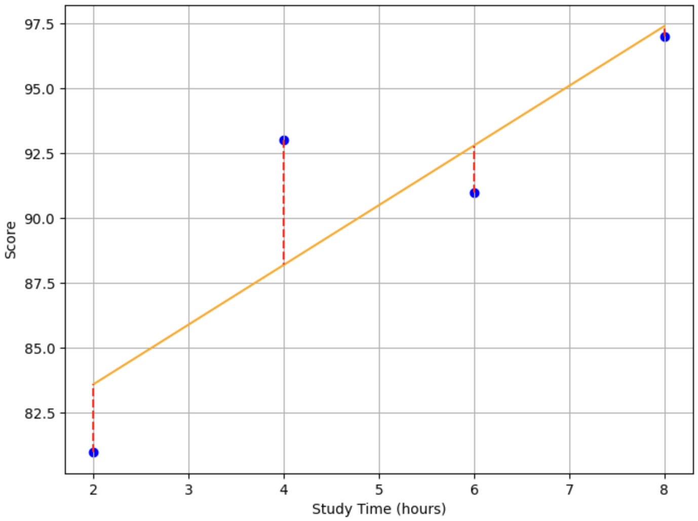

# 평균 제곱 오차 (Mean Squared Error, MSE)

평균 제곱 오차는 회귀 문제에서 사용되는 손실 함수 중 하나이다.

## 배경

입력값이 하나인 경우에는 [최소 제곱법](./MeanSquaredError.md)을 이용해 기울기 $w$와 절편 $b$를 찾을 수 있다. 하지만 입력값이 여러 개인 경우에는 최소 제곱법을 사용할 수 없다.

대부분의 현상은 입력값이 여러 개인 경우가 많다. 그래서 최소 제곱법 대신 다른 방법이 필요했다.

-> 일단 선을 긋고 조금씩 수정해나가는 방법을 사용하며, 이때 사용되는 손실 함수가 평균 제곱 오차이다.

## 평균 제곱 오차

| 공부한 시간 (x) |   2    |   4    |   6    |   8    |
| :-------------: | :----: | :----: | :----: | :----: |
|  **성적 (y)**   | **81** | **93** | **91** | **97** |

일단 위 데이터와 함께 임의의 직선을 그어보자.

위 그래프에서 직선은 우리가 예측한 값이고, 점은 실제 데이터이다. 우리의 목표는 빨간 점선으로 표시된 에러를 최소화하는 직선을 찾는 것이다. 이 에러가 최소가 되는지 알기 위해서는 에러를 수치화할 수 있는 방법이 필요하다. 그것이 평균 제곱 오차이다.

## 오차

오차는 실제 값과 예측 값의 차이를 의미한다. 오차를 수식으로 나타내면 다음과 같다.

$$오차 = y - \hat{y}$$
여기서 $y$는 실제값, $\hat{y}$는 예측값이다. 그래서 오차는 음수일 수도 있고, 양수일 수도 있다. 따라서 오차의 크기를 비교하기 위해서는 오차의 제곱을 사용한다.

## 평균 제곱 오차 수식

평균 제곱 오차는 다음과 같이 정의된다.

$$MSE = \frac{1}{n} \sum_{i=1}^{n} (y_i - \hat{y_i})^2$$

여기서 $n$은 데이터의 개수, $y_i$는 i번째 데이터의 실제 값, $\hat{y_i}$는 i번째 데이터의 예측 값이다.

## 평균 제곱 오차의 한계

평균 제곱 오차는 실제값과 예측값의 차이를 이용하기 때문에 이상치(outlier)에 민감하다.

이상치는 실제 데이터에서는 상대적으로 적게 발생하지만, 모델을 학습시킬 때 큰 영향을 줄 수 있다.

데이터셋에 이상치가 포함되어 있다면, 이상치는 실제값과 예측값의 차이가 클 수 있으며, 제곱 연산에 의해 MSE에 큰 영향을 줄 수 있다. 이로 인해 모델의 성능이 이상치에 의해 왜곡될 수 있습니다.

따라서 이상치가 있는 데이터셋에서는 MSE 외에도 다른 손실 함수를 함께 고려하는 것이 중요하다. 예를 들어, 절대값을 사용하여 오차를 측정하는 평균 절대 오차(MAE)는 이상치에 대해 더 robust한 손실 함수이다. MAE는 이상치에 민감하지 않고, 이상치가 모델의 성능을 왜곡하는 것을 완화할 수 있다.

## 정리

평균 제곱 오차는 실제 값과 예측 값의 차이를 제곱한 값의 평균이다. 이 값이 작을수록 모델이 데이터를 잘 예측한다고 할 수 있다. 따라서 평균 제곱 오차를 최소화하는 것이 머신러닝 모델을 학습시키는 목표 중 하나이다. 선형 회귀를 하면서 평균 제곱 오차를 최소화하는 것이 목표이다.

추가적으로 이상치가 있는 데이터셋에서는 평균 제곱 오차 외에도 다른 손실 함수를 함께 고려하는 것처럼 데이터의 특성과 목적에 맞는 손실 함수를 선택하는 것이 가장 중요하다.
