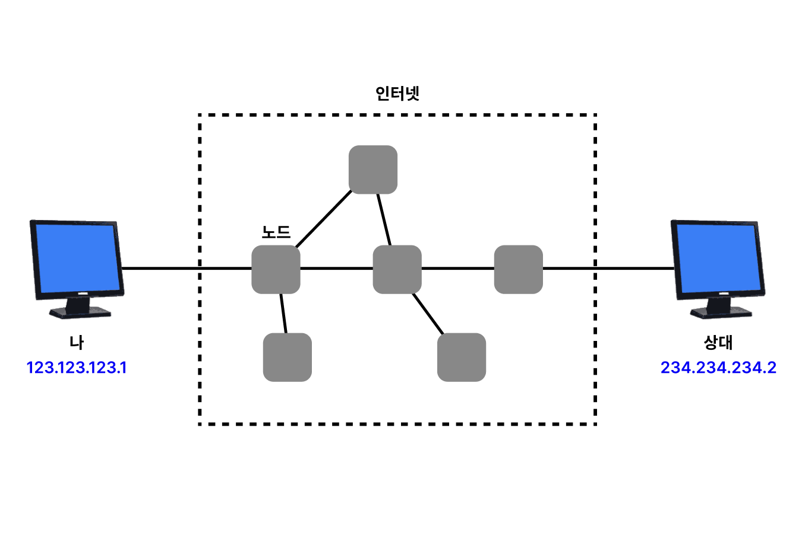
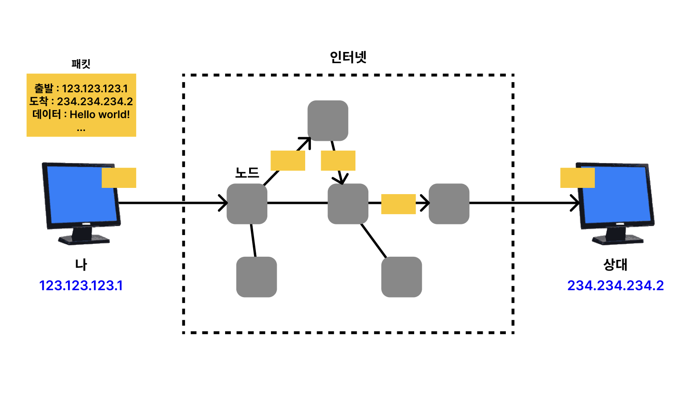
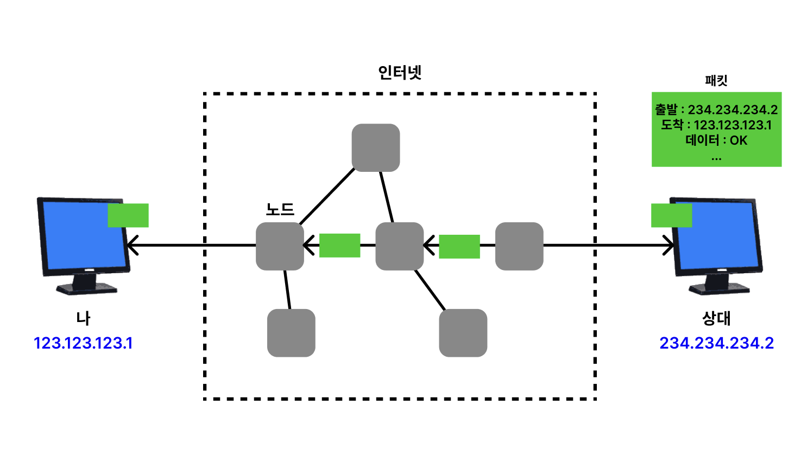
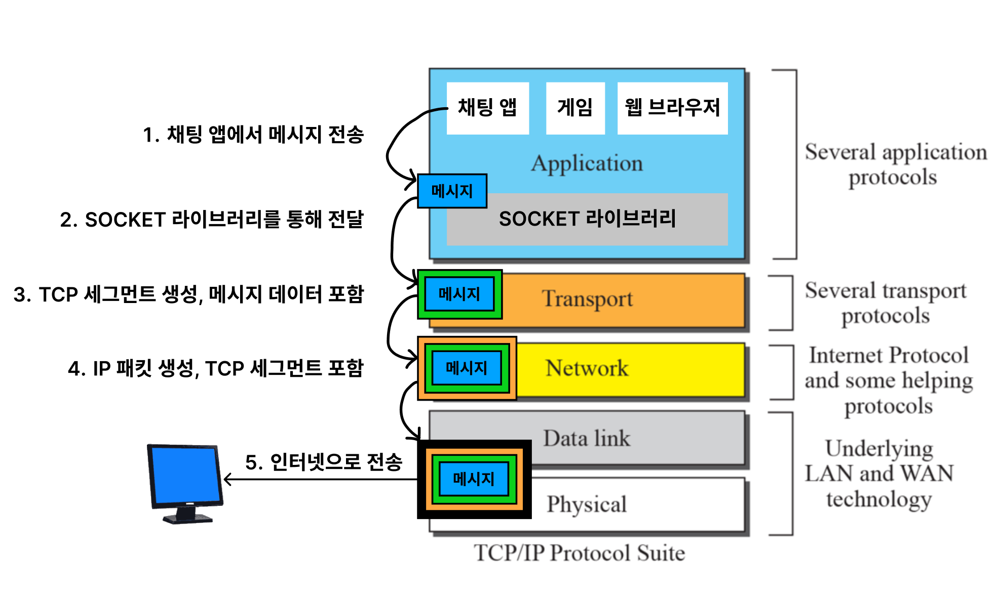
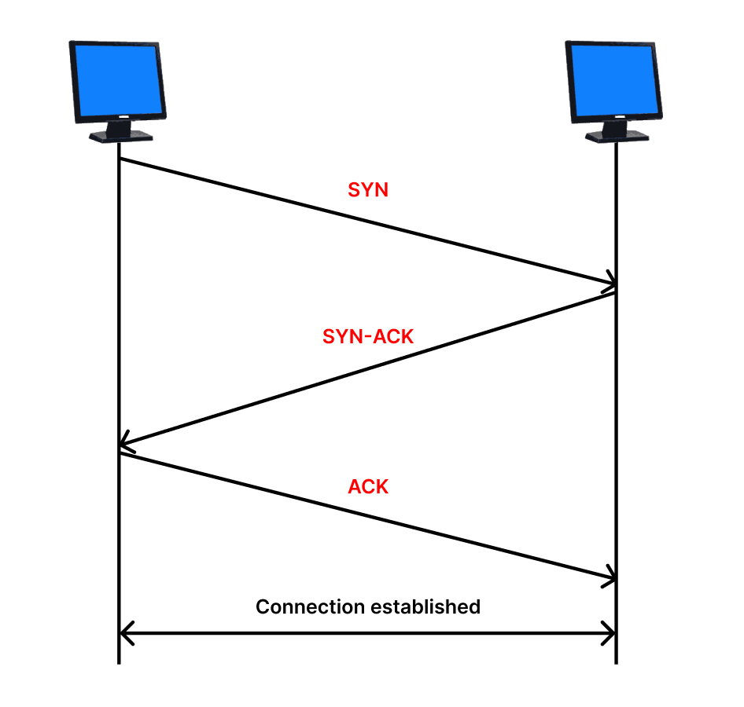
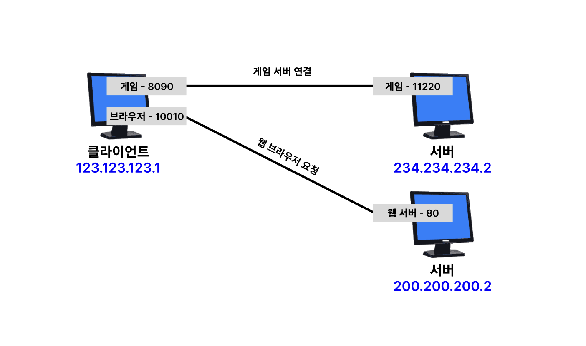

# 1. internet-network

두 개의 컴퓨터가 서로 통신하려고 한다. 만약 두 컴퓨터가 물리적인 케이블로 연결되어 있다면 통신은 쉽게 이루어질 것이다.
하지만 두 컴퓨터가 물리적으로 연결되어 있지 않다면 어떻게 해야 할까? 이를 가능하게 하는 것이 인터넷이다.

인터넷은 단순하지 않다. 해저 광케이블, 위성 등 다양한 매체를 통해 전 세계에 연결되어 있으며,
수많은 중간 노드를 거쳐서 통신이 이루어진다.

어떻게 수많은 복잡한 상황을 극복하고, 통신을 이루어낼 수 있을까?

## IP(Internet Protocol)

이 복잡한 인터넷 망 속에서 통신을 하기 위해서는 IP(Internet Protocol)라는 프로토콜이 사용된다.
IP는 각 컴퓨터에게 주소를 할당하고, 이 주소를 통해 데이터를 전송한다.

내 컴퓨터가 다른 컴퓨터에게 데이터를 전송하고 싶다면, 나와 상대방은 각각 IP 주소를 부여 받아야 한다.

지정한 IP 주소로 데이터를 전송하는 역할을 하는 것이 IP이다. 이때 패킷이라는 단위로 데이터를 전송한다.

### IP 패킷(IP Packet)

패킷은 데이터를 전송하는 단위이다. 간단하게 보면 패킷에는 출발지 IP 주소, 목적지 IP 주소, 데이터 등이 포함되어 있다.

그렇게 전송된 패킷은 중간 노드들을 거쳐 목적지에 도착한다. 중간 노드는 패킷을 받아서 목적지를 확인하고, 다음 노드에게 패킷을 전달한다. 중간 노드들이 `234.234.234.2` 주소로 가는 패킷을 받으면 어디로 보내야 하는지 알고 있기 때문에, 다음 노드에게 계속해서 패킷을 전달하다 보면 목적지에 도착하게 된다.

이때 패킷은 항상 같은 경로로 전달되지 않는다. 패킷은 다양한 경로로 전달되며, 중간 노드들은 패킷을 전달할 때 연결 상태, 혼잡도 등을 고려하여 최적의 경로로 전달한다.

또한 데이터의 크기가 크다면, 데이터를 여러 개의 패킷으로 나누어 전송한다.

상대가 패킷을 잘 받았다면, 상대는 패킷을 받았다는 응답을 보내준다. 이를 통해 패킷이 잘 전달되었는지 확인할 수 있다. 앞서 말한 것처럼 패킷은 항상 같은 경로로 전달되지 않는다는 것을 그림으로 표현했다.

### IP의 한계

단순하고 효율적이지만, IP에는 한계가 있다.

1. **비연결성(Connectionless)**: 목적지가 없거나, 패킷을 받을 수 없는 상태여도 패킷을 전송한다. 이는 친구가 이사를 갔는데, 그 친구가 이사를 갔다는 것을 모르고 계속해서 편지를 보내는 것과 같은 상황이다.

2. **비신뢰성(Unreliable)**: 패킷이 중간에 손실되거나, 순서가 뒤바뀔 수 있다. 앞서 말한 것처럼 데이터의 크기가 크다면, 데이터를 여러 개의 패킷으로 나누어 전송한다. 이때 패킷이 중간에 손실되거나, 순서가 뒤바뀌면 우리가 원하는 데이터를 전송하지 못하는 것이다.

3. **프로그램 구분**: IP는 프로그램을 구분하지 않는다. 따라서 같은 컴퓨터에서 여러 프로그램이 동시에 통신을 하더라도, IP는 이를 구분하지 않는다.

4. **흐름 제어 및 혼잡 제어**: IP는 흐름 제어 및 혼잡 제어를 제공하지 않는다. 이는 데이터를 전송할 때, 데이터의 양이나 속도를 제어하지 않는다는 것이다.

이러한 한계를 극복하기 위해 우리가 어디서 들어본 TCP가 등장한다.

## TCP(Transmission Control Protocol)

IP의 한계였던, 패킷이 중간에 손실되거나, 순서가 뒤바뀌는 등의 문제를 TCP가 해결해준다.

TCP는 IP 위에서 동작하는 프로토콜로, IP가 패킷을 전송하는 역할을 한다면, TCP는 패킷이 잘 전달되었는지, 순서가 맞는지 등을 확인하는 역할을 한다.

### 인터넷 프로토콜 스택

인터넷 프로토콜 스택은 크게 5개의 계층으로 나뉜다.

1. **응용 계층(Application Layer)**: HTTP, FTP, SMTP 등의 프로토콜이 동작하는 계층이다.
2. **전송 계층(Transport Layer)**: TCP, UDP 등의 프로토콜이 동작하는 계층이다.
3. **네트워크 계층(Network Layer)**: IP 프로토콜이 동작하는 계층이다.
4. **링크 계층(Link Layer)**: 이더넷, 와이파이 등의 프로토콜이 동작하는 계층이다.
5. **물리 계층(Physical Layer)**: 물리적인 매체를 통해 데이터를 전송하는 계층이다.

정확한 그림은 아니지만 간단하게 각 계층이 어떻게 동작하는지 알아보자. 우리가 채팅 앱을 통해 메시지를 전송한다면, 응용 계층에서는 메시지를 아래 계층으로 전달한다. 전달된 메시지는 전송 계층에서 TCP 헤더를 붙여서 IP 계층으로 전달한다. IP 계층에서는 IP 헤더를 붙여서 링크 계층으로 전달한다. 링크 계층에서는 이더넷 헤더를 붙여서 물리 계층으로 전달되고 인터넷을 통해 상대방에게 전달된다.

### 캡슐화(Encapsulation)와 역캡슐화(Decapsulation)

각 계층에서 아래 계층으로 데이터를 전달할 때 캡슐화라는 과정을 거친다. 캡슐화는 데이터를 전달할 때, 데이터에 헤더를 붙여서 전달하는 과정을 말한다. 반대로 데이터를 받을 때는 역캡슐화라는 과정을 거친다. 역캡슐화는 데이터를 받을 때, 헤더를 제거하는 과정을 말한다.

### TCP 세그먼트(TCP Segment)

TCP는 IP와 마찬가지로 패킷을 전송한다. 다만, TCP는 패킷을 세그먼트라고 부른다. TCP 세그먼트에는 출발지 포트, 목적지 포트, 순서 번호, 확인 응답 번호, 데이터 등이 포함되어 있다.

TCP 세그먼트는 IP 패킷 안에 포함되어 전송된다.

### 3-way Handshake

TCP는 연결 지향 프로토콜이다. 따라서 연결을 맺고, 데이터를 전송한 후 연결을 끊는다. 이때 연결을 맺기 위해 3-way Handshake를 사용한다.

1. **클라이언트가 서버에게 연결 요청**: 클라이언트가 서버에게 연결을 요청한다. 이때 클라이언트는 SYN 패킷을 보낸다.

2. **서버가 클라이언트에게 연결 요청 수락**: 서버는 클라이언트에게 연결 요청을 수락한다. 이때 서버는 SYN, ACK 패킷을 보낸다.

3. **클라이언트가 서버에게 연결 요청 수락**: 클라이언트는 서버에게 연결 요청을 수락한다. 이때 클라이언트는 ACK 패킷을 보낸다.

이렇게 3-way Handshake를 통해 연결이 맺어진다.

### 데이터를 잘 받았는지 확인하기

TCP는 데이터를 잘 받았는지 확인하기 위해 확인 응답 번호를 사용한다. 데이터를 받은 후, 상대방에게 데이터를 잘 받았다는 응답을 보내준다. 이를 통해 데이터가 잘 전달되었는지 확인할 수 있다.

### 데이터의 순서가 뒤바뀌는 것을 방지하기

TCP는 데이터의 순서가 뒤바뀌는 것을 방지하기 위해 순서 번호를 사용한다. 데이터를 전송할 때, 데이터에 순서 번호를 붙여서 전송한다. 상대방은 순서 번호를 통해 데이터의 순서를 파악하고, 데이터를 재조립한다.

### TCP의 특징

1. **연결 지향(Connection-Oriented)**: TCP는 연결 지향 프로토콜이다. 연결을 맺고, 데이터를 전송한 후 연결을 끊는다. 이는 편지를 보낼 때, 편지를 보내기 전에 상대방과 연락을 취하고, 편지를 보낸 후에 연락을 끊는 것과 같은 상황이다.

2. **신뢰성(Reliable)**: TCP는 신뢰성 있는 프로토콜이다. 데이터가 중간에 손실되거나, 순서가 뒤바뀌는 등의 문제를 해결해준다.

3. **흐름 제어 및 혼잡 제어**: TCP는 흐름 제어 및 혼잡 제어를 제공한다. 흐름 제어는 데이터의 양이나 속도를 제어하는 것이고, 혼잡 제어는 네트워크의 혼잡 상태를 파악하고, 데이터의 속도를 제어하는 것이다.

4. **프로그램 구분**: TCP는 프로그램을 구분한다. 따라서 같은 컴퓨터에서 여러 프로그램이 동시에 통신을 하더라도, TCP는 이를 구분한다.

이러한 장점들로 인해 현재까지도 TCP가 가장 많이 사용되고 있다.

## UDP(User Datagram Protocol)

TCP와 마찬가지로 IP 위에서 동작하는 프로토콜이다. 하지만, TCP와는 다르게 UDP는 연결 지향이 아니고, 신뢰성이 낮다.

### TCP와의 차이점

- TCP의 3-way Handshake 같은 기능이 없기 때문에 연결지향적이지 않다.
- 데이터를 잘 받았는지 확인하는 과정이 없기 때문에 신뢰성이 낮다.
- 데이터의 순서를 보장하지 않는다.

거의 기능이 없고 IP와 거의 비슷하다. 포트나 체크섬 정도만 추가된다. 따라서 응용 계층에서 추가적인 기능을 구현해야 한다.

### 그럼 왜 UDP를 사용할까?

TCP는 여러 기능이 포함된 만큼 복잡하고, 처리 속도가 느리다. 반면, UDP는 기능이 거의 없기 때문에 처리 속도가 빠르다. 따라서 신뢰성이나 연결 지향성이 크게 중요하지 않거나 처리 속도가 중요한 경우에 UDP를 사용하기도 한다.

## 포트(Port)

포트는 컴퓨터 내에서 프로세스를 구분하기 위해 사용된다. IP로 받은 데이터가 어떤 프로세스로 전달되어야 하는지를 포트를 통해 구분한다. 간단히 설명하면 IP 주소는 아파트의 주소, 포트는 아파트 안의 호수라고 생각할 수 있다.

전송 계층에서 목적지 포트와 출발지 포트를 포함하여 데이터를 전송한다. 목적지 포트를 통해 데이터를 받을 프로세스를 구분하고, 출발지 포트를 통해 데이터를 보낸 프로세스를 구분한다.

포트는 0부터 65535까지 사용할 수 있다. 0~1023번 포트는 잘 알려진 포트(Well-known Port)로, 특정 프로토콜에 할당되어 있다. 예를 들어, 80번 포트는 HTTP, 443번 포트는 HTTPS에 할당되어 있다. 따라서 잘 알려진 포트는 사용하지 않는 것이 좋다.

## DNS(Domain Name System)

인터넷에서는 IP 주소를 사용하여 통신을 한다. 하지만, IP 주소는 사람이 외우기 힘들다. 예를 들어 `123.123.123.1:80` 이런식으로 구글 사이트에 접속해야 한다면 상당히 불편할 것이다. 이러한 불편함을 해결하기 위해 도메인 이름을 사용한다.

도메인 이름은 사람이 외우기 쉽게 만들어진 이름이다. 예를 들어, `www.google.com`이라는 도메인 이름을 사용하면, 구글 사이트에 접속할 수 있다. 이때 도메인 이름을 IP 주소로 변환하는 것이 DNS의 역할이다.

DNS는 중간 관리자 역할을 한다. 도메인 이름을 IP 주소로 변환하거나, IP 주소를 도메인 이름으로 변환하는 역할을 한다. 우리가 서버를 개발하고 배포하려고 할 때 도메인 이름과 IP 주소를 DNS에 등록하면, 사용자는 도메인 이름을 통해 서버에 접속할 수 있는 것이다.

## 정리

인터넷은 두 컴퓨터가 물리적으로 연결되어 있지 않더라도 통신을 할 수 있게 해주는 것이다. 이를 가능하게 하는 것이 IP이다. IP는 각 컴퓨터에게 주소를 할당하고, 이 주소를 통해 데이터를 전송한다. IP는 패킷이라는 단위로 데이터를 전송하며, 중간 노드들을 거쳐 목적지에 도착한다.

하지만 IP에는 한계가 있다. 이러한 한계를 극복하기 위해 TCP가 등장한다. TCP는 IP가 패킷을 전송하는 역할을 한다면, TCP는 패킷이 잘 전달되었는지, 순서가 맞는지 등을 확인하는 역할을 한다. TCP는 IP와 마찬가지로 패킷을 전송하며, 패킷을 세그먼트라고 부른다.

TCP는 연결 지향 프로토콜이며, 신뢰성이 높다. 또한, 흐름 제어 및 혼잡 제어를 제공한다. 이러한 장점들로 인해 현재까지도 가장 많이 사용되고 있다.

UDP는 TCP와 마찬가지로 IP 위에서 동작하는 프로토콜이다. 하지만, TCP와는 다르게 UDP는 연결 지향적이지 않고, 신뢰성이 낮다. UDP는 기능이 거의 없기 때문에 처리 속도가 빠르다.

포트는 컴퓨터 내에서 프로세스를 구분하기 위해 사용된다. IP로 받은 데이터가 어떤 프로세스로 전달되어야 하는지를 포트를 통해 구분한다.

DNS는 도메인 이름을 IP 주소로 변환하거나, IP 주소를 도메인 이름으로 변환하는 역할을 한다. 사용자는 도메인 이름을 통해 서버에 접속할 수 있게 해준다.

## 참고

- [모든 개발자를 위한 HTTP 웹 기본 지식 - 인프런](https://www.inflearn.com/course/http-%EC%9B%B9-%EB%84%A4%ED%8A%B8%EC%9B%8C%ED%81%AC/dashboard)
