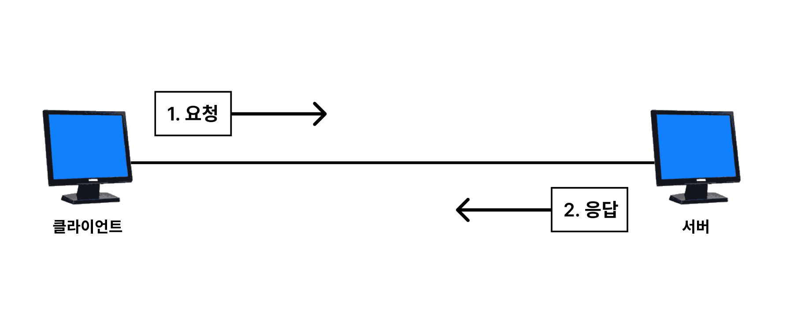
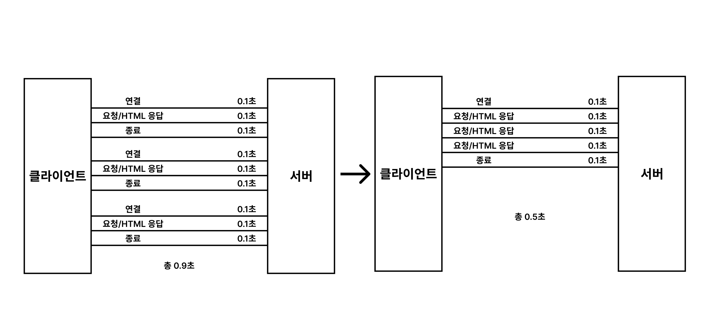
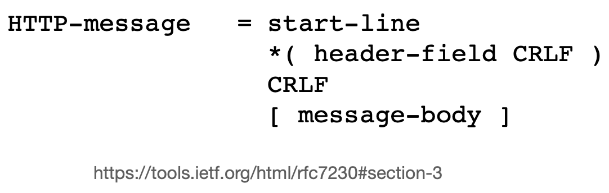

# 3. HTTP

## 모든 것이 HTTP

HTTP는 HyperText Transfer Protocol의 약자로, 웹에서 데이터를 주고받을 수 있는 프로토콜이다.
현재 웹에서 사용하는 대부분의 데이터(HTML, 이미지, 음성 등)는 HTTP를 통해 전송된다. 또한 서버 간에 데이터(XML, JSON 등)를 주고받을 때에도 HTTP를 사용한다.

### HTTP의 역사

- HTTP/0.9 1991년: GET 메서드만 지원, HTTP 헤더X
- HTTP/1.0 1996년: 메서드, 헤더 추가
- HTTP/1.1 1997년: 가장 많이 사용, 우리에게 가장 중요한 버전  
  `RFC2068 (1997) -> RFC2616 (1999) -> RFC7230~7235 (2014)`
- HTTP/2 2015년: 성능 개선
- HTTP/3 진행중: TCP 대신에 UDP 사용, 성능 개선

현재 가장 많이 사용하는 버전은 HTTP/1.1이고, 2나 3은 성능 개선을 위해 나온 버전이다. 또한 HTTP/1.1이나 HTTP/2는 TCP 기반으로 동작하지만, 3은 UDP 기반으로 동작한다.

## HTTP의 특징

- 클라이언트-서버 구조
- 무상태(Stateless)
- 비연결성(Connectionless)
- HTTP 메시지
- 단순함, 확장 가능

## 클라이언트-서버 구조



클라이언트는 요청을 보내고 응답을 기다린다. 서버는 해당 요청을 받아서 응답을 보낸다.  
이러한 구조의 장점은 서버와 클라이언트가 각각 독립적으로 발전할 수 있다는 것이다.
클라이언트는 UI, UX에 집중하고, 서버는 데이터, 비즈니스 로직에 집중할 수 있다.  
간단하게 예시를 들자면 서비스의 인기가 급증하여 서버의 부하가 증가되더라도 클라이언트의 변경 없이 서버의 확장만으로 문제를 해결할 수 있다.

## 무상태(Stateless)

Stateless의 반대 개념은 Stateful이다. 먼저 이 둘의 차이를 예시를 통해 알아보자.

### Stateful vs Stateless

```plaintext
Stateful

고객: 이 사과는 얼마인가요?
상인: 1000원입니다. (사과 상태 유지)

고객: 2개 살게요.
상인: 2000원입니다.
```

위 대화에서는 고객이 "2개 살게요"라고 말했을 때 이전 대화(사과의 가격을 물어본 것)의 맥락을 기억하기 때문에 고객이 사과 2개를 산다고 판단할 수 있다. 즉, 이전의 상태를 기억하고 있다. 이러한 방식을 `Stateful`이라고 한다.

```plaintext
Stateless

고객: 이 사과는 얼마인가요?
상인A: 1000원입니다.

고객: 2개 살게요.
상인B: ? 무엇을 2개 구매하실 건가요?

고객: 사과 2개를 살게요.
상인C: 2000원입니다.
```

위 대화는 조금 다르다. 상인이 중간에 바뀌었기 때문에 상인B는 고객이 무엇을 2개 살 것인지 모른다. 즉 이전의 상태를 기억하지 않는다. 따라서 고객은 아래처럼 구체적으로 말해야 한다. 그러면 상인C로 바뀌더라도 요청의 응답할 수 있다. 이러한 방식을 `Stateless`라고 한다.

- Stateful은 중간에 다른 상인으로 바뀌면 안된다. 또는 바뀌더라도 이전의 상인이 알고 있는 상태를 공유해야 한다.
- Stateless는 중간에 다른 상인으로 바뀌어도 된다. 클라이언트가 구체적으로 말하기 때문에 이전의 상태를 공유할 필요가 없다.

### HTTP는 Stateless

HTTP는 Stateless 프로토콜이다. 즉, 이전 요청이 다음 요청에 영향을 주지 않는다. 이러한 특징 때문에 서버는 클라이언트의 상태를 기억할 필요가 없다. 따라서 서버는 더 많은 요청을 처리할 수 있고, 클라이언트는 더 많은 서버에 요청을 보낼 수 있다. 확장성 측면에서 매우 중요한 특징이다.

장점만 있는 것 같은 `Stateless`이지만, 단점도 있다. 우선 모든 것을 무상태로 설계할 수 있는 것은 아니다. 로그인이 필요한 서비스 같은 경우 사용자가 로그인 했다는 상태를 서버에서 기억해야 한다. 일반적으로 브라우저 쿠키와 세션을 사용하여 상태를 유지한다. 그럴 때는 최소한의 상태를 유지하려고 노력해야 한다.

두 번째 단점은 상태를 유지하지 않는 대신, 클라이언트가 요청에 필요한 모든 정보를 제공해야 한다. 즉, 요청 메시지(데이터)의 크기가 커진다는 것이다.

## 비연결성(Connectionless)

HTTP는 비연결성 프로토콜이다. 즉, 클라이언트가 서버에 요청을 보내고, 서버가 클라이언트에 응답을 보내면 연결을 끊는다. 일반적으로 초 단위 이하의 빠른 속도로 응답하고 연결을 끊기 때문에 1시간 동안 수천명이 서비스를 이용한다고 하더라도 실제 서버에서 동시에 처리하는 요청은 수십개 이하로 매우 작다고 한다. 서버 입장에서는 연결을 유지하는 곳에 자원을 할당할 필요가 없기 때문에 더 많은 요청을 처리할 수 있다.

하지만 이러한 특징 때문에 클라이언트가 서버에 요청을 보낼 때마다 새로운 연결을 맺어야 한다. 이는 요청마다 새로운 연결을 맺기 때문에 요청마다 연결을 맺는 데 드는 시간이 추가된다. 웹 브라우저로 웹 페이지를 요청할 때, HTML, CSS, JavaScript, 이미지 등 수십 개의 리소스를 요청하게 되는데 이 때마다 연결을 맺어야 하는 것이다. 하지만 현재는 `HTTP 지속 연결(Persistent Connection)`을 사용하여 이러한 문제를 해결한다.

### HTTP 지속 연결(Persistent Connection)



실제로 HTTP/2나 HTTP/3에서는 TCP 연결을 최소화하고, 하나의 연결로 여러 요청을 처리한다. 이를 통해 연결을 맺는 데 드는 시간을 줄이고, 더 많은 요청을 처리할 수 있다고 한다.

## HTTP 메시지

HTTP 메시지는 서버와 클라이언트 간에 데이터를 주고받는 방식이다. HTTP 메시지는 크게 요청 메시지와 응답 메시지로 나뉜다.

### 요청, 응답 메시지 예시

요청 메시지

```plaintext
GET /search?q=hello&hl=ko HTTP/1.1
Host: www.google.com
```

응답 메시지

```plaintext
HTTP/1.1 200 OK
Content-Type: text/html; charset=UTF-8
Content-Length: 1234

<!DOCTYPE html>
<html>
  <body>
    ...
  </body>
</html>
```

요청 메시지는 클라이언트가 서버에게 보내는 메시지이고, 응답 메시지는 서버가 클라이언트에게 보내는 메시지이다. 추가로 예시에는 없지만 요청 메시지에도 Body가 있을 수 있다. 예를 들어, POST 메서드를 사용할 때 Body에 데이터를 담아서 서버에 전송할 수 있다.

### HTTP 메시지 구조

HTTP 메시지는 크게 세 부분으로 나뉜다.



- Start Line: 요청 라인, 상태 라인
- Header: 헤더
- Body: 본문

CRLF는 Carriage Return Line Feed의 약자로, 줄 바꿈을 의미한다. 즉, `\r\n`을 의미한다. 위 예시를 사용하여 각 부분을 알아보자.

### Start Line

```plaintext
GET /search?q=hello&hl=ko HTTP/1.1
```

- 요청 라인: 요청 메시지의 첫 번째 줄이며 요청 메서드(GET), 요청 URI(/search?q=hello&hl=ko), HTTP 버전(1.1)으로 이루어져 있다.
  - 요청 메서드: 서버가 수행해야 할 동작을 지정한다. 예시로는 GET, POST, PUT, DELETE 등이 있다.
  - 요청 URI: `absolute-path[?query]` 형태로 이루어져 있다. `absolute-path`는 요청하는 리소스의 경로를 나타내고, `query`는 요청하는 리소스에 대한 추가 정보를 담고 있다.
  - HTTP 버전: 요청 메시지가 사용하는 HTTP 버전을 나타낸다.

```plaintext
HTTP/1.1 200 OK
```

- 상태 라인: 응답 메시지의 첫 번째 줄이며 HTTP 버전(1.1), 상태 코드(200), 상태 메시지(OK)로 이루어져 있다.
  - 상태 코드: 서버가 클라이언트에게 응답하는 방식을 지정한다. 예시로는 200(OK), 404(Not Found), 500(Internal Server Error) 등이 있다.
  - 상태 메시지: 상태 코드에 대한 우리가 이해하기 쉬운 설명을 담고 있다. 예를 들어, 200(OK) 상태 코드는 요청이 성공했음을 의미하고, 상태 메시지는 OK로 이루어져 있다.

### Header

```plaintext
Host: www.google.com
```

```plaintext
Content-Type: text/html; charset=UTF-8
Content-Length: 1234
```

- 헤더: 요청이나 응답에 대한 정보를 담고 있다. `key: value` 형태로 이루어져 있다.
  - `field-name: OWS field-value OWS` 형태로 이루어져 있다.
  - `OWS`는 Optional Whitespace의 약자로, 공백이 있어도 되고 없어도 된다는 의미이다.
  - `field-name`은 헤더의 이름을 나타내고, `field-value`는 헤더의 값이다.
  - `field-name`은 대소문자를 구분하지 않는다.
- 본문의 내용, 크기, 형식, 인증 등 다양한 정보를 담고 있으며, 필요에 따라 추가적인 헤더를 만들어 사용할 수 있다.

### Body

```plaintext
<!DOCTYPE html>
<html>
  <body>
    ...
  </body>
</html>
```

- 본문: 요청이나 응답의 본문으로, HTML, 이미지, JSON, XML 등의 Byte로 표현할 수 있는 모든 데이터를 담을 수 있다.

## 단순함, 확장 가능

HTTP는 단순하고 확장 가능한 프로토콜이다. 단순하다는 것은 HTTP 메시지가 텍스트로 이루어져 있어서 사람이 읽을 수 있다는 것이다. 또한 확장 가능하다는 것은 HTTP 헤더에 새로운 필드를 추가하거나, 새로운 메서드를 정의할 수 있다는 것이다. 이러한 특징 때문에 HTTP는 다양한 용도로 사용되고 있다.

## 정리

HTTP는 `HyperText Transfer Protocol`의 약자로 웹에서 데이터를 주고받을 수 있는 프로토콜이다. HTTP는 클라이언트-서버 구조, 무상태, 비연결성, HTTP 메시지, 단순함, 확장 가능한 특징을 가지고 있다. 또한 HTTP 메시지는 요청 메시지와 응답 메시지로 나뉘며, 각각 Start Line, Header, Body로 이루어져 있다. HTTP는 단순하고 확장 가능한 프로토콜이기 때문에 지금까지도 많이 사용되고 있다. 최근에는 HTTP/2나 HTTP/3 같은 버전이 나오면서 성능 개선을 위해 노력하고 있다.

## 참고

- [모든 개발자를 위한 HTTP 웹 기본 지식 - 인프런](https://www.inflearn.com/course/http-%EC%9B%B9-%EB%84%A4%ED%8A%B8%EC%9B%8C%ED%81%AC/dashboard)
