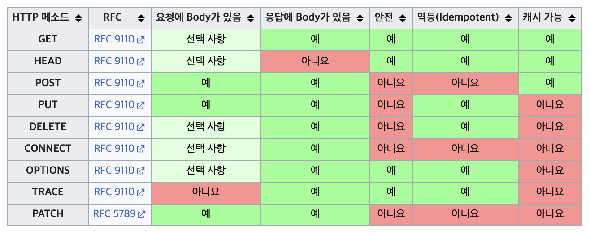

# 4. HTTP Method

HTTP 메서드는 클라이언트가 서버에게 요청의 목적(행위)을 알리는데 사용한다.

## HTTP API를 만들어보자

요구사항: 회원 정보 관리 API를 만들어보자.

- 회원 목록 조회
- 회원 조회
- 회원 등록
- 회원 수정
- 회원 삭제

```
- 회원 목록 조회: /read-memeber-list
- 회원 조회: /read-member-by-id
- 회원 등록: /create-member
- 회원 수정: /update-member
- 회원 삭제: /delete-member
```

URI만으로 어떤 동작을 하는지는 알 수 있는 것 같은데, 이것은 좋은 API 설계일까?

URI는 자원을 표현하는데 집중해야 한다. 동사는 행위에 대한 것이므로 URI에 동사를 사용하는 것은 좋지 않다. 그렇다면 어떻게 URI를 설계해야 할까?

## 리소스

리소스는 API가 관리하는 개념을 의미한다. 회원 목록 조회, 회원 조회, 회원 등록, 회원 수정, 회원 삭제는 모두 회원이라는 리소스를 관리한다. 따라서 리소스를 URI에 표현해야 한다.

```bash
# 참고: 계층 구조상 상위를 컬렉션으로 보고 복수로 사용하는 것이 좋다.
- 회원 목록 조회: /members
- 회원 조회: /members/{id}
- 회원 등록: /members
- 회원 수정: /members/{id}
- 회원 삭제: /members/{id}
```

members는 우리가 관리하는 리소스인 회원을 표현한 것이고 {id}는 회원을 식별하는데 사용하는 식별자이다. 식별자는 어떤 회원을 조회, 수정, 삭제할지 식별하는데 사용한다.

가장 중요한 것은 리소스와 행위를 분류하여 URI는 리소스를 식별하는데 중점을 두고 설계해야 한다.

- 리소스: 회원
- 행위: 조회, 등록, 수정, 삭제

좋아보이지만 큰 문제가 있다. 식별자 1을 가진 회원을 조회하거나 수정할 때 URI가 중복된다. 해당 요청이 조회인지 수정인지 구분할 수 없다는 것이다. 즉, URI만으로는 무엇을 해야 하는지 정확하게 알 수 없다.

## HTTP Method

HTTP 메서드는 클라이언트가 서버에게 요청의 목적(행위)을 알리는데 사용한다. 따라서 URI에 동사를 사용하지 않아도 HTTP 메서드를 사용하여 행위를 명확하게 표현할 수 있다.

주로 사용하는 HTTP 메서드는 다음과 같다.

```bash
GET: 리소스 조회
POST: 리소스 생성
PUT: 리소스 수정(대체), 리소스가 없으면 생성
PATCH: 리소스 (일부)수정
DELETE: 리소스 삭제
```

`GET`은 리소스를 조회할 때 사용하고, `POST`는 리소스를 생성할 때 사용한다. `PUT`과 `PATCH`는 리소스를 수정할 때 사용하고, `DELETE`는 리소스를 삭제할 때 사용한다.

우리는 HTTP 메서드를 사용하여 개선된 URI를 만들 수 있다.

```bash
- 회원 목록 조회: GET /members
- 회원 조회: GET /members/{id}
- 회원 등록: POST /members
- 회원 수정: PUT /members/{id}
- 회원 삭제: DELETE /members/{id}
```

### GET

GET은 리소스를 조회할 때 사용한다. GET은 요청을 전송할 때 필요한 데이터를 쿼리 스트링(쿼리 파라미터)에 담아서 전송한다. 쿼리 스트링은 `?` 뒤에 `key=value` 형식으로 요청한다.

메시지 바디를 사용해서 데이터를 전송할 수 있지만, 지원하지 않는 곳이 많아서 권장하지 않는다.

```
# 요청 메시지
GET /members/2 HTTP/1.1
Host: localhost:8080

# 응답 메시지
HTTP/1.1 200 OK
Content-Type: application/json
Content-Length: 26

{
  "id": "2",
  "username": "user2"
}
```

### POST

POST는 서버에게 데이터를 전송하고 데이터를 처리할 때 사용한다. POST는 요청을 전송할 때 메시지 바디를 가지고 데이터를 전송한다.

메시지 바디를 통해 들어온 데이터를 처리하는 모든 기능을 수행할 수 있다. 주로 새로운 리소스를 생성할 때 사용하거나 프로세스를 처리할 때 사용한다.

```
# 요청 메시지
POST /members HTTP/1.1
Host: localhost:8080
Content-Type: application/json
Content-Length: 26

{
  "username": "newUser"
}

# 응답 메시지
HTTP/1.1 201 Created
Content-Type: application/json
Content-Length: 26
Location: /members/3

{
  "id": "3",
  "username": "newUser"
}
```

클라이언트가 POST로 회원을 생성하면 서버는 회원을 생성하고 생성된 회원의 정보를 응답한다. 응답 메시지에는 생성된 회원의 정보와 생성된 회원의 URI를 응답한다.

POST를 정리하면 다음과 같다.

- 새로운 리소스 생성(등록)  
  예시: 회원 등록, 주문 생성, 게시글 생성
- 요청 데이터 처리  
  POST의 결과로 새로운 리소스가 생성되지 않을 수도 있다.
  예시: 주문에서 결제완료 -> 배달시작 -> 배달완료처럼 단순히 값 변경을 넘어 프로세스의 상태를 변경되는 경우
- 다른 메서드로 처리하기 애매한 경우  
  예시: JSON으로 조회 데이터를 넘겨야 하는 경우

즉, 특정 URI에 POST 요청이 오면 요청 데이터를 어떻게 처리할지 결정해야 한다. (정해진 방식이 없다.)

정해진 방식이 없기 때문에 조회도 POST로 처리할 수 있다. 하지만 대부분의 경우 조회는 GET 메서드가 유리하다. GET은 캐싱을 사용할 수 있고, 브라우저에서 즐겨찾기에 추가하거나 공유하기에도 좋다.

### PUT

PUT은 리소스를 수정(대체)할 때 사용한다. 리소스가 있으면 대체, 리소스가 없으면 생성한다. 파일 덮어쓰기와 유사하다.

POST(`POST /members`)와 PUT(`PUT /members/3`)차이점은 클라이언트가 리소스의 위치(`3`)를 알고 URI를 지정한다는 것이다. POST는 서버가 리소스의 위치를 생성하고 응답해주지만, PUT은 클라이언트가 리소스의 위치를 알고 URI를 지정한다.

```
# 리소스가 있는 경우
{
    "id": "3",
    "username": "user3"
}

# 요청 메시지 1
PUT /members/3 HTTP/1.1
Host: localhost:8080
Content-Type: application/json
Content-Length: 26

{
  "id": "3",
  "username": "updatedUser3"
}

# 결과
{
    "id": "3",
    "username": "updatedUser3"
}

# 요청 메시지 2
PUT /members/3 HTTP/1.1
Host: localhost:8080
Content-Type: application/json
Content-Length: 26

{
  "id": "3",
}

# 결과
{
    "id": "3", // username 필드가 없어졌다.
}
```

두 요청은 이미 존재하는 리소스에 대해 PUT을 사용했다. 두 요청과 결과에서 알 수 있는 것은 PUT은 리소스를 대체한다는 것이다.

```
# 리소스가 없는 경우
# 요청 메시지
PUT /members/4 HTTP/1.1
Host: localhost:8080
Content-Type: application/json
Content-Length: 26

{
  "id": "4",
  "username": "newUser4"
}

# 결과
{
    "id": "4",
    "username": "newUser4"
}
```

리소스가 없는 경우 PUT은 리소스를 생성한다. 즉, 리소스가 있으면 대체하고, 리소스가 없으면 생성한다.

### PATCH

PATCH는 리소스의 일부를 수정할 때 사용한다.

```
# 리소스
{
    "id": "3",
    "username": "user3"
}

# 요청 메시지
PATCH /members/3 HTTP/1.1
Host: localhost:8080
Content-Type: application/json
Content-Length: 26

{
  "username": "updatedUser3" // username만 수정
}

# 결과
{
    "id": "3", // id 필드는 변경되지 않았다.
    "username": "updatedUser3"
}
```

PUT과 다르게 대체되지 않고 일부만 변경된다.

### PUT vs PATCH

`PUT`과 `PATCH`의 차이는 리소스 전체를 수정하는지, 일부를 수정하는지에 대한 차이이다. `PUT`은 리소스 전체를 수정할 때 사용하고 `PATCH`는 리소스의 일부를 수정할 때 사용한다. `PUT`은 리소스가 없으면 생성하고, `PATCH`는 리소스가 없으면 에러를 응답한다. 이것은 `PUT`은 `idempotent`하고 `PATCH`는 `non-idempotent`하다는 것을 의미한다.

> idempotent는 여러 번 요청해도 결과가 같은 것을 의미하고, non-idempotent는 여러 번 요청하면 결과가 달라질 수 있는 것을 의미한다.

### DELETE

DELETE는 리소스를 삭제할 때 사용한다.

```
# 리소스
{
    "id": "3",
    "username": "user3"
}

# 요청 메시지
DELETE /members/3 HTTP/1.1
Host: localhost:8080

# 결과
리소스 삭제
```

DELETE는 리소스를 삭제할 때 사용한다. 리소스가 삭제되면 200 OK를 응답한다. 리소스가 없으면 404 Not Found를 응답한다.

## HTTP Method의 속성

HTTP 메서드는 목적에 따라 다양한 속성을 가진다.

- 안전(Safe): 호출해도 리소스를 변경하지 않는다.
- 멱등(Idempotent): 호출한 횟수와 상관없이 결과가 같다.
- 캐시가능(Cacheable): 응답 결과 리소스를 캐시해도 된다.



[출처](https://ko.wikipedia.org/wiki/HTTP)

### 안전(Safe)

안전은 호출해도 리소스를 변경하지 않는다는 것을 의미한다. GET은 안전하다. GET은 서버에게 리소스를 조회하라고 요청하는 것이기 때문에 리소스를 변경하지 않는다.

참고로 HEAD도 안전하다. HEAD는 GET과 동일하지만 응답 본문을 받지 않는 메서드이다.

### 멱등(Idempotent)

```
f(f(x)) = f(x)
```

멱등은 한 번 호출하나 여러 번 호출하나 결과가 같다는 것을 의미한다.

- GET: 한 번 조회하나 여러 번 조회하나 같은 결과를 반환한다.
- PUT: 동일한 요청을 여러 번 해도 결과가 같다. (덮어쓰기를 생각하면 쉬움)
- DELETE: 한 번 삭제하나 여러 번 삭제하나 같은 결과를 반환한다.
- POST: 멱등이 아니다. 한 번 생성하나 여러 번 생성하면 다른 결과를 반환한다.

멱등은 중요한 속성이다. 네트워크 장애로 인해 중복 요청이 발생할 수 있기 때문에 멱등성이 보장되지 않으면 중복 데이터가 발생할 수 있다.

예를 들어, 결제 시스템에서 중복 결제가 발생하면 고객에게 불만을 줄 수 있다. 중복 결제가 발생하지 않도록 결제 시스템은 멱등성을 보장해야 한다. [토스 페이먼츠 블로그 - 멱등성이 뭔가요?](https://docs.tosspayments.com/blog/what-is-idempotency)

참고로 외부 요인으로 중간에 리소스가 변경되어 멱등성이 깨질 수 있다. 예를 들어, 사용자A가 GET 요청을 보내 X라는 리소스를 조회하고 한번 더 요청을 보내는 중간에 사용자B가 X 리소스를 변경하면 사용자A가 두 번 요청을 보내도 결과가 같지 않을 수 있다. 하지만 이것은 외부 요인으로 인한 것이기 때문에 멱등성이 깨진 것이 아니다. (외부 요인으로 생기는 문제까지 고려하면 무한한 멱등성을 보장할 수 없다.)

### 캐시가능(Cacheable)

캐시가능은 응답 결과를 캐시해도 된다는 것을 의미한다.

여러 메서드가 캐시가 가능하지만 실제로는 GET과 HEAD가 주로 캐시에 사용된다. GET과 HEAD는 안전하고 멱등하기 때문에 캐시가 가능하다. 추가로 POST도 캐시가 가능하지만 복잡하고 많은 제약이 있어서 잘 사용하지 않는다고 한다.

## 마무리

- URI는 리소스를 표현해야 한다.
- 리소스와 행위를 분리해야 한다.
- HTTP 메서드로 행위를 표현한다.
- 안전성: 호출해도 리소스를 변경하지 않는다.
- 멱등성: 한 번 호출하나 여러 번 호출하나 같은 결과를 반환한다.
- 캐시가능: 응답 결과를 캐시해도 된다.

URI는 리소스를 표현하는데 집중해야 하고, HTTP 메서드로 행위를 표현해야 한다. 즉, 리소스와 행위를 분리해야 한다. 물론 실제로는 리소스와 행위가 서로 연관되어 있기 때문에 완전히 분리하기는 어려울 수 있지만 리소스와 행위를 분리하려는 노력이 중요하다. (어려운 경우 컨트롤 URI를 사용하기도 한다.) HTTP 메서드의 속성으로는 안전성, 멱등성, 캐시가능이 있다. 특히 멱등성은 중요한 속성이니 잘 알아두자.

## 참고

- [HTTP 메서드 - 위키백과](https://ko.wikipedia.org/wiki/HTTP)
- [멱등성이 뭔가요?](https://docs.tosspayments.com/blog/what-is-idempotency)
- [모든 개발자를 위한 HTTP 웹 기본 지식 - 인프런](https://www.inflearn.com/course/http-%EC%9B%B9-%EB%84%A4%ED%8A%B8%EC%9B%8C%ED%81%AC/dashboard)
