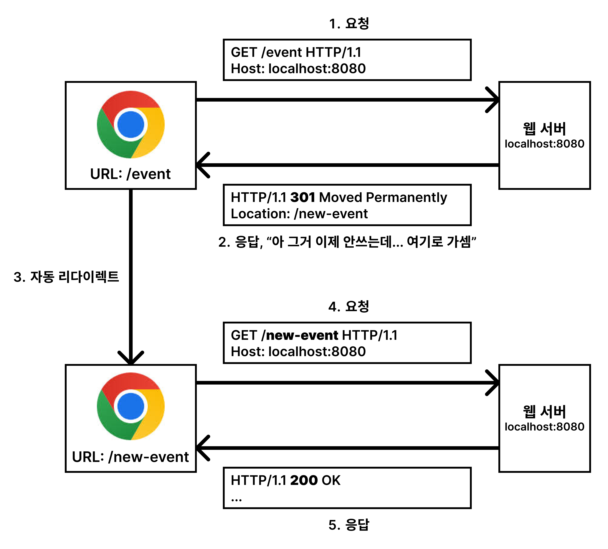
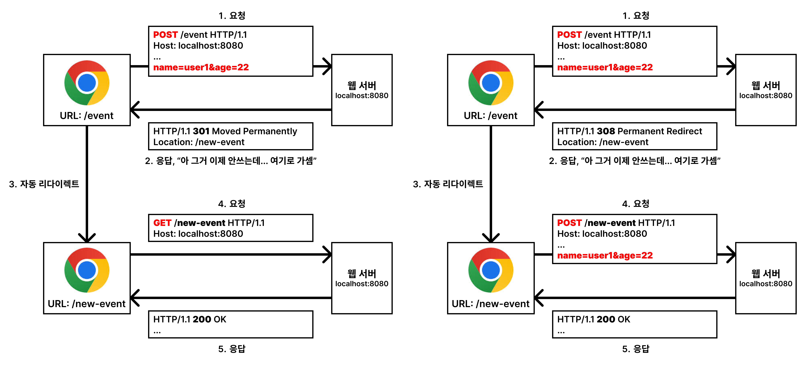
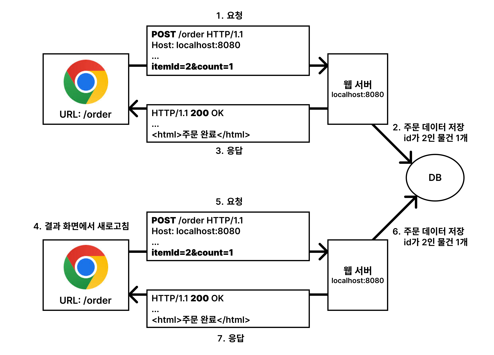
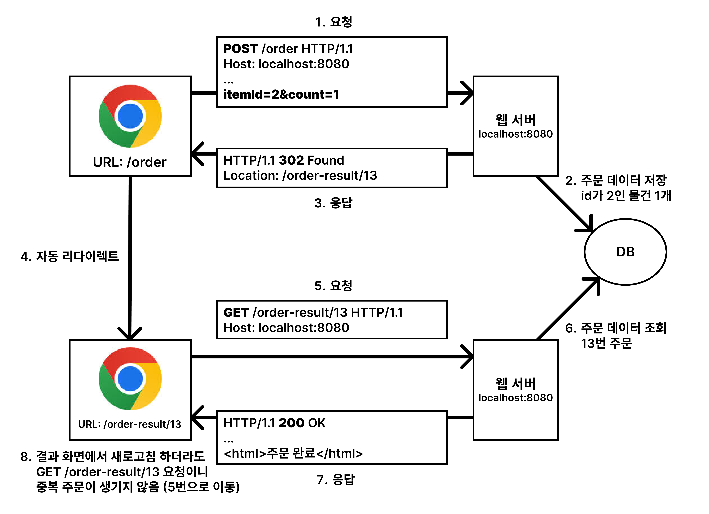

# 6. HTTP 상태 코드

HTTP Status Code는 Client가 보낸 HTTP 요청에 대한 처리 상태를 나타낸다.  
5개의 그룹으로 나누어져 있으며, 각 그룹은 상태 코드의 첫 번째 숫자로 식별된다.

```
- 1xx (Informational): 요청을 받았으며 프로세스를 계속한다.
- 2xx (Successful): 요청을 성공적으로 받았으며 인식했고 수용했다.
- 3xx (Redirection): 요청 완료를 위해 추가 작업 조치가 필요하다.
- 4xx (Client Error): 요청의 문법이 잘못되었거나 요청을 처리할 수 없다.
- 5xx (Server Error): 서버가 명백히 유효한 요청에 대해 실패했다.
```

## 만약 모르는 상태 코드가 나타나면?

만약 모르는 상태 코드가 나타나면, 클라이언트는 상위 상태 코드로 해석하면 된다.  
미래에 새로운 상태 코드가 추가되어도, 상위 상태 코드로 해석하면 된다.

예를 들어, 서버가 251 상태 코드를 반환하면, 클라이언트는 2xx 상태 코드로 해석하면 된다.

## 1xx (Informational)

**요청이 수신되어 처리 중이라는 것을 나타낸다.**  
실무에서 거의 사용되지 않는다고 한다.

## 2xx (Successful)

**클라이언트의 요청을 성공적으로 처리했음을 나타낸다.**

```
- 200 OK: 요청이 성공했음을 나타낸다.
- 201 Created: 요청이 성공적으로 처리되었으며 새로운 리소스가 생성되었음을 나타낸다.
- 202 Accepted: 요청이 수신되었지만 처리되지 않았음을 나타낸다.
- 204 No Content: 요청이 성공했지만 응답 본문에 정보가 없음을 나타낸다.
```

### 200 OK

클라이언트의 요청이 성공했음을 나타낸다.

```
# 요청 메시지
GET /index.html HTTP/1.1
Host: localhost:8080

# 응답 메시지
HTTP/1.1 200 OK
Content-Type: text/html
Content-Length: 1234

(HTML 데이터)
```

### 201 Created

클라이언트의 요청이 성공적으로 처리되었으며 새로운 리소스가 생성되었음을 나타낸다. 생성된 리소스의 경로는 `Location` 헤더에 포함된다.

```
# 요청 메시지
POST /members HTTP/1.1
Host: localhost:8080
Content-Type: application/json

{
  "name": "spring"
}

# 응답 메시지
HTTP/1.1 201 Created
Content-Type: application/json
Content-Length: 34
Location: /members/1

{
  "id": 1,
  "name": "spring"
}
```

클라이언트가 위 응답을 받으면 `2xx` 상태 코드로 성공적인 요청을 처리했음을 인식하고, 그중에서도 `201 Created` 상태 코드로 새로운 리소스가 생성되었으니 `Location` 헤더에 생성된 리소스의 경로가 포함되어 있음을 인식할 수 있다.

### 202 Accepted

클라이언트의 요청이 수신되었지만 처리되지 않았음을 나타낸다.

예를 들어, 비동기 분석 처리 시나리오가 있습니다. 클라이언트가 서버에게 분석 요청을 보내면, 서버는 분석 요청을 받아들이고, 분석 결과를 생성하는데 시간이 걸릴 수 있습니다. 이때 서버는 202 Accepted 상태 코드를 반환하여 클라이언트에게 요청이 수신되었음을 알립니다. 클라이언트는 이 상태 코드를 받으면, 서버가 요청을 받아들였으며 현재 처리 중이라는 것을 인식할 수 있으며, 다른 작업을 수행할 수 있습니다. 클라이언트는 나중에 다른 요청을 통해 진행 상황이나 분석 결과를 확인할 수 있습니다.

하지만, 이 상태 코드도 실무에서 잘 사용되지 않는다고 한다.

### 204 No Content

클라이언트의 요청이 성공했지만 응답 본문에 정보가 없음을 나타낸다.

예를 들어, 웹 문서 편집기에서 저장 버튼을 누를 때, 서버는 문서를 저장하고, 저장이 완료되었음을 알리기 위해 `204 No Content` 상태 코드를 반환할 수 있다. 클라이언트는 이 상태 코드를 받으면, 요청이 성공적으로 처리되었음을 인식하고, 추가적인 정보를 전달하지 않아도 된다. 성공적으로 저장되었다는 것만 알면 되기 때문에 이 경우에는 응답 본문에 정보가 없어도 된다.

## 3xx (Redirection)

**요청을 완료하기 위해 유저 에이전트(주로 웹 브라우저를 말함)의 추가 동작이 필요함을 나타낸다.**

```
- 300 Multiple Choices: 요청한 리소스에 여러 선택지가 있음을 나타낸다. (잘 사용되지 않음)
- 301 Moved Permanently: 요청한 리소스가 새로운 위치로 영구적으로 이동되었음을 나타낸다.
- 302 Found: 요청한 리소스가 일시적으로 다른 위치에 있음을 나타낸다.
- 303 See Other: 요청한 리소스가 다른 위치에 있음을 나타낸다.
- 304 Not Modified: 클라이언트가 마지막으로 요청한 이후에 리소스가 수정되지 않았음을 나타낸다.
- 307 Temporary Redirect: 요청한 리소스가 일시적으로 다른 위치에 있음을 나타낸다.
- 308 Permanent Redirect: 요청한 리소스가 새로운 위치로 영구적으로 이동되었음을 나타낸다.
```

## 리다이렉션

리다이렉션은 클라이언트의 요청을 다른 위치로 보내는 것을 말한다. 리다이렉션은 클라이언트가 요청한 리소스가 다른 위치에 있을 때 사용된다. 리다이렉션은 클라이언트가 요청한 리소스가 영구적으로 이동했는지, 일시적으로 다른 위치에 있을 뿐인지에 따라 다르게 사용된다.

웹 브라우저는 3xx 응답의 결과에 Location 헤더가 있으면, Location 위치로 자동 이동한다.



리다이렉션의 흐름을 위 그림과 함께 간단히 알아보자.

1. 클라이언트가 서버에게 리소스를 요청한다. (옛날 이벤트 주소를 요청)
2. 서버는 요청을 받아들이고, 요청한 리소스가 다른 위치에 있음을 알리기 위해 3xx 상태 코드와 Location 헤더를 응답한다. (새로운 이벤트 주소와 함께 301 상태 코드 응답)
3. 클라이언트는 3xx 응답을 받으면, Location 헤더의 위치로 자동 이동한다. (새로운 이벤트 주소로 이동)
4. 클라이언트는 Location 위치로 이동하고, 해당 리소스를 요청한다. (새로운 이벤트 주소 요청)
5. 서버는 요청을 받아들이고, 요청한 리소스를 응답한다. (새로운 이벤트 주소 응답)

### 리다이렉션의 종류

```
- 영구 리다이렉션 (Permanent Redirect)
  예시: /event -> /new-event

- 일시적 리다이렉션 (Temporary Redirect)
  예시: 주문 완료 후 주문 내역 화면으로 이동, PRG(Post/Redirect/Get)

- 특수한 리다이렉션 (Not Modified)
  예시: 캐시를 사용하여 리소스를 캐시에서 가져오는 경우
```

## 영구 리다이렉션

특정 리소스가 영구적으로 다른 위치로 이동했을 때 사용된다. 클라이언트는 요청한 리소스가 영구적으로 다른 위치로 이동했음을 인식한다. 상태 코드는 `301 Moved Permanently` 또는 `308 Permanent Redirect`를 사용한다.

### 301 Moved Permanently vs 308 Permanent Redirect

두 상태 코드는 거의 동일하게 작동하지만 차이점이 있다. 아래의 그림을 통해 알아보자 왼쪽이 `301 Moved Permanently`이고, 오른쪽이 `308 Permanent Redirect`이다.


사용자가 이벤트에 참가하기 위해 폼에 이름과 나이를 작성하고 `POST` 요청을 보내는 상황이다.

- `301 Moved Permanently`는 리다이렉트될 때 요청 메서드가 `GET`으로 변경되고 본문이 제거될 수 있다. 즉, 사용자는 새로운 이벤트 페이지에서 다시 폼을 작성해야 한다.
- `308 Permanent Redirect`는 리다이렉트될 때 요청 메서드와 본문이 변경되지 않는다. 즉, 사용자는 새로운 이벤트 페이지에서 다시 폼을 작성하지 않아도 참가 신청이 되는 것이다.

물론 위와 같은 상황들은 실무에서 거의 발생하지 않는다고 한다. 이벤트가 바뀌면 대부분 받아야 할 데이터도 바뀌기 때문이다. 쉬운 이해를 위한 예시로만 이해하자. 참고로 뒤에 나오는 일시적 리다이렉션이 더 많이 사용된다고 한다.

## 일시적 리다이렉션

특정 리소스가 일시적으로 다른 위치에 있을 때 사용된다. 클라이언트는 요청한 리소스가 일시적으로 다른 위치에 있음을 인식한다. 상태 코드는 `302 Found`, `303 See Other`, `307 Temporary Redirect`를 사용한다.

### 302 Found vs 307 Temporary Redirect vs 303 See Other

세 상태 코드는 거의 동일하게 작동하지만 차이점이 있다.

- `302 Found`: 리다이렉트될 때 요청 메서드가 `GET`으로 변경되고 본문이 제거될 수 있다. `301 Moved Permanently`와 매우 유사하지만, 일시적으로 리다이렉트될 때 사용된다.
- `307 Temporary Redirect`: 리다이렉트될 때 요청 메서드와 본문이 변경되지 않는다. `308 Permanent Redirect`와 매우 유사하지만, 일시적으로 리다이렉트될 때 사용된다.
- `303 See Other`: 리다이렉트될 때 요청 메서드가 `GET`으로 변경되고 본문이 제거된다. `302 Found`와 매우 유사하지만, 리다이렉트될 때 `GET` 메서드로 명확하게 변경된다.

처음 `302` 스펙의 의도는 HTTP 메서드를 유지하는 것이었다. 그런데 대부분의 웹 브라우저들이 GET으로 바꾸도록 구현되어 있었다.(다 그런 것은 아님) 그래서 모호한 `302` 대신에 사용할 수 있도록 `307`, `303`이 추가되었다.

`307`과 `303`을 권장하지만, 실제로 많은 애플리케이션 라이브러리들이 `302`를 기본값으로 사용한다. 그래서 `302`를 사용해도 큰 문제는 없다고 한다.

### PRG(Post/Redirect/Get) 예시

사용자가 주문을 완료하고 주문 내역 화면으로 이동하는 상황을 생각해보자. 사용자가 주문을 완료하면, 주문 내역 화면으로 이동해야 한다. 그런데 이때 주문 내역 화면이 `POST` 요청을 처리하고 있으면, 사용자가 주문 내역 화면을 새로고침하면 주문이 다시 발생할 수 있다. 이런 문제를 해결하기 위해 PRG(Post/Redirect/Get) 방식을 사용한다.



중복 주문이 발생하는 문제를 해결하기 위해 PRG 방식을 사용하면 아래와 같이 동작한다.



새로고침을 하더라도 주문이 중복으로 발생하지 않는다. PRG 방식은 사용자가 `POST` 요청을 보내고, 서버가 `POST` 요청을 처리한 후, 사용자를 다른 페이지로 리다이렉트하는 방식이다. 사용자는 리다이렉트된 페이지에서 `GET` 요청을 보내므로, 중복 주문이 발생하지 않는다. 즉, 새로고침을 하더라도 주문이 중복으로 발생하지 않는다.

## 기타 리다이렉션

앞서 소개한 상태 코드 외에도 다른 리다이렉션 상태 코드가 있다.

### 300 Multiple Choices

안쓴다고 한다.

### 304 Not Modified

클라이언트가 마지막으로 요청한 이후에 리소스가 수정되지 않았음을 나타낸다. 클라이언트는 캐시된 리소스를 사용할 수 있다. `304 Not Modified` 상태 코드를 사용할 때는 (캐시를 사용하므로) 메시지 본문을 포함하지 않는다. 주로 조건부 `GET`, `HEAD` 요청에 사용된다.

## 4xx (Client Error)

**클라이언트의 요청에 오류가 있음을 나타낸다. 오류의 원인이 클라이언트에 있다.**

4xx대 오류에서 중요하게 생각해야 할 점은 클라이언트가 보낸 요청이 이미 잘못되었기 때문에, 똑같은 요청을 다시 보내더라도 실패할 것이라는 것이다. (서버를 수정하지 않는 이상)

```
- 400 Bad Request: 요청이 잘못되었음을 나타낸다.
- 401 Unauthorized: 인증이 필요함을 나타낸다.
- 403 Forbidden: 서버가 요청을 거부함을 나타낸다.
- 404 Not Found: 요청한 리소스를 찾을 수 없음을 나타낸다.
```

### 400 Bad Request

클라이언트의 요청이 잘못되었음을 나타낸다. 클라이언트가 보낸 요청이 서버가 이해할 수 없는 요청이거나, 잘못된 요청이라는 것을 나타낸다.

예를 들어, 파라미터가 잘못된 경우, 요청 본문이 잘못된 경우 등이 있다.

### 401 Unauthorized

클라이언트가 인증되지 않았음을 나타낸다. 클라이언트가 리소스에 접근하려면 인증이 필요하다.

예를 들어, 로그인이 필요한 페이지에 로그인하지 않은 사용자가 접근하려고 할 때, 서버는 401 Unauthorized 상태 코드를 반환하여 클라이언트에게 인증이 필요하다는 것을 알린다.

```
# 참고

- 인증(Authentication): 사용자가 누구인지 확인하는 것 (로그인)
- 인가(Authorization): 사용자에게 특정 리소스에 접근할 권한이 있는지 확인하는 것 (권한 확인, 예시: 관리자가 맞는지 등)

401 Unauthorized 이름이 조금 혼란스러울 수 있다. 직역하면 인가되지 않았다는 뜻이지만, 실제로는 인증되지 않았다는 의미로 401 상태 코드를 사용한다.
```

### 403 Forbidden

클라이언트가 요청을 거부당했음을 나타낸다. 클라이언트가 리소스에 접근할 권한이 없다.

예를 들어, 관리자 페이지에 일반 사용자가 접근하려고 할 때, 서버는 `403 Forbidden` 상태 코드를 반환하여 클라이언트에게 접근 권한이 없다는 것을 알린다.

### 404 Not Found

클라이언트가 요청한 리소스를 찾을 수 없음을 나타낸다. 클라이언트가 요청한 리소스가 서버에 없다.

예를 들어, 존재하지 않는 페이지에 접근하려고 할 때, 서버는 `404 Not Found` 상태 코드를 반환하여 클라이언트에게 요청한 리소스를 찾을 수 없다는 것을 알린다. 또는 클라이언트가 권한이 없는 리소스에 접근하려고 할 때도 `404 Not Found` 상태 코드를 반환할 수 있다. (403 말고 404 띄우고 싶을 때)

## 5xx (Server Error)

**서버가 요청을 처리하는 중에 오류가 발생했음을 나타낸다. 오류의 원인이 서버에 있다.**

5xx대 오류에서 중요하게 생각해야 할 점은 클라이언트가 보낸 요청은 올바르지만, 서버에서 오류가 발생했기 때문에, 같은 요청을 다시 보내면 성공할 수 있다는 것이다. (서버를 수정하면 성공할 수 있다)

```
- 500 Internal Server Error: 서버에 오류가 발생했음을 나타낸다.
- 503 Service Unavailable: 서비스를 사용할 수 없음을 나타낸다.
```

### 500 Internal Server Error

서버에 오류가 발생했음을 나타낸다. 서버에서 처리 중에 오류가 발생했기 때문에 요청을 처리할 수 없다.

예를 들어, 서버에서 데이터베이스에 접근하려고 할 때, 데이터베이스 연결이 끊겼을 때, 서버는 `500 Internal Server Error` 상태 코드를 반환하여 클라이언트에게 서버에 오류가 발생했음을 알린다.

### 503 Service Unavailable

서비스를 사용할 수 없음을 나타낸다. 서버가 요청을 처리할 수 없을 때 사용된다.

예를 들어, 서버가 과부하 상태일 때, 서버는 `503 Service Unavailable` 상태 코드를 반환하여 클라이언트에게 서버가 요청을 처리할 수 없음을 알린다. 추가로 Retry-After 헤더를 통해 서비스를 사용할 수 있는 시간을 알려줄 수도 있다.

## 정리

HTTP 상태 코드는 클라이언트가 보낸 HTTP 요청에 대한 처리 상태를 나타낸다. 5개의 그룹으로 나누어져 있으며, 각 그룹은 상태 코드의 첫 번째 숫자로 식별된다.

```
- 1xx (Informational): 요청을 받았으며 프로세스를 계속한다.
- 2xx (Successful): 요청을 성공적으로 받았으며 인식했고 수용했다.
- 3xx (Redirection): 요청 완료를 위해 추가 작업 조치가 필요하다.
- 4xx (Client Error): 요청의 문법이 잘못되었거나 요청을 처리할 수 없다.
- 5xx (Server Error): 서버가 명백히 유효한 요청에 대해 실패했다.
```

만약 모르는 상태 코드가 나타나면, 클라이언트는 상위 상태 코드로 해석하면 된다. 미래에 새로운 상태 코드가 추가되어도, 상위 상태 코드로 해석하면 된다.

HTTP 상태 코드는 클라이언트와 서버 간의 통신에서 중요한 역할을 한다. 클라이언트는 서버로부터 받은 상태 코드를 통해 요청이 성공했는지, 실패했는지, 어떤 이유로 실패했는지 등을 알 수 있다. 서버는 클라이언트에게 상태 코드를 통해 요청 처리 상태를 알릴 수 있다.

항상 사용하던 상태 코드만 생각 없이 작성한 경우가 많았는데, 이번 강의를 통해 각 상태 코드의 의미와 차이점들을 알게 되었고, 상태 코드도 의미 있게 사용하려고 노력할 예정이다. 추가로 서버 개발자 뿐만 아니라, 프론트엔드 개발자도 HTTP 상태 코드에 대해 알고 있다면 더욱 원활한 개발이 가능할 것 같다.

## 참고

- [모든 개발자를 위한 HTTP 웹 기본 지식 - 인프런](https://www.inflearn.com/course/http-%EC%9B%B9-%EB%84%A4%ED%8A%B8%EC%9B%8C%ED%81%AC/dashboard)
