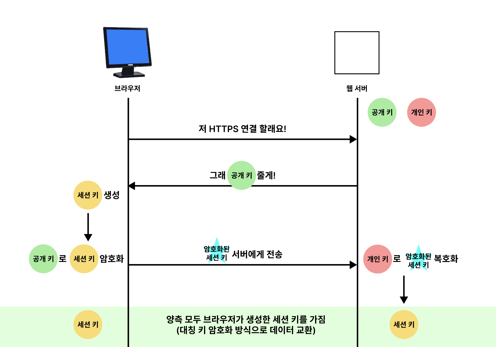
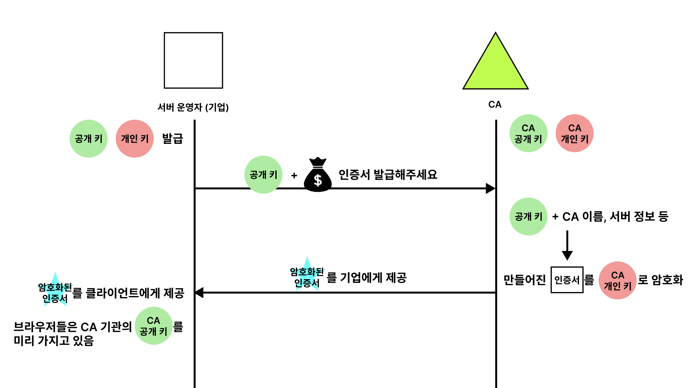
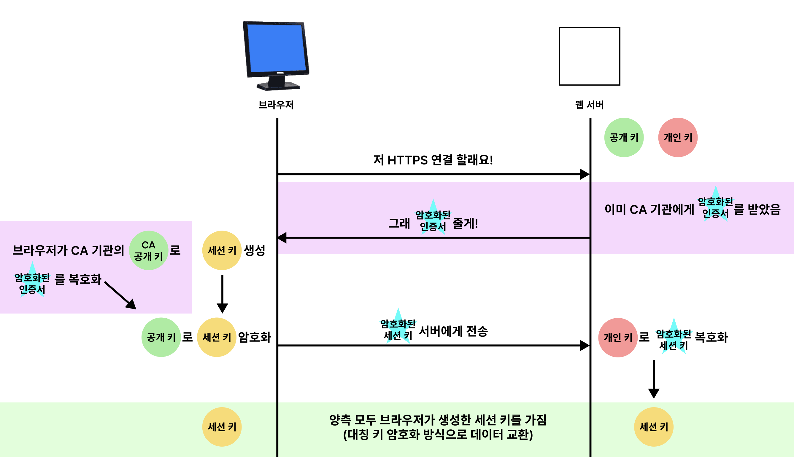

# HTTP & HTTPS

아마 한번 이상의 프로젝트를 경험해봤다면 HTTP와 HTTPS에 대해 들어봤을 것이다. 이번에는 HTTP와 HTTPS에 대해 알아보자.

## HTTP

HTTP(HyperText Transfer Protocol)는 웹 서버-클라이언트 간에 데이터를 주고받기 위한 프로토콜이다. HTTP는 TCP/IP 기반으로 동작하며, Steteless 기반 프로토콜이다. (기본 포트는 80번이다.)

사용자가 웹 사이트를 방문하면 브라우저는 웹 서버에 HTTP 요청을 보내고, 웹 서버는 요청에 대한 HTTP 응답을 보낸다. HTTP는 요청과 응답으로 이루어져 있으며, 요청과 응답은 헤더와 바디로 구성되어 있다.

HTTP에 대한 내용은 [모든 개발자를 위한 HTTP 웹 기본 지식 - 인프런](HTTP/README.md#모든-개발자를-위한-http-웹-기본-지식)에 정리되어 있다.

### 요청 메시지 예시

```http
POST /users HTTP/1.1
Host: localhost:8080
Content-Type: application/json

{
  "name": "John",
  "password": 1234,
}
```

자세한 HTTP 메시지 구조는 [RFC9110](https://datatracker.ietf.org/doc/html/rfc9110#name-messages) 참고하자.

좋은 프로토콜이지만, 문제가 있다. 바로 HTTP 메시지들은 모두 평문으로 전송된다는 것이다. **즉, 누구나 쉽게 읽을 수 있다.**

비밀번호와 같은 민감한 정보를 HTTP를 통해 전송하면, 모니터링하고 있거나 네트워크를 가로채는 악의적인 사용자 입장에서 보내거나 받는 정보가 무엇인지 정확히 알 수 있다는 것이다. 이러한 보안 문제를 해결하기 위해 HTTPS가 등장했다.

## HTTPS

HTTPS(HyperText Transfer Protocol over Secure Socket Layer)는 HTTP의 보안 버전이다. HTTPS는 HTTP에 데이터 암호화가 추가된 프로토콜이다. HTTPS는 SSL(Secure Socket Layer) 또는 TLS(Transport Layer Security) 프로토콜을 사용하여 데이터를 암호화한다. (기본 포트는 443번이다.)

### 메시지 예시

HTTPS를 사용하면, 평문 메시지 대신에 아래와 같이 암호화된 메시지를 전송한다. 악의적인 사용자가 메시지를 보더라도, 암호화된 메시지를 읽을 수 없는 것이다.

```http
sf2asdf8Fw6T8UV81pQfyhDkhebbz7+oiwldr1j2gHBB3L3RFTRsQCpaSnSBZ78Vme+DpDVJPvZdZUZHpzbbcqmSW1+3xXGsERHg9YDmpYk0VVDiRvw1H5miNieJeJ/FNUjgH0BmVRWII6+T4MnDwmCMZUI/orxP3HGwYCSIvyzS3MpmmSe4iaWKCOHQ==
```

## 암호화?

암호화는 데이터를 다른 형태로 변환하는 것이다. 암호화된 데이터는 암호화된 키를 가지고 있어야만 원래 데이터로 복호화할 수 있다. 암호화된 데이터를 가로채도, 암호화된 키를 모르면 원래 데이터를 알 수 없기 때문에 악의적인 사용자로부터 데이터를 보호할 수 있다.

우리가 엑셀 파일에 비밀번호를 걸어놓는 것도 암호화의 한 예시이다. 엑셀 파일을 열려면 비밀번호를 알아야만 열 수 있기 때문에, 엑셀 파일에 저장된 데이터를 보호할 수 있다.

기본적으로 데이터를 암호화하려면 세 가지가 필요하다.

- 암호화할 데이터
- 고유한 키 (암호화 키)
- 암호화 알고리즘

데이터와 암호화 키를 암호화 알고리즘에 넣으면, 암호화된 데이터가 생성되는 것이다. 암호화된 데이터를 복호화하려면, 암호화 키를 사용하여 암호화된 데이터를 복호화해야 한다.

엑셀 파일의 비밀번호와 같이 웹 서버가 키 하나를 지정하고 데이터를 암호화해서 사용자의 웹 브라우저로 전송하고, 웹 브라우저는 그 키를 이용해 데이터를 복호화하면 될 것이다. 그러나 웹 서버와 사용자는 일대다(불특정 다수) 관계이다. 이때 키를 요청한 사용자에게 모두 나눠준다면, 누구나 암호화를 풀 수 있게 되어 아무 의미가 없게 된다.

위와 같은 문제를 해결하기 위해 HTTPS는 SSL이나 TLS 프로토콜을 통해 세션 데이터를 암호화한다.

> TLS는 Transport Layer Security의 줄임말이며, 과거 SSL에서 발전하며 이름이 변경된 것이지만, 아직도 SSL이란 명칭이 많이 사용되고 있다고 한다.
>
> TLS(Transport Layer Security)는 온라인 네트워크에서 데이터를 안전하게 주고받기 위한 암호화 프로토콜이다. 통신 데이터를 TLS 프로토콜을 따라 암호화하면 누군가 데이터를 가로채도 복호화할 수 없기 때문에 데이터를 안전하게 주고받을 수 있다. 2018년에 공개된 [TLS 1.3 (RFC8446)](https://datatracker.ietf.org/doc/html/rfc8446)이 현재 가장 최신 버전이라고 한다.

## 암호화 방식

HTTPS는 대칭 키 암호화 방식과 비대칭 키 암호화 방식을 모두 사용한다. 우선 각 방식에 대해 알아보자.

### 대칭 키 암호화 방식

대칭키 암호화 방식은 이름에서 알 수 있듯이, 데이터 암호화와 복호화에 같은 키를 사용하는 방식이다. 즉, 클라이언트와 서버가 같은 키를 사용하여 데이터를 암호화하고 복호화한다.

복잡한 계산을 요구하지 않기 때문에 빠른 연산 속도가 장점이지만, 키가 노출되는 경우 매우 위험하다. 대칭키 암호화 방식은 키를 안전하게 전달하는 것이 중요하다.

```
일반 텍스트 + 키 = 암호 텍스트: hello + 2jd8932kd8 = X5xJCSycg14=

암호 텍스트 + 키 = 일반 텍스트: X5xJCSycg14= + 2jd8932kd8 = hello
```

같은 키를 사용하므로, 서버와 클라이언트가 같은 키를 가지고 있어야 한다. 이때 키를 안전하게 전달하는 것이 중요하다.

### 비대칭 키 암호화 방식

비대칭키 암호화 방식은 데이터 암호화와 복호화에 공개 키와 개인 키를 사용하는 방식이다. 공개 키와 개인 키를 1쌍으로 사용한다.

- 공개 키(Public Key): 누구나 알 수 있는 키
- 개인 키(Private Key): 자신만 알고 있는 키

이때 어떤 키로 암호화하느냐에 따라 특징이 달라진다.

- 공개 키로 암호화하면, 개인 키로 복호화할 수 있다. 메시지를 개인 키를 가진 사람만 볼 수 있다.
- 개인 키로 암호화하면, 공개 키로 복호화할 수 있다. 개인 키를 가진 사람이 자신이 보낸 메시지라는 것을 증명할 수 있다. (전자 서명)

## HTTPS 동작 방식

다시 돌아와서 HTTPS는 대칭 키 암호화 방식과 비대칭 키 암호화 방식을 모두 사용하여 빠른 속도와 안전한 통신을 제공한다.

HTTPS 연결 과정에서 서버와 클라이언트 간에 세션 키를 교환한다. 세션 키는 주고 받는 데이터를 암호화하기 위해 사용되는 대칭 키이다. 데이터를 교환하는 과정에서는 빠른 연산 속도를 위해 대칭 키를 사용한다.

문제는 세션 키를 클라이언트와 서버가 어떻게 교환할 것인가이다. 이 과정에서 비대칭 키가 사용된다. 처음 연결을 성립하여 안전하게 세션 키를 공유하는 과정에서 비대칭 키가 사용되는 것이다.



1. 브라우저가 웹사이트 서버에 접속하여 연결을 요청한다.
2. 이때 서버는 개인 키를 비밀로 유지하며 브라우저에게 공개 키를 전송한다.
3. 브라우저는 세션 키 라고 하는 세 번째 키를 생성한다.
4. 서버에서 받은 공개 키를 사용하여 세션 키를 암호화한다.
5. 암호화된 세션 키는 서버에게 전송된다.
6. 서버는 개인 키를 사용하여 브라우저에게 받은 암호화된 세션 키를 복호화한다. 이제 양측 모두 브라우저가 생성한 세션 키를 가지고 있다.
7. 공개 키 암호화는 종료되고 대칭 암호화로 대체된다.
8. 이제 브라우저와 서버는 대칭 키(세션 키)를 사용하여 데이터를 주고 받는다.

그림에서 볼 수 있듯이, 비대칭 암호화 방식은 나머지 연결에 사용되는 세 번째 키(세션 키)를 교환하기 위해 처음에 잠깐만 사용된다. 이후 데이터를 주고 받는 과정에서는 대칭 키 암호화 방식을 사용한다.

### 왜 저렇게 할까?

왜 비대칭 키 암호화 방식을 사용하여 세션 키를 교환하는 것일까? 왜 하나의 방식을 사용하지 않을까?

우선 비대칭 암호화의 수학적 오버헤드가 훨씬 더 높기 때문에 이를 유지하려면 훨씬 더 많은 컴퓨팅 자원이 필요하다. 반면에 대칭 암호화는 빠른 연산 속도를 가지고 있기 때문에 데이터를 주고 받는 데 적합하다.

하지만, 서버가 불특정 다수의 클라이언트와 통신하는 구조에서 대칭 키를 안전하게 키를 전달하는 것이 매우 어렵다. 이때 비대칭 키 암호화 방식의 단방향성을 이용하여 대칭 키(세션 키)를 교환하는 것이다.

덕분에 HTTPS는 안전한 통신(비대칭 키)을 제공하면서도 빠른 속도(대칭 키)를 유지할 수 있다.

## 서버의 키는 어디서 나와?

좋은 방법인 것은 알겠으나, 서버의 비대칭 키(공개 키, 개인 키)는 어디서 나온 것일까?

일반적으로 서버의 비대칭 키는 인증 기관(CA, Certificate Authority)에 의해 발급된다. 인증 기관은 서버의 신원을 확인하고, 서버의 공개 키를 인증하는 역할을 한다.



1. 서버 운영자(기업)는 HTTP 기반의 애플리케이션에 HTTPS를 적용하기 위해 비대칭 키(공개 키, 개인 키)를 발급받는다.
2. CA 기관에게 돈을 지불하고, 공개 키를 저장하는 인증서의 발급을 요청한다.
3. CA 기관은 CA 기관의 이름, 서버의 공개 키, 서버의 정보 등을 기반으로 인증서를 생성하고, CA 기관의 개인 키로 암호화하여 서버 운영자에게 암호화된 인증서를 제공한다.
4. 서버 운영자는 클라이언트에게 암호화된 인증서를 제공한다.
5. 브라우저는 CA 기관의 공개 키를 이미 가지고 있으므로, 암호화된 인증서를 복호화하여 CA 기관의 공개 키로 서버의 공개 키를 얻는다.

즉, 클라이언트는 브라우저와 CA 기업의 활약으로 사실상 서버의 공개 키를 얻게 된다.

따라서 위에서 살펴본 HTTPS의 동작 방식을 좀 더 자세히 살펴보면 아래와 같다. (변경된 부분 보라색으로 표시)



인증서는 CA 기관의 개인키로 암호화되었기 때문에, 신뢰성을 확보할 수 있고, 클라이언트는 서버의 공개 키로 데이터를 암호화하였기 때문에 해당 서버만 복호화하여 원본의 데이터를 얻을 수 있다.

다시 말하지만, 인증서에는 서버의 공개 키가 포함되어 있으므로, 사실 서버의 공개 키라고 볼 수 있다. 또한 브라우저에는 인증된 CA 기관의 정보들이 사전에 등록되어 있기 때문에 잘못된 CA 기관의 인증서는 브라우저가 거부한다.

## 내용 정리

- HTTP는 평문으로 데이터를 주고 받는 프로토콜이다.
- HTTPS는 HTTP에 데이터 암호화가 추가된 프로토콜이다.
- HTTPS는 대칭 키 암호화 방식과 비대칭 키 암호화 방식을 모두 사용한다.
- 대칭 키 암호화 방식은 데이터 암호화와 복호화에 같은 키를 사용하는 방식이다.
- 비대칭 키 암호화 방식은 데이터 암호화와 복호화에 공개 키와 개인 키를 사용하는 방식이다.
- HTTPS는 대칭 키 암호화 방식과 비대칭 키 암호화 방식을 모두 사용하여 빠른 속도와 안전한 통신을 제공한다.
- 서버의 비대칭 키는 인증 기관(CA, Certificate Authority)에 의해 발급된다.
- 인증 기관은 서버의 신원을 확인하고, 서버의 공개 키를 인증하는 역할을 한다.

### 서비스 제공자 입장

- HTTP는 평문으로 데이터를 주고 받기 때문에, 누구나 데이터를 읽을 수 있다. 반면, HTTPS는 HTTP에 데이터 암호화가 추가된 프로토콜이기 때문에, 데이터를 안전하게 주고 받을 수 있다. (물론 예외 상황도 있다고 한다. 추가 학습 필요) 즉, 보안이 중요한 정보(민감한 데이터)를 주고 받을 때는 HTTPS를 사용하는 것이 좋다고 볼 수 있다.
- HTTPS 환경을 구축하기 위해 인증서를 발급하는 과정이나 관리하는 과정에서 추가적인 비용이 발생한다.
- HTTP에 비해 HTTPS는 암호화를 위한 연산이 추가되기 때문에, 약간의 성능 저하가 발생할 수 있다. 그러나, 최근 하드웨어의 발전으로 인해 성능 저하가 크게 나타나지 않는다고 한다.

### 서비스 사용자 입장

- HTTP와 HTTPS의 속도 차이는 아마 느끼기 힘들 것이다. 따라서 사용자 입장에서는 안전한 HTTPS를 사용하는 것이 거의 모든 상황에서 좋다고 볼 수 있다.

### 생각 정리

- 민감한 정보를 주고 받을 때는 항상 HTTPS를 사용하는 것이 좋을 것 같다.
- 다만, 서비스 제공자 입장에서 민감한 정보를 다루지 않는다면, 관리나 비용 측면에서 HTTP를 사용하는 것도 하나의 방법이 될 수 있을 것 같다.

## 참고

- [How Does HTTPS Work? RSA Encryption Explained - Bobby](https://tiptopsecurity.com/how-does-https-work-rsa-encryption-explained/#!prettyPhoto)
- [HTTP와 HTTPS의 개념 및 차이점 - 망나니개발자](https://mangkyu.tistory.com/98)
- [HTTP와 HTTPS의 차이 - bclef25](https://velog.io/@bclef25/http%EC%99%80-https%EC%9D%98-%EC%B0%A8%EC%9D%B4)
- [Cloudflare HTTP vs. HTTPS: What are the differences?](https://www.cloudflare.com/ko-kr/learning/ssl/why-is-http-not-secure/)
- [TLS 1.3 (RFC8446)](https://datatracker.ietf.org/doc/html/rfc8446)
