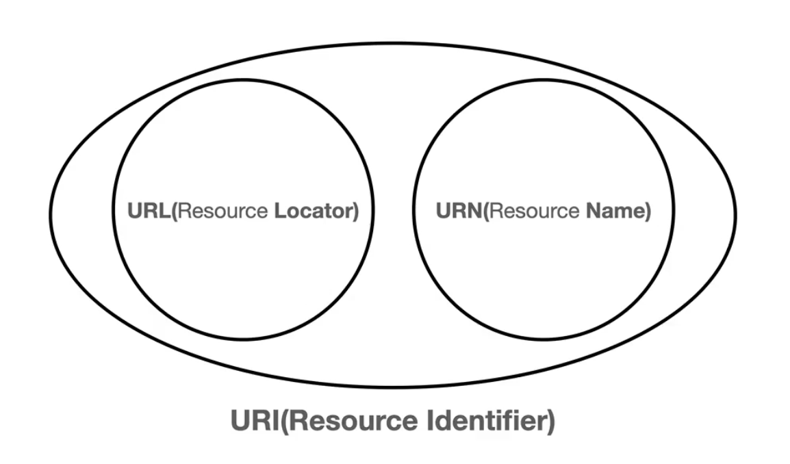
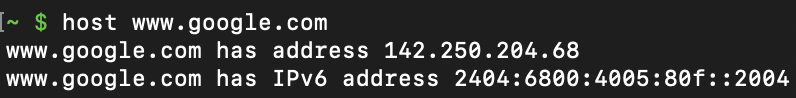

# 2. uri-webbrowser

이번에는 많이 들어본 URI와 웹 브라우저 요청 흐름에 대해 학습할 것이다.

## URI? URL? URN?

[1.1.3. URI, URL, and URN 스펙](https://www.ietf.org/rfc/rfc3986.txt)을 확인해보면 URI(Uniform Resource Identifier)는 Locator, Name 또는 둘 다 추가로 분류할 수 있다고 한다.



먼저 URI가 가장 큰 개념이다. Resource를 식별(IDentify)하기 위한 것이다. URI는 URL과 URN으로 나뉜다.

## URI(Uniform Resource Identifier)

- U(Uniform): 리소스를 식별하는 통일된 방식
- R(Resource): 자원, URI로 식별할 수 있는 모든 것
- I(Identifier): 다른 항목과 구분하는데 필요한 정보

URL(Uniform Resource Locator): 리소스의 위치를 나타낸다. 예를 들어, `https://www.google.com`이 URL이다. 현재 가장 많이 사용된다.

URN(Uniform Resource Name): 리소스의 이름을 나타낸다. 예를 들어, `urn:isbn:0451450523`이 URN이다 (어떤 책의 ISBN이 0451450523이다). 하지만 이름만으로 리소스를 찾는 방법이 보편화되지 않았기 때문에, 대부분 URL을 사용한다.

## URL(Uniform Resource Locator)

리소스의 위치를 나타내는 URL은 다음과 같은 구조로 이루어져 있다.

```plaintext
scheme:[//[user:password@]host[:port]][/]path[?query][#fragment]
```

'hello'라는 검색어를 검색하기 위해 구글에 접속하는 URL이다.

```plaintext
https://www.google.com/search?q=hello
```

- scheme: 리소스에 접근하기 위해 사용되는 프로토콜 (https)
- user: URL의 사용자 정보를 포함해야 될 때 쓰는데 현재 거의 사용하지 않음 (생략 가능)
- host: 리소스가 위치한 서버의 도메인 이름 또는 IP 주소 (www.google.com)
- port: 서버의 포트 번호 (80, 80이나 443은 생략 가능)
- path: 서버에서 제공하는 리소스의 경로 (/search)
- query: 리소스에 접근하기 위한 추가적인 정보 (?q=hello&hl=ko)

### Path

위 URL에서 `/search` 부분이 Path이다.

- 서버에서 제공하는 리소스의 경로를 나타낸다.
- `/`로 구분되며, 계층적인 구조를 가진다.
- 파일 경로와 유사하다.

### Query String (or Parameter)

위 URL에서 `?q=hello&hl=ko` 부분을 Query String 또는 Parameter라고 한다.

- `?`로 시작하며, `&`로 여러 개의 쿼리를 연결할 수 있다.
- `key=value` 형태로 이루어져 있다.
- 모든 값은 문자열로 전달된다.
- `key`는 서버를 구현한 사람이 정할 수 있다.

### Fragment

위 URL에서 `#fragment` 부분이 Fragment이다.

- 리소스 내부의 위치를 나타낸다.
- 서버에 전달되는 정보가 아니라, 클라이언트에서 사용하는 정보이다.
- 내부 북마크 등에 사용된다.

## 웹 브라우저 요청 흐름

웹 브라우저에서 URL을 입력하고 엔터를 누르면 어떤 일이 일어날까?

```
https://www.google.com/search?q=hello&hl=ko
```

먼저 URL을 입력하면, 웹 브라우저는 URL을 해석한다. URL을 해석하면, 다음과 같은 정보를 얻을 수 있다.

- scheme: https
- host: www.google.com
- port: 443 (생략되어 있음, https의 기본 포트)
- path: /search
- query: q=hello&hl=ko

웹 브라우저는 DNS(Domain Name System)에 www.google.com의 IP 주소를 요청하고, DNS는 www.google.com의 IP 주소를 응답한다.



위와 같이 도메인 이름을 통해 직접 IP 주소를 찾아볼 수도 있다.

웹 브라우저는 IP 주소와 포트 번호를 사용하여 서버에 HTTP 요청을 보낸다. 이때, HTTP 요청은 다음과 같은 형태로 이루어져 있다.

```plaintext
GET /search?q=hello&hl=ko HTTP/1.1
Host: www.google.com
```

이러한 HTTP 요청은 전송 계층을 지나면서 출발지 IP 주소와 목적지 IP 주소, 출발지 포트 번호와 목적지 포트 번호를 가지게 된다.

서버는 해당 요청을 받아서, 요청에 맞는 응답을 생성한다. 응답은 다음과 같은 형태로 이루어져 있다.

```plaintext
HTTP/1.1 200 OK
Content-Type: text/html; charset=UTF-8
Content-Length: 1234

<!DOCTYPE html>
<html>
  <body>
    ...
  </body>
</html>
```

웹 브라우저는 응답을 받아서, 화면에 표시한다.

## 정리

URI는 리소스를 식별하기 위한 통합된 방법이다. URL은 리소스의 위치를 나타내는 방법이고, URN은 리소스의 이름을 나타내는 방법이다. 단, URN은 거의 사용되지 않는다. 주로 URL을 사용한다.

URL은 다음과 같은 구조로 이루어져 있다.

```plaintext
scheme:[//[user:password@]host[:port]][/]path[?query][#fragment]
```

우리가 웹 브라우저에 URL을 입력하면, 웹 브라우저는 URL을 해석하여, DNS에 IP 주소를 요청하고, IP 주소와 포트 번호를 사용하여 서버에 HTTP 요청을 보낸다. 서버는 해당 요청을 받아서, 요청에 맞는 응답을 생성하여 클라이언트에게 전달한다.

## 참고

- [모든 개발자를 위한 HTTP 웹 기본 지식 - 인프런](https://www.inflearn.com/course/http-%EC%9B%B9-%EB%84%A4%ED%8A%B8%EC%9B%8C%ED%81%AC/dashboard)
