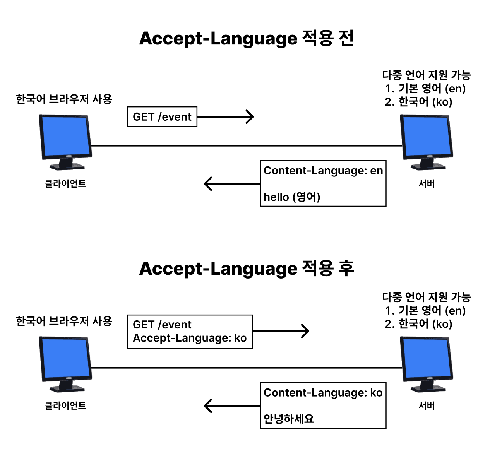
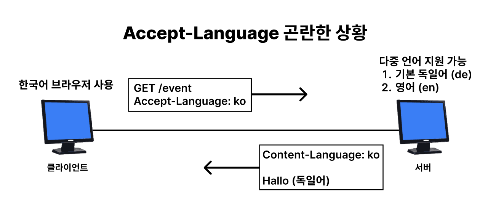
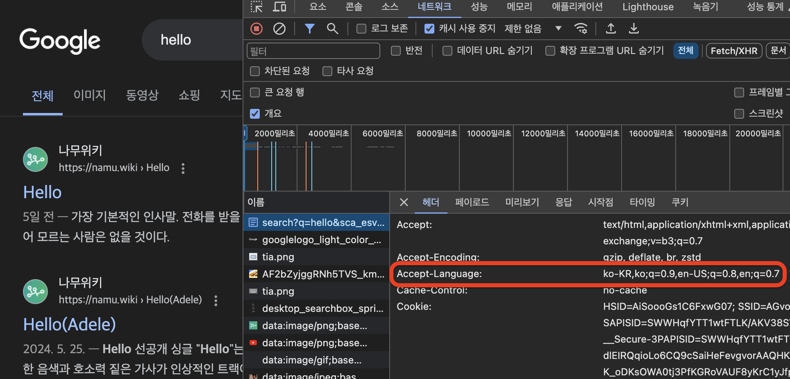
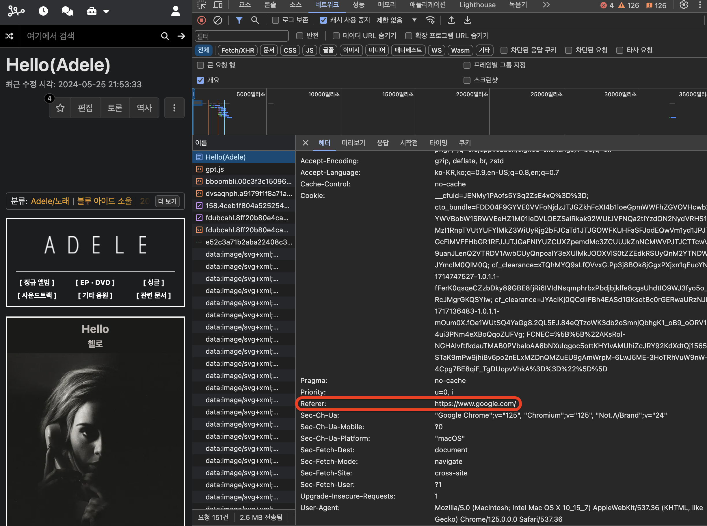
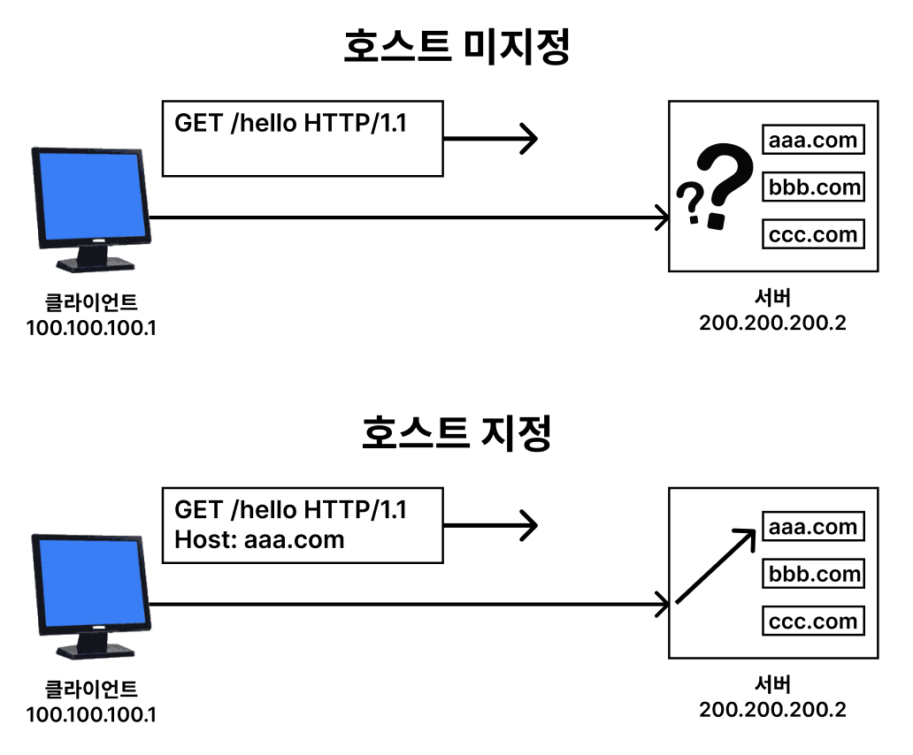
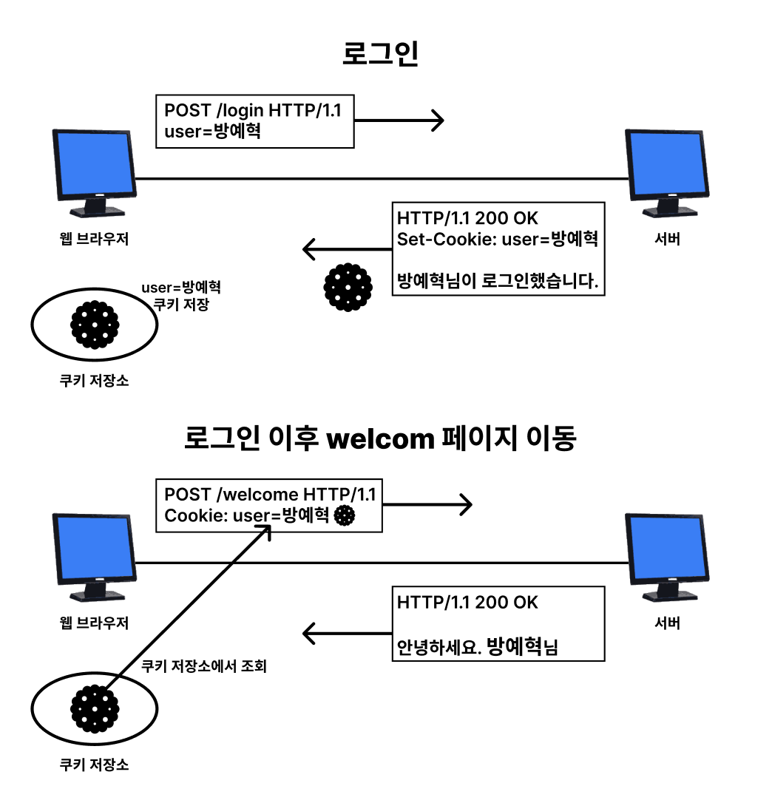

# HTTP 헤더 1

HTTP 헤더는 HTTP 전송에 필요한 모든 부가 정보를 담고 있다.  
예시: 메시지 바디의 길이, 데이터 타입, 압축, 인증, 캐시, 연결 관리 등

## HTTP 헤더 구조

```
header-field: ":" OWS field-value OWS
```

- `header-field`: 헤더 필드 이름, 대소문자를 구분하지 않음
- `field-value`: 헤더 필드 값, 대소문자를 구분함
- `OWS`: Optional White Space (띄어쓰기 가능)

```
# 예시
Host: www.google.com
Content-Type: text/html; charset=utf-8
```

## HTTP 헤더 분류

```
- 일반 헤더 (General Header)
- 요청 헤더 (Request Header)
- 응답 헤더 (Response Header)
- 표현 헤더 (Entity Header, 과거 Entity Header로 불렸던 것이 표현 헤더로 변경됨)
```

### Representation(표현) 구성 요소

- Representation Metadata(표현 메타데이터): 표현 데이터를 해석하는 데 필요한 정보. 예를 들어, 데이터의 타입, 인코딩 방식 등을 나타내는 `Content-Type`, `Content-Encoding` 등의 헤더가 포함된다.
- Representation Data(표현 데이터): 실제로 전달되는 데이터이다. 예를 들어, HTML, JSON, 이미지, 동영상 등이 포함된다.

메시지 본문(Message Body)을 통해 표현 데이터를 전달하고, 표현 헤더는 이 데이터를 해석할 수 있는 정보를 제공한다. 따라서 표현 헤더는 표현 메타데이터와 페이로드 메시지를 구분해야 한다.

참고: REST의 R이 Representation이다. REST는 Representation State Transfer의 약자이다.

## 표현 헤더(Representation Header)

표현 헤더는 전송, 응답 모두에 사용되는 헤더이다.

```
- Content-Type: 표현 데이터의 타입
- Content-Encoding: 표현 데이터의 압축 방식
- Content-Language: 표현 데이터의 자연 언어
- Content-Length: 표현 데이터의 길이
```

### Content-Type

표현 데이터의 타입을 설명한다. 미디어의 타입이나 문자 인코딩을 나타낸다.

```
Content-Type: text/html; charset=UTF-8
Content-Type: application/json
...
```

### Content-Encoding

표현 데이터의 압축 방식을 나타낸다. 데이터를 전송하는 곳에서 압축하고 `Content-Encoding` 헤더에 압축 방식을 명시한다. 데이터를 수신하는 곳에서는 `Content-Encoding` 헤더를 보고 압축을 해제한다.

```
Content-Encoding: gzip
Content-Encoding: deflate
Content-Encoding: identity (압축하지 않음)
...
```

### Content-Language

표현 데이터의 자연 언어를 나타낸다. 예를 들어, 한국어, 영어, 일본어 등이 있다.

```
Content-Language: ko
Content-Language: en
...
```

### Content-Length

표현 데이터의 길이를 나타낸다. 바이트 단위로 표현한다.

```
Content-Length: 1234
```

주의할 점은 `Transfer-Encoding`를 사용하면 `Content-Length`를 사용하면 안된다.

## 협상(Content Negotiation)

클라이언트와 서버가 서로 데이터 형식을 맞추기 위한 과정이다. 즉, 클라이언트가 선호하는 표현을 요청하고, 서버는 그에 맞게 응답한다. (요청에 응하지 못할 수도 있음)

```
- Accept: 클라이언트가 선호하는 미디어 타입
- Accept-Charset: 클라이언트가 선호하는 문자 인코딩
- Accept-Encoding: 클라이언트가 선호하는 압축 방식
- Accept-Language: 클라이언트가 선호하는 자연 언어
```

협상 헤더는 요청할 때만 사용한다.

### 협상 예시



서버가 영어, 한국어를 지원하고, 클라이언트가 한국어를 선호한다면 서버는 한국어로 응답한다.

하지만 아래와 같이 곤란한 상황이 발생할 수 있다.



서버가 독일어, 영어를 지원하고, 클라이언트가 한국어를 선호한다면 서버는 어떤 언어로 응답해야 할까? 그림에서는 기본으로 지원되는 언어가 독일어니까 독일어로 응답해야 하는가? 여기서 필요한 것은 우선순위이다. (기본으로 독일어가 지원된다는 것도 어떻게 보면 우선순위인 것이다.)

## 협상과 우선순위

Quality Value(Q)를 사용하여 우선순위를 나타낸다. `q` 값이 클수록 우선순위가 높다. 기본값은 1이며 범위는 0 ~ 1이다. (클수록 우선순위가 높음)

```
# 예시
GET /event
Accept-Language: ko-KR,ko;q=0.9,en-US;q=0.8,en;q=0.7
```

- ko-KR;q=1 (여기서는 q가 생략되어 있음, 생략되면 1임)
- ko;q=0.9
- en-US;q=0.8
- en;q=0.7

참고: ko-KR은 한국에서 사용하는 한국어를 의미하고, ko는 한국 공용어를 의미한다.



실제로 구글에 `hello`를 검색하고 요청 헤더를 살펴보면 선호하는 언어와 우선순위가 포함되어 있는 것을 볼 수 있다. 추가로 선호하는 미디어 타입이나 압축 방식도 포함되어 있다.

### 구체적인 것이 우선순위가 높다.

```
Accept: text/*, text/html, text/html;level=1, */*

# 위 헤더 value들의 우선순위는 아래와 같다.
1. text/html;level=1
2. text/html
3. text/*
4. */*
```

구체적인 것을 기준으로 미디어 타입을 결정한다.

```
Accept: text/*;q=0.3, text/html;q=0.7, text/html;level=1

# 위 헤더 value들의 우선순위는 아래와 같다.
1. text/html;level=1 (1)
2. text/html (0.7)
3. text/plain (0.3, text/*에 속함)
```

## 전송 방식 (Transfer Coding)

전송 방식은 데이터를 전송하는 방식을 나타낸다. 예시로 `Content-Encoding`은 데이터를 압축하는 방식이고, `Transfer-Encoding`은 데이터를 전송하는 방식이다.

전송 방식은 단순하게 4가지로 나눌 수 있다.

```
- 단순 전송
- 압축 전송
- 분할 전송
- 범위 전송
```

### 단순 전송

단순하게 데이터를 전송하는 방식이다. `Content-Length` 헤더를 사용하여 전체 데이터의 길이를 알려준다. 즉, 데이터의 길이를 알 수 있어야 한다.

```
HTTP/1.1 200 OK
Content-Type: text/html
Content-Length: 1234

(HTML 데이터)
```

### 압축 전송

데이터를 압축하여 전송하는 방식이다. `Content-Encoding` 헤더를 사용하여 압축 방식을 명시한다. 실제로 용량이 절반 이상 줄어드는 경우가 많다고 한다.

```
HTTP/1.1 200 OK
Content-Type: text/html
Content-Encoding: gzip
Content-Length: 345

(압축된 HTML 데이터)
```

### 분할 전송

데이터를 분할하여 전송하는 방식이다. `Transfer-Encoding` 헤더를 사용하여 `chunked` 값을 명시한다. 데이터를 여러 조각으로 나누어 전송하고, 마지막에는 `0`을 보내어 전송이 끝났음을 알린다.

```
HTTP/1.1 200 OK
Content-Type: text/plain
Transfer-Encoding: chunked

5
hello
6
world!
0
\r\n
```

앞서 설명했듯이, `Content-Length`와 `Transfer-Encoding`는 같이 사용하면 안된다. 분할된 각각의 데이터 조각에는 길이 정보가 포함되어 있기 때문이다.

### 범위 전송

데이터의 일부분만 전송하는 방식이다. `Range` 헤더를 사용하여 전체 데이터 중 일부분만 전송한다. 예를 들어, 동영상을 다운로드 받다가 중간에 멈추면 다시 요청해야 한다. 이때 처음부터 다시 받으면 비효율적이므로 범위 전송을 사용한다. (특정 범위만 요청)

```
# 요청
GET /video.mp4 HTTP/1.1
Range: bytes=1000-2000

# 응답
HTTP/1.1 200 OK
Content-Type: video/mp4
Content-Range: bytes 1000-2000/8000
Content-Length: 1001

(동영상 데이터)
```

## 일반 정보

단순한 정보성 헤더들이다.

```
- From: 유저 에이전트의 이메일 주소
- Referer: 이전 웹 페이지 주소
- User-Agent: 클라이언트 정보
- Server: 서버 정보
- Date: 메시지 생성 날짜
```

### From

유저 에이전트의 이메일 주소를 나타낸다.(요청에서 사용) 잘 사용되지 않는다고 한다.

검색 엔진 같은 곳에서 내 사이트를 크롤링해서 정보를 가져갈 때, 이메일 주소를 남겨두면 연락할 수 있기 때문에 사용한다고 한다.

### Referer

이전 웹 페이지 주소를 나타낸다.(요청에서 사용) 클릭해서 이동한 페이지의 주소를 나타낸다.

A 페이지에서 B 페이지로 이동하는 경우 B를 요청할 때 `Referer: A`를 포함해서 요청한다. (Referer를 사용해서 유입 경로 분석 가능)



실제로 구글에 `hello`를 검색하고 나무위키로 이동하면 Referer에 구글 검색 페이지 주소가 포함되어 있는 것을 볼 수 있다.

참고: referer는 referrer 단어의 오타이다. 근데 이미 너무 많이 사용되어서 수정하기 어렵다고 한다.

### User-Agent

클라이언트 정보를 나타낸다.(요청에서 사용) 클라이언트의 종류, 버전, 운영체제 등을 나타낸다.

```
User-Agent: Mozilla/5.0 (Windows NT 10.0; Win64; x64) AppleWebKit/537.36 (KHTML, like Gecko) Chrome/58.0.3029.110 Safari/537.3
```

주로 통계나 문제 대응을 위해 사용한다. 예를 들어, `User-Agent`를 통해 어떤 환경에서 장애가 발생했는지 파악할 수 있다.

### Server

서버 정보를 나타낸다.(응답에서 사용) 서버의 종류, 버전 등을 나타낸다. (origin 서버의 정보를 나타낸다.)

```
Server: Apache/2.2.22 (Debian)
```

### Date

메시지 생성 날짜를 나타낸다.(응답에서 사용) 메시지가 생성된 날짜와 시간을 나타낸다.

```
Date: Tue, 15 Nov 1994 08:12:31 GMT
```

## 특별한 정보

단순히 일반 정보가 아니라 실제 애플리케이션에 영향을 주는 특별한 정보들을 나타내는 헤더들이다.

```
- Host: 요청한 호스트 정보
- Location: 리다이렉트 시킬 위치
- Allow: 허용 가능한 메서드
- Retry-After: 다음 요청까지 대기 시간
```

### Host

요청한 호스트 정보를 나타낸다.(요청에서 사용) 요청한 호스트 정보를 나타낸다.  
`Host` 헤더가 없으면 HTTP/1.1 요청은 올바르게 처리되지 않을 수 있습니다.

```
GET /search?q=hello&hl=ko HTTP/1.1
Host: www.google.com
```

[가상 호스트](https://www.ibm.com/docs/en/i/7.3?topic=concepts-virtual-hosts)를 통해 여러 도메인을 하나의 서버에서 운영할 수 있다. `Host` 헤더를 통해 어떤 도메인으로 요청했는지 알 수 있는 것이다.



위 그림처럼 호스트를 지정하지 않는 경우 요청이 어디로 가야할지 모르기 때문에 서버가 요청을 정상적으로 처리할 수 없다. 꼭 호스트를 지정해야 한다.

### Location

리다이렉트 시킬 위치를 나타낸다.(응답에서 사용) 클라이언트에게 리다이렉트할 위치를 알려준다.

`201 Created`에서는 요청에 의해 생성된 리소스의 위치를 알려줄 때 사용한다. `3xx` 상태 코드에서는 리다이렉트할 위치를 알려줄 때 사용한다. ([6.http-status/3xx](6.http-status.md#3xx-redirection)에서 공부했던 내용이다.)

```
HTTP/1.1 301 Moved Permanently
Location: /new-event
```

### Allow

허용 가능한 메서드를 나타낸다.(응답에서 사용) 리소스에 대해 허용되는 메서드를 나타낸다.

```
HTTP/1.1 405 Method Not Allowed
Allow: GET, HEAD
```

해당 리소스에 대해 `GET`, `HEAD` 두 가지 메서드만 허용된다는 의미이다.

### Retry-After

다음 요청까지 대기 시간을 나타낸다.(응답에서 사용) 서버가 과부하 상태일 때 클라이언트에게 다음 요청까지 대기해야 하는 시간을 알려준다.

```
# 날짜로 대기 시간을 나타낸다.
HTTP/1.1 503 Service Unavailable
Retry-After: Tue, 15 Nov 1994 08:12:31 GMT

# 초 단위로 대기 시간을 나타낸다.
HTTP/1.1 503 Service Unavailable
Retry-After: 120
```

실제로는 사용하기 어렵다고 한다. (언제 서버가 정상화될지 아는 것이 어렵기 때문)

## 인증 정보

인증 정보를 나타내는 헤더들이다.

```
- Authorization: 요청에 대한 인증 정보
- WWW-Authenticate: 요청에 대한 인증 정보를 요구
```

### Authorization

요청에 대한 인증 정보를 나타낸다.(요청에서 사용) 클라이언트가 서버에게 인증 정보를 전달할 때 사용한다.

```
# Authorization: <type> <credentials>
Authorization: Bearer {access_token}
```

`Bearer`는 [type](https://beeceptor.com/docs/concepts/authorization-header/)이고, `{access_token}`은 credentials이다. (Bearer 토큰을 사용한 인증)

### WWW-Authenticate

요청에 대한 인증 정보를 요구한다.(응답에서 사용) 서버가 클라이언트에게 인증 정보를 요구할 때 사용한다. `401 Unauthorized` 상태 코드와 함께 사용된다.

```
HTTP/1.1 401 Unauthorized
WWW-Authenticate: Basic realm="User Visible Realm"
```

## 쿠키 정보

[쿠키](https://www.cloudflare.com/ko-kr/learning/privacy/what-are-cookies/) 정보를 나타내는 헤더들이다.

```
- Set-Cookie: 서버에서 클라이언트로 쿠키 전달(응답에서 사용)
- Cookie: 클라이언트에서 서버에서 받은 쿠키 저장 및 전달(요청에서 사용)
```

쿠키는 클라이언트의 상태 정보를 저장하고 전달하기 위해 사용한다. 쿠키는 클라이언트에 저장되어 있으며, 서버와 클라이언트 간의 상태 정보를 유지하기 위해 사용된다.



위 그림처럼 주로 로그인 이후 세션 관리를 위해 쿠키를 사용하고 트래킹, 광고, 개인화 등에도 사용된다.

### Set-Cookie

서버에서 클라이언트로 쿠키를 전달한다.(응답에서 사용) 클라이언트에게 쿠키를 저장하라고 요청할 때 사용한다.

```
# 만료일이 되면 쿠키 삭제
Set-Cookie: expires=Sat, 26-Dec-2020 04:39:21 GMT

# 0이나 음수를 사용하면 쿠키 삭제
Set-Cookie: max-age=3600 (3600초)
```

- `expires`: 쿠키 만료일을 나타낸다.
- `max-age`: 쿠키 만료 시간을 초 단위로 나타낸다.

날짜를 생략하면 세션 쿠키가 된다. (브라우저 종료 시 삭제) 만료일을 설정하면 영속적인 쿠키가 된다. (특정 시간에 삭제)

### Cookie

클라이언트에서 서버로 쿠키를 전달한다.(요청에서 사용) 클라이언트가 서버에게 쿠키를 전달할 때 사용한다.

```
Cookie: name=value
```

쿠키는 항상 서버에 전송되므로 네트워크 트래픽을 추가로 유발한다. 따라서 최소한의 정보만 사용해야 한다. 서버에 전송하지 않고, 웹 브라우저 내부에 데이터를 저장하고 싶으면 웹 스토리지 (localStorage, sessionStorage)를 사용한다.

주의할 점은 보안에 민감한 데이터는 저장하면 안된다. (주민번호, 신용카드 번호 등)

### 쿠키 도메인

쿠키는 도메인 단위로 관리된다. 쿠키를 생성할 때 도메인을 지정하면 해당 도메인과 서브 도메인에만 쿠키가 전송된다.

```
Set-Cookie: name=value; domain=example.com
```

위 코드는 `example.com` 도메인과 서브 도메인에만 쿠키가 전송된다. 만약 생략하면 현재 도메인에만 쿠키가 전송된다.

### 쿠키 경로

쿠키는 경로 단위로 관리된다. 쿠키를 생성할 때 경로를 지정하면 해당 경로와 하위 경로에만 쿠키가 전송된다.

```
Set-Cookie: name=value; path=/example
```

위 코드는 `/example` 경로와 하위 경로에만 쿠키가 전송된다.  
예를 들어, `/example/1`, `/example/1/2` 등의 경로에는 쿠키가 전송되지만, `/`, `/example2` 등의 경로에는 쿠키가 전송되지 않는다.

### 쿠키 보안

쿠키는 보안에 민감한 정보를 저장하므로 보안을 유지해야 한다. 쿠키에 `Secure` 속성을 추가하면 HTTPS 프로토콜을 사용할 때만 쿠키가 전송된다.

```
- Secure: HTTPS 프로토콜을 사용할 때만 쿠키 전송
- HttpOnly: JavaScript로 쿠키에 접근 불가
- SameSite: CSRF 공격 방지
```

## 정리

HTTP 헤더는 HTTP 전송에 필요한 모든 부가 정보를 담고 있다. 예를 들어, 메시지 바디의 길이, 데이터 타입, 압축 방식, 인증 정보 등이 포함된다.

헤더는 `header-field: OWS field-value OWS` 형태로 작성된다. `header-field`는 대소문자를 구분하지 않고, `field-value`는 대소문자를 구분한다. `OWS`는 Optional White Space로 띄어쓰기가 가능하다는 의미이다.

헤더는 크게 네 가지로 나뉘어 있다.

```
- 일반 헤더 (General Header)
- 요청 헤더 (Request Header)
- 응답 헤더 (Response Header)
- 표현 헤더 (Entity Header, 과거 Entity Header로 불렸던 것이 표현 헤더로 변경됨)
```

표현이란 데이터를 해석하는 데 필요한 정보를 제공하는 것을 말한다. 표현 헤더는 전송, 응답 모두에 사용되며, 데이터 타입이나 인코딩 방식을 나타낸다. 표현 헤더는 Representation Metadata와 Representation Data로 나뉘어 있다. Representation Metadata는 데이터 타입이나 인코딩 방식을 나타내고, Representation Data는 실제 데이터를 나타낸다. (HTML, JSON 등)

협상은 클라이언트와 서버가 서로 데이터 형식을 맞추기 위한 과정이다. 클라이언트가 선호하는 표현을 요청하고, 서버는 그에 맞게 응답한다. 협상 헤더는 요청할 때만 사용한다. Quality Value(Q)를 사용하여 우선순위를 나타낸다. `q` 값이 클수록 우선순위가 높다. 기본값은 1이며 범위는 0 ~ 1이다. (클수록 우선순위가 높음)

전송 방식은 데이터를 전송하는 방식을 나타낸다. 단순 전송, 압축 전송, 분할 전송, 범위 전송으로 나뉜다. 단순 전송은 `Content-Length`를 사용하여 전체 데이터의 길이를 알려준다. 압축 전송은 `Content-Encoding`를 사용하여 압축 방식을 명시한다. 분할 전송은 `Transfer-Encoding`를 사용하여 `chunked` 값을 명시한다. 범위 전송은 `Range` 헤더를 사용하여 전체 데이터 중 일부분만 전송한다.

이외에도 일반 정보, 특별한 정보, 인증 정보, 쿠키 정보를 전달할 때 사용하는 헤더들이 있다.

이렇게나 다양한 헤더들이 있지만, 실제로 내가 사용해본 것은 많지 않다. 필요에 의해 헤더를 쓸 수 있도록 공부해야겠다.

## 참고

- [Authorization HTTP Header](https://beeceptor.com/docs/concepts/authorization-header/)
- [What are cookies? | Cookies definition](https://www.cloudflare.com/ko-kr/learning/privacy/what-are-cookies/)
- [모든 개발자를 위한 HTTP 웹 기본 지식 - 인프런](https://www.inflearn.com/course/http-%EC%9B%B9-%EB%84%A4%ED%8A%B8%EC%9B%8C%ED%81%AC/dashboard)
