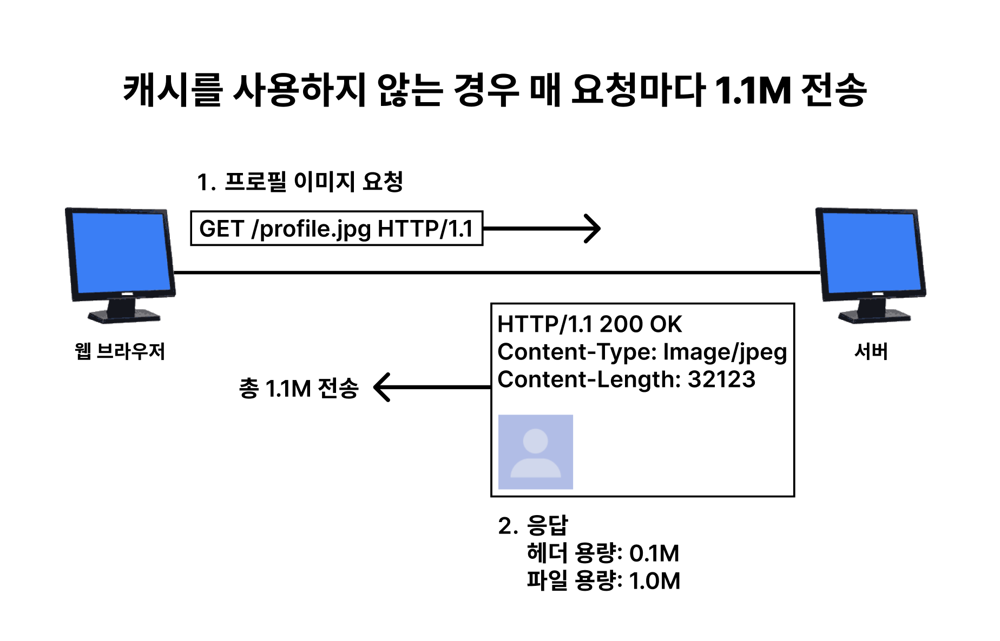
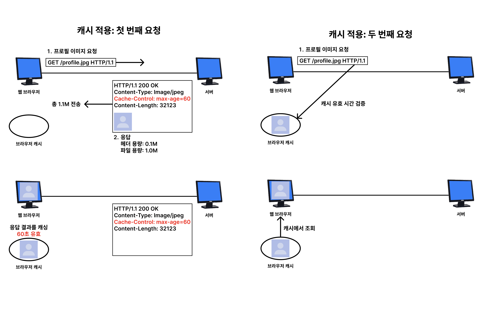
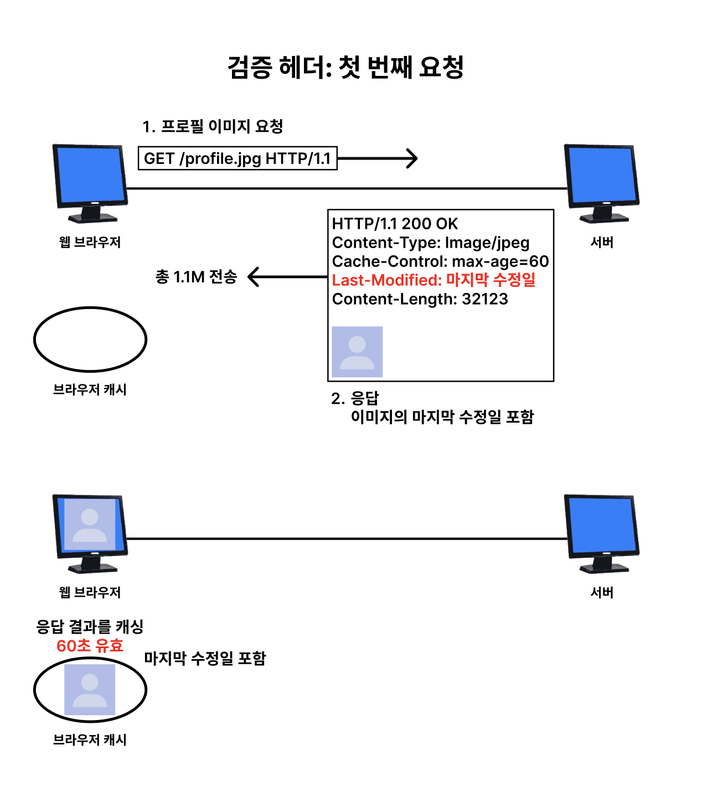
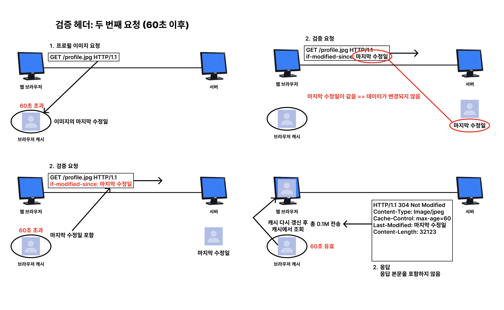
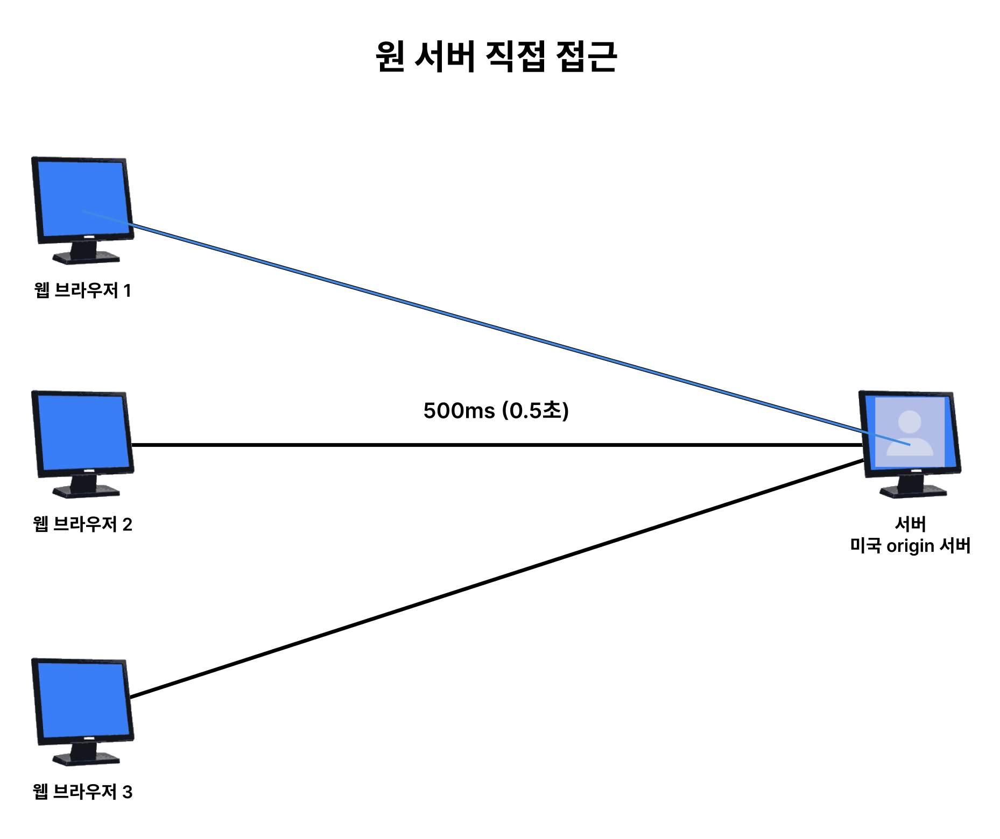
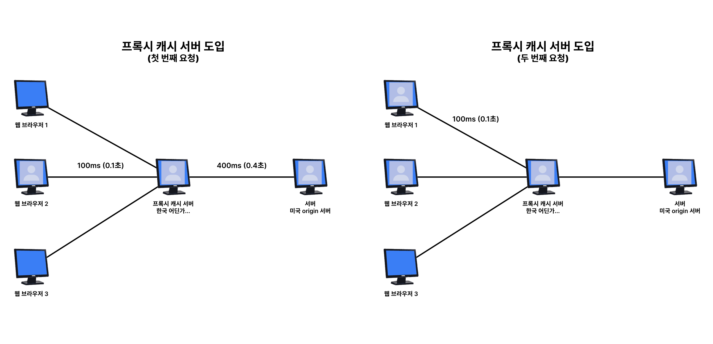
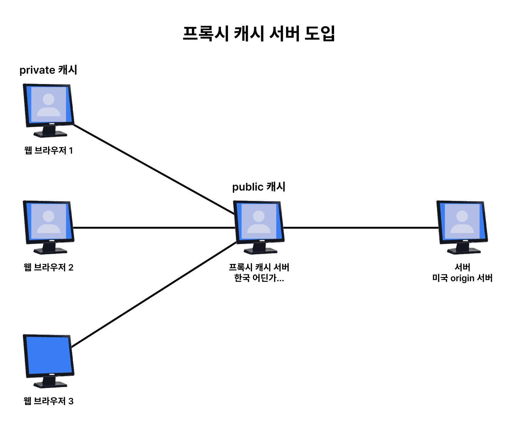
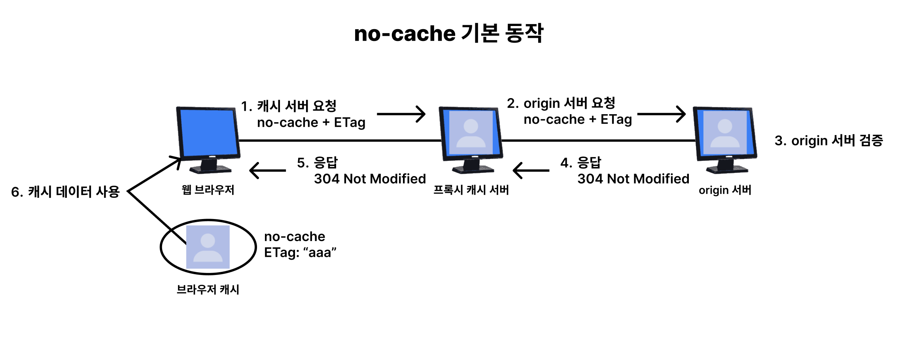
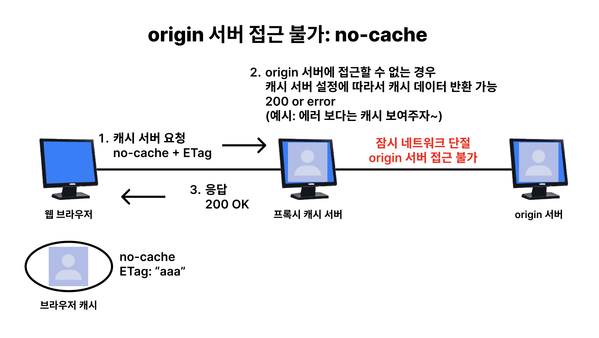
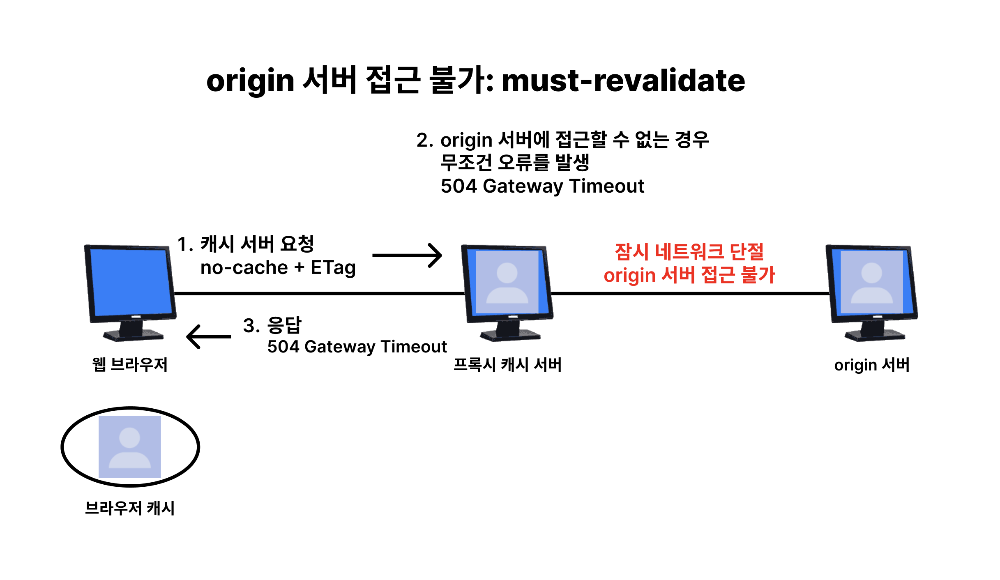

# HTTP 헤더 2

HTTP 헤더는 HTTP 전송에 필요한 모든 부가 정보를 담고 있다.  
예시: 메시지 바디의 길이, 데이터 타입, 압축, 인증, 캐시, 연결 관리 등

## 캐시 기본 동작

캐시 관련 헤더를 알아보기 전에 간단하게 캐시의 기본 동작을 예시를 통해 알아보자.



먼저 캐시를 사용하지 않는 경우에는 프로필 이미지를 요청할 때마다 서버에 요청을 보내야 한다. 첫 번째 요청이나 두 번째 요청이나 매번 서버에 요청을 보내고 이미지를 받아야 한다.

그렇게 때문에 데이터가 변경되지 않아도 계속 네트워크를 통해 이미지를 받아야 한다. 이는 네트워크 비용이나 시간 낭비로 이어질 수 있다. 또한 브라우저 로딩 속도도 느려지기 때문에 느린 사용자 경험으로 이어질 수 있다.



반면 캐시를 사용하면 이미지를 한 번 받아두고, 이후에는 서버에 요청을 보내기 전에 브라우저 캐시에 저장된 이미지를 검증 후 사용할 수 있다. 이렇게 되면 네트워크 비용이나 시간을 절약할 수 있고, 브라우저 로딩 속도도 빨라진다. 이는 빠른 사용자 경험으로 이어질 수 있다.

만약 캐시 유효 시간이 만료되었다면, 서버에 다시 요청을 보내어 새로운 이미지를 받아온다.

## 캐시 시간 초과

캐시 유효 시간이 만료되어 다시 서버에 요청을 보내면 아래의 두 가지 상황이 발생한다.

```
1. 서버에서 기존 데이터를 변경하지 않음
2. 서버에서 기존 데이터를 변경함
```

캐시 만료 후에도 서버에서 데이터가 변경하지 않았다면, 저장해 두었던 캐시를 그대로 사용할 수 있다. 단, 클라이언트의 데이터와 서버의 데이터가 일치하는지 검증하는 과정이 필요하다.

### if-modified-since, Last-Modified



클라이언트가 데이터를 요청하면 서버는 응답 헤더에 `Last-Modified`를 포함하여 응답한다. 값으로는 데이터가 마지막으로 수정된 시간을 포함한다. (예시: `Last-Modified: Tue, 15 Nov 2024 12:45:26 KST`)



60초 이후 캐시가 만료되어 다시 서버에 요청을 보내면, 클라이언트는 `if-modified-since` 헤더에 이전에 받았던 `Last-Modified` 값을 포함하여 요청한다.

서버는 클라이언트가 보낸 `if-modified-since` 값과 서버의 데이터가 변경된 시간을 비교하여, 데이터가 변경되지 않았다면 `304 Not Modified` 상태 코드와 함께 응답한다. 이때 본문은 포함되지 않는다. (네트워크 비용 절약)

클라이언트는 서버가 데이터가 변경되지 않았다고 대답하면 브라우저에 저장된 캐시를 그대로 사용한다. (캐시 갱신 및 재활용)

만약 데이터가 변경되었다면, 서버는 새로운 데이터와 함께 `200 OK` 상태 코드를 응답한다.

결과적으로 네트워크 다운로드가 발생하지만, 검증 헤더를 통해 네트워크 다운로드를 최소화할 수 있다. (변경되지 않은 데이터라면 본운 응답 X)

### if-modified-since, Last-Modified 단점

- `1초 미만 단위로 캐시 조정 불가능` : Last-Modified는 초 단위까지 표현하지만, 파일 시스템의 시간 단위가 초 단위보다 더 빠를 수 있다.
- `마지막 수정일 기반` : 마지막 수정일을 기반으로 캐시를 관리한다. 하지만 파일의 내용이 변경되지 않아도, 수정일이 변경될 수 있다.

### ETag(Entity Tag), if-none-match

캐시용 데이터에 임의의 고유한 버전 이름을 달아두는 것이다.
데어터가 변경되면 이 이름이 바뀌게 된다. (Hash를 사용하여 생성) 즉, 아주 단순하게 ETag가 변경되었다면, 데이터도 변경된 것이다.

과정은 `Last-Modified`와 비슷하다.

```
1. 클라이언트가 데이터를 요청하면 서버는 응답 헤더에 ETag를 포함하여 응답한다. ETag는 데이터의 버전이나 고유한 해시 값을 나타내며, 데이터가 변경되면 ETag 값도 변경된다. (예시: `ETag: "v1.0"`)
2. 클라이언트는 캐시에 데이터와 ETag를 저장한다.
3. 캐시 만료 이후에 클라이언트는 `if-none-match` 헤더에 이전에 받았던 ETag 값을 포함하여 요청한다.
4. 서버는 클라이언트가 보낸 `if-none-match` 값과 서버의 ETag 값을 비교하여, 데이터가 변경되지 않았다면 `304 Not Modified` 상태 코드와 함께 응답한다. 이때 본문은 포함되지 않는다.
5. 클라이언트는 서버가 데이터가 변경되지 않았다고 대답하면 브라우저에 저장된 캐시를 그대로 사용한다. (캐시 갱신 및 재활용)
! 만약 데이터가 변경되었다면, 서버는 새로운 데이터와 함께 `200 OK` 상태 코드를 응답한다. 이때 새로운 ETag 값을 함께 응답한다.
```

캐시 제어 로직을 서버에서 완전하게 관리하기 때문에 클라이언트는 단순하게 ETag만 서버에 보내고 같으면 유지, 다르면 다시 받는다. 즉, 클라이언트는 캐시 로직을 몰라도 된다.  
(예시: 배포 주기에 맞춰 ETag를 모두 갱신하자!)

## 캐시 제어 헤더

- `Cache-Control`: 캐시 제어
- `Pragma`: 캐시 제어 (하위 호환)
- `Expires`: 캐시 만료 시간을 지정 (하위 호환)

### Cache-Control 지시어

- `Cache-Control: max-age` : 캐시 유효 시간, 초 단위
- `Cache-Control: no-cache` : 데이터는 캐시해도 되지만, 항상 원(origin) 서버에 검증하고 사용
- `Cache-Control: no-store` : 데이터에 민감한 정보가 있으므로 저장하면 안됨 (사용 후 바로 삭제)

### Pragma, Expires

- `Pragma: no-cache` : 캐시 제어 (HTTP 1.0)
- `Expires: Mon, 01 Jan 1990 00:00:00 GMT` : 직접 캐시 만료일을 지정 (HTTP 1.0)

`Expires`는 캐시 만료일을 정확한 날짜로 지정한다. 하지만 현재는 더 유연한 `Cache-Control`을 권장한다. `Cache-Control: max-age`와 함께 사용하면 `Expires`는 무시된다.

## 프록시 캐시



만약 서버가 미국에 있다면, 한국에 있는 사용자는 미국까지 데이터를 요청하고 응답을 받아야 한다. 여기서는 500ms(0.5초)가 걸린다고 가정한다.

사진에서 보듯이 사용자가 프로필 이미지를 요청하면 모든 클라이언트가 0.5초씩 걸리게 된다. 이때 프록시 캐시를 도입할 수 있다.



프록시 캐시 서버는 사용자와 서버 사이에 위치하며, 서버로부터 데이터를 받아 사용자에게 전달한다. 이때 프록시 캐시 서버는 데이터를 캐시해두고, 다음에 같은 데이터를 요청할 때는 서버에 요청하지 않고 캐시된 데이터를 사용할 수 있다. 즉, 첫 번째 사용자는 0.5초, 이후 사용자는 0.1초가 걸린다. (검증, 만료 등을 고려하지 않은 예시임)



이때 `private cache`와 `public cache`가 있다. `private cache`는 특정 사용자만 사용할 수 있는 캐시이고, `public cache`는 여러 사용자가 공유하는 캐시이다.

### Cache-Control 지시어

- `Cache-Control: private` : 개인 캐시, 사용자만 사용 가능 (기본값)
- `Cache-Control: public` : 공용 캐시, 응답이 public 캐시에 저장될 수 있음
- `Cache-Control: s-maxage` : 프록시 캐시에만 적용되는 max-age
- `Age` : 원 서버에서 응답 후 프록시 캐시에 머문 시간 (초 단위)

## 확실한 캐시 무효화

`Cache-Control: no-cache, no-store, must-revalidate`를 사용하여 캐시를 확실하게 무효화할 수 있다.

- `Cache-Control: no-cache` : 데이터는 캐시해도 되지만, **항상 원 서버에 검증**하고 사용
- `Cache-Control: no-store` : 데이터에 민감한 정보가 있으므로 **저장하면 안됨**
- `Cache-Control: must-revalidate` : 캐시 유효 시간이 지나고 최초 조회 시 **원 서버에 검증**하고 사용, 이때 원 서버 접근 실패 시 반드시 오류를 응답(504 Gateway Timeout), 만약 유효 시간이 남아 있다면 캐시를 사용

### Cache-Control: no-cache 기본 동작



이름에 `no-cache`가 들어가지만, 캐시를 사용하지 않는 것이 아니다. **캐시해도 되지만, 항상 원 서버에 검증**하고 사용한다.

### no-cache vs must-revalidate

만약 원 서버에 접근할 수 없는 경우를 통해 차이점을 알아보자.



`Cache-Control: no-cache`는 캐시를 사용할 수 있지만, 항상 원 서버에 검증하고 사용한다. 이때 원 서버에 접근할 수 없다면, 서버 설정에 따라 캐시를 사용할 수 있다. (예시: 오류 보다는 캐시를 보여주자라고 설정할 수 있다.)



`Cache-Control: must-revalidate`는 캐시 유효 시간이 지나고 최초 조회 시 원 서버에 검증하고 사용한다. 이때 원 서버에 접근할 수 없다면, 반드시 오류를 응답(504 Gateway Timeout)한다. 즉, 원 서버에 접근할 수 없다면 캐시를 사용할 수 없다.

## 정리

- 캐시를 사용하면 네트워크 다운로드를 최소화할 수 있다.
- 캐시 유효 시간이 만료되면 서버에 다시 요청을 보내어 새로운 데이터를 받아온다.
- 캐시 검증을 위해 `Last-Modified & if-modified-since`, `ETag & if-none-match` 헤더들을 사용한다.
- `Last-Modified & if-modified-since`는 마지막 수정일을 기반으로 캐시를 관리한다.
- `ETag & if-none-match`는 고유한 버전 이름을 기반으로 캐시를 관리한다.
- 캐시 제어를 위해 `Cache-Control(권장)`, `Pragma`, `Expires` 헤더를 사용한다.
- 프록시 캐시를 사용하면 사용자와 서버 사이에 위치하여 캐시를 관리할 수 있다. (private, public cache 개념)
- `Cache-Control: no-cache, no-store, must-revalidate`를 사용하여 캐시를 확실하게 무효화할 수 있다.
- `Cache-Control: no-cache`는 캐시를 사용할 수 있지만, 항상 원 서버에 검증하고 사용한다.
- `Cache-Control: must-revalidate`는 캐시 유효 시간이 지나고 최초 조회 시 원 서버에 검증하고 사용한다. 이때 원 서버에 접근할 수 없다면 반드시 오류를 응답한다.

## 참고

- [모든 개발자를 위한 HTTP 웹 기본 지식 - 인프런](https://www.inflearn.com/course/http-%EC%9B%B9-%EB%84%A4%ED%8A%B8%EC%9B%8C%ED%81%AC/dashboard)
