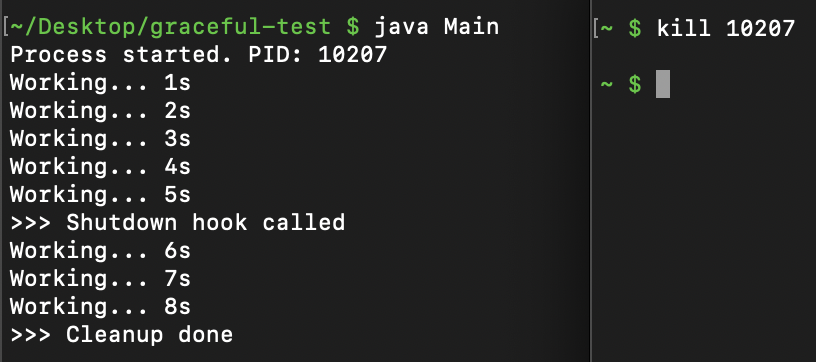
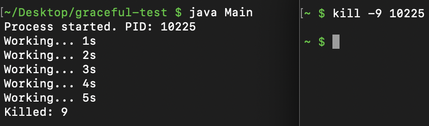

# Graceful Shutdown

무중단 배포를 학습하던 중, 애플리케이션이 종료되는 순간에도 사용자 입장에서 중단을 느끼지 않으려면 어떤 조건이 필요할지 궁금해졌다.
그래서 애플리케이션 종료 시점과 관련된 내용을 학습해보고자 한다.

## Graceful Shutdown이란?

Graceful Shutdown은 애플리케이션이 종료될 때
- 새로운 요청은 받지 않고
- 이미 수락한 요청은 끝까지 처리한 뒤
- 커넥션과 리소스를 정리하고 종료하는 절차다.

## OS 관점

Graceful Shutdown이 가능한 핵심 원리는 운영체제가 프로세스에 보내는 `시그널(Signal)`에 있다.
리눅스의 kill 명령어는 단순히 프로세스를 죽이는 것이 아니라 신호를 보내는 도구다.

### SIGTERM (Signal 15)

kill 명령어의 기본값이다. 운영체제가 프로세스에게 "종료해달라"고 정중하게 요청하는 신호다.
애플리케이션은 이 신호를 감지(Catch)할 수 있으며, 이 신호를 받았을 때 종료 훅(Shutdown Hook)을 실행하여 리소스를 정리하고 진행 중인 요청을 마무리한 뒤 스스로 종료하게 된다.

이것이 바로 Graceful Shutdown의 트리거가 된다.

### SIGKILL (Signal 9)

"강제 종료" 신호다. 
프로세스가 이 신호를 받으면 정리 작업을 할 틈도 없이 즉시 종료된다.
따라서 이 신호로는 Graceful Shutdown을 수행할 수 없다.

## kill 명령어로 시그널 보내보기

```java
public class Main {

    public static void main(String[] args) throws Exception {
        Runtime.getRuntime().addShutdownHook(new Thread(() -> {
            System.out.println(">>> Shutdown hook called");
            try {
                Thread.sleep(3000); // 정리 작업 흉내
            } catch (InterruptedException ignored) {}
            System.out.println(">>> Cleanup done");
        }));

        long pid = ProcessHandle.current().pid();
        System.out.println("Process started. PID: " + pid);

        int seconds = 0;
        while (true) {
            seconds++;
            System.out.println("Working... " + seconds + "s");
            Thread.sleep(1000);
        }
    }
}
```

자바 코드를 컴파일하고 실행한 뒤, 다른 터미널에서 해당 프로세스에 시그널을 보내보자.

### SIGTERM 보내기



카운트 로그를 찍는 프로세스에 SIGTERM을 보내면 작업 로그가 중단되고 shutdown hook이 실행된다.

- 기본적으로 `kill <PID>` 명령어는 SIGTERM을 보낸다.

### SIGKILL 보내기



SIGKILL을 보내면 카운트 도중 즉시 종료되며 어떤 정리 로그도 남지 않는다.
이는 SIGKILL이 JVM에게 종료 절차를 수행할 기회를 주지 않기 때문이다.

## Spring Boot에서의 Graceful Shutdown

[Spring Boot 2.3](https://github.com/spring-projects/spring-boot/wiki/Spring-Boot-2.3-Release-Notes#graceful-shutdown) 버전 이후부터는 이 기능이 내장되어 있으며, 설정 시 기존의 모든 요청이 완료될 때까지 기다리는 유예 기간(Grace Period)을 가진다.
이 기간 동안 톰캣(Tomcat), 제티(Jetty), 리액터 네티(Reactor Netty)와 같은 웹 서버는 네트워크 계층에서 새로운 요청을 받지 않도록 차단하거나 특정 상태 코드를 반환하며 연결을 끊는다.

```yml
# 활성화 방법
server:
  shutdown: graceful

# 유예 기간 설정 (기본값 30초)
spring:
  lifecycle:
    timeout-per-shutdown-phase: 20s
```

> ### Tip
>
> Spring Boot의 graceful shutdown은 SIGTERM을 전제로 동작하며, SIGKILL(kill -9)로 종료되면 애플리케이션은 정리할 기회 없이 즉시 종료된다.
> IDE에서 graceful shutdown이 안 되는 경우, SIGTERM을 보내지 않기 때문인 경우가 많다.

### 동작 과정

`server.shutdown=graceful`이 활성화된 상태에서 애플리케이션이 종료되면, Spring ApplicationContext가 닫히는 과정에서 다음 순서로 동작한다.

**1. 새로운 트래픽 차단**

Spring은 SmartLifecycle과 Phased 인터페이스를 이용해 빈들의 종료 순서를 관리한다.
웹 서버 컴포넌트는 가장 높은 Phase 값(Integer.MAX_VALUE)을 가지므로, 종료 과정에서 가장 먼저 처리된다.

Tomcat 기준으로는

- Connector가 pause 상태로 전환된다.
- 이미 맺어진 커넥션은 유지된다.
- 새로운 TCP 연결 요청은 더 이상 받지 않는다.
- 클라이언트는 상황에 따라 503 Service Unavailable 또는 Connection Refused를 받게 된다.

즉, 새 요청은 차단하고 기존 요청만 처리하는 상태로 전환된다.

**2. 유예 기간 동안 기존 요청 처리**

`spring.lifecycle.timeout-per-shutdown-phase` 설정은 각 Phase 그룹이 종료될 때 최대 얼마까지 기다려줄지를 의미한다.
중요한 점은 이 시간이 애플리케이션 전체 종료 시간이 아니라 각 Phase 단위로 적용되는 최대 대기 시간이라는 것이다.

기다리는 대상은 서블릿 스레드에서 실행 중인 요청이다.
즉, 컨트롤러 메서드가 return하고 응답이 완전히 전송될 때까지를 의미한다.

유예 시간이 초과되면, 요청 처리 중이더라도 더 이상 기다리지 않고 남은 작업을 정리하지 못한 채 종료된다.

이 값은 안전한 종료와 빠른 종료 사이의 트레이드오프이며, 실무에서는 보통 P99 응답 시간보다 약간 길게 설정하는 것이 일반적이라고 한다.

> 결국 Spring Boot의 graceful shutdown도 OS가 보낸 SIGTERM을 계기로 ApplicationContext 종료 흐름을 시작하는 것이다.

### 주의사항: 비동기 작업(@Async)의 함정

Graceful shutdown을 활성화했다고 해서 모든 비동기 작업까지 자동으로 기다려주는 것은 아니다.

`@Async`로 실행되는 작업이나 별도의 스레드 풀에서 동작하는 작업은 기본 설정만으로는 graceful shutdown의 대기 대상에 포함되지 않는다.

따라서 비동기 작업도 안전하게 종료하려면 ThreadPoolTaskExecutor에 다음 설정이 필요하다.

- setWaitForTasksToCompleteOnShutdown(true)
- 필요하다면 setAwaitTerminationSeconds(...) 설정

이를 설정하지 않으면 요청 처리는 끝났지만, 백그라운드 작업이 진행 중인 상태에서 애플리케이션이 먼저 종료되는 상황이 발생할 수 있다.

## 그러면 블루-그린 배포에서는?

블루-그린 배포에서 가장 민감한 지점은 트래픽이 전환된 이후, 기존 서버(A)를 어떻게 종료하느냐이다.

다음과 같은 단순한 배포 흐름을 가정해보자.
```
- Nginx → A 서버로 트래픽 전달 중
- 배포 스크립트 실행
	- B 서버 기동
	- B 서버 헬스체크 통과
	- Nginx upstream을 A → B로 변경
	- A 서버 종료
배포 완료
```

이 흐름 자체는 블루-그린 배포의 전형적인 형태지만, A 서버를 어떻게 종료하느냐에 따라 무중단 여부가 갈린다.

### 문제가 되는 경우: 강제 종료(kill -9)

만약 A 서버에 아직 처리 중인 커넥션이 남아 있는 상태에서 운영자가 kill -9로 서버를 강제 종료한다면

- 처리 중이던 요청이 즉시 중단된다.
- TCP 연결이 갑자기 끊긴다.
- 클라이언트는 timeout 또는 connection reset을 경험한다.

이러한 실패는 사전에 예측할 수 없고, 서버 로그나 메트릭으로도 추적하기 어렵다.
따라서 이 경우는 무중단 배포라고 볼 수 없다.

### 의도된 종료: SIGTERM + Graceful Shutdown

반면, A 서버 종료 시 다음과 같은 전략을 적용한다면 상황은 달라진다.

- 트래픽은 이미 B 서버로 전환된 상태
- A 서버는 새로운 요청을 더 이상 받지 않음
- SIGTERM을 보내 graceful shutdown 시작
- 일정 시간(P99 응답 시간 등) 동안 기존 요청 처리
- 유예 시간이 초과되면 남은 요청은 503으로 명시적으로 거절

이 방식에서는 일부 요청이 실패할 수 있다. 하지만 그 실패는 `의도된` 종료 과정에서 발생하고, 클라이언트가 명확한 상태 코드(503)를 수신한다. 
(이때 반환되는 503은 네트워크 오류가 아니라, 애플리케이션이 의도적으로 선택한 HTTP 응답이다.)
또한, 재시도 정책을 적용할 수 있으며, 클라이언트 입장에서 연결 단절이나 timeout이 발생하지 않는다.

즉, 실패는 존재하지만 예측 가능하고 통제 가능하다.

### 무중단 배포에서 “중단”의 기준

이 관점에서 보면, 무중단 배포의 핵심은 “모든 요청이 반드시 성공하는가”가 아니다. 
중요한 기준은 예측, 관측, 대응 가능한 실패를 만드는 것이다.

SIGTERM 기반의 graceful shutdown과 503 응답을 활용한 종료 전략은 연결 단절 없이 상태 전이를 명확히 드러내며 재시도 가능한 실패를 만든다.

> “실패가 없는 배포”가 아니라 “예기치 않은 끊김이 없는 배포”에 가깝다.

## 참고 자료

- [Spring Boot Docs - Graceful Shutdown](https://docs.spring.io/spring-boot/reference/web/graceful-shutdown.html)
- [Spring Boot Features Release Notes 2.3.0#Graceful Shutdown](https://docs.spring.io/spring-boot/docs/2.3.0.RELEASE/reference/html/spring-boot-features.html#boot-features-graceful-shutdown)
