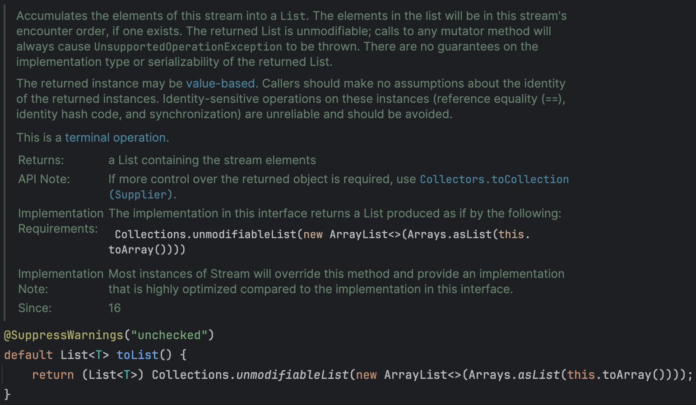

# 컬렉션을 리스트로 수집하기

IntelliJ IDEA에서 컬렉션을 리스트로 수집하려고 `collect(Collectors.toList())`를 사용하면 다음과 같은 제안이 나타난다.


해당 제안을 클릭하면 아래와 같이 `toList()`로 변경된다.

```java
List<String> sortedNames = names.stream()
                .map(String::toUpperCase)
                .sorted()
                .toList();
```

처음에는 `collect(Collectors.toList())`가 길어서 더 간결하게 사용할 수 있도록 IntelliJ IDEA에서 제안을 해주는 것이라고 생각했다. 두 방법 모두 같은 결과를 반환하기 때문에 완전히 같은 기능을 한다고 생각했다. 하지만 `toList()`는 `Collectors.toList()`와 다르다.

## collect()

`collect()` 메서드는 `Stream` 인터페이스에 정의된 메서드로 스트림의 요소를 수집하는 최종 연산이다. `collect()` 메서드는 `Collector` 인터페이스를 구현한 클래스를 인수로 받는다. `Collector` 인터페이스는 스트림의 요소를 하나의 결과로 수집하는 방법을 정의한다. 위에서 사용한 `Collectors.toList()`는 `Collector` 인터페이스를 구현한 클래스이다. 즉, `collect(Collectors.toList())`는 스트림의 요소를 리스트로 수집하는 방법을 정의한 `Collector` 인터페이스를 구현한 `Collectors.toList()`를 인수로 받는 것이다.

## Collertors.toList()


앞서 말한 것처럼 `Collectors.toList()`는 `Collector` 인터페이스를 구현한 클래스이며, 스트림의 요소를 리스트로 수집하는 방법을 정의한다. `ArrayList`를 생성하고 `ArrayList.add()` 메서드를 이용해 요소를 추가하는 방식으로 요소를 수집하는 것을 볼 수 있다. 추가적으로 설명에서는 반환된 리스트의 유형, 가변성, 직렬화 가능성 또는 스레드 안전성에 대한 보장이 없다고 한다.

```java
List<String> sortedNames = names.stream()
                .map(String::toUpperCase)
                .sorted()
                .collect(Collectors.toList());
```

위 코드를 설명하면 `names` 스트림의 요소를 대문자로 변환하고 정렬한 후 `Collectors.toList()`를 이용해 `ArrayList`를 생성하고 `ArrayList.add()` 메서드를 이용해 요소를 추가한다. 이때 반환된 리스트의 유형, 가변성, 직렬화 가능성 또는 스레드 안전성에 대한 보장이 없다고 할 수 있다.

## toList()



`toList()`는 JDK 16부터 추가된 메서드로 `Stream` 인터페이스에 정의된 메서드이다. `toList()`는 `Collectors.toList()`와 같은 기능을 하는 것 같지만 아래의 설명이 중요하다.

```
The returned List is unmodifiable; calls to any mutator method will always cause UnsupportedOperationException to be thrown.
```

`toList()`로 수집된 리스트는 수정할 수 없으며, 수정자 메서드를 호출하면 `UnsupportedOperationException`이 발생한다. 즉, `toList()`로 수집된 리스트는 불변 리스트라는 것이다.

```java
List<String> sortedNames = names.stream()
                .map(String::toUpperCase)
                .sorted()
                .toList();
```

위 코드를 설명하면 `names` 스트림의 요소를 대문자로 변환하고 정렬한 후 `toList()`를 이용해 불변 리스트를 생성한다. 이때 반환된 리스트는 수정할 수 없으며, 수정 작업을 호출하면 `UnsupportedOperationException`이 발생한다. 이때 반환된 리스트는 스레드 안전하다고 할 수 있다.


IntelliJ IDEA에서 `toList()`로 수집된 리스트를 수정하려고 하면 "Immutable object is modified" 경고가 나타난다. 이 경고는 `toList()`로 수집된 리스트는 수정할 수 없다는 것을 알려준다. 이를 무시하고 실행한다면 `UnsupportedOperationException`이 발생하는 것을 확인할 수 있다.


## 추가 테스트

처음에 IntelliJ IEDA에서 `collect(Collectors.toList())`를 사용했을 때는 `toList()`로 변경할 수 있다는 제안이 나타났다. 그렇다면 언제나 `toList()`로 변경할 수 있다는 제안이 나타나는 것인지 확인하기 위해 다른 코드를 작성해보았다.


사진처럼 수집된 리스트가 수정되는 코드가 이미 작성되어 있는 경우 노란줄과 함께 `toList()`로 변경할 수 있다는 제안이 나타나지 않았다.

# 결론

`collect(Collectors.toList())`와 `toList()`는 완전히 같은 기능을 하는 것이 아니다.

`collect(Collectors.toList())`로 수집된 리스트는 `thread-safe` 하지 않기 때문에 여러 스레드가 같은 리스트를 수정하려고 시도한다면 예상치 못한 결과나 오류가 발생할 수 있다. 반면, `toList()`로 수집된 리스트는 수정할 수 없으며, 수정하는 코드가 실행된다면 `UnsupportedOperationException`이 발생한다. 따라서 `toList()`를 사용하면 불변 리스트를 생성할 수 있고, 불변 리스트는 스레드 안전하다.

만약 반환할 리스트가 수정되지 않거나, 수정되지 않아야 한다면 `toList()`를 사용하는 것이 좋을 것 같다.
