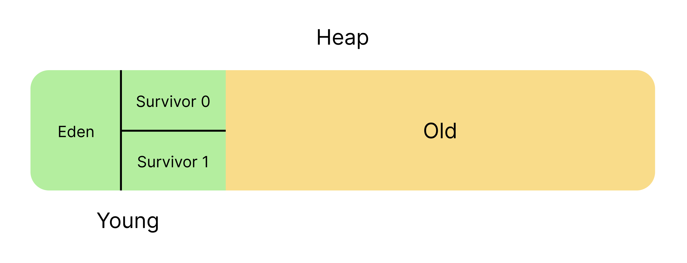

# Garbage Collection (GC)

자바로 작성된 프로그램은 JVM(Java Virtual Machine) 위에서 실행된다. JVM은 `가비지 컬렉션(Garbage Collection)`을 통해 메모리를 자동으로 관리한다. 가비지 컬렉션은 자바의 메모리 관리 방법 중의 하나로 JVM의 `Heap 영역`에서 동적으로 할당했던 메모리 중 사용하지 않는 메모리를 찾아내고 해제하는 기능이다.

## 등장 배경

등장 배경을 설명할 때 가장 많이 나오는 예제가 C언어이다. C언어는 메모리를 직접 할당하고 해제해야 한다. 즉, 메모리를 할당하고 해제하는 것은 온전히 개발자의 책임이 되는 것이다. 이 때문에 실제로 많은 문제가 발생했다고 한다.

```
- 해제한 메모리를 다시 사용하려는 경우
- 해제한 메모리를 까먹고 다시 해제하는 경우
- 메모리를 할당하고 해제하는 것을 잊어버리는 경우 (메모리 누수가 발생하고, 이것이 잦아지면 큰 문제로 이어질 수 있다.)
```

반면 자바는 가비지 컬렉터(Garbage Collector)가 메모리를 자동으로 관리해주기 때문에 메모리 관리에 대한 부담을 덜 수 있고, 개발과 비즈니스 로직에 집중할 수 있다.

## 어떤 것이 가비지인가?

가비지(Garbage)의 단어 자체는 쓰레기를 의미한다. 가비지 컬렉터는 어떤 것을 가비지로 인식할까?

일반적으로 Heap 영역에 생성된 객체 중에서 참조되지 않는 객체(더 이상 사용되지 않는 객체)를 가비지로 인식한다. 아래의 예시를 통해 쉽게 이해할 수 있다.

```java
for (int i = 0; i < 1000; i++) {
    Dog dog = new Dog();
    dog.bark();
}
```

for 루프를 통해 1000개의 Dog 객체가 생성되고 사용된다. 그러나 루프가 끝나고 나면 더 이상 사용되지 않는다. 이처럼 더 이상 사용되지 않는 객체를 가비지라고 한다.

만약 이렇게 프로그램 실행 중에 사용되지 않는 객체들이 메모리에 쌓이게 된다면, 결국 메모리 부족으로 인해 프로그램이 종료될 수 있다.

## 가비지 판단 기준 (Reachability)

가비지 컬렉션은 도달 능력(Reachability)을 기반으로 가비지를 판단한다. 도달 능력이란 어떤 객체가 다른 객체에 의해 참조되는지 여부를 의미한다. 객체에 대한 참조가 존재하면 도달 가능하다고 판단하며, 그렇지 않으면 도달 불가능하다고 판단한다.


- Reachable: 객체가 참조되고 있는 상태 (Object1, Object2, Object4)
- Unreachable: 객체가 참조되고 있지 않은 상태, GC 대상 (Object3)

JVM의 메모리에서 객체들은 Heap 영역에 생성되고 Method 영역과 Stack 영역에는 참조값(주소값)만 저장된다. 하지만 특정 메서드의 실행이 끝나는 것처럼 Heap 영역에 생성된 객체의 참조값을 가진 변수가 없어지면, 그 객체는 더 이상 사용되지 않는 객체(그림에서 Object 3과 같은)로 판단된다. 이러한 가비지를 가비지 컬렉터가 수집하여 메모리를 확보하는 컨셉이다. (JVM 구조에 대해서는 뒤에서 살펴볼 예정이다.)

## 그러나...

불필요한 객체는 가비지 컬렉터가 알아서 처리해주기 때문에 편리하고, 한정된 메모리를 효율적으로 관리할 수 있게 되었다.

그러나 이러한 기능에도 단점이 존재한다.

```
- 가비지를 판단하는 과정에서 비용이 발생한다.
- 자동으로 메모리를 관리해주기 때문에 가비지 컬렉션 실행 타이밍이나 점유 시간을 예측하기 어렵다. (개발자가 제어하기 어렵다.)
- 가비지 컬렉션이 실행되는 동안 애플리케이션의 실행이 멈추는 `Stop-the-World` 현상이 발생한다.
```

### Stop-The-World (STW)

가비지 컬렉션을 실행하기 위해 JVM이 애플리케이션을 모두 멈추는 현상을 `Stop-the-World`라고 한다. Stop-the-World가 발생하면, 가비지 컬렉션 실행을 위한 스레드를 제외한 모든 애플리케이션 스레드가 작업을 멈추게 된다.

이러한 현상은 애플리케이션의 응답 시간을 길게 만들 수 있으므로, 가비지 컬렉션 튜닝을 통해 이러한 현상을 줄이려고 노력한다고 한다.

가비지 컬렉션을 사용하면 `Stop-the-World` 현상이 발생할 수밖에 없다. 따라서 Real-time 시스템(미사일과 같이 정확한 시간에 동작해야 하는 시스템 등)에서는 가비지 컬렉션을 사용하는 것이 적합하지 않다고 한다. 언제 가비지 컬렉션이 실행될지 예측할 수 없기도 하고, 실행 중에 애플리케이션의 실행이 멈추는 현상이 발생할 수 있기 때문이다.

## 가비지 컬렉션 동작 방식

가비지 컬렉션은 Unreachable 객체(가비지)를 찾아내고 메모리를 확보하는 과정을 거친다. 가비지 컬렉션은 다음과 같은 방식으로 동작한다. 이때 `Mark-and-Sweep` 알고리즘을 사용한다.


원리는 그림과 같이 간단하다. 먼저 가비지를 식별(Mark)하고 제거(Sweep)한다. 이때 단편화(Fragmentation)가 발생할 수 있으므로, 이를 해결하기 위해 `Compaction` 과정을 거친다.

- `Mark` : 가비지 컬렉터가 Reachable 객체를 찾아내기 위해 Heap 영역을 순회하며 Mark를 한다. Root Space부터 순회하여 Reachable 객체를 찾아내고, Mark를 한다. 이때 연결되지 않은 객체는 가비지로 판단한다.
- `Sweep` : 가비지로 판단된 객체들을 Heap 영역에서 제거한다.
- `Compaction` : 제거된 객체들로 인해 발생한 단편화를 해결하기 위해 객체들을 한 곳으로 모은다. (가비지 컬렉션 종류에 따라 Compaction 과정이 생략될 수도 있다고 한다.)

### 간단한 JVM 구조


- 출처: [Wikipedia-Java virtual machine](https://en.wikipedia.org/wiki/Java_virtual_machine)

가비지 컬렉션이 어떻게 동작하는지 이해하기 위해서는 JVM의 메모리 구조를 간단하게라도 이해하는 것이 중요하다.

JVM은 크게 3가지 영역으로 구성된다.

- `Class Loader` : 바이트 코드를 읽고 클래스 정보를 메모리의 Heap, Method Area에 저장한다.
- `JVM Memory` : 프로그램이 실행되는 동안 사용하는 메모리 영역이다.
- `Execution Engine` : 바이트 코드를 네이티브 코드로 변환하고 실행하는 엔진이다.

### JVM 메모리 구조

JVM은 OS로부터 메모리를 할당받아 다음과 같이 구성된다. 해당 메모리를 용도에 따라 여러 영역으로 나누어 사용한다.


우선 `Method Area`와 `Heap` 영역은 모든 스레드가 공유하는 영역이다. 반면 `Stack`과 `PC Register`, `Native Method Stack`은 각 스레드마다 별도로 할당되며, 스레드가 종료되면 해당 스레드와 함께 사라진다. 아래 그림으로 살펴보자.


- 출처: [JVM 구조 블로그 포스팅](https://blog.naver.com/PostView.naver?blogId=gomets_journey&logNo=223305402218&categoryNo=28&parentCategoryNo=0&viewDate=&currentPage=2&postListTopCurrentPage=&from=postList&userTopListOpen=true&userTopListCount=5&userTopListManageOpen=false&userTopListCurrentPage=2&photoView=0)

- `Method Area` : 클래스 정보를 메타데이터처럼 저장하는 공간이다. 클래스 로더에 의해 로드되는 클래스 파일의 바이트 코드를 저장한다. (클래스 변수, 메서드 정보 등)
- `Heap` : 어플리케이션 실행 중에 생성된 객체를 저장하는 공간이다. 가비지 컬렉션의 대상이 되는 공간이다.
- `Stack` : 메서드 호출 시 생성되는 지역 변수, 매개변수, 리턴 값 등을 저장하는 공간이다. (스레드마다 별도로 할당)
- `PC Register` : 현재 수행 중인 JVM 명령의 주소를 저장하는 공간이다. (스레드마다 별도로 할당)
- `Native Method Stack` : 네이티브 메서드를 실행하는 스레드의 호출 정보를 저장하는 공간이다. (스레드마다 별도로 할당)

### 가비지 컬렉션의 Root Space

Root Space는 가비지 컬렉션에서 객체의 생명줄이라고 할 수 있다. Root Space는 객체의 생존 여부를 판단하기 위해 사용하는 기준이 되는 객체들을 말한다. 객체가 Root Space에 의해 직접 또는 간접적으로 참조되고 있는 동안에는 가비지 컬렉터에 의해 제거되지 않는다. (프로그램 내에서 생성된 모든 객체를 트리 구조로 관리한다고 생각할 때, Root Space는 트리의 루트 노드라고 할 수 있다.)

JVM 가비지 컬렉션의 Root Space는 아래와 같다.

- `Stack의 로컬 변수` : 메서드 내에 선언된 지역 변수, 메서드가 실행 중이라면 항상 접근할 수 있다.
- `Method Area의 정적 변수` : 클래스에 속하며 모든 인스턴스에서 공유되는 변수, 클래스가 로드된 동안에는 항상 접근할 수 있다.
- `JNI 참조` : JNI 호출의 일부로 생성된 객체, 네이티브 코드에서 참조되는지 여부를 알 수 없으므로 특별히 관리된다.

JVM은 위와 같은 Root Space를 기준으로 `Mark-and-Sweep` 알고리즘을 통해 가비지 컬렉션을 실행한다.

## Heap 메모리 구조

JVM의 Heap 영역은 JVM에서 실행되는 프로그램의 데이터를 저장하기 위해 런타임 동적으로 할당하여 사용하는 영역으로 가비지 컬렉션의 대상이 되는 공간이다.

### 약한 세대 가설 (The Weak Generational Hypothesis)


- 출처: [Oracle Docs](https://docs.oracle.com/javase/8/docs/technotes/guides/vm/gctuning/generations.html)

이미지에서 보듯이 대부분의 객체는 금방 Unreachable 상태가 된다. 즉, 객체의 생존 기간은 매우 짧다. 예를 들어 for 루프에서 사용하는 반복자 객체는 루프가 끝나면 더 이상 사용되지 않는다.

즉, 객체는 대부분 일시적으로 생성되고 사용되는 객체이며, 오래 살아남는 객체는 드물다. 이러한 특성을 바탕으로 더욱 효율적인 메모리 관리를 위해 가비지 컬렉션은 객체의 생존 기간에 따라 Heap 영역을 세대별로 나누게 되었고, `Young` 영역과 `Old` 영역으로 나누어 관리한다.


> 추가로 공식 문서에서는 가비지 수집 과정에서 병목 현상이 발생한다면, 전체 힙 크기와 각 영역의 크기를 개발자가 지정해야 할 수도 있다고 한다. 시스템과 프로그램의 특성에 따라 조절하면 더 좋은 성능을 얻을 수 있을 것이다.

### Young 영역

Young 영역은 새롭게 생성된 객체가 할당(Allocation)되는 영역이다. 앞서 설명한 약한 세대 가설에 따라 대부분의 객체는 금방 Unreachable 상태가 되기 때문에, 많은 객체가 Young 영역에 생성되고 사라진다.

또한 영역 별로 가비지 컬렉션 알고리즘이 다르게 적용되는데, Young 영역은 대부분의 객체가 금방 Unreachable 상태가 되기 때문에 `Minor GC`가 주로 발생한다.



Young 영역은 내부에서 `Eden 영역`과 `Survivor 영역`으로 나누어진다.

- `Eden 영역` : 새롭게 생성된 객체가 할당되는 영역 (new 키워드로 생성된 객체)
- `Survivor 영역` : Eden 영역에서 최소 1번의 가비지 컬렉션에서 살아남은 객체가 존재하는 영역

더 자세한 설명은 뒤에서 GC 과정을 설명할 때 함께 정리할 예정이다.

### Old 영역

Young 영역에서 일정 기간동안 Reachable 상태가 유지되는 객체들은 Old 영역으로 이동한다. Old 영역은 Young 영역보다 크게 할당되며, Old 영역에 대한 가비지 컬렉션이 비교적 더 적게 발생한다.

Old 영역에 대한 가비지 컬렉션은 `Major GC` 또는 `Full GC`라고 불린다.

### Old 영역이 Young 영역보다 큰 이유

Old 영역이 Young 영역보다 크게 할당되는 이유는 Young 영역에서 대부분의 객체는 짧은 생애 주기를 가지기 때문이다. 새롭게 생성된 객체는 Young 영역에 할당되며, 많은 객체가 곧바로 가비지로 수집된다. 따라서 Young 영역은 상대적으로 작게 설정되어 빠르게 가비지 컬렉션이 이루어지도록 한다.

또한 Young 영역의 가비지 컬렉션(Minor GC)은 비교적 빠르고 효율적이다. 반면 Old 영역의 가비지 컬렉션(Major GC)은 시간이 더 오래 걸리고 성능에 더 큰 영향을 미칠 수 있다. 따라서 Old 영역을 크게 할당하여 Major GC의 빈도를 줄이는 것이 중요하다.

## Minor GC

Minor GC는 Young 영역에서 발생하는 가비지 컬렉션이며, 아래와 같은 과정을 거친다.

```
- 새로 생성된 객체가 Eden 영역에 할당된다.
- 객체가 계속 생성되어 Eden 영역이 꽉 차게 되고 Minor GC가 실행된다.
- Eden 영역에서 살아남은 객체는 1개의 Survivor 영역으로 이동된다.
- Eden 영역에서 사용(참조)되지 않는 객체의 메모리가 해제된다.
- 위 과정을 반복하면서 두 개의 Survivor 영역을 옮겨가며 가비지 컬렉션을 실행한다. (1개의 Survivor 영역은 반드시 비어있는 상태가 된다.)
```

이러한 과정을 반복하여 계속해서 살아남은 객체는 Old 영역으로 이동(Promotion)된다. 그림으로 살펴보자.


이처럼 반복되는 Minor GC 과정을 살펴보면 항상 Survivor 영역 중 하나는 비어있는 상태가 되어야 한다. 이러한 과정을 통해 Young 영역에서 살아남은 객체들은 Old 영역으로 이동하게 된다.

추가로 JVM 옵션으로 Eden 영역과 Survivor 영역의 비율을 조절할 수 있다. 이를 통해 Minor GC의 빈도를 조절할 수 있다.

### age와 age threshold

age 값은 Survivor 영역에서 객체가 살아남은 횟수를 의미한다. age 값이 age 임계값(threshold)보다 크면 Old 영역으로 이동되는데 이것을 Promotion이라고 한다. JVM 중 가장 일반적인 HotSpot JVM의 경우 이 age의 기본 임계값은 31이다. age를 기록하는 부분이 6bit로 되어있기 때문이라고 한다.

## Major GC (Full GC)

Old 영역은 길게 살아남는 메모리들이 존재하는 공간이다. Old 영역의 객체들은 GC 과정 중에 제거되지 않은 경우 age 임계값을 초과하여 이동된 객체들이다. 그리고 Major GC는 객체들이 계속 Promotion 되어 Old 영역의 메모리가 부족해지면 발생하고 Full GC라고도 불린다.

Major GC는 Old 영역 전체를 검사하기 때문에 Minor GC보다 더 많은 시간이 소요된다. (Young 영역보다 Old 영역의 크기가 더 크다.) 따라서 Major GC가 발생하면 애플리케이션의 응답 시간이 길어질 수 있다.

즉, Minor GC는 Young 영역의 크기가 작아서 자주 발생하지만, 빠르게 처리되는 반면 Major GC는 Old 영역의 크기가 크기 때문에 자주 발생하지 않지만 처리 시간이 오래 걸린다.

그림으로 Major GC를 살펴보자. age threshold는 7이라고 가정한다.


Minor GC에서 오랫동안 살아남은 객체들은 Old 영역으로 이동하게 된다. 이때 age 값이 age threshold를 초과하면 Old 영역으로 이동된다. 이러한 과정을 반복하다가 Old 영역의 메모리가 부족해지면 Major GC가 발생하게 된다.

> Minor GC는 보통 0.5초 정도의 시간이 소요되지만, Major GC는 10배 이상의 시간이 소요될 수 있다고 한다. 따라서 Major GC가 발생하는 것을 최대한 줄이는 것이 중요하다. 왜냐하면 초반에 공부했던 `Stop-The-World` 현상이 발생하기 때문이다. GC가 일어나면 Thread가 멈추고 Mark and Sweep 작업을 해야 해서 CPU에 부하를 주기 때문에 멈추거나 버벅이는 현상이 일어나기 때문이다.

## 가비지 컬렉션 알고리즘

JVM의 가비지 컬렉션은 개발자의 수고를 덜어주고 효율적인 개발을 할 수 있도록 도와준다. 하지만 문제는 가비지 컬렉션을 수행하기 위해 `Stop-The-World`가 발생되고 이로 인해 애플리케이션의 응답 시간이 길어지는 현상이 발생한다. 이러한 문제를 해결하기 위해 다양한 가비지 컬렉션 알고리즘이 개발되었다.

소개하는 가비지 컬렉션 알고리즘 모두 옵션을 통해 선택할 수 있으며, 애플리케이션의 특성에 따라 적절한 알고리즘을 선택하여 사용할 수 있다.

### Serial GC

- 주로 클라이언트 스타일의 머신을 대상으로 하며, 자바 SE 5 및 6에서 기본으로 사용되는 가비지 컬렉션 방식이다.
- 단일 가상 CPU를 사용하여 `Minor GC`, `Major GC`을 직렬로 수행한다.
- Minor GC는 `Mark-Sweep`을 사용하고, Major GC에는 `Mark-Sweep-Compact`를 사용한다.
- 싱글 스레드로 가바지 컬렉션을 처리하기 때문에 Stop-The-World 시간이 길어진다.
- 하드웨어 성능이 안좋거나 Heap이 매우 작은 경우에 사용할 수 있다.
- 즉, 메모리와 코어가 적은 임베디드 하드웨어에서도 유용하다고 한다.
- `-XX:+UseSerialGC` 옵션으로 사용할 수 있다.


### Parallel GC

- Java 8에서 디폴트로 사용되는 가비지 컬렉션 방식이다.
- Serial GC와 기본적인 방식은 같지만, Young 영역의 Minor GC를 멀티 스레드로 수행한다. (Old 영역은 여전히 싱글 스레드이다.)
- Serial GC보다 Stop-The-World 시간이 짧고, 멀티 코어 환경에서 더 효율적으로 동작한다.
- `-XX:+UseParallelGC` 옵션으로 사용할 수 있다. (GC 스레드는 기본적으로 cpu 개수만큼 할당되며 옵션을 통해 지정할 수도 있다.)


### CMS GC (Concurrent Mark Sweep GC)

- Stop-The-World 시간을 줄이기 위해 개발된 가비지 컬렉션 방식이다.
- GC 작업을 애플리케이션 스레드와 병행하여 수행한다.
- 기본적으로 메모리 단편화를 방지하기 위한 Compaction을 지원하지 않는다.
- 또한 메모리와 CPU 사용량이 높아진다는 단점이 있다.
- `G1 GC`가 나오면서 더 이상 사용되지 않는다. (Java 9 버젼부터 Deprecated 되었고, 결국 Java 14에서는 사용이 중지되었다.)


### G1 GC (Garbage First GC)

- Java 9부터 디폴트로 사용되는 가비지 컬렉션 방식이다.
- 4GB 이상의 힙 메모리, Stop the World 시간이 0.5초 정도 필요한 상황에 사용을 권장한다. (Heap이 너무 작을 경우 사용하지 않는 것이 좋다.)
- 기존의 GC 알고리즘에서는 Heap 영역을 물리적으로 고정된 Young / Old 영역으로 나누어 사용하였지만,
  G1 GC는 전체 힙 영역을 `Region`이라는 영역으로 체스판과 같이 분할하여 상황에 따라 Eden, Survivor, Old 등 역할을 고정이 아닌 런타임에 동적으로 부여한다. 가비지로 가득 찬 영역을 빠르게 회수하여 빈 공간을 확보하므로, 결국 GC 빈도가 줄어드는 효과를 얻게 되는 원리이다.
- `-XX:+UseG1GC` 옵션으로 사용할 수 있다.


G1 GC에서는 이전의 GC들처럼 일일이 메모리를 탐색해 객체들을 제거하지 않는다. 대신 메모리가 많이 차있는 영역(region)을 인식하는 기능을 통해 메모리가 많이 차있는 영역을 우선적으로 GC 한다. 즉, G1 GC는 Heap Memory 전체를 탐색하는 것이 아닌 영역(region)을 나눠 탐색하고 영역(region) 별로 GC가 일어난다.

또한 이전의 GC 들은 Young Generation에 있는 객체들이 GC가 돌 때마다 살아남으면 Eden → Survivor0 → Survivor1으로 순차적으로 이동했지만, G1 GC에서는 순차적으로 이동하지는 않는다. 대신 G1 GC는 더욱 효율적이라고 생각하는 위치로 객체를 Reallocate(재할당) 시킨다. 예를 들어 Survivor1 영역에 있는 객체가 Eden 영역으로 할당하는 것이 더 효율이라라고 판단될 경우 Eden 영역으로 이동시킨다.

## 마무리

말로만 듣고 넘겼던 가비지 컬렉션에 대해 조금 더 깊이 알아보았다. 가비지 컬렉션은 자바의 큰 장점 중 하나이지만, 이를 통해 발생하는 Stop-The-World 현상은 애플리케이션의 성능에 영향을 미칠 수 있다. 따라서 가비지 컬렉션 튜닝은 애플리케이션의 성능을 향상시키기 위해 중요한 요소 중 하나이다.

물론, 가비지 컬렉션 튜닝은 최후의 수단으로 생각하는 것이 좋다고 한다. 튜닝 전에는 가비지 컬렉션의 원리와 동작 방식을 이해하고, 가비지 컬렉션이 최대한 덜 작동하도록 코드를 작성하는 것이 중요하다. 그러나, "객체 생성 및 할당은 성능에 독이 되니 피해야겠어!"라는 생각은 피해야 할 것 같다. 당연한 말이지만, 클린 코드와 가독성을 고려하여 최선의 코드를 작성하는 것이 중요할 것 같다. 또한, 가비지 컬렉션 튜닝은 애플리케이션의 특성에 따라 다르기 때문에, 튜닝을 하기 전에 애플리케이션의 특성을 분석하는 것이 중요해 보인다.

## 참고 자료

- [Oracle Docs-GC tuning](https://docs.oracle.com/javase/8/docs/technotes/guides/vm/gctuning/generations.html)
- [Oracle-Java Garbage Collection Basics](https://www.oracle.com/webfolder/technetwork/tutorials/obe/java/gc01/index.html)
- [Java Garbage Collection 포스팅](https://d2.naver.com/helloworld/1329)
- [Java의 동작 원리와 JVM 구조 포스팅](https://blog.naver.com/PostView.naver?blogId=gomets_journey&logNo=223305402218&categoryNo=28&parentCategoryNo=0&viewDate=&currentPage=2&postListTopCurrentPage=&from=postList&userTopListOpen=true&userTopListCount=5&userTopListManageOpen=false&userTopListCurrentPage=2&photoView=0)
- [Java 가비지 컬렉션 기본 개념 포스팅](<https://jellili.tistory.com/60#%EC%9E%90%EB%B0%94%20%EA%B0%80%EB%B9%84%EC%A7%80%20%EC%BB%AC%EB%A0%89%EC%85%98(GC%2C%20Garbage%20Collection)%20%EA%B8%B0%EB%B3%B8%20%EA%B0%9C%EB%85%90-1>)
- [[10분 테코톡] 조엘의 GC](https://www.youtube.com/watch?v=FMUpVA0Vvjw&list=LL&index=1&ab_channel=%EC%9A%B0%EC%95%84%ED%95%9C%ED%85%8C%ED%81%AC)
