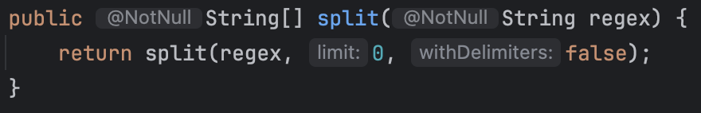
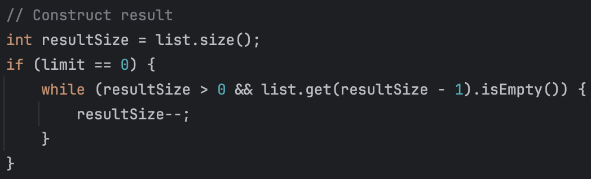

# String의 split() 메서드

String 클래스에서 제공하는 `split()` 메서드는 문자열을 특정 구분자로 나누어 배열로 반환한다. 이 메서드를 사용하다가 발생한 논리적인 문제를 기록하려고 한다.

## 문제 상황

```text
게임에 참여할 사람의 이름을 입력하세요.(쉼표 기준으로 분리)
pobi, jason
```

위와 같은 요구사항을 해결한다고 가정하면, String 클래스에서 제공하는 `split()` 메서드를 사용하려고 할 것이다.

나도 간단하게 `split()` 메서드를 사용하여 문제를 해결하려고 했다.

## 1. 구분만 한다.

```java
public class InputView {

    private static final Scanner scanner = new Scanner(System.in);

    public List<String> readPlayerNames() {
        System.out.println("게임에 참여할 사람의 이름을 입력하세요.(쉼표 기준으로 분리)");
        return splitWithComma(scanner.nextLine());
    }

    private List<String> splitWithComma(String input) {
        return Arrays.stream(input.split(","))
                .toList();
    }
}
```

가독성을 위해 `splitWithComma()` 라는 메서드를 작성했다. Scanner로 입력받은 문자열을 `쉼표(,)`를 기준으로 문자열을 나누려고 했다.
그러나 실행 결과는 예상과 달랐다.

```text
게임에 참여할 사람의 이름을 입력하세요.(쉼표 기준으로 분리)
pobi, jason

실제로 반환된 배열 출력 결과: [pobi,  jason]
```

`split()` 메서드를 사용하면 `쉼표(,)`를 기준으로 문자열을 나누기만 할 뿐, 공백을 제거하지 않는다. 따라서 `jason` 앞에 공백이 포함되어 있다.

### 해결 방법

`,`로 구분된 문자열들을 `trim()` 메서드를 사용하여 공백을 제거한 후, 리스트로 반환하면 된다.

```java
// trim() 사용하기
private List<String> splitWithComma(String input) {
    return Arrays.stream(input.split(","))
            .map(String::trim)
            .toList();
}
```

이렇게 하면 공백이 제거된 결과를 얻을 수 있다.

또는 `split()` 메서드의 인자로 `\\s*,\\s*`를 사용하여 공백을 제거할 수도 있다.

```java
// 정규식을 사용하기
private List<String> splitWithComma(String input) {
    return Arrays.stream(input.split("\\s*,\\s*"))
            .toList();
}
```

> `\\s*`: 0개 이상의 공백 문자  
> `,`: 쉼표  
> `\\s*`: 0개 이상의 공백 문자

이렇게 하면 `split()` 메서드를 사용하면서 공백을 제거할 수 있다.

두 방법 모두 원하는 결과를 얻을 수 있지만, 성능 측면에서는 `trim()` 메서드를 사용하는 것이 정규표현식을 사용하는 것보다 더 효율적이라고 한다.

```text
게임에 참여할 사람의 이름을 입력하세요.(쉼표 기준으로 분리)
pobi,                  jason

실제로 반환된 배열 출력 결과: [pobi, jason]
```

공백이 몇개가 들어가더라도 제거되는 것을 확인할 수 있다.

## 2. 구분자 이후에 아무것도 없는 경우

```text
게임에 참여할 사람의 이름을 입력하세요.(쉼표 기준으로 분리)
,,,

실제로 반환된 배열 출력 결과: []
```

위와 같이 입력한 경우 `split()` 메서드의 반환 배열은 아무것도 없는 배열이다. 이런 결과를 쉽게 설명하면 `split()` 메서드는 구분자 뒤에 아무것도 없는 문자열은 무시한다고 할 수 있다.



위는 구분자만 전달한 경우에 호출되는 `split()` 메서드이다. 구분자만 전달한 경우 limit은 0이 전달되고, withDelimiters는 false로 전달된다.

메서드를 쭉 따라가면 아래와 같은 로직을 볼 수 있다.



limit이 0인 경우, 구분자 뒤에 아무것도 없는 문자열(trailing empty strings)은 결과에서 제외된다.

예를 들어, `,,pobi,,,`와 같은 문자열을 `split(",")`로 나누면 결과는 `[, , pobi]`가 된다.

즉, `,,,`와 같은 문자열은 모두 해당 반복문에서 버려진다고 할 수 있다.

이러한 동작은 많은 경우에 유용할 수 있겠지만, 나의 사용 사례에서는 문제가 될 수 있다. 사용자가 `,`를 입력했다는 것은 게임에 참여할 사람의 이름을 입력하고 구분했다고 간주해야 하는데, 이러한 정보가 split() 내부에서 무시되는 것은 논리적으로 맞지 않다는 관점이다.

무시되는 것이 아니라 차라리 이름은 공백일 수 없다고 예외를 발생시키는 것이 더 좋은 방법이라고 생각한다.

### 해결 방법

limit을 -1로 전달하면 구분자 사이에 빈 문자열도 포함하여 반환한다.

```java
private List<String> splitWithComma(String input) {
    return Arrays.stream(input.split(",", -1))
            .map(String::trim)
            .toList();
}

// 이후 이름을 검증하는 로직을 추가할 수 있다.
```

이제 사용자가 4명의 플레이어를 의도했지만 이름을 비워둔 것으로 정확하게 해석할 수 있다. 이후에 추가적인 검증 로직을 적용하여 빈 이름에 대한 처리를 할 수 있다.

```text
게임에 참여할 사람의 이름을 입력하세요.(쉼표 기준으로 분리)
,,,

실제로 반환된 배열 출력 결과: [, , , ] (size: 4)
```

사용자는 4명의 플레이어 이름을 공백으로 입력했다고 간주할 수 있다. 더욱 자연스러운 결과를 얻을 수 있게 된다.

## limit의 의미

split() 메서드의 limit 매개변수는 문자열 분할 결과의 최대 개수를 제한한다. limit의 값에 따라 다음과 같은 동작을 한다.

`limit > 0`: 최대 limit개의 문자열로 분할한다. 마지막 부분 문자열에는 나머지 모든 내용이 포함된다.

```java
"a,b,c,d".split(",", 2) // 결과: ["a", "b,c,d"]
```

`limit = 0(기본값)`: 가능한 많이 분할하고, 뒤에 따라오는 빈 문자열은 버린다.

```java
"a,b,c,,".split(",") // 결과: ["a", "b", "c"]
```

`limit < 0`: 가능한 많이 분할하고, 모든 빈 문자열을 유지한다.

```java
"a,b,c,".split(",", -1) // 결과: ["a", "b", "c", ""]
```

## withDelimiters의 의미

split() 메서드의 withDelimiters 매개변수는 구분자를 결과 배열에 포함할지 여부를 결정한다.

`withDelimiters = true`: 구분자를 결과 배열에 포함한다.

```java
"a,b,c".split(",", true) // 결과: ["a", ",", "b", ",", "c"]
```

`withDelimiters = false(기본값)`: 구분자를 결과 배열에 포함하지 않는다.

```java
"a,b,c".split(",") // 결과: ["a", "b", "c"]
```

## 정리

`split()` 메서드를 사용할 때, limit과 withDelimiters 매개변수를 사용하여 원하는 결과를 얻을 수 있다. 또한, 공백을 제거하거나 빈 문자열을 포함하도록 설정하여 논리적인 문제를 해결할 수 있다.

자바에서 기본으로 제공하니 별 생각 없이 사용했었는데, 이렇게 내부적으로 어떻게 동작하는지 알게 되어서 좋았다. 앞으로도 항상 의심하고 검증하는 습관을 가지도록 해야겠다.

## 추가 (생성형 AI 응답입니다.)

`String.split()`과 `StringTokenizer` 비교

String.split()과 StringTokenizer는 모두 문자열을 분리하는 데 사용되지만, 동작 방식과 특성에 차이가 있습니다.

## 1. 기본 동작 비교

| 기능             | String.split()                 | StringTokenizer               |
| ---------------- | ------------------------------ | ----------------------------- |
| 반환 타입        | String[] (배열)                | Enumeration (반복자)          |
| 구분자           | 정규표현식 지원                | 문자 집합 (정규표현식 미지원) |
| 빈 토큰 처리     | limit 매개변수에 따라 다름     | 기본적으로 무시               |
| 구분자 포함 여부 | withDelimiters 매개변수로 설정 | 생성자 매개변수로 설정 가능   |

## 2. 사용 예시

### StringTokenizer 사용 예시

```java
String input = "pobi, jason, brown";
StringTokenizer tokenizer = new StringTokenizer(input, ",");

List<String> names = new ArrayList<>();
while (tokenizer.hasMoreTokens()) {
    names.add(tokenizer.nextToken().trim());
}
// 결과: [pobi, jason, brown]
```

### 연속된 구분자 처리 예시

```java
// String.split() (limit < 0 사용 시)
"a,,b,c".split(",", -1);  // 결과: ["a", "", "b", "c"]

// StringTokenizer
StringTokenizer tokenizer = new StringTokenizer("a,,b,c", ",");
// 토큰 반복하면 결과: ["a", "b", "c"] (빈 토큰 무시)
```

## 3. 성능 비교

StringTokenizer는 정규표현식을 사용하지 않기 때문에 단순 구분자 처리에서는 일반적으로 split()보다 빠릅니다.

```
// 간단한 벤치마크 결과 예시 (1백만 번 반복 시 평균 소요 시간)
// StringTokenizer: 약 15ms
// String.split(","): 약 30ms
// String.split("\\s*,\\s*"): 약 45ms
```

## 4. 선택 가이드

### StringTokenizer 선택 시기:

단순한 문자 집합으로 구분할 때 (정규표현식이 필요 없을 때)
성능이 중요한 경우
연속된 구분자를 하나로 처리하고 싶을 때

### String.split() 선택 시기:

정규표현식을 활용한 복잡한 패턴 매칭이 필요할 때
빈 토큰을 보존해야 할 때 (limit < 0 옵션 사용)
함수형 프로그래밍 스타일로 스트림 API와 함께 사용할 때

## 5. 최신 트렌드

Java 8 이후로는 StringTokenizer보다 split()과 스트림 API를 조합하는 방식이 더 많이 사용된다고 해요.

```java
List<String> names = Arrays.stream("pobi, jason, brown".split(","))
                           .map(String::trim)
                           .collect(Collectors.toList());
```

## 결론

두 방식 모두 각자의 장단점이 있으므로, 상황에 맞게 선택하는 것이 중요합니다. 단순 구분에는 StringTokenizer가 성능상 유리할 수 있으나, 복잡한 처리나 모던 Java 기능 활용 시에는 split()이 더 적합합니다.
