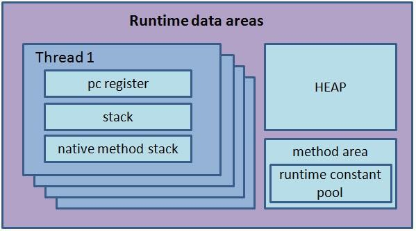

# Java Virtual Machine (JVM)

Java Virtual Machine (JVM)은 직역하면 자바 가상 머신이다. 자바로 작성된 모든 프로그램은 자바 가상 머신에서만 실행될 수 있으므로, 자바 프로그램을 실행하기 위해서는 반드시 자바 가상 머신이 설치되어 있어야 한다.

JVM 안에는 자바 실행 환경(Java Runtime Environment, JRE)이 포함되어 있다. JRE은 자바 프로그램을 실행하기 위해 필요한 라이브러리들과 기타 파일들을 가지고 있다.

# JVM이 왜 필요한가?

**자바는 OS(운영체제)에 독립적이다.**

JVM을 사용함으로써 얻는 가장 큰 이점은 JVM을 사용하면 자바 프로그램을 모든 플랫폼에서 실행할 수 있다는 것이다. 즉, 자바 프로그램은 OS에 상관없이 실행될 수 있다. 이는 자바 프로그램이 JVM에서 실행되기 때문이다. JVM은 자바 프로그램이 실행되는 환경을 제공해주기 때문에, 자바 프로그램은 OS에 상관없이 실행될 수 있다.

## WOCA(Write Once, Compile Anywhere)

개발자가 작성한 C언어 코드는 기계가 이해할 수 없으며, 0과 1로 구성된 기계어만을 이해할 수 있다. 따라서, 개발자가 작성한 코드를 실행하기 위해서는 해당 코드를 기계어로 변환해주어야 한다. 이 변환 작업을 `컴파일(Compile)`이라고 한다. 이렇게 컴파일된 코드를 `Binary code(기계가 읽을 수 있는 이진 코드, 기계어)`라고 부른다.

- 출처: [Java-as-platform-independence-WORA](http://java.meritcampus.com/core-java-topics/creation-of-java-as-platform-independence-wora)

이를 `WOCA`의 특성이라 부르며, **"Write Once, Compile Anywhere, 한번의 작성으로 어디서든 컴파일이 가능하다"** 라는 의미이다. 그러나 기계어는 특정 OS나 CPU 구조에 맞춰진 `컴파일러(Compiler)`를 통해 생성되기 때문에, 특정 OS나 CPU에서만 실행될 수 있다.

정리하면, 컴파일러는 항상 같은 형식의 기계어를 만들어내지만 각 OS 환경에 맞춰진 독자적인 컴파일러이기 때문에 다른 환경에서는 이해할 수 없다는 것이다. 즉, OS 종속성이 존재하고, 이식성이 낮다고 표현한다.

## WORA(Write Once, Run Anywhere)

OS 종속성을 해결하기 위해 자바가 등장했다. JAVA 언어로 작성한 코드는 직접 OS에 의해 실행되는 것이 아니라, JVM을 거쳐서 실행된다. 따라서, JVM만 설치되어 있다면 어떤 OS에서든 자바 프로그램을 실행할 수 있다.

- 출처: [Java-as-platform-independence-WORA](http://java.meritcampus.com/core-java-topics/creation-of-java-as-platform-independence-wora)

이를 `WORA`의 특성이라 부르며, **"Write Once, Run Anywhere, 한번의 작성으로 어디서든 실행이 가능하다(다시 컴파일할 필요가 없다)"** 라는 의미이다.

위에서 C언어에서의 컴파일은 코드를 바로 기계어로 변환하여 하드웨어에 의해 읽어지고, 그렇기 때문에 OS 환경에 따라 코드가 달라져야했던 것과 달리, 자바는 JVM을 통해 실행되기 때문에 코드의 수정 없이 어디서든 실행이 가능한 것이다.

간단하게 과정을 정리하면 아래와 같다.

1. 자바 컴파일러가 자바로 작성된 코드(.java)를 바이트 코드(.class)로 컴파일한다.  
   (바이트 코드는 JVM이 이해할 수 있는 코드이지 CPU가 이해할 수 있는 코드는 아니다)
2. 바이트 코드를 기계어로 변환한다. (이때 필요한 것이 JVM이다)
3. 이렇게 JVM에 의해 컴파일된 기계어는 바로 CPU에서 실행된다.

정리하면, 자바는 OS에 독립적이며, 이식성이 높다는 장점을 가지고 있다. 하지만 JVM은 OS에 종속적이기 때문에 자신의 환경에 맞는 JVM을 설치해야 한다. 또한 다른 언어와는 다르게 두 번의 컴파일 과정이 필요하기 때문에 비교적 느리다는 단점이 있다.

추가로 자바가 아닌 코틀린과 같은 다른 언어도 클래스 파일만 있다면 JVM을 사용할 수 있게 개발되고 있다고 한다.

# JVM 동작 흐름

지금까지 알아본 자바 애플리케이션의 실행 과정을 간단하게 표현한 그림이다. 이제 바이트 코드(.class)가 어떻게 처리되어 실행되는지 JVM의 동작 흐름을 알아보자.

JVM의 역할은 자바 애플리케이션을 클래스 로더를 통해 읽어 자바 API와 함께 실행하는 것이다.  
아래는 자바 파일을 어떻게 읽어 실행하는지를 간단하게 표현한 그림이다.

- 자바 프로그램을 실행하면 `JVM`은 OS로부터 메모리를 할당받는다.
- `자바 컴파일러(javac)`가 자바 소스코드(.java)를 자바 `바이트 코드(.class)`로 컴파일 한다.
- `Class Loader`는 동적 로딩을 통해 필요한 클래스들을 로딩 및 링크하여 `Runtime Data Area(실질적인 메모리를 할당 받아 관리하는 영역)`에 올린다.
- `Runtime Data Area`에 로딩된 바이트 코드는 `Execution Engine`을 통해 해석된다.
- 이 과정에서 `Execution Engine`에 의해 `Garbage Collector의 작동`과 `Thread 동기화`가 이루어진다.

## 컴파일 실습

실제로 `IntelliJ`와 같은 IDE에서 자바 코드를 컴파일하면, `.class` 파일이 생성되는 것을 확인할 수 있다. 이 `.class` 파일은 JVM이 이해할 수 있는 바이트 코드이며, JVM은 이 바이트 코드를 해석하여 실행한다.

- 만약 class 파일을 실행시키다가(`java {class명}`) `ClassNotFoundException`이 발생하면, `Class Loader`가 해당 클래스를 찾지 못했다는 의미이다. (클래스 파일이 존재하지 않는다는 의미) [StackOverFlow](https://stackoverflow.com/questions/7509295/noclassdeffounderror-wrong-name)를 참고하면 문제를 해결할 수 있을 것이다.

# JVM 구조

JVM은 크게 3가지 영역으로 나눌 수 있다. 각 영역에 대해 알아보자.

- `Class Loader`
- `Execution Engine`
- `Runtime Data Area`

## Class Loader

클래스 로더는 JVM 내로 클래스 파일을 로드하고, 링크를 통해 배치하는 작업을 수행한다. 로드된 바이트 코드(.class)들을 엮어서 JVM의 메모리 영역인 Runtime Data Area에 배치한다. 이때, 한번에 메모리에 적재하는 것이 아니라, 필요할 때 클래스를 동적으로 로딩한다.

### 클래스 파일의 로딩 순서

- `Loading` : 클래스 파일을 가져와서 JVM의 메모리에 로드한다. (클래스의 종류에 따라 Class Loader가 다르다.)
- `Linking` : 클래스 파일을 사용하기 위해 검증, 준비, 해석하는 과정이다.
  - `Verifying` : 읽어들인 클래스가 JVM 명세에 명시된 대로 구성되어 있는지 검사한다. JVM 규격에 따라 검증된 컴파일러에서 .class 파일이 생성되는지 등을 확인한다. 이를 통해 .class 파일의 정확성을 보장한다. 클래스 로드의 전 과정 중에서 가장 까다로운 검사를 수행하는 과정이기 때문에 당연히 시간도 많이 걸리고 복잡한 프로세스를 거친다고 한다. (final 메서드와 클래스가 오버라이드 되지는 않았는지, 변수를 읽기 전에 초기화되었는지 등을 검사한다.)
  - `Preparing` : 클래스가 필요로 하는 메모리를 할당한다. 할당하려는 값은 초기화 단계에서 할당되며, 준비 단계에서는 각 데이터들의 기본값으로 초기화가 먼저 진행된다고 한다.
  - `Resolving` : 클래스의 상수 풀 내 모든 심볼릭 레퍼런스를 다이렉트 레퍼런스로 변경한다. (추상적인 기호를 구체적인 값으로 동적으로 결정하는 과정이다.)
- `Initializing` : 클래스 변수들을 적절한 값으로 초기화한다. static initializer들을 수행하고, static 필드들을 설정된 값으로 초기화한다.

> 클래스 파일을 로드한다는 것은 실제 데이터를 메모리에 저장하는 것과는 문맥이 약간 다르다. 먼저 클래스에 대한 정보를 저장하고, 이 정보를 토대로 이후 Stack나 Heap에서 여러가지 데이터가 필요할 때 로드된 클래스 정보들이 실제 데이터를 사용하는 것이다.

## Execution Engine

Execution Engine은 Class Loader가 Runtime Data Area에 배치한 바이트 코드를 기계어로 변환하고 실행하는 역할을 수행한다.

Execution Engine에는 바이트코드를 기계어로 변환하는 영역이 크게 `Interpreter`와 `JIT Compiler`로 나뉜다. 또한, Runtime Data Area의 Heap 메모리를 관리하기 위한 `Garbage Collector`도 Execution Engine 내부에 속해있다.

### Interpreter

- 바이트 코드를 한 줄씩 읽어서 실행한다.
- JVM안에서 바이트코드는 기본적으로 인터프리터 방식으로 동작한다.
- 다만, 같은 메서드 라도 매번 호출될 때마다 매번 해석하고 수행해야 되서 전체적인 속도는 느리다.

### JIT Compiler

- 인터프리터의 단점을 보완하기 위해 도입되었다.
- 인터프리터 방식으로 실행하다가 적절한 시점에 바이트 코드 전체를 컴파일하여 네이티브 코드로 변경하고, 이후에는 더 이상 인터프리팅 하지 않고 네이티브 코드로 직접 실행하는 방식이다.
- 이후에는 더 이상 인터프리팅 하지 않고 네이티브 코드로 직접 실행하기 때문에 전체적인 실행 속도가 빠르다.

\*Native Code는 자바에서 부모가 되는 C언어나 C++, 어셈블리어를 의미한다.

JIT 컴파일러가 컴파일하는 과정은 바이트코드를 하나씩 인터프리팅하는 것보다 훨씬 오래 걸린다.
한번만 실행되는 코드라면 JIT 컴파일러를 사용하는 것이 오히려 더 비효율적일 수 있다. 그래서 JIT 컴파일러는 코드를 인터프리팅하는 방식으로 동작하다가, JVM이 특정 메서드가 반복적으로 수행될 것으로 예측되면 JIT 컴파일러를 이용하여 네이티브 코드로 컴파일한다. (기준은 컴파일 임계치라고 한다.)

### Garbage Collector

- [`Garbage Collection`](GarbageCollection.md)에 대한 내용은 따로 정리하였다.

## Runtime Data Area

- 출처: [JVM 구조 블로그 포스팅](https://blog.naver.com/PostView.naver?blogId=gomets_journey&logNo=223305402218&categoryNo=28&parentCategoryNo=0&viewDate=&currentPage=2&postListTopCurrentPage=&from=postList&userTopListOpen=true&userTopListCount=5&userTopListManageOpen=false&userTopListCurrentPage=2&photoView=0)

Runtime Data Area는 JVM의 메모리 영역으로 자바 애플리케이션을 실행할 때 사용되는 데이터들을 적재하는 영역이다. 크게 5가지 영역으로 나눌 수 있다.

- `Method Area`
- `Heap Area`
- `Stack Area`
- `PC Register`
- `Native Method Stack`

또한 그림에서 볼 수 있듯이, `Method Area`와 `Heap Area`는 모든 스레드가 공유하는 영역이고, `Stack Area`, `PC Register`, `Native Method Stack`은 각 스레드마다 하나씩 존재하는 영역이다.

### PC Register (Program Counter Register)

> If that method is not native, the pc register contains the address of the Java Virtual Machine instruction currently being executed. If the method currently being executed by the thread is native, the value of the Java Virtual Machine's pc register is undefined. [Oracle Docs](https://docs.oracle.com/javase/specs/jvms/se8/html/jvms-2.html)

JVM은 동시에 여러 스레드를 실행할 수 있기 때문에, 각 스레드마다 현재 수행 중인 JVM 명령의 주소를 저장하는 공간이 필요하다. 이를 PC Register가 관리하여 추적할 수 있도록 한다.

각 스레드는 항상 하나의 메서드를 실행 중이다. 이 실행 중인 메서드를 `current method` 라고 부른다. PC Register는 현재 실행 중인 JVM 명령의 주소를 저장하고 있다. 만약 현재 메서드가 자바 메서드가 아닌 네이티브 메서드라면, pc 레지스터의 값은 정의되지 않는다.

또한, PC Register는 특정 플랫폼에서 returnAddress나 네이티브 포인터를 저장할 수 있을 정도로 넓다고 한다.

### Native Method Stack

JVM은 자바가 아닌 다른 언어(C, C++ 등)로 작성된 메서드(네이티브 메서드)를 실행할 수 있다.

앞서 PC Register에서는 네이티브 메서드인 경우 PC Register의 값이 정의되지 않는다고 했다. 즉 네이티브 메서드 실행을 위한 공간이 필요한데, Native Method Stack이 네이티브 메서드들을 실행하기 위한 스택 영역이다.

Native Method Stack은 스택 영역과 마찬가지로 각 스레드 마다 개별적으로 생성되며, 자바 외부의 네이티브 코드를 호출할 때마다 생성되었다가 호출이 완료되면 사라진다.

> 모든 JVM 구현체가 네이티브 메서드를 로드하는 것이 필수가 아니며, 네이티브 메서드를 로드하지 않거나, 기존의 스택을 사용하지 않는 JVM은 네이티브 메서드 스택을 구현하지 않을 수 있다고 한다.

### Stack Area

Stack 영역은 메서드 호출 시 지역 변수, 매개변수, 함수 호출내역 등이 저장되는 영역이다. 각 스레드마다 개별적으로 할당되며, 메서드가 호출될 때 생성되고 메서드가 종료되면 제거된다.

Stack 영역에 저장되는 데이터는 `Frame`이라고 부르는 블록 단위로 저장된다. 각 메서드 호출 시마다 각각의 Frame이 생성되어 스택에 쌓이게 된다.

- `Local Variables` : 매개변수, 메서드 내에서 선언된 변수 등이 저장된다.  
  (몇 개의 지역변수가 있을지는 컴파일 시점에 결정되며, 실행 시점에 메모리가 할당된다.)
- `Operand Stack` : 연산을 위한 스택이다. 연산 결과를 임시로 저장하는 공간이다.
- `Frame Data` : 메서드의 반환 타입, 메서드의 클래스 또는 인터페이스의 런타임 상수 풀 참조, 메서드의 코드, 메서드의 예외 처리 테이블 등이 저장된다.

더 자세한 내용은 [JVM-Stack 포스팅](https://johngrib.github.io/wiki/jvm-stack/)을 참고하여 학습했다.

### Method Area

> The Java Virtual Machine has a method area that is shared among all Java Virtual Machine threads. The method area is analogous to the storage area for compiled code of a conventional language or analogous to the "text" segment in an operating system process. It stores per-class structures such as the run-time constant pool, field and method data, and the code for methods and constructors, including the special methods used in class and instance initialization and interface initialization. [Oracle Docs](https://docs.oracle.com/javase/specs/jvms/se8/html/jvms-2.html)

Method 영역은 메서드 영역은 모든 스레드가 공유하는 영역으로 JVM이 시작될 때 생성되고, JVM이 시작될 때 생성되는 공간으로 Class Loader가 바이트 코드(.class)를 처음 메모리 공간에 올릴 때 초기화되는 대상을 저장하기 위한 메모리 공간이다. JVM이 동작하고 클래스가 로드될 때 적재되서 프로그램이 종료될 때까지 저장 된다.

클래스별 구조체를 저장하는데, 런타임 상수 풀, 필드 및 메서드 데이터, 메서드와 생성자의 코드 등이 저장되며, 클래스와 인스턴스 초기화 및 인터페이스 초기화를 위한 특별한 메서드들도 이곳에 저장된다.

> JVM이 시작할 때 Method 영역에 모든 클래스의 메타데이터 저장되는 것은 아니다. JVM은 동적으로 클래스를 로딩하고 링크하기 때문에, 컴파일 시점에 로딩되는 클래스도 있고, 런타임 시점에 로딩되는 클래스도 있다. (다만 JVM 벤더마다 다를 수 있다.)

### Runtime Constant Pool

- 각 런타임 상수 풀은 자바 가상 머신(JVM)의 메서드 영역에서 할당된다.
- 클래스나 인터페이스의 런타임 상수 풀은 JVM이 해당 클래스나 인터페이스를 생성할 때 구성된다.
- 각 클래스나 인터페이스에 대한 런타임 시의 상수 풀 테이블을 나타내요. 이는 클래스 파일의 `constant_pool` 테이블의 런타임 표현이다.
- JVM은 이 Constant Pool을 통해 해당 메소드나 필드의 실제 메모리 상 주소를 찾아 참조한다.
- 정리하면 상수 자료형을 저장하여 참조하고 중복을 막는 역할을 수행한다.
- [Oracle Docs-Constant Pool](https://docs.oracle.com/javase/specs/jvms/se8/html/jvms-5.html)을 참고하면 더 자세한 내용을 확인할 수 있다.

### Heap Area

> The Java Virtual Machine has a heap that is shared among all Java Virtual Machine threads. The heap is the run-time data area from which memory for all class instances and arrays is allocated. [Oracle Docs](https://docs.oracle.com/javase/specs/jvms/se8/html/jvms-2.html)

Heap 영역은 Method 영역과 함께 모든 스레드가 공유하는 영역이다. JVM이 관리하는 프로그램 상에서 데이터를 저장하기 위해 런타임 시 동적으로 할당하여 사용하는 영역이다.

즉, `new 키워드`로 생성되는 클래스와 인스턴스 변수, 배열 타입 등 `Reference Type`이 저장되는 곳이다. (모든 클래스 인스턴스와 배열의 메모리가 힙에서 할당된다.)

중요한 점은 `Reference Type`이 저장되는 곳이며, JVM 스택 영역의 변수나 다른 객체의 필드에서 참조된다는 점이다. 즉, Heap 영역에 생성된 객체를 참조하는 변수가 없다면, 이 객체는 GC의 대상이 된다.

효율적인 Garbage Collection을 위해 Heap 영역을 세분화하여 관리한다. 자세한 내용은 [Garbage Collection](GarbageCollection.md)에 정리해두었다.

## 마무리

JVM은 자바 프로그램을 실행하기 위한 가상 머신이다. JVM은 OS에 독립적이며, WORA(Write Once, Run Anywhere)의 특성을 가지고 있다. JVM은 크게 3가지 영역으로 나눌 수 있으며, 각 영역은 다음과 같은 역할을 수행한다.

- `Class Loader` : 클래스 파일을 로드하고 링크하여 Runtime Data Area에 배치하는 역할을 수행한다.
- `Execution Engine` : 바이트 코드를 기계어로 변환하고 실행하는 역할을 수행한다. Interpreter와 JIT Compiler로 나뉜다.
- `Runtime Data Area` : JVM의 메모리 영역으로 자바 애플리케이션을 실행할 때 사용되는 데이터들을 적재하는 영역이다. PC Register, Native Method Stack, Stack Area, Method Area, Heap Area로 나뉜다.

## 참고 자료

- [Oracle Docs-JVM](https://docs.oracle.com/javase/specs/jvms/se8/html/jvms-2.html)
- [Java-as-platform-independence-WORA](http://java.meritcampus.com/core-java-topics/creation-of-java-as-platform-independence-wora)
- [Java-Bytecode](http://java.meritcampus.com/core-java-topics/bytecode-in-java)
- [JVM 구조 블로그 포스팅](https://blog.naver.com/PostView.naver?blogId=gomets_journey&logNo=223305402218&categoryNo=28&parentCategoryNo=0&viewDate=&currentPage=2&postListTopCurrentPage=&from=postList&userTopListOpen=true&userTopListCount=5&userTopListManageOpen=false&userTopListCurrentPage=2&photoView=0)
- [JVM-Class Loader 포스팅](https://medium.com/@gsy4568/jvm%EC%9D%98-%EC%B2%AB%EA%B4%80%EB%AC%B8-classloader-ecdf93d53a7b)
- [JVM-내부 구조 메모리 영역 포스팅](https://inpa.tistory.com/entry/JAVA-%E2%98%95-JVM-%EB%82%B4%EB%B6%80-%EA%B5%AC%EC%A1%B0-%EB%A9%94%EB%AA%A8%EB%A6%AC-%EC%98%81%EC%97%AD-%EC%8B%AC%ED%99%94%ED%8E%B8)
- [JVM-Runtime Data Area 포스팅](https://velog.io/@ddangle/Java-%EB%9F%B0%ED%83%80%EC%9E%84-%EB%8D%B0%EC%9D%B4%ED%84%B0-%EC%98%81%EC%97%ADRuntime-Data-Area%EC%97%90-%EB%8C%80%ED%95%B4)
- [JVM-Stack 포스팅](https://johngrib.github.io/wiki/jvm-stack/)
