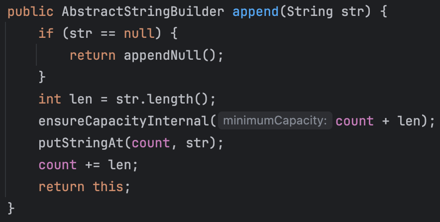

# StringBuilder & StringBuffer

Java에서 문자열을 다루는 클래스로 `String`, `StringBuilder`, `StringBuffer`가 있다. 각 클래스의 특징과 차이점을 알아보자.

## 할당된 메모리 공간

- `String` 객체는 한 번 생성되면 할당된 공간을 변경할 수 없는 `불변(immutable)` 객체이다.
- `StringBuilder`와 `StringBuffer`는 `가변(mutable)` 객체로 생성된 후에도 메모리 공간을 변경할 수 있다.

### String


`String` 클래스의 value 필드는 문자열의 실제 데이터를 저장하는 데 사용되는 내부 배열이다. 이 필드는 byte[] 타입이며, 문자열 데이터를 바이트 배열로 저장한다. value 필드는 final로 선언되어 있어, 한 번 초기화된 후에는 더 이상 변경할 수 없다.

즉, `String` 객체는 불변성을 가지며, 이 불변성은 value 필드가 변경되지 않도록 보장한다.

### StringBuilder & StringBuffer

```java
public final class StringBuilder
    extends AbstractStringBuilder
    implements java.io.Serializable, Comparable<StringBuilder>, CharSequence
{
    ...
}

public final class StringBuffer
    extends AbstractStringBuilder
    implements Serializable, Comparable<StringBuffer>, CharSequence
{
    ...
}
```

`StringBuilder`와 `StringBuffer`는 추상 클래스인 `AbstractStringBuilder`를 상속받는다.


`AbstractStringBuilder` 클래스는 `String` 클래스와 다르게 value 필드를 final로 선언하지 않았다. 따라서 `StringBuilder`와 `StringBuffer`는 가변성을 가지며, value 필드를 변경할 수 있다.

### AbstractStringBuilder

`AbstractStringBuilder` 추상 클래스는 value 필드와 count 필드를 가지고 있다.



`StringBuilder`와 `StringBuffer`는 문자열을 추가할 때 `append()` 메서드를 사용한다. 이 메서드는 주어진 문자열(str)을 현재의 문자 시퀀스 끝에 추가하며, 내부적으로는 문자열의 길이를 조정한다. (필요한 경우 내부 버퍼의 크기를 확장한다.)

즉, `StringBuilder`와 `StringBuffer`는 문자열을 수정할 때 새로운 객체를 생성하는 것이 아니라 기존 객체의 value 필드를 변경(사이즈 조정, 문자열 추가)한다. 덕분에 값이 변경되더라도 같은 주소를 참조하게 된다.

### 불변 객체와 가변 객체의 차이

```java
public static void main(String[] args) {
    // String, StringBuilder, StringBuffer 준비
    String string = "String";
    StringBuilder stringBuilder = new StringBuilder("StringBuilder");
    StringBuffer stringBuffer = new StringBuffer("StringBuffer");

    // 각 객체의 해시코드 값을 확인
    System.out.println("string.hashCode() = " + string.hashCode());
    System.out.println("stringBuilder.hashCode() = " + stringBuilder.hashCode());
    System.out.println("stringBuffer.hashCode() = " + stringBuffer.hashCode());

    // 값 수정
    System.out.println("=============== 값 변경 ===============");
    string += "Hello";
    stringBuilder.append("Hello");
    stringBuffer.append("Hello");

    // 각 객체의 해시코드 값을 재확인
    System.out.println("string.hashCode() = " + string.hashCode());
    System.out.println("stringBuilder.hashCode() = " + stringBuilder.hashCode());
    System.out.println("stringBuffer.hashCode() = " + stringBuffer.hashCode());
}
```

`String`, `StringBuilder`, `StringBuffer` 타입의 변수를 선언하고 문자열을 수정하기 전에 객체의 주소를 해싱하여 값을 반환해주는 hashCode()의 반환 값을 출력하고, 문자열을 수정한 뒤 hashCode()의 반환 값을 출력하는 코드이다.


결과를 확인해보면, `String` 객체의 주소만 바뀐 것을 볼 수 있다. `String` 객체는 불변 객체이기 때문에 값을 변경하면 새로운 객체를 생성하고, 이 객체의 주소를 참조하게 된다.

> String 객체에 + 연산을 하면 새로운 String 객체가 생성된다. [String Constant Pool](https://deveric.tistory.com/123)에 대해 학습하면 더 이해하기 쉽다.


`String` 객체일 경우 매번 문자열이 업데이트 될때마다 계속해서 메모리 블럭이 추가되게 되고, 이는 GC의 대상이 된다. 즉, 빈번하게 문자열을 수정해야 하는 경우 `String` 객체를 사용하는 것은 비효율적이다.

## StringBuilder vs StringBuffer

그러면 `StringBuilder`와 `StringBuffer`는 무엇이 다른 것일까?

바로 `동기화(synchronization)` 여부이다.

- `StringBuilder`는 `동기화`를 보장하지 않는다. (Non-Thread-Safe)
- `StringBuffer`는 `동기화`를 보장한다. (Thread-Safe)

`동기화`란 멀티 쓰레드 환경에서 여러 쓰레드가 동시에 접근할 때, 데이터의 일관성을 유지하기 위해 사용하는 기술이다. `StringBuffer`는 멀티 쓰레드 환경에서 안전하게 사용할 수 있도록 동기화를 보장한다. 반면, `StringBuilder`는 동기화를 보장하지 않기 때문에 멀티 쓰레드 환경에서 사용할 때 주의해야 한다.


실제로 `StringBuilder` 클래스의 주석을 보면 `StringBuilder`는 쓰레드에 안전하지 않다고 명시되어 있으며, 동기화가 필요한 경우 `StringBuffer`를 사용하라고 권장한다.

`StringBuffer`는 어떻게 동기화를 보장하는가?

- `StringBuffer`의 메서드는 `synchronized` 키워드를 사용하여 동기화를 보장한다.


실제로 `StringBuffer` 클래스의 메서드를 확인해보면, `synchronized` 키워드가 사용되어 있음을 확인할 수 있다.

### synchronized 키워드

[`synchronized`](https://docs.oracle.com/javase/tutorial/essential/concurrency/syncmeth.html) 키워드는 멀티 쓰레드 환경에서 동기화를 보장하는 키워드이다. `synchronized` 키워드가 사용된 메서드나 블록은 한 번에 하나의 쓰레드만 실행할 수 있도록 보장한다.

즉, 한 쓰레드가 메서드를 실행하는 동안 다른 쓰레드들은 기다려야 하며, 실행 중인 쓰레드가 메서드를 종료하면 그때서야 다른 쓰레드가 메서드에 접근할 수 있다. (데이터 일관성 유지)

너무 많은 `synchronized` 키워드 사용은 성능 저하를 가져올 수 있으며, 데드락이 발생할 수 있기 때문에 주의해야 한다.

### 동기화 보장 확인

```java
public static void main(String[] args) {
    StringBuilder stringBuilder = new StringBuilder();
    StringBuffer stringBuffer = new StringBuffer();

    // 여러 쓰레드가 동시에 접근하여 * 추가
    new Thread(() -> {
        for(int i = 0; i < 100000; i++) {
            stringBuilder.append("*");
            stringBuffer.append("*");
        }
    }).start();
    new Thread(() -> {
        for(int i = 0; i < 100000; i++) {
            stringBuilder.append("*");
            stringBuffer.append("*");
        }
    }).start();

    // 잠시 기다린 후 결과 출력
    Thread.sleep(2000);
    System.out.println("stringBuilder.length() = " + stringBuilder.length());
    System.out.println("stringBuffer.length() = " + stringBuffer.length());
}
```

여러 쓰레드가 동시에 `StringBuilder`와 `StringBuffer`에 `*` 문자를 추가하는 코드이다.

동기화를 고려하지 않고 코드를 살펴보면, 각각 200,000개의 `*` 문자를 추가하는 것으로 예상된다.


결과를 보면 `StringBuilder`는 200,000보다 작은 값의 길이를 가진 것을 볼 수 있다. 즉, 여러 쓰레드가 동시에 접근하여 `*` 문자를 추가하다가 데이터 일관성이 깨진 것이다.

반면, `StringBuffer`는 200,000의 길이를 가진 것을 볼 수 있다. `StringBuffer`는 동기화를 보장하기 때문에 여러 쓰레드가 동시에 접근하여 `*` 문자를 추가해도 데이터 일관성이 유지된다.

> `StringBuilder`는 `Thread-safe` 하지 않아서 각 쓰레드가 해당 객체에 접근하여 `*` 문자를 추가할 때, 기다려주지 않기 때문에 이러한 현상(씹힘)이 발생한 것이다.

### 성능은?

당연히 `StringBuffer`가 느리다. 동기화를 보장하기 위해 동시에 접근하는 쓰레드를 기다려야 하기 때문이다.

`synchronized` 키워드가 달린 메서드나 블록을 호출할 때, Java는 해당 객체의 **모니터 락(monitor lock)** 을 얻기 위해 작업을 수행한다. 이 락은 **상호 배제(mutual exclusion)** 를 보장하여, 하나의 쓰레드만이 락을 소유한 상태에서 동기화된 코드에 접근할 수 있도록 한다.

즉, 각 쓰레드는 모니터 락을 얻어야만 동기화된 메서드나 블록에 접근할 수 있고, 누군가 이미 락을 가지고 있다면 대기해야 하기 때문에 성능이 저하된다.

```java
public static void main(String[] args) {
    final int lengths = 1_000_000;

//  String ----------------------------------------------
    long startTime1 = System.currentTimeMillis();
    String string = "";
    for (int i = 0; i < lengths; i++){
        string += "*";
    }
    long endTime1 = System.currentTimeMillis();
// StringBuffer -----------------------------------------
    long startTime2 = System.currentTimeMillis();
    StringBuffer stringBuffer = new StringBuffer();
    for (int i = 0; i < lengths; i++){
        stringBuffer.append("*");
    }
    long endTime2 = System.currentTimeMillis();
// StringBuilder ----------------------------------------
    long startTime3 = System.currentTimeMillis();
    StringBuilder stringBuilder = new StringBuilder();
    for (int i = 0; i < lengths; i++){
        stringBuilder.append("*");
    }
    long endTime3 = System.currentTimeMillis();
// 출력 --------------------------------------------------
    System.out.println("String + 연산 : " + (endTime1 - startTime1));
    System.out.println("StringBuffer append() : " + (endTime2 - startTime2));
    System.out.println("StringBuilder append() : " + (endTime3 - startTime3));
}
```

`String`, `StringBuffer`, `StringBuilder`를 사용하여 1,000,000개의 `*` 문자를 추가하는 코드이다.


결과를 확인해보면, `StringBuffer`가 `StringBuilder`보다 느리다는 것을 알 수 있다.

추가적으로 Java의 main 메서드는 싱글 쓰레드로 동작한다. 따라서 `StringBuffer`가 `StringBuilder`보다 느린 것은 `StringBuffer`가 `synchronized` 키워드를 사용하여 동기화를 위한 오버헤드(모니터 락을 획득하기, 반납하기)가 발생하기 때문이다.

즉, 싱글 쓰레드 환경에서는 `StringBuilder`를 사용하는 것이 더 효율적이다.

## 비교 정리

|                       | String | StringBuffer | StringBuilder |
| --------------------- | ------ | ------------ | ------------- |
| **가변 여부**         | 불변   | 가변         | 가변          |
| **쓰레드 세이프**     | O      | O            | X             |
| **연산 속도(비교적)** | 느림   | 빠름         | 아주 빠름     |

따라서, 단일 쓰레드 환경에서 문자열을 수정할 때는 `StringBuilder`를 사용하고, 멀티 쓰레드 환경에서 문자열을 수정할 때는 `StringBuffer`를 사용하는 것이 좋다. 또한, 테스트 결과에서 보이는 것처럼 문자열을 수정할 때 `String` 객체를 사용하는 것은 비효율적이다.

## 마무리

Java 기술을 알아보는 과정에서 쓰레드, 동기화, 경쟁 상태 등의 개념까지 학습할 수 있었다. 모든 기술들은 아래에 숨겨진 CS 지식을 바탕으로 만들어진 것이며, 이를 이해하고 활용할 수 있어야 더 나은 코드를 작성할 수 있다고 느꼈다.

항상 고민하고 이유를 찾아서 적용하는 습관을 들이는 것이 중요하다고 생각했다.

## 참고

- [Oracle Docs - Synchronized Methods](https://docs.oracle.com/javase/tutorial/essential/concurrency/syncmeth.html)
- [JAVA-☕-String-StringBuffer-StringBuilder-차이점-성능-비교 [Inpa Dev 👨‍💻:티스토리]](https://inpa.tistory.com/entry/JAVA-%E2%98%95-String-StringBuffer-StringBuilder-%EC%B0%A8%EC%9D%B4%EC%A0%90-%EC%84%B1%EB%8A%A5-%EB%B9%84%EA%B5%90)
- [StringBuilder와 StringBuffer는 무슨 차이가 있는가? [HeoSeungYeon :Velog]](https://velog.io/@heoseungyeon/StringBuilder%EC%99%80-StringBuffer%EB%8A%94-%EB%AC%B4%EC%8A%A8-%EC%B0%A8%EC%9D%B4%EA%B0%80-%EC%9E%88%EB%8A%94%EA%B0%80#2-stringbuilder-vs-stringbuffer)
- [String Constant Pool과 Constant Pool - EricJeong :티스토리](https://deveric.tistory.com/123)
- [StackOverFlow - Difference between StringBuilder and StringBuffer](https://stackoverflow.com/questions/355089/difference-between-stringbuilder-and-stringbuffer?page=1&tab=scoredesc#tab-top)
