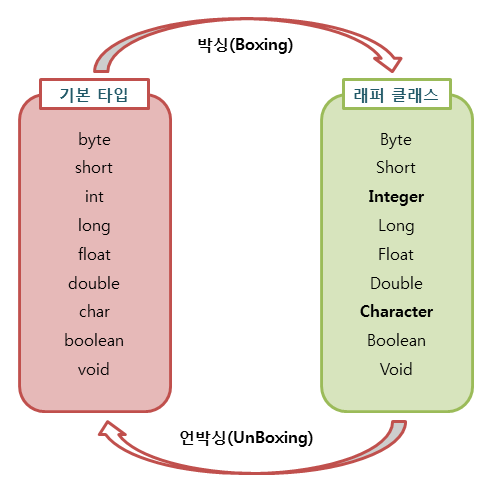
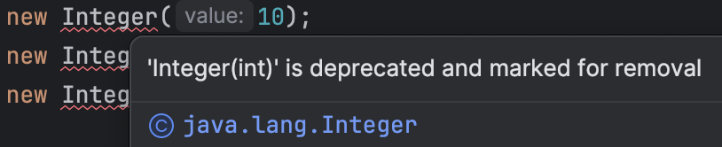

# Wrapper Class

Java의 자료형은 8종류의 `기본형(primitive type)`과 `참조형(reference type)`으로 나누어진다. 대표적으로 기본 자료형은 int, char, boolean 등이 있고 참조 자료형은 class, interface 등이 있다.

`래퍼 클래스(wrapper class)`는 기본 자료형을 객체로 다루기 위해서 사용하는 클래스이다.
자바는 모든 기본 자료형은 값을 갖는 객체를 생성할 수 있다. 이를 포장 객체라고도 부르는데, 기본 자료형의 값을 내부에 두고 포장하기 때문이다.

래퍼 클래스는 산술 연산을 위해 정의된 클래스가 아니므로, 인스턴스에 저장된 값(래퍼 클래스가 감싸고 있는 기본 자료형의 값)은 외부에서 변경할 수 없다. 단순히 값을 참조하기 위해 새로운 인스턴스를 생성하고, 생성된 인스턴스의 값만을 참조할 수 있다.

| 기본 타입 (primitive type) | 래퍼 클래스 (wrapper class) |
| -------------------------- | --------------------------- |
| byte                       | Byte                        |
| char                       | Character                   |
| int                        | Integer                     |
| float                      | Float                       |
| double                     | Double                      |
| boolean                    | Boolean                     |
| long                       | Long                        |
| short                      | Short                       |

래퍼 클래스는 `java.lang` 패키지에 있다.

## Boxing & Unboxing



위 그림과 같이 기본 자료형의 값을 포장 객체로 만드는 과정을 `박싱(boxing)`이라고 하고 반대로 포장객체에서 기본 자료형의 값을 얻어내는 과정을 `언박싱(unboxing)`이라고 한다.

## AutoBoxing & AutoUnboxing

기본 자료형의 값을 직접 박싱, 언박싱하지 않아도 자동적으로 박싱과 언박싱이 일어나는 경우가 있다. 래퍼 클래스 타입에 기본 자료형 값이 대입될 경우에 발생한다. 예를 들어 int타입의 값을 Integer클래스 변수에 대입하면 오토박싱이 일어나 힙 영역에 Integer객체가 생성된다.

```java
public static void main(String[] args) {
    Integer wrapper = 20; // 오토박싱
    int primitive = wrapper; // 오토언박싱

    System.out.println(wrapper); // 20
    System.out.println(primitive); // 20
}
```

## 값 비교

```java
public static void main(String[] args) {
    Integer num1 = new Integer(10);
    Integer num2 = new Integer(10);
    Integer num3 = new Integer(20);

    System.out.println(num1 < num3); // true
    System.out.println(num1 == num2); // false
    System.out.println(num1.equals(num2)); // true
}
```

- 첫 번째 출력문은 num1과 num3이 참조하는 객체의 값이 같은지 비교한다. num1과 num3은 각각 10과 20을 가리키고 있으므로 num1이 더 작은 값이므로 true가 출력된다.
- 두 번째 출력문은 num1과 num2가 같은 객체를 참조하는지 비교한다. 즉 주솟값을 비교하는 것이다. num1과 num2는 각각 다른 객체를 참조하고 있으므로 false가 출력된다.
- 세 번째 출력문은 num1과 num2가 가리키는 객체의 값이 같은지 비교한다. num1과 num2는 둘 다 10을 가리키고 있으므로 true가 출력된다.

### 주의사항



위 예시에서 사용한 Integer(int) 생성자는 JDK 9부터 ~~deprecated~~ 되었다. 대신 valueOf(int) 메소드를 사용하도록 권장된다. 추가로 valueOf() 메소드는 캐시를 사용하기 때문에 `-128 ~ 127` 사이의 값은 캐시된 객체를 반환한다. 따라서 아래처럼 == 연산자로 비교해도 true가 반환된다. 하지만 이 범위를 벗어나면 새로운 객체를 생성하므로 == 연산자로 비교하면 false가 반환된다.

```java
public static void main(String[] args) {
    Integer num1 = Integer.valueOf(10);
    Integer num2 = Integer.valueOf(10);

    System.out.println(num1 == num2); // true

    Integer num3 = Integer.valueOf(128);
    Integer num4 = Integer.valueOf(128);

    System.out.println(num3 == num4); // false
}
```

## 언제 사용하는가?

1. 제네릭 타입, 컬렉션 프레임워크 등 기본 자료형을 사용할 수 없는 경우 사용한다.

   ```java
   ArrayList<int> list = new ArrayList<int>(); // 에러 발생
   ArrayList<Integer> list = new ArrayList<Integer>(); // 올바른 사용
   ```

   기본 자료형을 사용할 수 없는 이유는 제네릭 타입은 참조 자료형만을 사용할 수 있기 때문이다. 따라서 기본 자료형을 사용하려면 래퍼 클래스를 사용해야 한다.

2. 기본 자료형을 객체로 다루기 위해 사용한다.

   기본 자료형은 객체가 아니기 때문에 객체로 다루어야 할 경우가 있다. 이런 경우 래퍼 클래스를 사용하여 기본 자료형을 객체로 변환할 수 있다. 예를 들어, 메소드의 매개변수로 객체만을 요구하는 경우나 위 코드처럼 컬렉션에 저장하기 위해서는 기본 자료형을 래퍼 클래스로 변환해야 한다.

3. 포장 객체는 `null` 값을 가질 수 있다.

   기본 자료형은 `null` 값을 가질 수 없다. 하지만 래퍼 클래스는 `null` 값을 가질 수 있다.

4. 래퍼 클래스는 상수와 메소드를 제공한다.

   래퍼 클래스는 상수와 메소드를 제공하여 기본 자료형을 다루는 데 유용하다. 예를 들어, `Integer.MAX_VALUE`, `Integer.MIN_VALUE` 등의 상수를 사용하여 최댓값, 최솟값을 알 수 있다.

5. 래퍼 클래스는 문자열을 기본 자료형으로 변환할 때 사용한다.

   래퍼 클래스는 문자열을 기본 자료형으로 변환할 때 사용한다. `Integer.parseInt()`, `Double.parseDouble()` 등의 정적 메소드를 사용하여 문자열을 기본 자료형으로 변환할 수 있다.

   ```java
   public static void main(String[] args) {
       String s = "10";
       int num = Integer.parseInt(s);

       System.out.println(num); // 10
   }
   ```

## 참고

- [공식문서](https://docs.oracle.com/javase/10/docs/api/index.html?overview-summary.html)
- [참고 블로그](https://www.tcpschool.com/java/java_api_wrapper)
