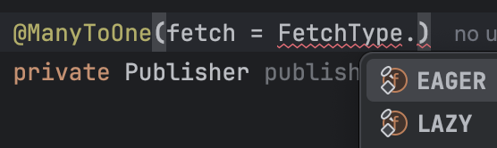

# 연관관계 매핑

JPA는 객체와 관계형 데이터베이스의 테이블 간의 연관관계를 매핑하기 위한 기능을 제공한다.
간단히 연관관계에 대해 알아보고, 궁금했던 부분을 정리해보려고 한다.

Spring Data JPA보단 JPA에 관한 내용이다.

## 궁금했던 부분

- [지연 로딩으로 생성된 프록시(Proxy)는 필요할 때 실제 객체로 대체되나?](#지연-로딩으로-생성된-프록시proxy는-필요할-때-실제-객체로-대체되나)
  - [왜 이렇게 설계되어 있을까? (추측)](#왜-이렇게-설계되어있을까-추측)
- [양방향 연관관계 매핑 시 mappedBy를 꼭 사용해야 하나?](#mappedby를-꼭-사용해야하나)
- [매핑된 컬렉션 필드는 왜 미리 초기화해야 할까?](#매핑된-컬렉션-필드는-왜-미리-초기화해야-할까)

## 연관관계(Associations)란?

JPA에서 연관관계는 단순히 자바 객체 간의 참조를 넘어서, 데이터베이스 테이블 간의 외래 키 관계를 어떻게 매핑할 것인지에 대한 개념이다.

연관관계는 엔티티들 간의 관계를 말한다.
보통 `관계의 개수(다중성)`에 따라 분류한다.
예를 들어, E와 F가 엔티티 클래스라고 할 때, 아래와 같은 관계가 있을 수 있다.

### 다중성(Multiplicity)

- `일대일(One-to-One)`: E의 인스턴스 하나가 F의 인스턴스 하나와만 연결된다. (예: 주민등록증 ↔ 주민)
- `다대일(Many-to-One)`: 여러 E 인스턴스가 하나의 F 인스턴스와 연결된다. (예: 주문들 → 고객)
- `다대다(Many-to-Many)`: 여러 E 인스턴스가 여러 F 인스턴스와 연결될 수 있다. (예: 학생 ↔ 강의)

### 방향성(Directionality)

추가로 연관관계는 방향성으로도 나눌 수 있다.

- `단방향(Unidirectional)`: E → F 방향으로만 참조할 수 있다. (F는 E를 모른다.)
- `양방향(Bidirectional)`: E ↔ F 서로 참조할 수 있다.

## 연관관계 매핑

JPA는 객체와 관계형 데이터베이스의 테이블 간의 연관관계를 매핑하기 위해 애너테이션을 제공한다.
`@OneToOne`, `@OneToMany`, `@ManyToOne`, `@ManyToMany` 애너테이션을 사용하여 연관관계를 매핑할 수 있다.

사용법은 [Hibernate Docs](https://docs.jboss.org/hibernate/orm/6.4/introduction/html_single/Hibernate_Introduction.html#associations)를 참고하자.

## FetchType, 즉시 로딩과 지연 로딩

연관관계 설정할 때 자주 마주치는 속성이 `FetchType`이다.
언제 연관된 엔티티를 로딩할지 결정하는 설정이다.



- `EAGER`: 연관된 엔티티를 즉시 로딩한다.
- `LAZY`: 연관된 엔티티를 필요할 때 로딩한다.

두 방식 모두 장단점이 있다.

### 즉시 로딩(Eager Loading)

즉시 로딩은 바로 가져오는 방식이다.
엔티티를 조회할 때 연관된 엔티티도 함께 쿼리로 가져온다.

`@ManyToOne`, `@OneToOne`은 기본적으로 `FetchType.EAGER`로 설정되어 있다.

```java
@Entity
public class Book {
    @Id @GeneratedValue
    private Long id;

    @ManyToOne // 기본값은 EAGER
    private Publisher publisher;
}
```

```java
@Test
void eagerLoading() {
    // Book과 Publisher 엔티티를 저장한다.
    Publisher publisher = new Publisher("A 출판사");
    entityManager.persist(publisher);
    entityManager.persist(new Book("JPA 입문", publisher));
    entityManager.flush();
    entityManager.clear();

    // Book 조회 시 Publisher도 함께 가져온다.
    Book book = entityManager.find(Book.class, 1L);
}
```

**실제로 실행되는 쿼리**

```sql
select
    b1_0.id,
    p1_0.id,
    p1_0.name,
    b1_0.title
from
    book b1_0
left join
    publisher p1_0
    on p1_0.id = b1_0.publisher_id
where
    b1_0.id = ?
```

`Eager Loading`은 연관된 엔티티를 JOIN으로 함께 가져온다.

**주의사항**

- 실제 사용하지 않더라도 연관된 엔티티를 항상 가져온다.
- 연관된 엔티티가 많을 경우, JOIN 쿼리가 복잡해진다.

### 지연 로딩(Lazy Loading)

지연 로딩은 연관된 엔티티를 필요할 때 가져오는 방식이다.
엔티티를 조회할 때 연관된 엔티티는 가져오지 않고, 실제로 필요할 때 쿼리를 날려서 가져온다.
이때, `Proxy` 객체를 사용한다.

```java
@Entity
public class Book {
    @Id @GeneratedValue
    private Long id;

    @ManyToOne(fetch = FetchType.LAZY)
    private Publisher publisher;
}
```

```java
@Test
void lazyLoading() {
    Publisher publisher = new Publisher("느긋한 출판사");
    entityManager.persist(publisher);
    entityManager.persist(new Book("지연의 미학", publisher));
    entityManager.flush();
    entityManager.clear();

    Book book = entityManager.find(Book.class, 1L);
    System.out.println("아직 Publisher를 로딩하지 않음");

    System.out.println(book.getPublisher().getName()); // 여기서 SELECT 발생!
}
```

**실제로 실행되는 쿼리**


로그를 확인하면, Book을 조회할 때는 Publisher를 가져오지 않고, `book.getPublisher().getName()`을 호출할 때 Publisher를 가져오는 것을 확인할 수 있다.

**주의사항**

- 연관된 엔티티가 필요한 경우에 매번 쿼리를 날려야 하므로, 다른 방향으로 성능 저하가 발생할 수 있다.
- `Proxy` 객체를 사용하므로, 실제 객체가 아닌 `Proxy` 객체를 참조한다.

# 지연 로딩으로 생성된 프록시(Proxy)는 필요할 때 실제 객체로 대체되나?

아니다. 프록시 객체는 처음부터 끝까지 그대로이다.
다만, 내부에서 실제 객체를 참조하고 있을 뿐이다.

```java
System.out.println(book.getPublisher().getClass()); // 프록시 인스턴스
book.getPublisher().getName(); // 여기서 SELECT
System.out.println(book.getPublisher().getClass()); // 여전히 프록시 인스턴스
```

`getName()` 호출 이후에도 `publisher`는 여전히 프록시 인스턴스이다.
인스턴스는 바뀌지 않으며, 내부에서 실제 데이터를 가져오는 것이다.


## 왜 이렇게 설계되어 있을까? (추측)

JPA는 지연 로딩을 통해 불필요한 쿼리 실행을 최소화하려고 한다.
이를 위해 엔티티 대신 프록시 객체를 주입하고, 실제 데이터가 필요해지는 시점에만 쿼리를 수행한다.

이때, 프록시 객체를 실제 엔티티로 교체하는 방식이 아니라, 프록시 객체를 유지한 채 내부에 실제 데이터를 채워넣는 방식으로 동작한다.

애플리케이션 코드에서 이미 참조하고 있는 프록시 객체를 중간에 실제 객체로 바꿔버리면, 객체 정체성이 바뀌는 것과 같기 때문에 가져온 데이터를 주입하는 방향으로 설계된 것 같다. (객체 비교에 문제가 생길 수 있지 않을까.. 라는 추측이다.)

추가로 프록시 객체도 책임지는 일이 꽤 있는 것 같다.
단순히 목업 객체가 아닌, 설계에서 중요한 역할을 수행하지 않을까 싶다.

# mappedBy를 꼭 사용해야하나?

결론부터 말하자면, 양방향 연관관계를 사용한다면 반드시 `mappedBy`를 명시해야 한다.

`mappedBy`를 생략해도 컴파일 오류는 나지 않지만, 원치 않는 테이블 구조가 생성되고, 불필요한 쿼리가 발생할 수 있다.
이는 예상치 못한 버그와 성능 저하로 이어질 수 있다.

```
양방향 연관관계에서 mappedBy를 생략하면,
JPA는 두 필드를 각각의 단방향 연관관계로 인식하게 된다.

반드시 mappedBy를 명시해서, JPA에게 연관관계의 구조를 정확히 알려주자.
그렇지 않으면, 예상치 못한 테이블 생성과 성능 문제를 피할 수 없다.
```

## 연관관계의 주인(owner)과 비주인(non-owner)

양방향 연관관계에서는 `누가 외래 키(FK)를 관리할지`, 즉 연관관계의 주인을 명확히 지정해야 한다.

이때 사용하는 것이 바로 `mappedBy`다.
`mappedBy`는 `나는 주인이 아니다`를 선언하는 역할을 한다.

```java
@Entity
public class Book {
    @Id @GeneratedValue
    private Long id;

    @ManyToOne
    private Publisher publisher; // 연관관계의 주인
}

@Entity
public class Publisher {
    @Id @GeneratedValue
    private Long id;

    @OneToMany(mappedBy = "publisher") // 연관관계의 비주인
    private List<Book> books;
}
```

## mappedBy 유무에 따른 테이블 생성 비교

```java
// mappedBy 사용
@ManyToOne(fetch = FetchType.LAZY)
private Publisher publisher;

@OneToMany(mappedBy = "publisher")
private Set<Book> books = new HashSet<>();
```

**테이블 구조**

```sql
Hibernate:
create table book (
    id bigint generated by default as identity,
    publisher_id bigint,
    title varchar(255),
    primary key (id)
);

Hibernate:
create table publisher (
    id bigint generated by default as identity,
    name varchar(255),
    primary key (id)
);

-- 외래 키 제약 조건..
```

book 테이블에만 외래 키 `publisher_id`가 존재하고, publisher 테이블에는 외래 키가 없다.

즉, 우리가 원하는 `Book이 Publisher를 참조하는 관계`가 정확히 구현되었다.

```java
// mappedBy 사용 안함
@ManyToOne(fetch = FetchType.LAZY)
private Publisher publisher;

@OneToMany // mappedBy 생략!
private Set<Book> books = new HashSet<>();
```

**테이블 구조**

```sql
Hibernate:
create table book (
    id bigint generated by default as identity,
    publisher_id bigint,
    title varchar(255),
    primary key (id)
);

Hibernate:
create table publisher (
    id bigint generated by default as identity,
    name varchar(255),
    primary key (id)
);

Hibernate:
create table publisher_books ( -- 의도하지 않은 중간 매핑 테이블 생성
    books_id bigint not null unique,
    publisher_id bigint not null,
    primary key (books_id, publisher_id)
);

-- 외래 키 제약 조건..
```

외래 키가 있는 `book.publisher_id`도 그대로 있고, `publisher_books`라는 조인 테이블이 불필요하게 하나 더 생겼다.

앞서 말한 것처럼 결국 JPA는 `Book → Publisher`, `Publisher → Book`을 서로 독립적인 단방향 관계 두 개로 판단한 것이다.

의도하지 않은 구조로 인해 중복된 연관관계와 불필요한 조인 및 insert 쿼리가 발생할 수 있다.

## 꼭 기억할 것

- 연관관계의 주인(소유자)는 외래 키를 가진 쪽이어야 한다.
- 주인이 아닌 쪽은 반드시 `mappedBy`를 통해 `나는 단순 조회용이다`라고 명시해야 한다.
- 연관관계를 수정하려면 반드시 주인 쪽을 변경해야 DB 반영이 이뤄진다.

  ```java
  // ✅ 주인(Book)이 Publisher를 바꾼다.
  book.setPublisher(publisher);

  // ❌ 주인이 아닌(Publisher) 컬렉션만 바꾸면 DB에는 반영되지 않는다.
  publisher.getBooks().add(book);
  ```

# 매핑된 컬렉션 필드는 왜 미리 초기화해야 할까?

```java
@Entity
public class Publisher {
    @Id @GeneratedValue
    private Long id;

    @OneToMany(mappedBy = "publisher")
    private Set<Book> books = new HashSet<>(); // 왜?
}
```

JPA에서는 `@OneToMany`과 같은 컬렉션 타입으로 매핑된 필드는 항상 비어 있는 컬렉션(예: `new HashSet<>()`)으로 초기화하는 것이 좋다.
그렇지 않으면 예상치 못한 문제에 마주칠 수 있다.

- 컬렉션 필드는 무조건 비어 있는 상태로라도 초기화해두자.
- 그래야 이후 add(), remove()와 같은 연산이 안전하게 동작한다.
- 특히 양방향 연관관계를 사용하는 경우에는 더더욱 초기화가 필수다.

## 왜 초기화해야 할까?

JPA는 연관된 엔티티를 영속화할 때, 해당 컬렉션이 비어 있어도 괜찮지만, 컬렉션 객체 자체는 반드시 존재해야 한다.  
그래야 내부적으로 연관관계 주인 쪽을 통해 관계를 저장하고, `cascade` 전파도 수행할 수 있다.

그런데 해당 필드가 `null`이라면?

- 내부에서 순회도 못하고,
- 프록시로 감싸지도 않으며,
- `cascade` 옵션이 있어도 전혀 전파되지 않는다.

결국 컬렉션이 `null`이면 JPA는 그 필드를 `없음`으로 간주하고 `연관관계 처리 자체를 생략`한다.  
그 결과, 데이터가 DB에 저장되지 않거나, 관계가 끊긴 상태로 저장되는 문제가 발생할 수 있다.

```java
@OneToMany(mappedBy = "publisher")
private Set<Book> books; // null 상태
```

```java
Publisher publisher = new Publisher("JPA 출판사");
// books 필드가 null이므로 아래에서 NPE 발생
publisher.getBooks().add(new Book("JPA의 정석", publisher));

// 또는 persist해도 연관관계 저장되지 않음
entityManager.persist(publisher);
```
