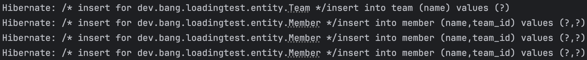
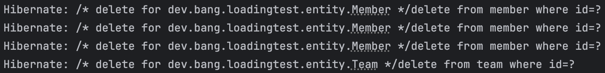
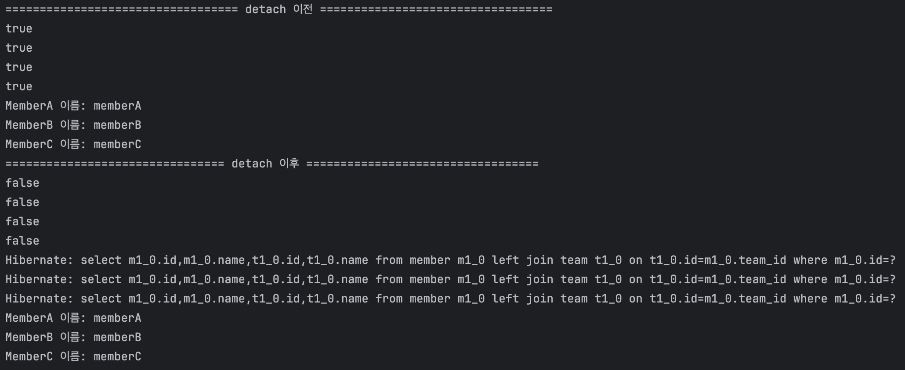
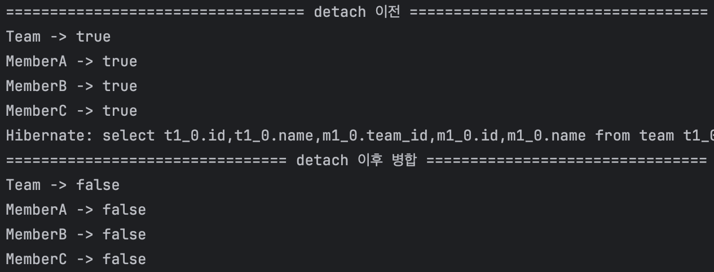
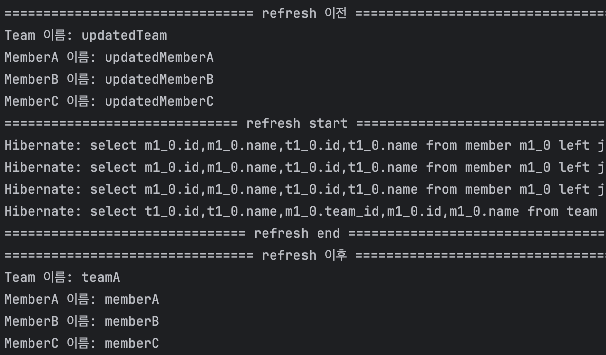
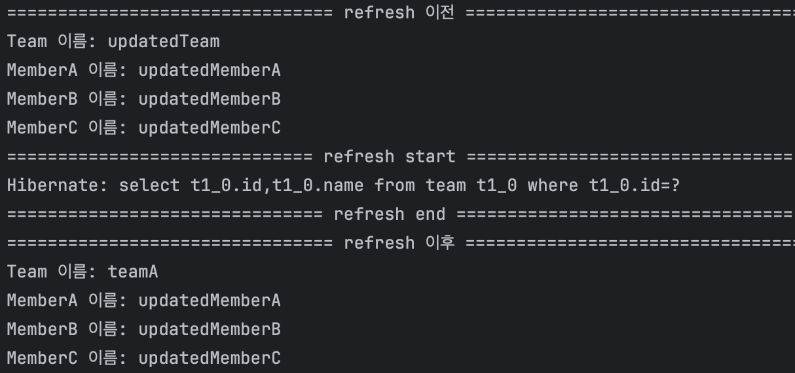

# 영속성 전이 (Cascade)

Spring Data JPA에서는 `CascadeType`을 사용하여 영속성 전이를 설정할 수 있다. (Spring Data JPA 기준으로 작성되었습니다.)

```java
// @ManyToOne
@Target({ElementType.METHOD, ElementType.FIELD})
@Retention(RetentionPolicy.RUNTIME)
public @interface ManyToOne {
    Class targetEntity() default void.class;

    CascadeType[] cascade() default {};

    FetchType fetch() default FetchType.EAGER;

    boolean optional() default true;
}
```

- 연관관계를 설정할 때 사용하는 @ManyToOne 어노테이션을 보면 cascade 속성이 있는 것을 확인할 수 있다.

실제로 프로젝트를 진행할 때 정확히 왜 사용하는지 모르고 사용하다가 아래와 같은 문제가 발생했던 적이 있었다.
이번 기회에 직접 테스트를 통해 영속성 전이에 대해 알아보고 정리해보려고 한다.

> 엔티티를 영속화할 때 연관된 엔티티도 함께 영속화해주는 것이 좋아보인다고 생각(알아서 관리해주나?로 생각)해서 고민 없이 `CascadeType.ALL`을 사용했는데, 삭제할 때도 전이가 되어서 자식 엔티티, 자식의 자식 엔티티까지 모두 삭제되는 문제가 발생했다.

## 영속성 전이란?

영속성 전이란 엔티티의 상태 변화를 전이시킬 때 연관된 엔티티의 상태 변화를 전이시키는 것을 말한다. 예를 들어 부모 엔티티를 저장할 때 자식 엔티티도 함께 저장하고 싶을 때가 있다. 이때 영속성 전이를 사용하면 부모 엔티티를 저장할 때 자식 엔티티도 함께 저장할 수 있다.

## CascadeType

```java
public enum CascadeType {
    ALL,
    PERSIST,
    MERGE,
    REMOVE,
    REFRESH,
    DETACH;

    private CascadeType() {
    }
}
```

CascadeType은 위와 같이 정의되어 있다.

- `ALL` : 모든 작업을 전이시킨다. 아래의 모든 작업을 전이시킨다.
- `PERSIST` : 영속성 컨텍스트에 저장할 때 전이시킨다.
- `MERGE` : 병합할 때 전이시킨다.
- `REMOVE` : 삭제할 때 전이시킨다.
- `REFRESH` : REFRESH할 때 전이시킨다.
- `DETACH` : DETACH할 때 전이시킨다.

## 테스트 사용 엔티티

```java
@Entity
@Getter
public class Member {
    @Id
    @GeneratedValue(strategy = GenerationType.IDENTITY)
    private Long id;

    private String name;

    @ManyToOne
    private Team team;

    ...
}
```

```java
@Entity
@Getter
public class Team {
    @Id
    @GeneratedValue(strategy = GenerationType.IDENTITY)
    private Long id;

    private String name;

    @OneToMany(mappedBy = "team", fetch = FetchType.LAZY)
    private List<Member> members = new ArrayList<>();

    public void addMember(Member member) {
        members.add(member);
    }

    ...
}
```

## CascadeType.PERSIST

```java
@Entity
@Getter
public class Team {
    @Id
    @GeneratedValue(strategy = GenerationType.IDENTITY)
    private Long id;

    private String name;

    @OneToMany(mappedBy = "team", fetch = FetchType.LAZY, cascade = CascadeType.PERSIST)
    private List<Member> members = new ArrayList<>();

    ...
}
```

CascadeType.PERSIST를 사용하면 Team 엔티티를 저장할 때 Member 엔티티도 함께 저장된다. 정말 그렇게 되는지 테스트를 해보자.

```java
@SpringBootTest
public class CascadeTest {

    @Autowired
    private TeamRepository teamRepository;

    @Test
    @DisplayName("팀 저장 시 멤버도 함께 저장되는지 확인")
    void saveTeam() {
        Team team = new Team("teamA");
        team.getMembers().add(new Member("memberA", team));
        team.getMembers().add(new Member("memberB", team));
        team.getMembers().add(new Member("memberC", team));

        teamRepository.save(team);
    }
}
```

### 테스트 결과 (CascadeType.PERSIST)



코드를 살펴보면 3개의 멤버 객체들은 직접적으로 영속성 컨텍스트에 저장하지 않았다. 하지만 Team 엔티티를 저장할 때 자동으로 참조하는 Member 엔티티도 함께 저장되었다. 연관된 엔티티 객체들도 함께 저장된 것을 볼 수 있다.

CascadeType.PERSIST를 제거하고 다시 테스트를 진행하면 Team 엔티티만 저장되고 Member 엔티티는 저장되지 않는다.

## CascadeType.REMOVE

```java
@Entity
@Getter
public class Team {
    @Id
    @GeneratedValue(strategy = GenerationType.IDENTITY)
    private Long id;

    private String name;

    @OneToMany(mappedBy = "team", fetch = FetchType.LAZY, cascade = CascadeType.REMOVE)
    private List<Member> members = new ArrayList<>();

    ...
}
```

CascadeType.REMOVE를 사용하면 Team 엔티티를 삭제할 때 Member 엔티티도 함께 삭제된다. 정말 그렇게 되는지 테스트를 해보자.

```java
@SpringBootTest
public class CascadeTest {

    @Autowired
    private TeamRepository teamRepository;

    @Autowired
    private MemberRepository memberRepository;

    @Test
    @DisplayName("팀 삭제 시 멤버도 함께 삭제되는지 확인")
    void deleteTeam() {
        Team team = new Team("teamA");
        Member memberA = new Member("memberA", team);
        Member memberB = new Member("memberB", team);
        Member memberC = new Member("memberC", team);
        teamRepository.save(team);
        memberRepository.saveAll(List.of(memberA, memberB, memberC));

        teamRepository.deleteAll();
    }
}
```

### 테스트 결과 (CascadeType.REMOVE)



이번에는 Cascade.PERSIST 설정이 없기 때문에 직접 Member들을 저장했다. 또한 코드를 살펴보면 Team 엔티티를 삭제했지만, Member 엔티티도 함께 삭제되었다. 연관된 엔티티 객체들도 함께 삭제된 것을 볼 수 있다. 앞서 말했듯이 무분별한 `CascadeType.ALL` 사용으로 인해 자식 엔티티, 자식의 자식 엔티티까지 모두 삭제되는 문제가 발생할 수 있으니 주의해야 한다.

## CascadeType.DETACH

```java
@Entity
@Getter
public class Team {
    @Id
    @GeneratedValue(strategy = GenerationType.IDENTITY)
    private Long id;

    private String name;

    @OneToMany(mappedBy = "team", fetch = FetchType.LAZY, cascade = {CascadeType.PERSIST, CascadeType.DETACH})
    private List<Member> members = new ArrayList<>();

    ...
}
```

CascadeType.DETACH를 사용하면 Team 엔티티를 DETACH할 때 Member 엔티티도 함께 DETACH된다. 정말 그렇게 되는지 테스트를 해보자. 이처럼 여러 타입을 함께 사용할 수 있다. 여러 타입을 사용할 때는 중괄호로 묶어서 사용하면 된다. Persist와 함께 사용해보자.

```java
@SpringBootTest
public class CascadeTest {

    @Autowired
    private TeamRepository teamRepository;

    @Autowired
    private MemberRepository memberRepository;

    @Autowired
    private EntityManager em;

    @Test
    @DisplayName("팀 detach 시 멤버도 함께 detach 되는지 확인")
    @Transactional
    void detachTeam() {
        Team team = new Team("teamA");
        Member memberA = new Member("memberA", team);
        Member memberB = new Member("memberB", team);
        Member memberC = new Member("memberC", team);
        team.addMember(memberA);
        team.addMember(memberB);
        team.addMember(memberC);
        teamRepository.save(team); // Cascade.PESIST이기 때문에 연관 멤버들도 영속화

        em.flush();

        System.out.println("================================== detach 이전 ==================================");
        System.out.println(em.contains(team));
        System.out.println(em.contains(memberA));
        System.out.println(em.contains(memberB));
        System.out.println(em.contains(memberC));

        // 영속 상태에서 로드하여 쿼리 발생 확인
        Member findMemberA = em.find(Member.class, memberA.getId());
        Member findMemberB = em.find(Member.class, memberB.getId());
        Member findMemberC = em.find(Member.class, memberC.getId());

        System.out.println("MemberA 이름: " + findMemberA.getName());
        System.out.println("MemberB 이름: " + findMemberB.getName());
        System.out.println("MemberC 이름: " + findMemberC.getName());

        em.detach(team);

        System.out.println("================================ detach 이후 ==================================");
        System.out.println(em.contains(team));
        System.out.println(em.contains(memberA));
        System.out.println(em.contains(memberB));
        System.out.println(em.contains(memberC));

        // 준영속 상태에서 다시 로드하여 쿼리 발생 확인
        Member reloadedMemberA = em.find(Member.class, memberA.getId());
        Member reloadedMemberB = em.find(Member.class, memberB.getId());
        Member reloadedMemberC = em.find(Member.class, memberC.getId());

        System.out.println("MemberA 이름: " + reloadedMemberA.getName());
        System.out.println("MemberB 이름: " + reloadedMemberB.getName());
        System.out.println("MemberC 이름: " + reloadedMemberC.getName());
    }
}
```

### 테스트 결과 (CascadeType.DETACH)



결과를 보면 detach 이전에는 영속화된 엔티티들이기 때문에 영속화 여부 `em.contains()`가 true이다. detach 이후에는 준영속 상태이기 때문에 당연히 false가 나온다. 이를 통해 detach된 엔티티가 준영속 상태로 관리되는 것을 확인할 수 있다. detach된 엔티티는 영속성 컨텍스트에서 관리되지 않기 때문에 다시 로드할 때 쿼리가 발생하는 것을 확인할 수 있다. (영속 상태일 땐 조회 쿼리가 발생하지 않음)

## CascadeType.MERGE

```java
@Entity
@Getter
public class Team {
    @Id
    @GeneratedValue(strategy = GenerationType.IDENTITY)
    private Long id;

    private String name;

    @OneToMany(mappedBy = "team", fetch = FetchType.LAZY, cascade = CascadeType.MERGE)
    private List<Member> members = new ArrayList<>();

    ...
}
```

CascadeType.MERGE를 사용하면 Team 엔티티를 병합할 때 Member 엔티티도 함께 병합된다. 정말 그렇게 되는지 테스트를 해보자.

```java
@SpringBootTest
public class CascadeTest {

    @Autowired
    private TeamRepository teamRepository;

    @Autowired
    private MemberRepository memberRepository;

    @Autowired
    private EntityManager em;

    @Test
    @DisplayName("팀 병합 시 멤버도 함께 병합되는지 확인")
    @Transactional
    void mergeTeam() {
        Team team = new Team("teamA");
        Member memberA = new Member("memberA", team);
        Member memberB = new Member("memberB", team);
        Member memberC = new Member("memberC", team);
        Team savedTeam = teamRepository.save(team);
        List<Member> savedMembers = memberRepository.saveAll(List.of(memberA, memberB, memberC));
        System.out.println("================================== detach 이전 ==================================");
        System.out.println("Team -> " + (team.equals(savedTeam)));
        System.out.println("MemberA -> " + (memberA.equals(savedMembers.get(0))));
        System.out.println("MemberB -> " + (memberB.equals(savedMembers.get(1))));
        System.out.println("MemberC -> " + (memberC.equals(savedMembers.get(2))));
        em.flush();
        em.detach(team);
        em.detach(memberA);
        em.detach(memberB);
        em.detach(memberC);

        var mergedTeam = em.merge(team);
        var mergedMemberA = em.find(Member.class, memberA.getId());
        var mergedMemberB = em.find(Member.class, memberB.getId());
        var mergedMemberC = em.find(Member.class, memberC.getId());

        System.out.println("================================ detach 이후 병합 ================================");
        System.out.println("Team -> " + (team.equals(mergedTeam)));
        System.out.println("MemberA -> " + (memberA.equals(mergedMemberA)));
        System.out.println("MemberB -> " + (memberB.equals(mergedMemberB)));
        System.out.println("MemberC -> " + (memberC.equals(mergedMemberC)));
    }
}
```

병합 테스트를 위해 `EntityManager`를 사용하여 (병합 상황을 만들기 위해) 직접 detach를 했다. 이후 Team만 병합했다. 병합 이전 엔티티와 병합 이후 엔티티를 equals로 비교하면 false가 나온다. 이는 병합된 엔티티가 새로운 엔티티로 관리되기 때문이다. 이를 이용한 테스트이다.

### 테스트 결과 (CascadeType.MERGE)



결과를 보면 detach 이전에는 영속화된 엔티티들이기 때문에 equals로 비교하면 true가 나온다. 하지만 detach 이후에는 병합된 엔티티들이기 때문에 equals로 비교하면 false가 나온다. 이를 통해 병합된 엔티티가 새로운 엔티티로 관리되는 것을 확인할 수 있다. 여기서 중요한 것은 Team만 병합했지만, Member 엔티티도 함께 병합되었다는 것이다.

## CascadeType.REFRESH

```java
@Entity
@Getter
public class Team {
    @Id
    @GeneratedValue(strategy = GenerationType.IDENTITY)
    private Long id;

    private String name;

    @OneToMany(mappedBy = "team", fetch = FetchType.LAZY, cascade = {CascadeType.PERSIST, CascadeType.REFRESH})
    private List<Member> members = new ArrayList<>();

    ...
}
```

CascadeType.REFRESH를 사용하면 Team 엔티티를 refresh할 때 Member 엔티티도 함께 refresh된다. 정말 그렇게 되는지 테스트를 해보자. Persist와 함께 사용해보자.

```java
@SpringBootTest
public class CascadeTest {

    @Autowired
    private TeamRepository teamRepository;

    @Autowired
    private MemberRepository memberRepository;

    @Autowired
    private EntityManager em;

    @Test
    @DisplayName("팀 refresh 시 멤버도 함께 refresh 되는지 확인")
    @Transactional
    void refreshTeam() {
        Team team = new Team("teamA");
        Member memberA = new Member("memberA", team);
        Member memberB = new Member("memberB", team);
        Member memberC = new Member("memberC", team);
        team.addMember(memberA);
        team.addMember(memberB);
        team.addMember(memberC);
        teamRepository.save(team);

        em.flush();

        // 자식 엔티티 변경
        memberA.updateName("updatedMemberA");
        memberB.updateName("updatedMemberB");
        memberC.updateName("updatedMemberC");

        // 부모 엔티티 변경
        team.updateName("updatedTeam");

        System.out.println("================================ refresh 이전 ==================================");
        System.out.println("Team 이름: " + team.getName());
        System.out.println("MemberA 이름: " + memberA.getName());
        System.out.println("MemberB 이름: " + memberB.getName());
        System.out.println("MemberC 이름: " + memberC.getName());

        // 부모 엔티티만 refresh
        System.out.println("============================== refresh start ================================");
        em.refresh(team);
        System.out.println("=============================== refresh end =================================");

        System.out.println("================================ refresh 이후 ==================================");
        System.out.println("Team 이름: " + team.getName());
        System.out.println("MemberA 이름: " + memberA.getName());
        System.out.println("MemberB 이름: " + memberB.getName());
        System.out.println("MemberC 이름: " + memberC.getName());
    }
}
```

### 테스트 결과 (CascadeType.REFRESH)



refresh 이전에 엔티티의 이름을 변경하고 출력했을 때는 변경된 이름이 출력된다. refresh 이후에는 refresh된 엔티티의 이름이 출력된다. (실제 refresh를 위한 조회 쿼리도 발생한 것을 볼 수 있다.) 이를 통해 부모 엔티티만 refresh했지만, 자식 엔티티도 함께 refresh된 것을 확인할 수 있다.

만약 Cascade.REFRESH를 지우면 예상한 대로 부모 엔티티만 refresh되고, 자식 엔티티는 refresh되지 않는다.



## 마무리

영속성 전이는 연관된 엔티티의 상태 변화를 전이시킬 때 사용한다. `CascadeType`을 사용하여 영속성 전이를 설정할 수 있다. `CascadeType`은 `ALL`, `PERSIST`, `MERGE`, `REMOVE`, `REFRESH`, `DETACH`가 있다. 각각의 엔티티 상태 변화에 대해 어떤 작업을 전이시킬지 설정할 수 있다.

영속성 전이를 사용할 때 주의할 점은 무분별한 `CascadeType.ALL` 사용으로 인해 자식 엔티티, 자식의 자식 엔티티까지 모두 삭제되는 문제가 발생할 수 있으니 조심해야 한다. 비즈니스 로직에 맞게 적절한 `CascadeType`을 사용할 수 있도록 고민해야 한다.

## 참고 자료

- [영속성 전이 포스팅](https://hoestory.tistory.com/53)
- [JPA-Cascade-Types](https://www.baeldung.com/jpa-cascade-types)
