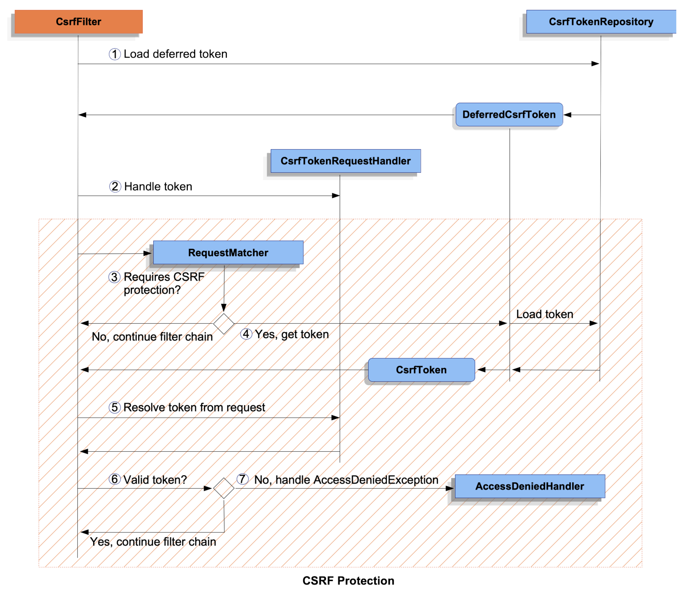
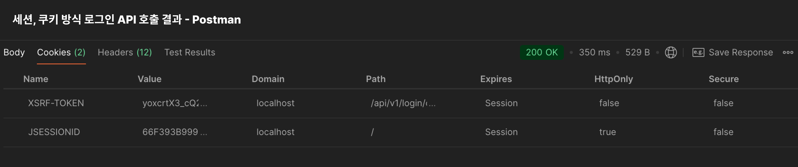
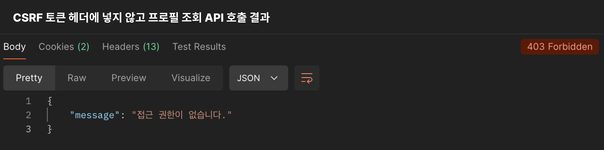
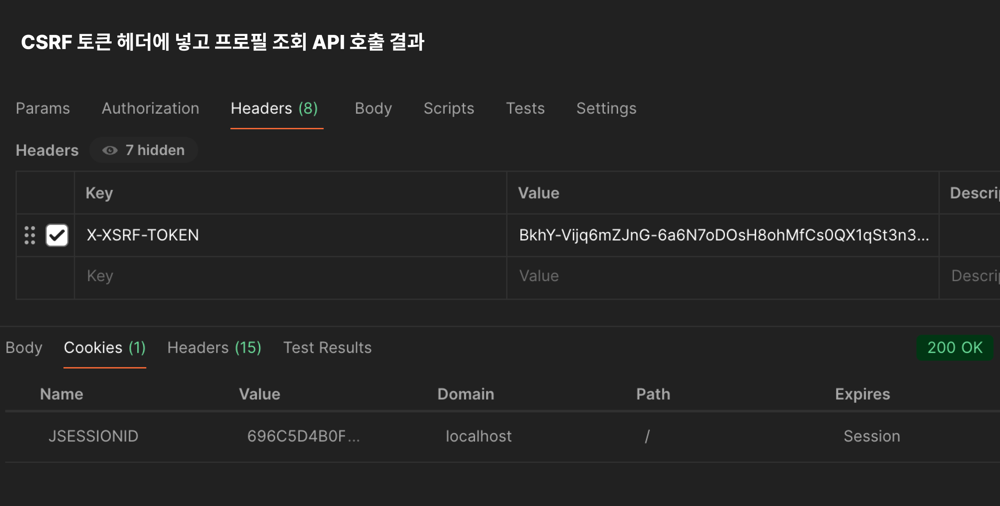
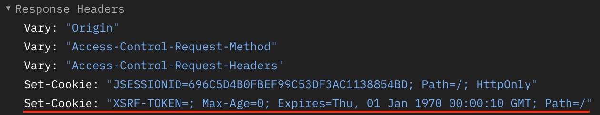

# Spring Security CSRF (feat. Synchronizer Token Pattern)

CSRF(Cross-Site Request Forgery, XSRF)는 사용자가 의도하지 않은 요청을 보내는 공격이다.

## CSRF 공격 예시

CSRF는 공격자는 사용자가 특정 웹사이트에 이미 로그인한 상태를 악용해, 사용자의 브라우저를 통해 악의적인 요청을 전송하는 것이다. 이 요청은 사용자가 직접 보낸 것처럼 보이기 때문에, 서버는 이를 정상적인 요청으로 처리할 수 있다. 예시로 살펴보자.

### 예시1 - 은행 이체 공격

- 사용자가 K-은행 웹사이트에서 자신의 계정으로 로그인한 상태이다.
- 로그인 후, 사용자는 K-은행에서 제공하는 이체 기능을 사용하여 돈을 다른 계좌로 보낼 수 있다.
- 정상적인 상황에서는 사용자가 `직접` 이체 요청을 해야 하고, 이 요청은 해당 계정의 인증을 위한 세션 정보나 쿠키가 필요하다.

공격자는 이 부분을 악용해 다음과 같은 공격을 수행할 수 있다.

1. 공격자는 K-은행 웹사이트와 비슷한 외관을 가진 악의적인 웹사이트를 만든다.
2. 공격자는 피해자(사용자)가 이미 K-은행에 로그인해 있다는 사실을 알고 있다.
3. 공격자는 자신의 웹사이트에 K-은행의 이체 기능을 사용하는 HTTP POST 요청을 생성하도록 폼을 만든다.

```html
<form action="https://k-bank.com/transfer" method="POST">
  <input type="hidden" name="amount" value="1000" />
  <input type="hidden" name="toAccount" value="attacker-account" />
</form>
<script>
  document.forms[0].submit(); // 자동으로 폼 제출
</script>
```

4. 피해자가 악성 웹사이트를 방문하기만 하면, `자동으로 악의적인 이체 요청이 K-은행 서버로 전송`된다.
5. 피해자의 브라우저는 K-은행에 `이미 로그인된 상태`이므로, 요청에는 `사용자의 세션 쿠키가 자동으로 포함`된다.
6. 서버는 해당 요청이 정상적인 사용자의 요청인 것으로 인식하게 되며, 결국 피해자의 돈이 공격자의 계좌로 이체된다.

### 예시2 - 소셜 미디어 포스트 공격

- 사용자가 소셜 미디어 사이트(SNS)에 로그인한 상태이다.
- 이 사이트는 사용자가 게시물을 작성할 수 있는 기능을 제공한다.
- 게시물 작성은 HTTP POST 요청을 통해 수행된다.

공격자는 이 부분을 악용해 다음과 같은 공격을 수행할 수 있다.

1. 공격자는 피해자가 이미 SNS에 로그인해 있다는 사실을 알고 있다.
2. 공격자는 악성 스크립트를 포함한 게시물(또는 이메일)을 작성하고, 피해자의 클릭을 유도한다. 예를 들어, 이메일에 다음과 같은 악성 이미지를 포함시킨다.

```html

```

3. 피해자가 이메일의 이미지를 클릭하면, 브라우저는 해당 이미지의 URL로 요청을 보낸다.
4. SNS 서버는 해당 요청을 받아들이고, 게시물 작성을 수행한다.
5. 피해자의 브라우저는 이미 SNS에 로그인되어 있으므로, 요청에는 사용자의 세션 쿠키가 자동으로 포함된다.
6. 서버는 해당 요청이 정상적인 사용자의 요청인 것으로 인식하게 되며, 결국 피해자의 계정으로 "I am a genius"라는 메시지가 자동으로 게시된다.

## CSRF 발생 원리 요약

- `로그인 상태` : CSRF 공격은 주로 사용자가 웹사이트에 로그인한 상태에서 발생한다.
- `자동 전송되는 쿠키` : 브라우저는 사용자가 명시적으로 요청을 보내지 않았더라도 해당 도메인에 대한 요청이 있을 때마다 쿠키를 함께 전송한다.
- `악성 요청` : 공격자는 피해자가 악의적인 요청을 보내도록 유도한다. HTML 폼, 이미지 태그, 링크 등을 통해 악성 요청을 자동으로 전송하도록 만든다.
- `서버의 취약성` : 서버는 이런 요청이 사용자가 직접 보낸 것인지 판단하지 못하는 경우이다.

## Spring Security CSRF

Spring Security는 기본적으로 안전하지 않은 HTTP 메서드(예: POST 요청)에 대한 CSRF 공격으로부터 보호하므로 추가 코드가 필요하지 않다고 한다. 아래와 같이 기본 구성을 명시적으로 지정할 수 있다.

```java
@Configuration
@EnableWebSecurity
public class SecurityConfig {

	@Bean
	public SecurityFilterChain securityFilterChain(HttpSecurity http) throws Exception {
		http
			// ...
			.csrf(Customizer.withDefaults());
		return http.build();
	}
}
```

## CSRF 보호 구성

CSRF 보호는 SecurityFilterChain의 [CsrfFilter](https://docs.spring.io/spring-security/site/docs/6.3.3/api/org/springframework/security/web/csrf/CsrfFilter.html)에 의해 제공된다. CSRF 보호의 동작 방식은 크게 2가지로 나뉜다.

- CSRF 토큰을 애플리케이션에서 사용할 수 있게 설정하기
- 요청이 CSRF 토큰이 필요한지 확인하고 필요한 경우 토큰을 검증하기

### CSRF 토큰?

CSRF 토큰은 특정 사용자가 요청을 보낼 때 서버가 그 사용자를 믿을 수 있는지 확인하기 위해 생성한 고유한 코드이다. 이 토큰을 이용해 해당 사용자가 실제로 요청을 보낸 것인지 확인할 수 있다. (토큰이 필요한 요청에) 토큰이 없거나 유효하지 않다면, 해당 요청이 악의적인 웹사이트에서 자동으로 보낸 요청일 수 있으므로, 이 요청을 차단한다.

정리하면 CSRF 보호는 주로 클라이언트가 서버에 보낸 요청이 진짜 사용자가 보낸 것인지 확인하는 보안 절차이다. 이를 위해 서버는 CSRF 토큰이라는 고유한 값을 클라이언트에게 주고, 클라이언트는 이 토큰을 다음 요청에 다시 서버로 보내서 자신이 진짜 사용자임을 증명하는 것이다.

## CSRF 필터 처리 과정



1. Load Deferred Token  
   서버는 `DeferredCsrfToken`이라는 객체를 통해 CSRF 토큰을 나중에 사용하기 위해 준비한다. 여기서 사용되는 `CsrfTokenRepository`는 서버에 CSRF 토큰을 저장하고 불러오는 역할을 한다.

> ### DeferredCsrfToken
>
> 일반적인 CSRF 토큰 생성과 달리, `DeferredCsrfToken`은 CSRF 토큰을 나중에 필요할 때 생성할 수 있는 인터페이스다. 예를 들어, 사용자의 세션이 처음 생성될 때 CSRF 토큰을 즉시 생성하는 대신, 세션이 실제로 특정 요청을 처리할 때 CSRF 토큰이 생성되도록 지연할 수 있다. 즉, 사용자 세션이 처음 생성될 때 모든 사용자를 위해 미리 CSRF 토큰을 생성하는 것보다, CSRF 토큰이 필요해지는 순간에 생성하는 방식이 더 효율적일 수 있다.

2. Handle Token  
   `CsrfTokenRequestHandler`는 요청에 CSRF 토큰을 추가한다. 클라이언트가 이 토큰을 요청에 담아 다시 서버로 보내도록 하는 것이 목적이다. 서버는 이 과정에서 CSRF 토큰을 클라이언트에 전달하고, 다음 요청에서 해당 토큰을 받아서 검증하는 것을 기대한다. 예를 들어, 사용자가 POST 요청을 보내기 전에 서버는 CSRF 토큰을 생성하고, 이 토큰을 요청 헤더나 쿠키에 담아 클라이언트에게 보낸다.

3. Requires CSRF Protection?  
   서버는 들어온 요청이 CSRF 보호가 필요한지 판단한다. CSRF 보호가 필요하지 않으면 필터 체인을 그냥 통과시키고, 다음 단계로 넘어가지 않는다. 보통 안전한 메서드 요청은 CSRF 보호가 필요 없지만, POST, PUT, DELETE 같은 요청은 보호가 필요하다.

4. Yes, Get Token  
   CSRF 보호가 필요한 요청이라고 판단되면, 서버는 `DeferredCsrfToken`을 통해 저장된 CSRF 토큰을 불러온다. 불러온 토큰과 클라이언트의 요청에서 가져온 토큰을 비교하기 위함이다.

5. Resolve Token from Request  
   서버는 클라이언트가 보낸 CSRF 토큰을 추출한다. 이 토큰은 요청 헤더나 쿠키에 담겨 있을 수 있다.

> ### CsrfTokenRepository
>
> CSRF 토큰은 `CsrfTokenRepository`를 통해 저장된다. 기본적으로 `HttpSessionCsrfTokenRepository`가 사용되며, 이 구현체는 `사용자의 세션`에 CSRF 토큰을 저장한다. 세션을 통해 토큰이 유지되며, 서버 측에서 관리된다.
>
> Spring Security는 또 다른 구현체인 `CookieCsrfTokenRepository`도 제공한다. 이 구현체는 쿠키에 CSRF 토큰을 저장한다. 쿠키를 통해 클라이언트 측에서 토큰을 관리하며, 서버는 클라이언트로부터 쿠키에 저장된 토큰을 읽어 요청을 검증한다.
>
> 만약 세션이나 쿠키 이외에 특정 저장 방식을 사용하고 싶다면, `CsrfTokenRepository` 인터페이스를 구현하여 사용자가 원하는 방식으로 CSRF 토큰을 저장할 수 있다. 예를 들어, 데이터베이스, Redis 등 다른 저장소에 토큰을 저장할 수 있다.

6. Valid Token?  
   서버는 클라이언트가 보낸 CSRF 토큰이 서버에 저장된 토큰과 일치하는지 확인한다. 일치한다면 해당 요청은 안전한 것으로 간주하고 필터 체인이 계속 진행된다.

7. No, Handle AccessDeniedException  
   만약 클라이언트가 보낸 CSRF 토큰이 없거나 서버에 저장된 토큰과 일치하지 않으면, 서버는 `AccessDeniedException`을 발생시켜 요청을 거부한다. 이는 CSRF 공격일 가능성이 있기 때문이다.

# CSRF 보호 과정

[공식 문서](https://docs.spring.io/spring-security/reference/)에서 설명하는 CSRF 공격으로부터 애플리케이션을 보호하는 방법에 대해 알아보자. 특히 `Spring Security`에서 사용하는 `Synchronizer Token 패턴`을 중점적으로 설명한다.

> ### Synchronizer Token 패턴
>
> `Synchronizer Token 패턴`은 CSRF 공격을 방어하는 가장 확실한 방법 중 하나이다. 이 패턴의 핵심은 `CSRF 토큰`이라는 난수를 서버가 발급하고, 클라이언트가 이를 HTTP 요청에 포함시켜야 한다는 것이다. 서버는 요청을 받을 때마다 클라이언트가 보낸 CSRF 토큰과 서버가 기대하는 CSRF 토큰을 비교하여 일치하지 않을 경우 요청을 거부한다. - [Synchronizer Token Pattern - Spring Docs](https://docs.spring.io/spring-security/reference/features/exploits/csrf.html#csrf-protection-stp)

CSRF 보호를 위해 클라이언트와 서버 간의 통신에서 CSRF 토큰을 처리하는 방법을 설명하며, 여기서는 `JavaScript SPA`와 Spring Security를 통합하는 방법에 중점을 두어 설명한다.

## JavaScript SPA와 Spring Security 통합

JavaScript SPA는 서버와의 통신을 위해 REST API를 사용한다. 서버는 클라이언트에 CSRF 토큰을 전달하고, 클라이언트는 해당 토큰을 다음 요청 헤더에 포함시켜 서버로 보낸다. 이 과정을 통해 서버는 클라이언트가 보낸 요청이 진짜 사용자가 보낸 것인지 확인할 수 있다. (이때, `CookieCsrfTokenRepository`를 사용한다.)

- 서버는 클라이언트가 CSRF 토큰을 사용할 수 있도록 `쿠키에 CSRF 토큰을 저장`한다.
- 클라이언트는 `쿠키에서 CSRF 토큰을 읽고`, 요청을 보낼 때 CSRF 토큰을 `HTTP 헤더에 포함`시켜 서버로 보낸다.

### 추가로 고려해야 할 사항

- `BREACH 보호` : Spring Security는 기본적으로 CSRF 토큰에 대해 `BREACH 보호`를 제공한다. CSRF 토큰을 암호화된 형태로 저장함으로써 공격자가 토큰을 예측할 수 없게 만든다. 그러나 클라이언트는 CSRF 토큰을 사용해야 하므로 쿠키에 저장된 CSRF 토큰은 암호화 되지 않은 상태로 전달되어야 한다.

- `로그인 및 로그아웃 후 토큰 갱신` : Spring Security는 `CsrfAuthenticationStrategy`와 `CsrfLogoutHandler`를 통해, 인증 성공 및 로그아웃 성공 시 기존 CSRF 토큰을 제거한다. 즉, 사용자가 로그인하거나 로그아웃할 때마다 새로운 CSRF 토큰을 생성해야 한다. Spring Security는 기본적으로 새 CSRF 토큰을 로드하는 것을 미루며, 새 쿠키를 반환하려면 추가 작업이 필요하다.

## SPA를 위한 CSRF 보호 구성

- 아래 구성은 세션과 쿠키를 사용하여 인증하는 REST API 애플리케이션을 기반으로 한다. 지금 설명하려는 부분과 관련이 적은 부분은 생략했다.
- `SessionAuthenticationFilter`는 세션 인증을 위한 필터이다. 요청이 들어오면 쿠키의 `세션 ID`를 사용해 `SecurityContext에 인증 정보를 저장`한다.
- 바로 앞에서 Spring Security는 사용자가 로그인하거나 로그아웃하면 CSRF 토큰을 제거한다는 것을 살펴봤다. 따라서 로그인 후(자세하게 말하면, Security Context에 인증 객체가 저장되는 순간을 말한다.) 바로 다음 요청에는 CSRF 토큰이 없을 수 있다. (CSRF 토큰이 필요한데 없다면 요청이 거부될 것이다.) 이를 해결하기 위해 여러 방법이 있지만, 나는 새로운 CSRF 토큰을 발급하는 API를 만들어 해결했다.

```java
@Configuration
@EnableWebSecurity
@RequiredArgsConstructor
public class SecurityConfig {

    private final SessionAuthenticationFilter sessionAuthenticationFilter;
    private final CsrfCookieFilter csrfCookieFilter;
    private final CsrfRequireMatcher csrfRequireMatcher;
    private final SpaCsrfTokenRequestHandler spaCsrfTokenRequestHandler;

    @Bean
    public SecurityFilterChain filterChain(HttpSecurity http) throws Exception {
        return http
                .httpBasic(AbstractHttpConfigurer::disable)
                .csrf(this::csrfConfig)
                .sessionManagement(this::sessionConfig)
                .formLogin(AbstractHttpConfigurer::disable)
                .addFilterBefore(sessionAuthenticationFilter, UsernamePasswordAuthenticationFilter.class)
                .addFilterAfter(csrfCookieFilter, UsernamePasswordAuthenticationFilter.class)
                .build();
    }

    private void csrfConfig(CsrfConfigurer<HttpSecurity> csrf) {
        csrf.csrfTokenRepository(CookieCsrfTokenRepository.withHttpOnlyFalse()) // CSRF 토큰을 쿠키에 저장
                .requireCsrfProtectionMatcher(csrfRequireMatcher) // CSRF 토큰이 필요한지 확인
                .csrfTokenRequestHandler(spaCsrfTokenRequestHandler); // CSRF 토큰을 요청에 추가
    }

    private void sessionConfig(SessionManagementConfigurer<HttpSecurity> sessionManagement) {
        sessionManagement.sessionCreationPolicy(SessionCreationPolicy.IF_REQUIRED); // 세션 생성 정책
    }
}
```

```java
@Component
public class CsrfRequireMatcher implements RequestMatcher {

    @Override
    public boolean matches(HttpServletRequest request) {
        // CSRF 토큰이 필요한지 확인하는 로직을 구현하면 된다.
        // 예를 들어 Swagger API 문서 요청은 CSRF 토큰 검증을 건너뛰도록 설정할 수 있을 것이다.
    }
}
```

```java
@Component
public class SpaCsrfTokenRequestHandler extends CsrfTokenRequestAttributeHandler {

    private final CsrfTokenRequestHandler delegate = new XorCsrfTokenRequestAttributeHandler();

    @Override
    public void handle(HttpServletRequest request,
                       HttpServletResponse response,
                       Supplier<CsrfToken> csrfToken) {
        delegate.handle(request, response, csrfToken);
    }

    @Override
    public String resolveCsrfTokenValue(HttpServletRequest request, CsrfToken csrfToken) {
        if (StringUtils.hasText(request.getHeader(csrfToken.getHeaderName()))) {
            return super.resolveCsrfTokenValue(request, csrfToken);
        }

        return delegate.resolveCsrfTokenValue(request, csrfToken);
    }
}
```

```java
@Component
public class CsrfCookieFilter extends OncePerRequestFilter {

    @Override
    protected void doFilterInternal(HttpServletRequest request,
                                    @NonNull HttpServletResponse response,
                                    @NonNull FilterChain filterChain) throws ServletException, IOException {
        CsrfToken csrfToken = (CsrfToken) request.getAttribute("_csrf");
        // CSRF 토큰을 쿠키에 저장하여 클라이언트에 전달하는 로직을 구현하면 된다.
        // 예를 들어, 조건에 따라 CSRF 토큰을 쿠키에 저장하고, 기타 옵션을 추가할 수 있을 것이다.

        filterChain.doFilter(request, response);
    }
}
```

구현을 위한 틀은 [공식 문서](https://docs.spring.io/spring-security/reference/servlet/exploits/csrf.html#csrf-integration-javascript-spa)에서 자세히 설명하고 있다. 이를 참고하여 필요한 부분을 구현하면 된다.

### 추가 구성

- `SameSite` : CSRF 토큰을 쿠키에 저장할 때, `SameSite` 속성을 설정하여 쿠키의 사용 범위를 제한할 수 있다. 이를 통해 CSRF 공격을 방지할 수 있다. 나는 우선 `Lax`로 설정하여 쿠키를 전송하도록 했다.

  - `Strict` : Strict로 설정된 쿠키는 크로스 사이트 요청에는 전송되지 않는다. (퍼스트 파티 쿠키만 전송된다.)
  - `Lax` : Lax로 설정된 쿠키는 대체로 크로스 사이트 요청에는 전송되지 않지만, 예외적인 요청에는 전송된다.
  - `None` : 크로스 사이트 요청의 경우에도 항상 전송된다. (특정 브라우저는 보안 문제로 이 옵션을 지원하지 않는 경우도 있다.)

- `Path` : `Path` 속성을 설정하여 특정 경로에서만 쿠키를 사용할 수 있도록 제한할 수 있다. 나는 `/` 경로를 지정했다. 그 이유는 어떤 경로의 요청이든 결국 CSRF 토큰을 통한 보안 검증을 거쳐야 한다고 생각했기 때문이다.

- `HttpOnly` : `HttpOnly` 속성을 true로 설정하면, JavaScript를 통해 쿠키에 접근할 수 없게 된다. 이를 통해 XSS 공격을 방지할 수 있다. 다만, 우리는 Syncronizer Token 패턴을 사용할 예정이기 때문에 이 속성을 `false`로 설정했다.

- `Secure` : `Secure` 속성을 true로 설정하면, HTTPS 프로토콜을 사용하는 경우에만 쿠키가 전송된다. 이를 통해 중간자 공격을 방지할 수 있다. 나는 개발 환경에서도 테스트하기 위해 우선 `false`로 설정했다.

결국 CSRF 보호를 위한 구성은 애플리케이션의 특성 및 환경에 따라 다르게 설정해야 한다.

## 테스트



로그인 API를 호출하면 세션 ID와 CSRF 토큰 쿠키가 생성된다. 이후, 다른 API를 호출할 때 CSRF 토큰을 요청 헤더에 포함시켜 요청을 보내면, 서버는 이 토큰을 검증하여 요청을 처리한다.



다른 API(프로필 조회 API)를 호출할 때, CSRF 토큰을 헤더에 넣지 않으면 요청이 거부된다. (메시지와 같은 예외 처리는 직접 구현해야 한다.)



CSRF 토큰을 헤더에 포함시켜 요청을 보내면, 서버는 이 토큰을 검증하여 요청을 처리한다. (클라이언트가 쿠키로 받은 CSRF 토큰을 헤더에 포함시켜야 한다.)

해당 요청이 `SessionAuthenticationFilter`를 지난다. 세션 ID를 사용해 `SecurityContext`에 인증 정보를 저장하면서 CSRF 토큰을 제거한다.



Spring Security는 `CsrfAuthenticationStrategy`와 `CsrfLogoutHandler`를 통해 기존 CSRF 토큰을 제거하기 때문에 응답에서도 XSRF-TOKEN 쿠키의 값을 비워서 지정하여 기존 쿠키를 제거하는 것을 확인할 수 있다. 즉, 새로운 CSRF 토큰을 발급해야 한다. 나는 이를 위해 새로운 CSRF 토큰을 발급하는 API를 만들었다. 이후 클라이언트는 이 토큰을 사용해야 한다.

### 마무리, 고민

- CSRF 토큰은 로그인, 로그아웃, 또는 비밀번호 변경 등 중요한 작업 이후나 오래되었으면 갱신하는 것이 좋을 것 같다.

- 위 구현은 쉽게 말해 CSRF 토큰을 쿠키로 전달하여 클라이언트에게 이를 헤더에 포함하도록 하고 그것을 검증하는 방식이다. 이는 클라이언트가 Javascript로 쿠키에 접근한 후 헤더에 포함해야 해서 HttpOnly 옵션을 사용할 수 없다. 따라서 XSS 공격에 취약할 수 있다고 생각한다.

- 로그인과 동시에 Security Context에 인증 정보를 저장하는 것이 가장 이상적이라고 생각하는데, 구현에 실패했다. `Abstractauthenticationprocessingfilter`와 `AuthenticationManager`를 직접 구현하는 방식도 시도했지만, Service Layer에서 Security 의존성을 가지지 않게 고민하다가 구현에 실패했다. 이 부분을 해결하면 더 좋은 구현이 될 것 같다. 아니면 내가 생각하는 것이 잘못된 것일 수도 있다.

공부할수록 더 많은 고민이 생기는 것 같다. 워낙 방대한 주제이기 때문에 모든 것을 이해하고 예외 상황까지 고려하는 것이 어려운 것 같다. 그래도 이러한 고민을 통해 항상 최선의 선택을 하려고 노력할 예정이다.

## 참고

- [세션, 쿠키 로그인 방식을 선택한 이유](https://velog.io/@hyeok_1212/%EC%96%B4%EB%96%A4-%EB%A1%9C%EA%B7%B8%EC%9D%B8-%EB%B0%A9%EC%8B%9D%EC%9D%84-%EC%84%A0%ED%83%9D%ED%95%B4%EC%95%BC-%ED%95%A0%EA%B9%8C)
- [CSRF - Wikipedia](https://en.wikipedia.org/wiki/Cross-site_request_forgery)
- [Spring Security Reference - Spring Security Docs](https://docs.spring.io/spring-security/reference/)
- [CSRF With Stateless REST API - Baeldung](https://www.baeldung.com/csrf-stateless-rest-api)
